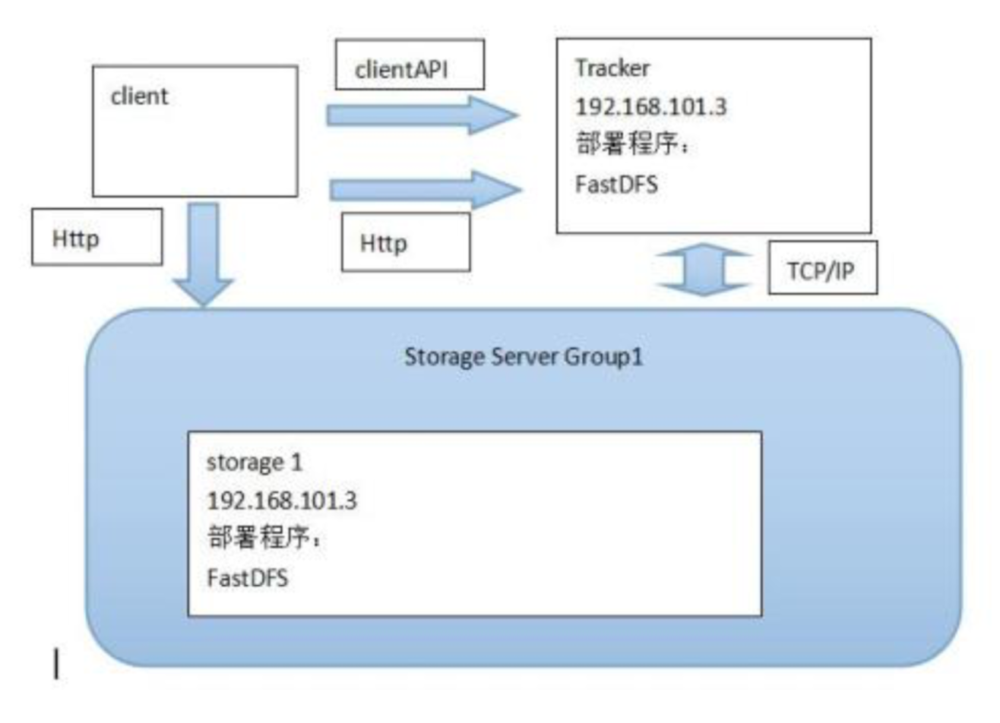

# FastDFS+Nginx搭建分布式图片存储

#### 1.什么是FastDFS

`FastDFS`是用 `c` 语言编写的一款开源的分布式文件系统。FastDFS 为互联网量身定制， 充分考虑了冗余备份、负载均衡、线性扩容等机制，并注重高可用、高性能等指标，使用 `FastDFS` 很容易搭建一套高性能的文件服务器集群提供文件上传、下载等服务。 `FastDFS`架构包括 `Tracker server` 和 `Storage server`。客户端请求 `Tracker server` 进行文 件上传、下载，通过 `Tracker server` 调度最终由 `Storage server` 完成文件上传和下载。 `Tracker server` 作用是负载均衡和调度，通过 `Tracker server` 在文件上传时可以根据一些 策略找到 Storage server 提供文件上传服务。可以将 `tracker` 称为追踪服务器或调度服务 器。 `Storage server` 作用是文件存储，客户端上传的文件最终存储在 `Storage` 服务器上， `Storageserver` 没有实现自己的文件系统而是利用操作系统 的文件系统来管理文件。可以将 `storage` 称为存储服务器。


服务端两个角色: `Tracker`:管理集群，`tracker` 也可以实现集群。每个 `tracker` 节点地位平等。收集 `Storage` 集群的状态。 `Storage`:实际保存文件 `Storage` 分为多个组，每个组之间保存的文件是不同的。每 个组内部可以有多个成员，组成员内部保存的内容是一样的，组成员的地位是一致的，没有 主从的概念。

#### 2．文件上传流程


客户端上传文件后存储服务器将文件ID返回给客户端，此文件ID用于以后访问该文 件的索引信息。文件索引信息包括:组名，虚拟磁盘路径，数据两级目录，文件名。


##### 文件名格式如下

```
group1/M00/00/00/rBAABVzRPC-AJVSQAAHqEHLGutU563.jpg
复制代码
```

- 组名:文件上传后所在的 `storage` 组名称，在文件上传成功后有 `storage` 服务器返回， 需要客户端自行保存。
- 虚拟磁盘路径:`storage` 配置的虚拟路径，与磁盘选项 `store_path*`对应。如果配置了 `store_path0` 则是 `M00`，如果配置了 `store_path1` 则是 `M01`，以此类推。
- 数据两级目录:`storage` 服务器在每个虚拟磁盘路径下创建的两级目录，用于存储数据 文件。
- 文件名:与文件上传时不同。是由存储服务器根据特定信息生成，文件名包含:源存储 服务器 `IP` 地址、文件创建时间戳、文件大小、随机数和文件拓展名等信息。

#### 3.文件下载流程


#### 4.简易FastDFS架构





#### 5.FastDFS安装

- 如下提供FastDFS和相应的Nginx模块的下载地址

[下载地址](https://link.juejin.im/?target=https%3A%2F%2Fpan.baidu.com%2Fs%2F1PtNmUPb20LDM3UJeHH91YQ) 提取码：nw6t

###### 5.1 安装fastdfs依赖包

1. 解压缩`libfastcommon-master.zip`
2. 进入到`libfastcommon-master`的目录中
3. 执行 `./make.sh`
4. 执行 `sudo ./make.sh install`

###### 5.2 安装fastdfs

1. 解压缩`fastdfs-master.zip`
2. 进入到 `fastdfs-master`目录中
3. 执行 `./make.sh`
4. 执行`sudo ./make.sh install`

###### 5.3 配置跟踪服务器tracker

1. `sudo cp /etc/fdfs/tracker.conf.sample /etc/fdfs/tracker.conf`
2. 在`/home/python/`目录中创建目录 `fastdfs/tracker`
3. 编辑`/etc/fdfs/tracker.conf`配置文件 `sudo vim /etc/fdfs/tracker.conf` 修改 `base_path=/home/python/fastdfs/tracker`

###### 5.4 配置存储服务器storage

1. `sudo cp /etc/fdfs/storage.conf.sample /etc/fdfs/storage.conf`
2. 在`/home/python/fastdfs/` 目录中创建目录 `storage`
3. 编辑`/etc/fdfs/storage.conf`配置文件 `sudo vim /etc/fdfs/storage.conf` 修改内容：`base_path=/home/python/fastdfs/storage` `store_path0=/home/python/fastdfs/storage``tracker_server=自己ubuntu虚拟机的ip地址:22122`

###### 5.5 启动tracker 和 storage

```
sudo service fdfs_trackerd start
sudo service fdfs_storaged start
```

###### 在云服务器上

```
sudo /usr/bin/fdfs_trackerd /etc/fdfs/tracker.conf start
sudo /usr/bin/fdfs_storaged /etc/fdfs/storage.conf start
```

###### 5.6 测试是否安装成功

1. `sudo cp /etc/fdfs/client.conf.sample /etc/fdfs/client.conf`
2. 编辑`/etc/fdfs/client.conf`配置文件 `sudo vim /etc/fdfs/client.conf` 修改内容：`base_path=/home/python/fastdfs/tracker` `tracker_server=自己ubuntu虚拟机的ip地址:22122`
3. 上传文件测试： `fdfs_upload_file /etc/fdfs/client.conf` 要上传的图片文件 如果返回类似`group1/M00/00/00/rBIK6VcaP0aARXXvAAHrUgHEviQ394.jpg`的文件`id`则说明文件上传成功

###### 5.7 安装nginx及fastdfs-nginx-module web模块

> 首先安装一下nginx的依赖库

- 安装gcc g++的依赖库

```
sudo apt-get install build-essential
sudo apt-get install libtool
复制代码
```

- 安装pcre依赖库（[www.pcre.org/）](https://link.juejin.im/?target=http%3A%2F%2Fwww.pcre.org%2F%EF%BC%89)

```
sudo apt-get update
sudo apt-get install libpcre3 libpcre3-dev
复制代码
```

- 安装zlib依赖库（[www.zlib.net](https://link.juejin.im/?target=http%3A%2F%2Fwww.zlib.net)）

```
sudo apt-get install libpcre3 libpcre3-dev
sudo apt-get install zlib1g-dev
复制代码
```

- 安装SSL依赖库（16.04默认已经安装了）

```
sudo apt-get install openssl
复制代码
```

1. 解压缩 `nginx-1.8.1.tar.gz`
2. 解压缩 `fastdfs-nginx-module-master.zip`
3. 进入`nginx-1.8.1`目录中
4. 执行`sudo ./configure --prefix=/usr/local/nginx --add-module=/home/ubuntu/fastdfs-nginx-module-master解压后的目录的绝对路径/src`
5. `sudo make` `sudo make install`
6. `sudo cp fastdfs-nginx-module-master解压后的目录中src下的mod_fastdfs.conf /etc/fdfs/mod_fastdfs.conf`
7. `sudo vim /etc/fdfs/mod_fastdfs.conf` 修改内容：

```
connect_timeout=10
tracker_server=自己ubuntu虚拟机的ip地址:22122
url_have_group_name=true
store_path0=/home/python/fastdfs/storage
复制代码
```

1. `sudo cp 解压缩的fastdfs-master目录conf目录中的http.conf /etc/fdfs/http.conf`
2. `sudo cp 解压缩的fastdfs-master目录conf目录中的mime.types /etc/fdfs/mime.types`
3. `sudo vim /usr/local/nginx/conf/nginx.conf`

在`http`部分中添加配置信息如下：

```
server {
            listen       8888;
            server_name  localhost;
            location ~/group[0-9]/ {
                ngx_fastdfs_module;
            }
            error_page   500 502 503 504  /50x.html;
            location = /50x.html {
            root   html;
            }
        }
复制代码
```

11.启动`nginx`

```
sudo /usr/local/nginx/sbin/nginx
```

关注下面的标签，发现更多相似文章