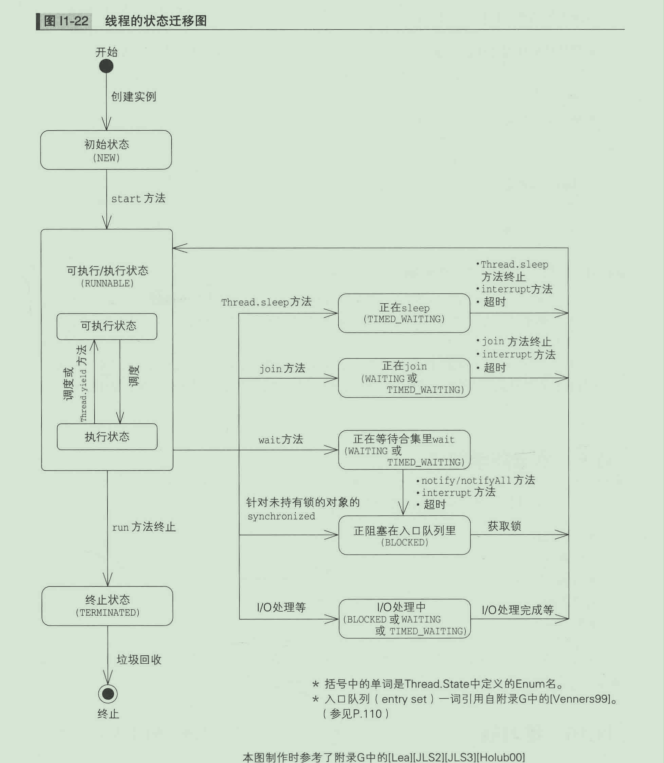
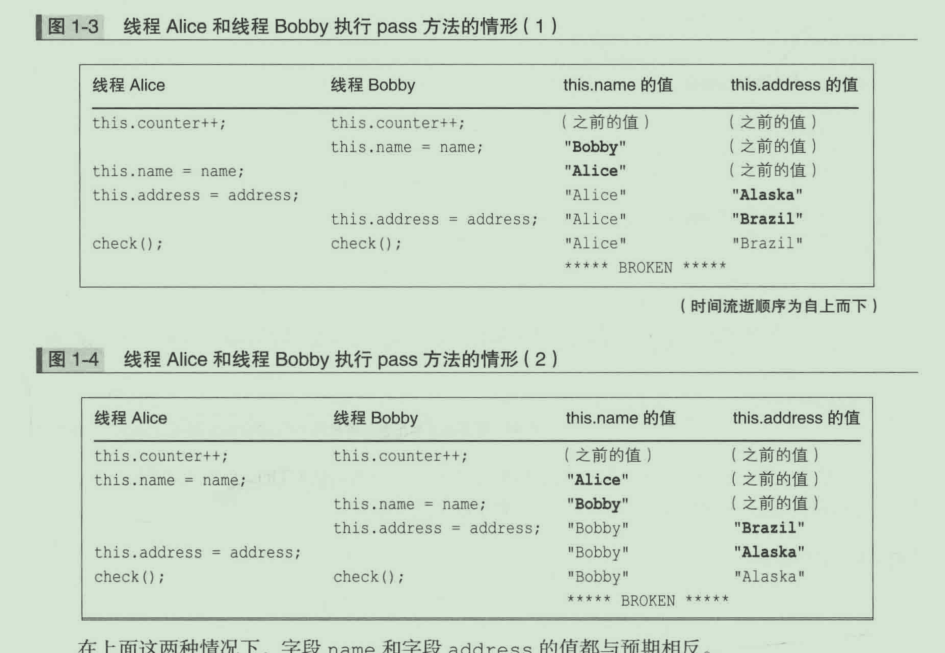
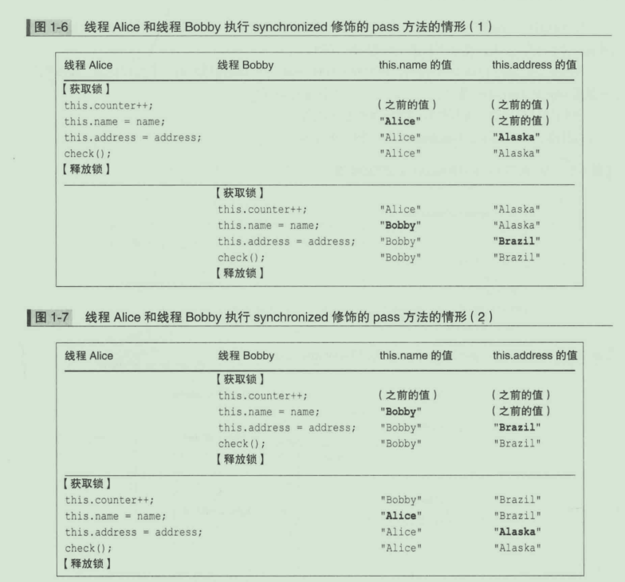
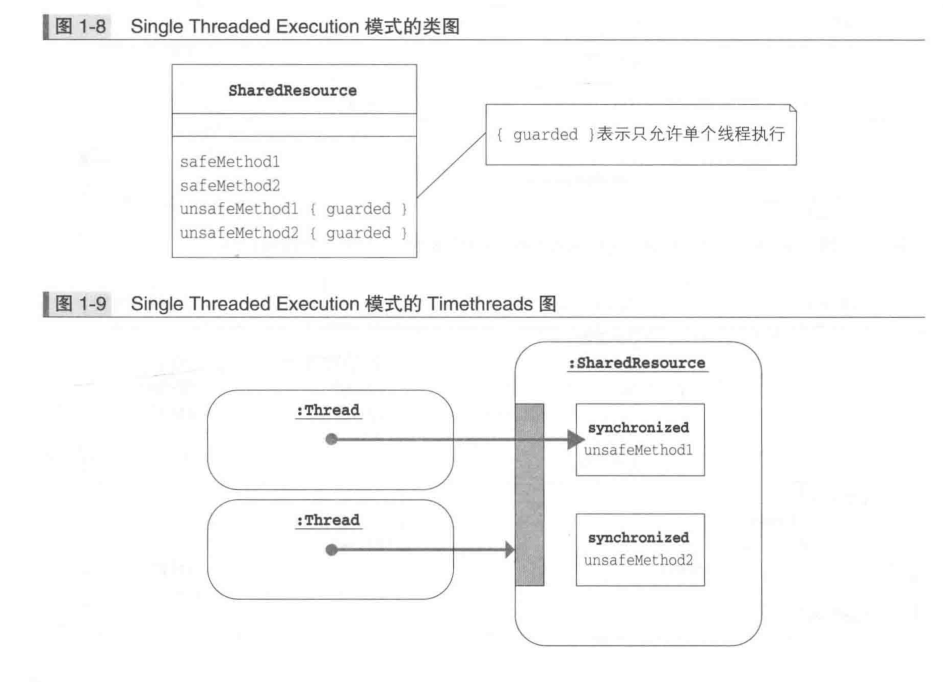
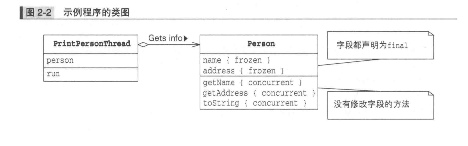
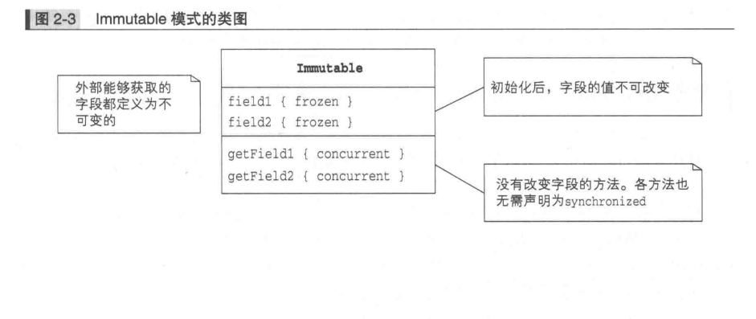
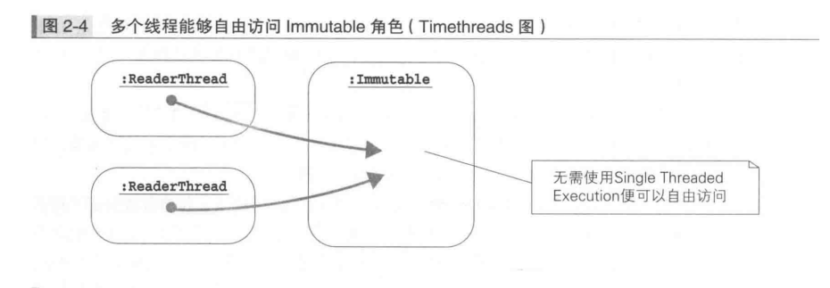

UML 中规定的箭头方向是从子类指向父类 。可能会有人认为子类是 以父类为基础的 ，箭头 从父类指向子类会更合理 。

关于这一点，按照以下方法去理解有助于大家记住这条规则 。在定义子类时需要通过

extends  关键字指定父类 。因此，**子类一定知道父类的定义**，而反过来，父类并不知道子类的 定义。只有在知道对方的信息时才能指向对方，因此箭头方向是从子类指向父类。


聚合

我们将这种 “持有” 关系称为聚合 （ aggregation ）。只要在一个类中持有另外一个类的实例一一 无论是一个还是多个一一它们之间就是聚合关系。就程序上而言 ，无论是使用数组、j ava .util .Ar rayList   还是其他实现方式 ，只要在一个类中持有另外一个类的实例，它们之间就是聚合关系。在 UML 中，我们使用带有空心菱形的实线表示聚合关 系，因此可以进行联想记忆 ，将聚合关系想象为在菱形的器皿装有其他物品。


# 1   Java 线程


>小知识：顺序、并行与并发
>
>下面简单说明一下顺序、并行与并发这三个概念。
>
>顺序 （ sequential ） 用于表示多个操作 “依次处理”。比如把十个操作交给一个人处理时，这 个人要一个一个地按顺序来处理。
>
>并行 （ parallel  ） 用于表示多个操作  “同时处理”。比如十个操作分给两个人处理时 ，这两个 人就会并行来处理。
>
>并发 （ concurrent ） 相对于顺序和并行来说比较抽象，用于表示“将一个操作分割成多个部 分并且允许无序处理”。比如将十个操作分成相对独立的两类 ，这样便能够开始并发处理了。如 果一个人来处理 ，这个人就是顺序处理分开的并发操作 ，而如果是两个人，这两个人就可以并 行处理同一个操作。
>
>

启动线程的方法有如下两种 。

( l） 利用 Thread 类的子类的实例启动线程

( 2 ） 利用 Runnabl e 接口的实现类的实例启动线程

 >’小知识：程序的终止
 >>Java 程序的终止是指除守护线程 （ Daemon  Thread ） 以外的线程全部终止。守护线程是执行 后台作业的线程。我们可以通过   setDaemon        方法把线程设置为守护线程
 >>
 >>

不管是利用 Thread 类的子类的方法 （ 1 ），还是利用Runn able 接口的实现类的方法 （ 2 ），启 动新线程的方法最终都是 Th read 类的 start 方法。

>
>
>小知识 ：Thread 类和 Runnable 方法
>Thread 类本身还实现了Runnable 接口 ，并且持有 ru n 方法 ，但 Th read 类的 r un 方法 主体是空的，不执行任何操作。Thread 类的 run 方法通常都由子类的 run 方法重写（ override ）


>小知识：java .utiI.concurrent.ThreadFactorγ 中的线程创建
>
> j ava .util.concurrent 包中包含一个将线程创建抽象化的 Th readFactory 接口。利用该接口 ，我们可以将以 Ru nnable 作为传入参数并通过 new 创建 Thread 实例的处理隐藏在Th readFactory 内部。典型用法如代码清单 11-8 所示。默认的 Th readFactory 对象是通过
>
>Execu tors . de f au ltThreadFactor y 方法获取的。
>
>

```java
代码清单 11-8	利用 Thread Factory 新启动钱程 （ Main.java )
public class Main{
    public static void main(String[] args){
        ThreadFactory factory = Executors.defaultThreadFactory();
        factory.newThread(new Runnable()).start;
    }     
}


```


线程 Thread 类中的 sleep 方法能够**暂停线程运行**，Sleep 也就是 “休眠” 的意思。sleep 方 法是 Thread 类的静态方法。

>小知识：如何唤醒呢
>
>如果要中途唤醒被 Thread .sleep 休眠的线程 ，**则可以使用 interrupt 方法**。详细内容 请参见 5.6 节中的 “ sleep 方法和 inter rupt 方法” 部分。
>
>


## 线程的互斥处理

多线程程序中的各个线程都是自由运行的，所以它们有时就会**同时操作同一个实例。**

这种线程 A 和线程 B 之间互相竞争 （ race ） 而引起的与预期相反的情况称为**数据竞争 （ data race ） 或竞态条件 （ race condition ）。**

这时候就需要有一种 “交通管制” 来协助防止发生数据竞争 。例如，如果一个线程正在执行 某一部分操作，那么其他线程就不可以再执行这部分操作。这种类似于交通管制的 操作通常称为 互斥 （ mutual exclusion ）。

**Java 使用关键字 synchronized 来执行线程的互斥处理。**

一个实例中的 syn chron i z ed 方法每次**只能由一个**线程运行 ，而非 s yn chron iz ed 方法则 可以同时由两个以上的线程运行


**每个实例拥有一个独立的锁**。因此，并不是说某一个实例中的 syηchro n i z ed 方法正在执行 中，其他实例中的 syn ch ro n i z ed 方法就不可以运行了

>小知识：锁和监视
>
>线程的互斥机制称为监视 （ monitor ）。另外，获取锁有 时也叫作 “拥有 （ own ） 监视” 或 “持有 （ hold ） 锁”。
>
>当前线程是否已获取某一对象的锁可以通过 Thread .holdsLoc k 方法来确认 。当前线程 已获取对象 obj 的锁时 ，可使用 assert 来像下面这样表示出来。
>
>assert Thread .holdsLock (obj);

syn chron i zed 静态方法每次只能由一个钱程运行， 这 一 点 和 sy n ch r on i z ed 实 例 方 法 相 同。但 sy n ch r o n i z ed 静 态 方 法 使 用 的 锁 和 synchronized 实例方法使用的锁是不一样的。

**Java 提供了用于执行线程控制的 w a i t 方法 、no t i f y 方法和 n o t i f y A l l 方法。w a i t 是让线程等待的方法 ，而 n o t i f y 和 notif yAl 工 是唤醒等待中的线程的方法 。**


**所有实例都拥有 一个等待队列** ，它是**在实例的 w a i t  方法执行后停止操作的线程的队列**。打个比方来说 ，就是为每 个实例准备的线程休息室。在执行 w a i t 方法后 ，线程便会暂停操作 ，进入等待队列这个休息室 。除非发生下列某一情 况 ，否则线程会一直在等待队列中休眠 。当下列任意一种情况发生时 ，线程便会退出等待队列。

- 有其他线程的 not if y 方法来唤醒线程
- 有其他线程的 not if yAll 方法来唤醒线程
- 有其他线程的 interrupt 方法来唤醒线程
- wait 方法超时

wait   （ 等待 ） 方法会让线程进入等待队列。假设我们执行了下面这条语句。

obj .wait ( ) ;

那么，**当前线程便会暂停运行，并进入实例 obj   的等待队列中**。这叫作  “线程正在 obj  上 wait 

如果实例方法中有如下语句 （ I ），由于其含义等同于 （ 2 ），所以执行了 w a i t （ ） 的线程将会进
入 this 的等待队列中，这时可以说 “线程正在 this 上 wait”。

wait () ;	( I )
this .wait  ( ) ;	( 2 )

若要执行 **wait 方法 ，线程必须持有锁** （ 这是规则 ）。但如果**线程进入等待队列 ，便会释放其实 例的锁**。


not if y （ 通知 ） 方法会将等待队列中的一个线程取出 。假设我们执行了下面这条语句。

obj .notif y ( ) ;

那么 obj   的等待队列中的**一个线程便会被选中和唤醒** ，然后就会退出等待队列。

同wait方法一样，若要执行 notif y 方法，线程也必须持有要调用的实例的锁 （ 这是规则 ）。

>小知识 ：执行 notify 后的线程状态
>n ot i f y **唤醒的线程并不会在执行 not if y 的一瞬间重新运行** 。因为在执行 no t if y 的那 一瞬间，执行notif y 的线程还持有着锁 ，所以其他线程还无法获取这个实例的锁 


>
>
>小知识 ：执行 notify 后如何选择线程
>假如在执行 n o t i f y 方法时 ，正在等待队列中等待的线程不止一个 ，对于“这时该如何来 选择线程” 这个问题规范中并没有作归规定。究竟是选择最先 w a it 的线程，还是随机选择， 或者采用其他方法要取决于 Java  平台运行环境 。因此编写程序时需要注意 ，最好不要编写依赖 于所选线程的程序。

​	


notif yAll （ 通知大家） 方法会将等待队列中的**所有线程都取出来**。例如 ，执行下面这条语句 之后 ，在 obj 实例的等待队列中休眠的所有线程都会被唤醒。
obj .notif yAll ( ) ;

如果简单地在实例方法中写成下面 （   I） 这样，那么由于其含义等同于 （ 2  ），所以该语句所在方 法的实例 （  t his ）  的等待队列中所有线程都会退出等待队列。

notif yAll () ;	( I )
this.notifyAll() ;	( 2 )

同wai t 方法和 n ot i f y 方法一样，not i f yAll 方法也**只能由持有要调用的实例的锁的线程 调用**。

刚被唤醒的线程会去获取其 他线程在进入 w a i t 状态时释放的锁。但现在锁是在谁的手中呢？ 对 ，就是执行 n ot if yA ll 的线程正持有着锁。因此，**唤醒的钱程虽然都退出了等待队列 ，但都在 等待获取锁，处于阻塞状态**。只有在执行 n ot i f yAll 的线程释放锁以后，其中一个幸运儿才能够 实际运行。


>小知识：如果线程未持有锁会怎样呢
>如 果 未 持有 锁 的线 程 调 用 w a it 、n o t i f y 或 ηo t i f y A l l ，异 常 j av a . l a n g .
>IllegalMonitorStateException 会被抛出。
>
>


>小知识：该使用notify 方法还是 notifyAll 方法昵
>not if y 方法和 notif yAll 方法非常相似 ，到底该使用哪一个呢？实际上 ，这很难选择。 **由于 not if y 唤醒的线程较少，所以处理速度要比使用 notif yAll 时快。**
>**但使用 n ot i f y 时，如果处理不好 ，程序便可能会停止。一般来说，使用 n ot if yAl l 时 的代码要比使用 notif y 时的更为健壮 。**
>除非开发人员完全理解代码的含义和范围，否则使用 notif yAll 更为稳妥。使用 notif y
>时发生问题的示例将在第 5 章的习题 5-8 中探讨。
>
>


**wait、notify 、notifyAll 是 Object 类的方法**

wa it 、not if y 和 not if yAll 都是 j ava . lang .Obj ect 类的方法 ，**而不是 Th read 类中 固有的方法**。
下面再来回顾一下 wait 、notif y 和 notif yAll 的操作。

- obj .wa it （） 是将当前线程放入 obj 的等待队列中
- obj .not if y （） 会从 obj 的等待队列中唤醒一个线程
- obj .not if yAll （） 会从 obj 的等待队列中唤醒所有线程

换句话说 ，wait 、not if y 和口ot if yAll 这三个方法与**其说是针对线程的操作**，倒**不如说是 针对实例的等待队列的操作**。由于所有实例都有等待队列，所以 w a it 、n ot i f y 和 no t if yA l l 也就成为了 Object 类的方法。


###### 


用于取消线程处理 的中断
( interrupt 、isIn ter rupted 、inter rupted 、工口terruptedException )
→第 5 章
·线程的优先级
(  setPr工ority 、getPriori ty )
→附录 C
·等待线程终止
( join )
→第 5 章、第 10 章


>
>
>知识 ：“阻塞” 和 “被阻塞”
>
>有时候，线程会因某些原因而无法继续运行。例如 ，当某线程 A 欲执行 sy n c h r o n i z ed 方法时 ，如果其他方法已经获取 了该实例的锁，那么线程 A 就无法继续运行了 。这种状态就称 为 “线程 A 阻塞”。
>
>有的读者可能认为这是因外部因素而停止的，应该称为“被阻塞”，这种被动表达更容易理解。 虽然本书采用的都是 “阻塞” 这种表达方式 但这里的 “阻塞” 跟 “被阻塞” 含义是相同的。


## 1- 练习


1. 在 Java 程序中，至少有一个线程在运行  				  √      

   y  在 Java 程序中 ，至少有一个线程在运行 

2. 调用 Thread 类的 run 方法后，新的线程就会启动。         ×

   x   启动新线程的并不是run 方法 ，而**是start 方法**。

3. start 方法和 ru n 方法声明在 Runnable 接口中。              √       ==×==

   ==只有 run 方法声明在 Runnable 接口中。==

4. 有时多个线程会调用同一个实例的方法。                          √ 

   有时多个线程会调用同一个实例的方法。 正因为如此 ，我们才需要执行线程的互斥处理。

5. 有时多个线程会调用 Thread  类的一个实例的方法。        ==√==   ×

   虽说是 T h r e a d 类的实例的方法，但与其他类的实例的方法并没有什么不同，所以也 会被多个线程调用

6. sleep 方法执行后，在指定时间内所有的线程都会暂停。    ×

   暂停的只是调用了 sleep 方法的线程 （ 当前线程 ）。

7. 某个线程在运行 synch r onized 方法时，其他所有线程都会停止运行。    ×

   停止运行的只是想要获取同一个实例的锁的线程。

8. **执行 sleep 方法后的线程仅在指定时间内待在等待队列中**。     √   ==×==

   ==执行 sleep 方法后的线程并不会进入等待队列。只有执行 w a it 方法后，线程才会进 入等待队列。==

9.  wait 方法的调用语句必须写在 synchron i zed 方法中。    √     ==×==

   ==**调用 wa it 方法的语句可以写在 synchronized 方法中和 synchronized 代码块中， 或者二者调用的其他方法中。只要执行 wa it 方法的线程在执行时获取了对象实例的锁 即可。**==

10. notif yAll 方法是 java .lang .Obj ect 类的实例方法。        √ 

    notif yAll 方法是 java .lang .Obj ect 类的实例方法


 11-2 （ 互斥处理 ）
在阁 11-4 的运行结果示例中 ，G ood ！和 N i ce ！字符串井没有像下面这样以 字句 为单位交错 排列。

GoNiod!ce ! GooNdi!ce !

这是为什么呢？

**这是因为，类库中妥善执行了线程的互斥处理。**

**也就是说，一个线程正在输出 Good ！字符串时，输出Nice ！的其他线程只能等待。**


 11-3 （ 线程的运行 ）

当下面的程序 （ 代码清单 11 门 和代码清单 川 12 ） 运行时 ，程序会在输出1000 个 “川 后，再 输出 1000 个 “＋” （ 图Tl -23 ）。请问，为什么输归结果并不是 “川 和 “＋” 交错混杂的呢？

​        

```java
代码清单 11-11        哪里有问题 （ Main .java ) 
publ ic  class  main {
    public  stat ic void  ma in ( String [ ]   args) {
         new Prin t Threa d （ ” 女 ” ） .run ( ) ;

   		new  Prin tThread （ ”＋” ） .ru n () ;
    }
}

代码清单 11-12	用于输出指定字符串 的 PrintThread  类 （ PrintThread.java  ) public class  printThread  extends  Th read   {
private String message ;
public  PrintThread (String message)   { this.message  = message ;

public  void  run ( )    {
f or  ( int i =  0；工 ＜ 1000;  i++ )   { System .out .print (message ) ;

```

**因为主线程调用的并不是 start 方法，而是run 方法**。new Prin tTh read （ ” 食 ”） • run ( ) ;

上面这条语句会创建 Pr int Th r ea d 类的实例，并执行该实例的 ru n 方法。但执行 ru n 方法 的并不是新线程 ，而是主线程。当输出 1000 个 “川 之后，下面的语句才会被执行 。

new  PrintThread （ ”＋” ） •run () ;

最终 ，所有的输出都是由主线程这一个线程来执行的。 也就是说，这个程序其实是一个单线程程序。


习题 11-4 （ 异常检测 ）

代码清单 Il-13 在本章的 Ban k 类 （ 代码清单 Il -10 ） 的基础上 ，去掉了syn ch ron i z ed 关键 字，井新增了一个 ch e ck 方法。ch ec k 方法会在可用余额为负数时显示警告消息。请确认当有多 个线程使用这个银行 （ Ban k 类 ） 时，可用余额变为负数的可能性。

```java
代码清单 11-13	确认可用余额变为负数的可能性 （ Bank.java ) 
public  class  Bank{
    private  int money;
    private  String name;
    public Bank ( String name,   int money){
        this .name   =  name;
        this .money  = money;
    }
    public  void  deposit ( int  m ) { 
        money +=  m;
    }
    public  boolean  withdraw ( int  m){
        if(money  >=  m){
            money  -= m;
            check();
            return true;
        }else{
            return false;
        }
    }
    public  String  getName ( )    { return   name;}    
    
    private  void   check (){ 
        if(money  < 0 ){
            System.out.println （ ” 可用余额为负数 ！money ＝” ＋ money) ;
        }
    }
}
```


用来确认可用余额变为负数的可能性的程序如下所示。不过，根据时间点不同，花费在确认上 的时间有时可能不会太久。

```java
    代码清单 Al1-1         用于确认可用余额变为负数 的可能性的 Main 类 （ Main .java ) public  class  Main    {

public  static void  main ( String[ ]  args)   (

Bank  bank  = new Bank ( "A  Bad  Bank", 1000) ;／／创建一个 1000 日元的银行账户

new ClientThread(bank).start () ; 
new  ClientThread ( ban k) .start ( ) ;
    }
    }
    
代码清单 Al1-2	反复取出、存入1000 日元的 ClientThread 类 （ ClientThread .java  ) public  class  ClientThread  extends  Thread   (
private Bank bank;
public ClientTh read (Bank  bank )    ( this.bank  =   bank;

public void  run ()   (
    while (true){
        boolean  ok  =  bank .withdraw ( l000 ) ;
        if (ok ){
			ban k .deposit ( lOOO ) ;
        }
    }
    }


```

==习题 11-5 （ 线程的暂停 ）==

某人写了如下代码 ，想让启动的线程暂停约 l秒。但这个代码是错误的 ，为什么呢？假设下面 的MyThread  就是代码清单 I l -2  中声明的那个类。

 ```java
／／创建实例

MyThread  t =  new  MyThread ( ) ;

／／启动线程
t .start () ;
／／暂停已启动的线程
try  {
	t .sleep ( l 000 ) ;
) catch( Interrupted.Exception e) {

}

 ```


这是因为 ，执行t .sleep ( l 0 0 0 ）；时**==暂停的并不是与 t 相关的线程 ，而是执行这条语句的 线程。==**

t .sleep ( l000 ) ;

上面这条语句调用出来的并不是 t  的实例方法，而是Th read  的静态方法。也就是说，这**等同 于**执行下面这条语句。

Thread .sleep ( 1000 ) ;

当想要暂停新启动的线程时 ，我们可以在 ==MyThread 类的 run 方法中调用 sleep 方法。==

 


习题 11-6 （ 互斥处理 ）

假设存在一个如代码清单 Jl-14 这样声明的 Something 类 ，变量 x , y 表示 Some th ing 类的 两个不同实例。请判断下列组合是否允许多个线程同时运行，允许请画〉，否则请画 X    。

代码清单 11-14	Something 类 （ Something.java  ) 

```java
public class Something{
    public                     void iA();
    public                     void iB();
    public        synchronized void iSyncA();
    public        synchronized void iSyncB();
    public static              void cA();
    public static              void cB();
    public static synchronized void cSyncA();
    public static synchronized void cSyncB();
}
```

​	

( 1 ) x .iA () ;	与  x .iA () ;  
( 2 ) x .iA () ;	与  x .iB () ;
( 3 ) x . iA () ;	与  x . iSyncA () ;	
( 4 ) x . iSyncA () ;	与	x .iSyncA () ;

( 5 )  x .iSyncA () ;	与    x .iSyncB () ;

( 6 ) x . iSyncA () ;	与	y . iSyncA () ;
( 7 ) x .iSyncA () ;  与	y .iSyncB () ;	

( 8 ) x .iSyncA () ;	与	Something .cA ( ) ;

( 9 )  x .iSyncA () ; 与 Something .cSyncA ( ) ;

( 10 ) Something. cSyncA ( ) ; 与		 Something .cSyncA ( ) ;
( 11 l Something. cSyncA ( ) ;与		Something .cSyncB ( )  ;
( 12 ) x .cSyncA ( ) ;  与   y .cSyncB () ;

​		


习题 11-6 的答案	（ 习题见 P.29 )
V ( I ) x . iA () ;与x .iA ( ) ;
​	非 synchron ized 方法可在任意时间由多个线程运行。
V ( 2 ) x . iA ( ) ;与x .iB () ;
​	非 synchron ized 方法可在任意时间由多个线程运行 。
V ( 3 ) x .iA ( ) ;与x .iSyncA ( ) ;
​	非 sy n ch r on i z e d 方法可在任意时间 由多个线程运行 ，即使存在正在运行其他的 s y n ch r on i z e d 		方法的线程 ，非s y n c h r o n i z e d 方法也仍然可以由多个线程 运行。
V ( 4 ) x .iSyncA () ;与x .iSyncA () ;
​	同一个实例的 sy口chronized  实例方法同时只能由一个线程运行。
V (  5 ) x .iSyncA () ;与x. iSyncB () ;
​	同一个实例的 synchrn ized 实例方法同时只能由一个线程运行 。

V (  6 ) x .iSyncA () ;与y .iSyncA () ;
​	实例不同，锁也就不同，所以就算是 synchron i zed 实例方法 ，也可以由多个线程同 时运行。
V ( 7 ) x. iSyncA ( ) ;与y .iSyncB () ;
​	实例不同，锁也就不同，所以就算是 synchroniz ed 实例方法 ，也可以由多个线程同 时运行。
V ( 8 ) x.iSyncA () ;与Something .cA ( ) ;
​	静态方法本来就不是 synchronized 方法，因此可以同时运行。
V ( 9 ) x. iSyncA ( ) ;与Something .cSyncA ( )  ;
​	synch ron i zed 实例方法和 syn ch ron i z ed 静态方法的锁不同，所以可以由多个线 程同时运行。
V (  I 0 ) Something .cSyncA ( ) ;与Something .cSyncA ( ) ;
​	synchronized 静态方法不可以 由多个线程同时运行。
V (  11 )  Somethi呵.cSyncA ( ) ;与Something .cSyncB ( ) ;
​	synchronized   静态方法不可以由多个线程同时运行。
V ( 12 ) x.cSyncA () ;与y. cSyncB () ;
​	由于 x .cSyncA （ ） 调用的方法是 Something .cSyncA ( ) , y .cSyncB （ ） 调用的方 法是 Someth ing .cSyncB （ ） ，所以都是 synchronized 静态方法 ，不可以由多个 线程同时运行。

 

​    

#  2多线程程序的评价标准


## 2.1   多线程程序的评价标准

安全性一一不损坏对象

所谓安全性 （ safety  ） 就是不损坏对象。这是程序正常运行的必要条件之一。是指对象的状态和设计者的原意不一致 ，通常是指对象的字段的值并非预期值。如果一个类即使被多个线程同时使用，也可确保安全性 ，那么这个类就称为线程安全 （ th read­ safe ） 类。由于类库中还存在着非线程安全的类 ，所以在多线程程序中使用类时一定要特别注意。 **例如 ，j ava .ut il . Vector 类是线程安全的类 ，而 j ava .u t il .Ar ra yList 则是非线程安全的 类。**一般在 API 文档中能够查到各个类是否是线程安全的。

>小知识 ：synchronized 和线程安全
>某个线程是线程安全的还是非线程安全的 ，与这个**类的方法是再是 synchroni zed 方法无 关**。javadoc 生成的 API 文档中也并未明确标注 synchronized ，因为sy口chronized 仅是具 体编写方法时的信息而已。
>
>

生存性一一必要的处理能够被执行

生存性 （   liveness   ） 是指无论是什么时候，必要的处理者一定能够被执行。这也是程序正常运行 的必要条件之一 （ 也有人也将 liveness 翻译为 “活性” ）。


可复用性一一类可重复利用

可复用性 （  reusabi lity   ）  是指类能够重复利用。类如果能够作为组件从正常运行的软件中分割出来 ，那么就说明这个类有很高的可复用性。 在编写多线程程序时 ，如果能够巧妙地将线程的互斥机制和l方针隐藏到类中 ，那这就是一个可

复用性高的程序。J2SE 5.0 中引人的 j ava .u t i l . con cu r ren t 包中就提供了便于多线程编程的 可复用性高的类。


性能一一能快速、大批量地执行处理

性能 （ performance ） 是指能快速 、大批量地执行处理。

影响性能的因素有好多种。下面是从 Doug Lea  的性能分类中摘录 出的主要部分。

吞吐量 （ throu gh pu t ） 是指单位时间内完成的处理数量 。能完成的处理越多 ，则表示吞吐量 越大。

响应性 （ responsiveness ） 是指从发 Hi请求到收到 响应的时间 。时间越短 ，H向应性也就越好。在

GUT 程序中 ，相比于到处理 “结束” 时的时间．至iJ 处理 “开始” 时的时间更为重要。前者是指实际 处理所花费 的时间，而后者是到程序开始 H向应用户所花费的时间 。相比于按下按钮后无任何反应 ， 10 秒后才提示 “处理完毕” 这种方式 ，在按下按钮时立刻提示 “处理开始” 这种方式的响应性更 高，即便到处理结束花费的时间稍多一点也没关系。响应性好也称为等待时间 （  latency    ） 短。

容量 （  capacity   ） 是指可同时进行的处理数量。例如，服务器能同时处理的客户端数或文件数等。 其他的诸如效率 （ efficiency ）、可伸缩性 （ scalability ），降级（ d巳gradation ） 等 ，也可作为性能的

评价标准。

有时候，这些要素之间会相互制约（ 也就是常说的有得必有失 ）例如 ，如果要提高吞吐量 ， 那么在很多情况下 ，程序的响应性就会下降。就像我们为了提高工作量而目不转睛地干活时＼ 如果 有人打招呼   ，那我们的反应就会慢半拍这样。反应慢半拍也就是说响应性变低了。另外，如果要提 高安全性 ，那么性能就可能会下降 （ 如吞吐量变小 ）。这就好比是为了防止棍乱而减少一次处理的 工作量时＼  一定时间内能处理的工作量向然而然地就变少了。


​                                                    

# 第 1章 Single Threaded Execution 模式


## 1.1  Single  Threaded   Execution 模式

Single Threaded  Execution 模式是多钱程程序设计 的基础 ，请务必学好它。
Single  Threaded   Execution 有时候也称为临界区 （ critical  section ） 或，临界域 （ critical  region  ）。 Single  Threaded  Execution   这个名称侧重于执行处理的线程 （ 过桥的人），而临界区或临界域的名称 则侧重于执行范围（人过的桥  ）


## 1.2    示例程序 1：不使用 Single Threaded Execution 模式的程序

表 1-1       类的一览表

 

​                                                              

| 名字       | 说明                                             |      |
| ---------- | ------------------------------------------------ | ---- |
| Main       | 创建门，并让三个人不断地通过的类                 |      |
| Gate       | 表示门的类。它会在人们通过门时记录其姓名与出生地 |      |
| UserThread | 表示人的类。人们将不断地通过 门                  |      |

Main 类

Ma 工 n 类 （ 代码清单 1 -1 ） 将创建一个门 （ Ga t e ）．并让三个人 （ U se rT h r e a d ） 不断地通过。 首先 M a in 类会创建 G a t e 类的实例，并将该实例作为参数传递给 U ser Th r e a d 类的构造函数， 意即告诉人们 “请通过这个门”。

```java
public class Main {
    public static void main(String[] args) {
        System.out.println("Testing Gate, hit CTRL+C to exit.");
        Gate gate = new Gate();
        new UserThread(gate, "Alice", "Alaska").start();
        new UserThread(gate, "Bobby", "Brazil").start();
        new UserThread(gate, "Chris", "Canada").start();
    }
}
```

非线程安全的 Gate 类
Gate 类 （ 代码清单 1-2 ） 表示的是人通过的门。
cou n t e z 字段表示的是到目前为止已经通过这道门的 “人数”。n ame 字段表示的是最后一个 通行者的 “姓名” ，address 字段则表示该人的 “出生地”。
pass 方法表示的是通过门。这个方法会将表示通过人数 的 coun ter 字段的值递增 1，并将参
数中传人的通行者的姓名与出生地分别赋给 name 字段与 address 字段。

this .name  = name;

在上面这行赋值语句 ，左边的 n ame 是 ga t e 类的实例的字段，而右边的nam e 则是 pa s s
方法的参数。
t oS t r i n g 方法会返回表示门当前状态的字符串 。如下所示 ，该字符串包含当前状态下的
coun ter 、name 、address 这三个字段的值。

che c k 方法用于检查门的当前状态 （ 最后一个通行者的记录数据 ） 是否正确。如果姓名( name ） 与出生地 （ address ） 首字母不同，那么说明记录数据是异常的。

该 G a t e 类在单线程时可以正常运行 ，但在多线程下就无法正常运行 。

```java
public class Gate {
    private int counter = 0;
    private String name = "Nobody";
    private String address = "Nowhere";
    public void pass(String name, String address) {
        this.counter++;
        this.name = name;
        try {
            Thread.sleep(1000);
        } catch (InterruptedException e) {
        }
        this.address = address;
        check();
    }
    public String toString() {
        return "No." + counter + ": " + name + ", " + address;
    }
    private void check() {
        if (name.charAt(0) != address.charAt(0)) {
            System.out.println("***** BROKEN ***** " + toString());
        }
    }
}

```

UserThread 类
Us er Thr ead 类 （ 代码清单 1-3 ） 表示的是不断通过门的人。这个类被声明为了 Thr ead 类的 子类。
ga te 字段表示的是人们要通过的门，myname 字段表示的是姓名 ，my address 表示的则是出 生地。

在 r u n 方法中，线程首先显示通行者姓名与 BE G I N 字样，随后执行w h i l e 无限循环，并在 循环中反复调用 pass 方法来表示这个人在 门里不断地穿梭通过。

```java
public class UserThread extends Thread {
    private final Gate gate;
    private final String myname;
    private final String myaddress;
    public UserThread(Gate gate, String myname, String myaddress) {
        this.gate = gate;
        this.myname = myname;
        this.myaddress = myaddress;
    }
    public void run() {
        System.out.println(myname + " BEGIN");
        while (true) {
            gate.pass(myname, myaddress);
        }
    }
}

```


运行结果示例

```
Testing Gate , hit CTRL+C  to exit . Alice BEGIN
B bby BEG IN Ch ris BEGIN
＊＊＊＊ BROKEN * No .1010560 : Bobby ,  Brazil
＊＊＊＊ BROKEN * No.1753974 : Alice, Alaska
＊＊＊＊ BROKEN * No.2 179746 : Bobby , Canada
＊＊＊＊ BROKEN ＊ No.34 4 0418 : Bobby , Brazil
＊＊＊＊ BROKEN * No.3864350 : Chris , Canada
＊＊＊＊ BROKEN * No .594 8274 : Bobby, Brazil 
＊＊＊＊ BROKEN * No.6289207 : Chris , Ca nada
＊＊＊＊ BROKEN * No .7969382 : Alice , Alaska
（ 以下省略。按 CTRL+C 终止程序 ）
```

Gate 类是非线程安全的  测试也无法证明安全性 测试次数不够 、时间点不对，都有可能检查不出错 误。一般来说 ，操作测试并不足以证明程序的安全性 。操作测试（ 操作试验 ） 只不过是为 了提高 “程序也许安全” 的概率而已。

** *** BROKEN *** ** No .1010560 : Bobby , Brazil

虽然此处输出了 BROKEN 信息，但姓名 （ Bobby ） 和州生地 （ Brazi ） 首字母是一样的	尽管 显示了 BROKEN，但调试信息、好像并没有错。

**导致这种现象的原因是，在某个钱程执行chec k 方法时＼ 其他线程不断执行·pas s 方法，改 写了name 字段和 address 字段的值。**




 对于 n am e 字段，两个相互竞争的线程中获胜的一方会先写入值。对于 addr es s 字段同样如 此，两个线程会再次竞争 ，获胜的一方先写入值。**这也就是所谓的数据竞争 （ data  race ）**。此时，各 字段的值都无法预测。
以上便是程序不使用 Single Threaded  Execution 模式时的情况。

## 1.3    示例程序 2：使用 Single Threaded Execution 模式的程序

线程安全的 Gate 类

```java
public class Gate {
    private int counter = 0;
    private String name = "Nobody";
    private String address = "Nowhere";
    public synchronized void pass(String name, String address) {
        this.counter++;
        this.name = name;
        this.address = address;
        check();
    }
    public synchronized String toString() {
        return "No." + counter + ": " + name + ", " + address;
    }
    private void check() {
        if (name.charAt(0) != address.charAt(0)) {
            System.out.println("***** BROKEN ***** " + toString());
        }
    }
}
```

**synchronized 的作用**

为什么将 pass 方法和 toSt r ing 方法修改为 syn chroni zed 方法后 ，BROKEN 就不再显示 了呢？

前面讲过 ，之所以会显示 BROKEN ，是因**为 pass 方法中的代码被多个线程交错执行**。

**而 synch ron ized 方法能够确保该方法同时只能由一个线程执行。**也就是说，在线程 Alice 执行 pass 方法时 ，线程 Bobby 就无法再执行 pass 方法。在线程 Alice 执行完 pass 方法之前， 线程 B obb y 就阻塞在 pa s s 方法的人口处。线程 A l i ce 执行完 pa s s 方法 ，释放锁之后 ，线程 Bobby 才能够开始执行 pass 方法。




## 1.4  Single Threaded Execution模式中的登场角色


### SharedResource （ 共享资源 ）

Single Threaded Execution 模式中出现了一个发挥 SharedR esource （ 共享资掠 ） 作用的类。在示 例程序 2 中，由 Gate 类扮演 SharedResource 角色。SharedResource 角色是可被多个线程访问的类 ，包含很多方法 ，但这些方法主要分为如下两类。

• safeMethod ：多个线程同时调用也不会发生问题的方法
•  unsafeMethod    ：多个线程同时调用会发生问题 ，因此必须加以保护的方法 

unsafeMethod     （ 不安全的方法 ） 在被多个钱程同时执行时，实例状态有可能会发生分歧。这 时就需要保护该方法 ，使其不被多个线程同时访问。

Single Threaded Execution 模式会**保护 unsafeMethod ，使其同时只能由一个线程的问**。Java 则是 通过将 unsafe Method 声明为 synchronized 方法来进行保护。



## 1.5  拓展思路的要点

何时使用 （ 可使用 Single Threaded  Execution  模式的情况 ）

Single Threaded Execution 模式该在哪些情况下使用呢？

### 单线程时

单线程程序中并不需要使用 Single Threaded Execution 模式，因此也就无需使用 synchronized
方法。

### 多个线程访问时

当shareResou rce 角色的实例有可能被多个线程同时访问时 ，就需要使用Single Threaded Execution 模式。

即便是多线程程序，如果所有线程 都是完全独立操作的，那么也无需使用 Single  Threaded Execution  模式。这种状态称为线程互不干涉 （ interfere  ）。在某些处理多个线程的框架中 ，有时线程的独立性是由框架控制的 。这时，框架使用者也就无需再考虑是再使用 Single Threaded Execution 模式。

### 状态可能发生变化时

之所以需要使用 Single Threaded Execu tion 模式 ，是因为 **ShareResource 角色的状态会发生 变化**。
如果在创建实例后，实例的状态再也不会发生变化，那就无需使用 Single  Threaded    Executi on
模式。

第 2 章将介绍的 Immu tab le 模式就相当于这种情形。在 l mm utable 模式「扎 实例的状态不会发 生变化，所以也就无 后使用 synch ronized  方法。

### 需要确保安全性时

只有在需要确保安全性时 ，才需要使用 Single Threaded Execution 模式。


>
>
>小知识：线程安全的方法
>Java 提供了下列方法 ，这些方法可以确保集合类为线程 安全的。
>
>•	synchronizedCollect ion 方法
>•	synchronizedList 方法
>•	synchronized.Map 方法
>•	synchronizedSet  方法
>•	synchronizedSortedMap  方法
>•	synchronizedSortedSet 方法


### 生存性与死锁

使用 Single Threaded   Execution   模式时 ，会存在发生死锁的危险。
死锁是指两个线程分别持有着锁 ，并相互等待对方释放锁  的现象。发生死锁的线程都无法再继续运行 ,  程序也就失去了生存性。


打个比方，假如l  Alice 和 Bobby 一起吃大盘子 巾的意大利面 ，而在子旁边只有一把勺子和一把叉子 ，但是要想吃意大利面 ，勺子和叉子又缺一不可。仅有的一把勺子被 Alice 拿走了，而仅有的一把叉子被 Bobby 拿走了 ，于是 …

拿着勺子的 Alice 一直等着 Bobby 放下叉子
拿着叉子的 Bobby 一直等着 Alice 放下勺子

Alice 和 Bobby 就这样面面相觑 ，谁也吃不了。像这样 ，多个钱程僵持下去 ，无法运行的状态 就称为死锁 。


在 Single Threaded  Execution 模式中 ，**满足下列条件时 ，死锁就会发生。**

1. 存在多个 SharedResource角色
2. 线程在持有着某个 SharedResource角色的锁的同时．还想获取其他 SharedResource角色的锁
3. 获取 SharedResource角色的锁的顺序并不固定 （ SharedResource角色是对称的 ）


下面以吃不到意大利面的两个人为例 来思考一下。

1. 多个 SharedResource  角色也就相当于勺子和叉子

2. 在持有着某个 SharedResource  角色的锁的 同时还去获取其他 SharedResource 角色的锁，也就相当于握着勺子，还想拿到对方的叉子，或者握着叉子，还想拿到对方的勺子
3. SharedResource  角色是对称的 ，相当于 “拿勺子→拿叉子” 和 “拿叉子→拿勺子” 这两种 操作。也就是说勺子和叉子二者并不分优先顺序

**只要破坏 （ 1 ）、（ 2 ）、（3 ） 中的一个条件 ，就可以防止死锁发生**。具体程序留到本章习题 1-6 中 再思考。


### 可复用性和继承反常

现在我们来思考一下 Single Threaded Execution 模式的可复用性。
假设现在要编写一个 SharedResource 角色的子类。**如果子类能够访问SharedResource 角色的字 段**，那么编写子类的开发人员就可能会不小心编写出无保护的 unsafeMethod 。**即使能够确保好不容易 编写的 Shared Resou rce 角色的安全性，在子类化时还是有可能会失去安全性**。**==如果不将包含子类 在内的所有 unsafeMethod 都声明为 synchroni zed 方法 ，就无法确保 SharedResource 角色的安 全性。==**
在面向对象的程序设计中 ，伴随子类化而出现 的  “继承”  起着非常重要的作用。但对于多线程 程序设计来说，继承会引起一些麻烦的问题。我们通常称之为继承反常  （  inheritance   anomaly  ）。


### 临界区的大小和性能

般情况下，Single Threaded Execution 模式会降低程序’性能 ，原因有如下两个方面。

1. **获取锁花费时间**

   进人 synchronized 方法时 ，线程需要获取对象的锁，该处理会花费时间。如果 SharedResource 角色的数量减少了,那么要获取的锁的数量也会相应地减少从而就能够 抑制性能的下降了。

2. **线程冲突引起的等待**

   当线程 A l ice  执行临界区内的处理时 ，其他想要进入临界区的线程会阻塞。这种状况称为线 程冲突 （ conflict ）。发生冲突时 程序的整体性能会随着线程等待时间的增加而下降。
   如果尽可能地缩小临界区的范围，降低线程冲突的概率  ，那么就能够抑制性能的下降。


>小知识 ：不易发生线程冲突的 ConcurrentHashMap
>即使是拥有相似功能的类库 ，也会存在是存易于发生线程 冲突的区别 。例如 ，j av a .
>u t il .Hashtable 和 j ava .util .concurrent .Con cu r ren tHashMap 两者功能相似 ，都 是线程安全的类 ，但其相应的方法却并不一样。
>Hashtable 中的所有方法都**采用 Single Threaded Execution 模式**，而Con currentHashMap 则将内部数据结构分成多段，针对各段操作的钱程互不相干，因而也就无需针对其他线程执行 互斥处理。这样看来 ，Ha shtable  更容易发生线程冲突。
>但是，实际性能和运行环境也紧密相关，也不是说在任何情况下 Concu rren t HashMap 就 一定是有利的。请注意这一点。
>
>


## 1.6 相关的设计模式

- Guarded Suspension 模式 （ 第 3 章 ）

  在 Single Threaded Execution 模式中．是否发生线程等待取决于 “是否有其他线程正在执行受保护的 unsafeMethod ”。而在 Guarded  Suspension 模式中，是否发生线程等待取决于 “对象的状态是否合适”。

  另外，在构建 Guarded Suspension 模式时 ，“检查对象状态” 部分就使用了Single Threaded Execution 模式。

-   Read-Write Lock 模式 （ 第 6 章）

  在 Single  Threaded  Execution 模式中，如果受保护的 unsafeMethod  正在被一个线程执行，那么 想要执行该方法的其他所有线程都必须等待该线程执行结束。而在 Read -W ri te Lock 模式中 ，多个线程可以同时执行 r ea d 方法。这时要进行等待的只有想 要执行 write 方法的线程。另外，在构建 Read-Write Lock 模式时，“检查线程种类和个数” 部分就使用了Single Threaded Execution  模式。

- Immutable 模式 （ 第 2 章）

  在 Single Threaded Execution 模式中，unsafeMethod 必须要加以保护 ，确保只允许 个线程执行。 而 Immutable 模式中的 immutable 角色 ，其对象的状态不会发生变化 。因此，所有方法都无需进行保护。换而言之，Immutable 模式中的所有方法都是 safeMethod。

- Thread Specific Storage 模式 （ 第 11章）

  在 Single Threaded Execution 模式中，会有多个线程访问SharedResource角色。所以 ，我们需 要保护方法 ，对线程进行交通管制。而 Thread-Specific  Storage 模式会确保每个线程都有其 固有的区域．且这块固有区域仅 由一个线 程访问，所以也就无需保护方法。


## 1.7 延伸阅读 1 关于synchronized

synchronized 语法与 Before/After 模式


不管是 syn chr o川z ed 方法 ，还是syn ch r on i z ed 代码块 ，都如代码清单 l-5 和代码清单 1-6 这样，是由 “ ｛ ” 和 “ ｝ ” 括起来的代码块。

```java
代码清单 1-5	synchronized 方法
synchronized  void  method ( )   {}

代码清单 1-6	synchronized 代码块
synchronized   （  obj )     { }

```

无论哪种，都可以看作在“ ｛ ” 处获取锁，在 “ ｝ ” 处释放锁。下面我们来**比较一下使用 syn ch ron i z ed 的代码与显式处理锁的代码。**假设存在一个获取锁的 lock 方法和一个释放锁的 un lock 方法。
如代码清单 1-7 所示 ，在方法开头调用l o ck ，在方法结尾调用 u n lock ，这就和使用了synchronized 的代码的功能一样了。

```java
代码清单 1-7	显示处理锁的方法
void method(){
	lock();
	...
	unlock();
}
```

大家是不是认为 “这虽然看起来有点复杂，但和使用 synchronized的代码也没有什么大的 区别” 呢？其实区别很大。问题主要在于省略的部分。如果在调用 lock 方法和调用unlock方法之间存在 retu rn ，那么**锁就有可能无法被释放** （ 代码清单 1-8 ）。

```java
代码清单1-8 	显示处理锁的方法
void method(){
	lock();
	if （ 条件表达式 ） ｛
		re turn ;	／／此处如果执行 ret urn , unlock （） 就不会被调用
	}
	unlock();
}
```

大家也许会想 “注意不要设置 r e t u r n 语句不就好了么”。并不是这样的 ，因为**问题并不仅仅 在于 r e t u r n 语句，异常处理同样也是一个问题。**调用的方法 （ 或者该方法调用的方法 ） 抛出异常 时，锁也可能无法被释放 。

```java
代码清单1-8 	显示处理锁的方法
void method(){
	lock();
	doMethod () ;／／如果该方法中抛出异常 ，u nlock （ ） 就不会被调用 	
	unlock();
}
```

**==相对地 ，syn chronized 方法和 syn chron ized 代码块无论是执行 retu rn 还是抛出异常， 都一定能够释放锁。==**

如果想让一个方法能够同时成对执行lock()和unlock() ，即“该方法在调用 lock 后， 无论执行什么操作 ，unlock 都会被调用” ，那么可以像下面这样使用 f in a l l y （ 也就是 “最 后” 的意思 ）。

```java
代码清单 1-10	调用 lock 方法之后，无论执行什么操作 ，都会调用 unlock 方法
void  method (){ 
	lock();
    try{
    	...
    }finally{
       unlock(); 
    }
}

```

不管代码清单 1-10 **中省略的部分是执行 r e t u r n 、抛出异常 ，还是其他任何操作 ，f i n a l ly部分都会被调用到** ，这是 Java规范。f i n a l ly 的这种用法是 Before/After 模式 （ 事前 ／事后模式 ） 的实现方法之一。关于 Before/After模式，我们将通过第6 章中的习题 6-5 了解一下。


### ynchron ized 在保 护着什么

**不管是 synchronized 方法 ，还是synchron ized 代码块 ，其中的 synch ronized 一定在 保护着什么**。例如 ，在代码清单 1-4 中，我们将 pa ss 声明为了 sy n ch r n i z ed 方法。这个 synch r nized 就保护着 Gate 类中的 coun ter 、name 和 address 这三个字段，确保这些字段 不可被多个线程同时访问。
**在明确了 “保护着什么” 之后 ，接下来就需要思考 “其他地方也妥善保护了吗”**。 当多个地方都使用字段时 ，虽然这边使用了 sy n ch ron i z ed 保护，但如果那边没有保护，那这个字段最终还是没有被保护  。就像虽然把前门和后门都锁好了，但如果窗户开着，那还是没有任 何意义一样 。
现在我们再来看一下代码清单 l-40 pass 方法和 toString方法确实声明为了 synchronized, 保护着字段 。但 check 方法也用到了name 字段和 address 字段，却未声明为 synchronized 。 那这是再就是打开的窗户了呢？
并不是。**因为只有 pass 方法调用了check 方法 ．而 pass 方法己经声明为了synch ron iz ed**。 另外，由于 chec k 方法声明为了private ，所以从该类外部并不可以调用该方法 。因此，chec k 方法无需声明为 synchron ized （ 虽然声明为 synchroni zed 也没关系，但可能会降低性能）。
sy n ch ron i z ed 就像是门上的锁。当看到门上了锁时 ，我们还应该确认其他的门和窗户是不 是都锁坷，了。只要是访问多个线程共享的字段的方法 ，就需要使用 synchronized 进行保护。


### 该以什么单位来保护昵

这里我们接着对前面介绍的 “保护着什么” 进行更深一层的思考。如果在代码清单 1-4 中加上 下面这个 synchronized 方法，会怎么样呢？

```java
public synchronized void setName (String name)  {
    this .name  =  name;
}    
public synchronized void setAddress (String address)  { 
    this.address   =   address;
}
```

这两个方法确实都是 synchroni zed 方法 ，**==但如果加上这两个方法 ，Gate 类就不安全了。==** 为什么呢？因为在 G a t e 类中 ，姓名和出生地必须一起赋值 。我们将 pa s s 方法声明为synchronized，就是**为了防止多个线程交错执行赋值操作** （ 图 1-6 、图 1-7 ）。如果定义像 setName 和 setAdd ress 这样的方法 **，线程就会分别给字段赋 值。**在保护 Gate 类时，如果**不将 字段合在一起保护**，那就没有意义了。


### 使用哪个锁保护

前面讲到在看见 synchronized 时，首先要考虑 “**保护着什么**”。接下来我们进一步考虑 “**使用哪个锁进行保护**”。
线程要执行 synchron ized 的实例方法 ，**必须获取 t h is 的锁，而能够获取一个实例 的锁的 线程只能有一个**。正是因为这种唯一性 ，才能够使用 sy n ch r on i z e d 来实现 Single Threaded Execution 模式。
**==实例不同，锁也就不一样==。**虽说  “使用 synchronized  保护着” ，但**如果实例不同 ，那各个线 程也可以分别执行各实例中的 synchronized  方法** （ 见图 11-12  ）。在使 用synchronized  代码 块 时，需特别考 虑 “ 使用哪个锁 进 行 保 护 ”。因 为 在synchronized 代码块中 ，需明确指定获取哪个实例的锁。我们来看一下下面这段代码。

```java
synchronized(obj){
    
}
```

其中，obj就是应该获取的锁的实例。千万注意不要弄错实例 。获取了错的实例的锁 ，就好比 要保护自己家 ，却去锁邻居家的门一样。


### 原子操作

synchronized  方法只允许一个线程同时执行。如果某个线程正在执行synchronized  方 法 ，其他线程就无法进入该方法。也就是说，从多线程的观点来看 ，**这个synchronized  方法执 行的操作是 “不可分割的操作”** 。这种不可分割的操作通常称为**原子 （ atomic ） 操作**。Atom 是物理 学中的 “原子” ，本意就是 “无法分割的物体” 。
为了确保示例程序中的 Ga te 类是线程安全的 ，我们将pas s 声明为了 synchronized  方法（ 代码清单 1-4  ）。这样 ，**pass  方法也就成为了原子操作。**


### long 与 double 的操作不是原子的

Java 编程规范定义了一些原子操作。例如 ，**cha r 、in t 等基本类型 （ primitive type ） 的赋值和 引用操作都是原子的。另外，对象等引用类型 （ reference type ） 的赋值和引用操作也是原子的**。**由 于本来就是原子的，所以就算不加上 synchroni zed ，这些操作也不会被分割。**
例如 ，假设存在一个 int 类型字段 n ，某个线程执行了以下赋值操作。

n = 123;

并且 ，相继有另外一个线程执行了以下赋值操作。

n = 456;

那么，n 的值肯定不是 123 就是 456①。不用担心这两个值的位模式 （ bit 阴阳m ） 会混杂在一起。 虽说基本类型的赋值和 引用操作是原子的 ，但实际上也存在例外情况。Java 编程规范规定 ，
long 、double  的赋值和引用操作并不是原子的。
例如 ，假设存在一个 long 类型宇段 longField ，某个线程执行了以下赋值操作。

longField = 123L; 同时，另外一个线程执行了以下赋值操作。 longField = 4 56L;
那么，longField 的值是无法确定的。**有可能是 123L ，也有可能是 4 56L ，还有可能是 O L, 甚至有可能是 3141592 6L。**当然 ，这只是 Java 编程规范中的规定而已。实际上 ，**大部分 Java 虚拟 机也都将 long 和 double 的操作实现为了原子的，不过那只是那些 Java 虚拟机的实现碰巧如此 而已。**

>① 这种说法严格来说是不正确的 。当线程给某个字段赋佳时 ，如采这个字段不是 volatile ，也没有
>加上 synchroni zed  进行同步化，那么其他线程有可能不会立刻看到赋位结采。这并不是是否原子
>( atomicity ） 的问题，而是其他线程是否能看到的问题，即可见性问题。详细内容请参见附录 Bo
>
>


由于 long 和 double 的赋值和引用是非原子操作 ，所以如果 long 字段或 double 字段是线 程共享的 ，那么在对该字段执行操作时，就必须使用 Single Threaded Execution 模式。**最简单的方 法就是在 synchronized 方法中执行操作。还有一种方法是不使用 synchr on ized ，而是在声明该字段时加上 volat ile 关键字。加上volatile 关键字后 ，对该字段的操作就是原子的了。** 


==总结如下。==

1. 基本类型 、引用类型的赋值和引用是原子操作
2. 但 long 和 double 的赋值和引用是非原子操作
3. l on g 或 d ou b le 在线程间共享时，需要将其放入 synchronized中操作，或者声明为volat ile

vola t ile 的作用并不仅仅是将 lon g 、double 的赋值和引用操作变为原子的。详细内容请 参见附录 Bo
另外，**java  .util .concurrent .atornic 包提供了便于原子操作编程的类，如Atornicin teger 、 At ornicLong 、Atornicin tegerArray  和 AtomicLongAr ray 等，这是通过封装 volat ile 功 能而得到的类库**。详细内容请参见附录 Ea


## 1.8	延伸阅读 2: java. util.concurrent 包和计数信号量

### 计数信号量和 Semaphore 类

首先来学习一下计数信号量。
本章介绍的 Single Threaded Execution 模式用于确保某个区域 “只能由一个线程” 执行。下面 我们将这种模式进一步扩展 ，**以确保某个区域“最多只能由 N个线程” 执行**。这时就要用计数信号 量来控制线程数量。
接下来更进一步扩展 ，**假设能够使用的资源个数有 N个 ，而需要这些资源的线程个数又多于 N个。这就会导致资源竞争 ，因此需要进行交通管制。这种情况下也需要用到计数信号量**。 java.util .concurrent 包提供了表示计数信号量的 Semaphore 类。 **资源的许可个数 （ pe rrnits ） 将通过 Semaphore 的构造函数来指定。**
==Semaphore的 acquire 方法用于确保存在可用资源 。当存在可用资源时 ，线程会立即从acquire 方法返回 ，同时信号量内部的资源个数会减 1。如无可用资源，线程则阻塞在 acquire 方法内，直至出现可用资源。==
==Semaphore 的 release 方法用于释放资源。释放资源后 ，信号量内部的资源个数会增加1另外，如果acquire 中存在等待的线程 ，那么其中一个线程会被唤醒 ，并从 acquire 方法返回。==


### 使用 Semaphore 类的示例程序

代码清单 1-11 是一个使用 Semaphore 类的示例程序。 该程序模拟的是**多个线程使用数量有限的资源的情形**。
BoundedResource 是表示数量有限的资源的类 ，它会在构造函数中指定资源的个数。
use 方法 “使用” 1个资源。

```java
semaph ore .acquire ( ) ;
```

上面这条语句用于确认 “是否确实存在可用资源”。**当所有资源都已被使用时，线程会阻塞在 该方法中**。
当线程从 acqu ire 方法返 回时，则一定存在可用资源。线程随后将调用 doUse 方法 ，并在最 后执行以下语句 ，释放所用的资源

```java
semaphore . release ( ) ;
```

由于 acqu i re 方法和 r elea se 方法必须**成对调用**，所以这里使用 f in a ll y 创建了Before/ After 模式 （ 见第 6 章习题 6-5 ）。
在 doU se 方法中，**==permits  -  semaphore .availablePermit s ()  表示当前正在使用中 的资源个数。==**

```java
import java.util.Random;
import java.util.concurrent.Semaphore;
class Log {
    public static void println(String s) {
        System.out.println(Thread.currentThread().getName() + ": " + s);
    }
}
// 资源个数有限
class BoundedResource {
    private final Semaphore semaphore;
    private final int permits;
    private final static Random random = new Random(314159);

    // 构造函数(permits为资源个数)
    public BoundedResource(int permits) {
        this.semaphore = new Semaphore(permits);
        this.permits = permits;
    }

    // 使用资源
    public void use() throws InterruptedException {
        semaphore.acquire();
        try {
            doUse();
        } finally {
            semaphore.release();
        }
    }

    // 实际使用资源(此处仅使用Thread.sleep)
    protected void doUse() throws InterruptedException {
        Log.println("BEGIN: used = " + (permits - semaphore.availablePermits()));
        Thread.sleep(random.nextInt(500));
        Log.println("END:   used = " + (permits - semaphore.availablePermits()));
    }
}

// 使用资源的线程
class UserThread extends Thread {
    private final static Random random = new Random(26535);
    private final BoundedResource resource;

    public UserThread(BoundedResource resource) {
        this.resource = resource;
    }

    public void run() {
        try {
            while (true) {
                resource.use();
                Thread.sleep(random.nextInt(3000));
            }
        } catch (InterruptedException e) {
        }
    }
}

public class Main {
    public static void main(String[] args) {
        // 设置3个资源
        BoundedResource resource = new BoundedResource(3);
        // 10个线程使用资源
        for (int i = 0; i < 10; i++) {
            new UserThread(resource).start();
        }
    }
}
```


```
>javac Main.java -encoding utf-8
D:\Kindle\图灵社区\图解Java多线程设计模式-Windows\src\SingleThreadedExecution\jucSemaphore>java Main
Thread-1: BEGIN: used = 2
Thread-2: BEGIN: used = 3
Thread-0: BEGIN: used = 1
Thread-2: END:   used = 3
Thread-3: BEGIN: used = 3
Thread-3: END:   used = 3
Thread-4: BEGIN: used = 3
Thread-0: END:   used = 3
Thread-5: BEGIN: used = 3
Thread-4: END:   used = 3
Thread-6: BEGIN: used = 3
Thread-6: END:   used = 3
Thread-7: BEGIN: used = 3
Thread-1: END:   used = 3
Thread-8: BEGIN: used = 3
Thread-5: END:   used = 3
Thread-9: BEGIN: used = 3
Thread-8: END:   used = 3
Thread-9: END:   used = 2
```


## 1.9	本章所学知识

在本章中，我们学习了Single Threaded Execution 模式。 当我们修改多个线程共享的实例时，实例就会失去安全性。所以  ，我们应该仔细找出实例状态不稳定的范围，将这个范围设为临界区，并对临界区进行保护 ，使其只允许一个线程同时执行。Java 使用 synchronized 来定义临界区，保护多个线程共享的字段 。 这就是 Single Threaded Execution 模式。
1.7 节介绍了学习 sy n ch r on i z e d 时应该注意的事项 。另外，1.8 节介绍了计数信号量和j ava.util.concurrent .Semaphore 类的使用方法。


## 1.10 练习

### 习题 1-1 （ 使错误更容易发生 ）

我们来看一下示例程序 l的运行结果示例（ 图 1-2 ），在非线程安全的Ga t e 类 （ 代码清单 1-2 ) 检查出第一个错误的时候，cou n t er 字段的值已经变为了 101056 0。也就是说，在检查州第一个 错误时，pa ss 方法已经执行了 100 万次以上。请试着修改一下代码清单 1-2 中的 Ga t e 类，使其 在 counter 值很小时就能够检查出错误。


**延长临界区可以提高检查出错误的可能性。**
例如，如果在 pa ss 方法中的 “给 n ame 赋值” 和 “给 addr e ss 赋值” 之间调用 sleep 方 法，那么代码清单 Al-I    中的线程会停止约 1000 毫秒。

```java
代码清单 A1-1	尽早检查出非线程安全 的 Gate 类 （ Gate.java ) 	
public class Gate {
    private int counter = 0;
    private String name = "Nobody";
    private String address = "Nowhere";
    public void pass(String name, String address) {
        this.counter++;
        this.name = name;
        try {
            Thread.sleep(1000);
        } catch (InterruptedException e) {
        }
        this.address = address;
        check();
    }
    public String toString() {
        return "No." + counter + ": " + name + ", " + address;
    }
    private void check() {
        if (name.charAt(0) != address.charAt(0)) {
            System.out.println("***** BROKEN ***** " + toString());
        }
    }
}

```

>小知识 ：Thread.yield
>
>也可以在临界区中调用 Th read 类的 yie ld 方法，加快线程的切换 


###  习题 1-2 ( private 字段的作用 ）

在本章中，Gate 类中的字段如代码清单 1-2 和代码清单 1-4 所示 ，都声明为了 private 。

```java
private  int  counter  =  O ;
private  string name  ＝”Nobody ” ；
private string  address  ＝”Nowhere ” ；
```

为什么要将这些字段声明为 p r iva t e 呢？另外，如果将这些字段声 明为 protected 或public ，会怎么样呢？请从类的安全性这个角度来分析一下。


之所以将字段声明为 private  ，是为了便于开发人员确认类的安全。
p r iva t e 字段只有在该类内部才可以访问。因此，只要确认该类中声明的方法是否在安全地 访问字段  ，便可以确认字段的安全性，而无需确认该类以外的类。
p r ot ect ed 字段可以被该类的子类和同一个包内的类访问。因此，确认安全性时，必须对子 类和同一个包内的类也进行确认。
p ubl ic 字段则可以被任何类访问。因此，确认安全性时，必须对访问该字段的所有类都进行 确认。


### ·习题 1-3 ( synchronized 的理由 ）

示例程序 2 的 Gate 类 （ 代码清单 1-4 ） 中有如下三个方法。

(  1 )  pass 方法 ：synchronized 方法

( 2 ) toSt r ing 方法 ：synchronized 方法

( 3 )  check 方法 ：非synchronized 方法

对于将 （ I ） 的pass 方法声明为 synchronized 方法的理由，以及未将 （ 3 ） 的 check 方法 声明为 synchronized 方法的理由，正文中已经讲解过了。这里请思考一下将 （ 2 ） 的 toSt ring 方法声明为 synchronized   方法的理由。


我们来思考一下其他程序使用代码清单 1-4 中的 Gate 类的情形。（ 习题见 P.55 )

```java
public   String  toString ( )     {
return  ”No. ” ＋ counter  ＋ “ ：”＋ name  ＋ ” ，” ＋ address;
}
```


假设当 Use rTh read 类的线程正在执行 pa ss 方法时 ，其他线程 X 调用了t oSt r ing 方法。 在线程 X 引用了name 字段的值但尚未引用 address 字段的值的这段期间 ，UserThread 线程可 能会修改 a d d r e ss 的值。这样一来，t oS t r in g 方法对线程 X 创建字符串时使用的n ame 和 address 的首字母可能并不一致。
虽然在示例程序中，不将toSt ring 声明为 synchronized 方法也不会失去安全性，但一般来说 ，多个结程共享的字段必须使用 synchronized （ 或者 volatile ）来加以保护 

**==但volatile不能保证线程安全，只是保证了可见性==**


### 习题 1-4 （ 读到一半的源代码 ）

代码清单 1-12 是 Po int 类的一部分源代码 ，请根据所读代码判断下面关于 Po in t 类的描述 ，判断对错

```java
代码清单 1-12	从这一部分源代码中能看出些什么呢 （ Point.java   )
public final class Point{
    private int x;
    private int y;
    public Point(int dx,int dy){
        this.x = x;
        this.y = y;
    }
    
    public synchronized void move(int dx,int dy){
        x+=dx;
        y+=dy;
    }
}
（ 读到这里为止 ）

```


1. 无法创建 Point 类的子类。
2.  给 Poin t 类的x 字段赋值的语句不可以写在 Point 类之外的类中
3. 对于 Point 类的实例，此处的move 方法同时只能由一个线程执行。
4. 该 Poin t 类即使由多个线程使用也是安全的。
5. 读完 Point 类的其他所有方法后就能够判断是再会发生死锁 。


1. 无法创建 Point 类的子类。

   由于 Point 类声明为了 f inal，所以无法创建子类。  

2.  给 Poin t 类的x 字段赋值的语句不可以写在 Point 类之外的类中

   由于x 宇段声明为了 private ，所以 Point 类之外的类不可以对其赋值。

3. 对于 Point 类的实例，此处的move 方法同时只能由一个线程执行。

   由于move 方法声明为了 synchronized ，所以该方法同时只能由一个线程执行。

4. 该 Poin t 类即使由多个线程使用也是安全的。

   如果只使用 move 方法 ，那么该 Poin t 类就是安全的。但 Point 类中未读的部分可能 会有如下所示的分别对字段赋值的方法，这样一来就无法断言该 Point 类 “是安全的”。

   ```java
   public synchronized void setX ( int x)  {
   	this .x =  x ;
   }
   public synchronized void sety ( int y)  {
   	this .y=  y ;
   }
   ```

5. 读完 Point 类的其他所有方法后就能够判断是再会发生死锁 。

   即使读完 Poi n t 类的其他方法 ，有时也无法判断是否会发生死锁 。这是因为使用

   Poin t 类的其他类也有可能会发生死锁。

   >小知识：开发人员应该注意的范围
   >我们来思考一下这个题中 “只阅读一部分源代码” 的含义。 **可见性在仅阅读类的那部分时就可以判断 ，但安全性却不可以。而生存性即使在读完整个类后也不一定能够判断出来。**
   >由此可知多线程程序设计的困难之处。相比一般的程序设计，多线程程序设计中   ，开发人 员应该注意的范围更广。
   >
   >


### 习题 1-5 （ 安全性的确认 ）

下面的 Secu r ityGate 类 （ 代码清单 1-13 ） 模拟的是一个机密设施入口处的门。进入 （ en ter ) 时，人数（ cou n ter ） 会递增 1；出来（ exit ） 时,人数会递减1。计数获取 （ getCoun ter ） 方法 能够获取当前停留在设施内的人数。这里的各方法并未声明为 synchronized 。请问这个类在多线程下使用是否安全？

```java
public class SecurityGate{
    private int counter = 0;
    public void enter(){
        counter++;
    }
    public void exit(){
        counter--;
    }
    public int getCounter(){
        return counter;
    }
}
```


不安全。为了确保安全，**enter 、exit 、getCounter 这些方法都必须声明为 synchronized方法。**
我们来思考一下下面这条让 coun te r 字段的值递增的语句。
counter ++ ;
虽然这条语句只有一行，但线程并不可以互斥执行（ 防止其他线程的干涉） 这条语句。线程将 执行一系列处理 ：检查 coun ter 宇段的值，递增1 ，赋给coun ter 字段。
当线程 A 在执行 ent er 方法且同时线程 B 在执行 ex it 方法时，如果不使用 Single Threaded Execution 模式 ，执行顺序有可能会变成如下这样。这时，线程B 对 exit 方法的执行就会无效。

这里 ，我们也想给出直接测试 Secu r i t y G a t e 类的安全性的程序 ，但是对如图 A l -2 所示的 情形进行测试是非常困难的。作为退一步的对策 ，我们修改了 Secur it yGa t e 类，在 cou n ter 递增、递减的地方调用了Thread .yield 方法 （ 代码清单 A l-2 ）。

```java
代码清单 A1-2	为了让线程在 counter  值变化前和变化后都易于切换而修改SecurityGate
public class SecurityGate {
    private int counter = 0;
    public void enter() {
        int currentCounter = counter;
        Thread.yield();
        counter = currentCounter + 1;
    }
    public void exit() {
        int currentCounter = counter;
        Thread.yield();
        counter = currentCounter - 1;
    }
    public int getCounter() {
        return counter;
    }
}

	
```

经过上述修改，我们执行代码清单A l -3 所示的程序之后 ，便可以检查出程序是不安全的。代 码清单 A l-3 所示的程序会反复执行 “创建 5 个 Cra ckerTh read 类 （ 代码清单 A l -4 ） 的实例，每 个实例执行 10 次 enter 和 exit，，处理。由于 ente r 和 exit 的调用次数是相同的，所以每当回 到最外层的 f o r 循环时，ge t Co u n t e r （ ） 的值都应该归 0。但如运行结果示例（ 图 A J -3 ） 所示 ， 有时并不会变为 0。下面是一个使用join 方法来检查线程是否终止的程序。

```java
public class Main {
    public static void main(String[] args) {
        System.out.println("Testing SecurityGate...");
        for (int trial = 0; true; trial++) {
            SecurityGate gate = new SecurityGate();
            CrackerThread[] t = new CrackerThread[5];

            // 启动CrackerThread
            for (int i = 0; i < t.length; i++) {
                t[i] = new CrackerThread(gate);
                t[i].start();
            }

            // 等待CrackerThread终止
            for (int i = 0; i < t.length; i++) {
                try {
                    t[i].join();
                } catch (InterruptedException e) {
                }
            }

            // 确认
            if (gate.getCounter() == 0) {
                // 无矛盾
                System.out.print(".");
            } else {
                // 发现矛盾
                System.out.println("SecurityGate is NOT safe!");
                System.out.println("getCounter() == " + gate.getCounter());
                System.out.println("trial = " + trial);
                break;
            }
        }
    }
}

```


```java
代码清单 A1-4	表示执行 10 次 enter 和 exit 的线程的类 （ CrackerThread ) 
public class CrackerThread extends Thread {
    private final SecurityGate gate;
    public CrackerThread(SecurityGate gate) {
        this.gate = gate;
    }
    public void run() {
        for (int i = 0; i < 10; i++) {
            gate.enter();
            gate.exit();
        }
    }
}
    
    
```


相信各位读者已经明 白了 **e n t e r 方法和 e x i t 方法声明为 sy n ch r o n i z ed 的理由了**，但g e t C ou n t e r 为 什 么也声明 为 sy n ch r on i z e d 呢？如 果 ge t C ou n t e r 方 法 不声明为 sy n ch r on i z e d 方法 ，或者cou n t e r 字段不声明为 vo l a t i le ，**==那么不管其他线程怎么修改 cou n t e r 字段的值 ，也只是对各自线程持有的缓存执行 的操作而已，并不一定会反映到共享内存 中。==**关于缓存和共享内存，请参见附录 B。


### ·习题 1-6 （ 避免死锁 ）

下面的代码清单 l-14	代码清单 1-16 是 1.5 节提到的会引起死锁的程序。请试着修改该程序 ， 避免死锁的发生。此处使用到的类如表 1-2 所示。

表 1-2    用于死锁实验的类的一览表​                

| 名字        | 说明                                          |
| ----------- | --------------------------------------------- |
| Main        | 创建勺子和叉子 ，并让 Alice 和 Bobby 运行的类 |
| Tool        | 表示餐具（ 勺子和叉子 ） 的类 左手和右手      |
| EaterThread | 分别拿起餐具   ，开始用餐的类                 |

 在 Ma in 类中创建 Tool 类的实例勺子和叉子，并传给EaterThread类 ，启动线程。

```java
代码清单 1-14	Main 类 （ Main .java )
public  class  Main   {
    public  static void  main (String [ ]   args)   {
        System.out.println （ ” Testing EaterThread,  hit CTRL+C  to exit .”） ；
        Tool  spoon  =  new  Tool("Spoon"); 
		Tool  fork  =  new  Tool("Fork"); 
        new EaterThread("Alice"，spoon,fork).start ( ) ; 
        new EaterThread("Bobby"，fork,spoon).start ( ) ;
    }
}
```


```java
代码清单 1-15	Tool 类 （ Tool.java ) 
public class Tool{
    private final String name;
    public Tool(String name){
        this.name = name;
    }
    public String toString(){
        return "["+name+"]";
    }
}
```

EaterThread 类在线程启动后 ，便无限循环调用 eat 方法。
eat 方法的处理如下:

1. 使用外层 synchron ized 代码块获取左手 （ lef thand ） 餐具的锁。
2. 显示如下消息，表示左手拿起餐具。Alice  takes  up [Spoon]  ( lef t )  . ( Alice 拿起勺子 ）
3. 使用内层 synchronized 代码块获取右手 （ righ thand ） 餐具的锁。
4. 显示如下消息，表示右手拿起餐具。Alice  ta kes   up   [   Fork   J       (right )   . ( Alice 拿起叉子 ）
5. 然后开始用餐。Alice  is  eating  now,    yum   yum! ( Alice 正在用餐 ，。阿呜E阿呜！）
6.  显示如下消息，表示右手放下餐具。Alice  puts  down   [  Fork   J      ( right) . ( Alice 放下叉子 ）
7.  退出内层 synchron ized 代码块 ，释放右手 （ righ thand ） 餐具的锁。
8.  显示如下消息，表示左手放下餐具。Alice puts down   [  Spoon   J       ( lef t )  . ( Alice 放下勺子 ）
9. 退出外层 synchronized 代码块 ，释放左手 （ lef thand ） 餐具的锁。

```java
代码清单 1-16	EaterThread 类 （ EaterThread .java ) 
public class EaterThread extends Thread{
    private String name;
    private final Tool lefthand;
    private final Tool righthand;
    public EaterThread(String name,Tool lefthand,Tool righthand){
        this.name=name;
        this.lefthand = lefthand;
        this.righthand = righthand;
    }
    public void run(){
        while(true){
            eat();
        }
    }
   public void eat(){
       synchronized(lefthand){
           System.out.println(name+" takes up "+lefthand +" (left).");
           synchronized(righthand){
               System.out.println(name+" takes up "+righthand +" (left).");
               System.out.println(name+" is eating now .");
               System.out.println(name+" puts down "+righthand +" (left)."); 
            }
           System.out.println(name+" puts down "+lefthand +" (left)."); 
       }
   }
}

```

直接执行该程序 ，运行结果示例如图 I 门所示 ，程序陷入死锁。	

```
Testing EaterThread , hit CTRL+C  to exit .
Alice takes up  [ Spoon  J   (lef t) .
Alice takes up  [ Fork  ]   ( right) . 
Alice is eating now , yum yum!
Alice puts down  [ Fork  J   ( right) .
Alice puts down  [ Spoon  ]  {lef t) . 
Bobby  takes up  [  Fork  ]   (lef t) .
Bobby  takes up  [ Spoon  J   (right) . 
Bobby is eating now,  yum yum!
Bobby puts down  [ Spoon  ]  ( right ) . 
Bobby pu ts down  [  Fork  ]   (lef t) .
（ 中间省略 ）
Alice  ta kes  up  [  Spoon  ]   (lef t ) .
Alice  takes  up  [  Fork  ]   ( right ) .
Alice is eating now , yum yum !
Alice puts down  [ Fork  ]  ( right) . 
Alice puts  down   [  Spoon  ]   ( lef t ) . 
Bobby  takes  up  [  Fork  ]   ( left) . 
Bobby  takes  up   [  Spoon  ]   ( right ) . 
Bobby  is eating now , yum  yum !
Bobby  puts  down   [ Spoon  ]   ( right) . 
Bobby  puts down  [  Fork  ]   ( lef t) .
Alice  takes  up  [  Spoon  ]  ( lef t) . 
Alice  ta kes  up  [ Fork  ]   {right) . 
Alice is eating now,  yum  yum '
Alice puts  down  [  Fork  ]  {right) . 
Alice puts down  [ Spoon  J   {lef t) .
Alice takes up  [ Spoon  ]  (lef t) .	←Alice 拿起勺子
Bobby ta kes up  [ Fork ]  {left) .	←Bobby 拿起叉子
（ 到此处停止执行。按 CTRL+C 终止程序 ）

```

程序执行到最后停止时，显示如下消息。

Alice  takes  up  [ Spoon  J    ( lef t) . 

Bobby  ta kes  up  [ Fork  ]    ( lef t) . 

的确如前文所讲 ，最终是 Alice 拿着勺子，Bobby 拿着叉子 ，程序停止不动了。 下面 ，请大家向行修改这个程序 ，避免死锁发生。


--

面介绍两种方法 （ 当然还有其他方法 ）。

**方法 1: Alice 和 Bobby 以相同顺序拿取餐具**

最简单的方法就是让 Alice 和 Bobby 以相同顺序拿取餐具。在代码清单 Al-5 的Ma in 类中， A l i c e 和 Bo b b y 都是按 “勺子→叉子” 的顺序拿取 ，这样便不会发生死锁。这就是本书 1.5 节中 提到的 “SharedResource 角色是对称的” 这一条件不成立时 的情况。该方法并不需要修改 T oo l 类和 EaterThread 类。

```java
public class Main {
    public static void main(String[] args) {
        System.out.println("Testing EaterThread, hit CTRL+C to exit.");
        Tool spoon = new Tool("Spoon");
        Tool fork = new Tool("Fork");
        new EaterThread("Alice", spoon, fork).start();
        new EaterThread("Bobby", spoon, fork).start();
    }
}
----
public class Tool {
    private final String name;
    public Tool(String name) {
        this.name = name;
    }
    public String toString() {
        return "[ " + name + " ]";
    }
}
---
public class EaterThread extends Thread {
    private String name;
    private final Tool lefthand;
    private final Tool righthand;
    public EaterThread(String name, Tool lefthand, Tool righthand) {
        this.name = name;
        this.lefthand = lefthand;
        this.righthand = righthand;
    }
    public void run() {
        while (true) {
            eat();
        }
    }
    public void eat() {
        synchronized (lefthand) {
            System.out.println(name + " takes up " + lefthand + " (left).");
            synchronized (righthand) {
                System.out.println(name + " takes up " + righthand + " (right).");
                System.out.println(name + " is eating now, yum yum!");
                System.out.println(name + " puts down " + righthand + " (right).");
            }
            System.out.println(name + " puts down " + lefthand + " (left).");
        }
    }
}
    
```


**方法2：勺子和叉子” 成对拿取**

这里不再单独获取勺子或叉子的锁 ，而是提供另外一个对象 ，来表示“成对的勺子和叉子”。 然后假设获取实例的锁就相当于拿取 “成对的勺子和叉子” ，这样便不会发生死锁 。这就是本书 1.5 节中提到的 “**存在SharedResource 角色” 这一条件不成立时的情况。**

```java
public class Main {
    public static void main(String[] args) {
        System.out.println("Testing EaterThread, hit CTRL+C to exit.");
        Tool spoon = new Tool("Spoon");
        Tool fork = new Tool("Fork");
        Pair pair = new Pair(spoon, fork);
        new EaterThread("Alice", pair).start();
        new EaterThread("Bobby", pair).start();
    }
}

-----
public class EaterThread extends Thread {
    private String name;
    private final Pair pair;
    public EaterThread(String name, Pair pair) {
        this.name = name;
        this.pair = pair;
    }
    public void run() {
        while (true) {
            eat();
        }
    }
    public void eat() {
        synchronized (pair) {
            System.out.println(name + " takes up " + pair + ".");
            System.out.println(name + " is eating now, yum yum!");
            System.out.println(name + " puts down " + pair + ".");
        }
    }
}
---------------
public class Pair {
    private final Tool lefthand;
    private final Tool righthand;
    public Pair(Tool lefthand, Tool righthand) {
        this.lefthand = lefthand;
        this.righthand = righthand;
    }
    public String toString() {
        return "[ " + lefthand + " and " + righthand + " ]";
    }
}
---
public class Tool {
    private final String name;
    public Tool(String name) {
        this.name = name;
    }
    public String toString() {
        return "[ " + name + " ]";
    }
}

    
```


### 习题 1-7 （ 创建 mutex )


这个问题涉及第 3 章 “Guarded Suspension 模式” ，大家也可以在读完第 3 幸之后再来解答

某人思考了 “**==不在 Gate 类中使用 synchronized ，该如何实现 Single Threaded  Execution 模式”==** 这个问题之后 ，写下了如代码清单 1-17 所示的Gate 类。 下面，请大家编写代码清单 1-17 中使用的 Mutex 类。
另外，**像 Mu t ex 类这样执行互斥处理的机制通常称为 Mutex** 。Mutex 是 Mutual  Exclusion （ 互 斥 ） 的缩写。

```java
public class Gate {
    private int counter = 0;
    private String name = "Nobody";
    private String address = "Nowhere";
    private final Mutex mutex = new Mutex();
    public void pass(String name, String address) { //非synchronized
        mutex.lock(); /// 
        try{
            this.counter++;
            this.name = name;
            this.address = address;
            check();
        }finally{
            mutex.unlock();  /////
        }
    }
    public String toString(){
        String s = null;
        mutex.lock();   /////
        try{
             return "No." + counter + ": " + name + ", " + address;
        }finally{
            mutex.unlock(); /////
        }
        return s;
    }
    private void check(){
        if (name.charAt(0) != address.charAt(0)) {
            System.out.println("***** BROKEN ***** " + toString());
        }
    }
}
```


实现方法有很多，这里介绍其中三个。（ 习题见 P.59 )

**·答案示例 1：简单的 Mutex 类**
代码清单 Al-9 是最简单的 Mu t e x 类。这里使用了boolean类型的字段 busy（ 繁忙 ），若
busy 为 t rue ，则表示执行了 lock 方法 ；若 busy 为 f alse，则表示执行了un lock 方法。
lock 方法和 unlock 方法都是 synchronized 方法 ，保护着 busy 字段。

```java
代码清单 A1-9	简单的Mutex 类 
public final class Mutex {
    private boolean busy = false;
    public synchronized void lock() {
        while (busy) {
            try {
                wait();
            } catch (InterruptedException e) {
            }
        }
        busy = true;
    }
    public synchronized void unlock() {
        busy = false;
        notifyAll();
    }
}

```

代码清单 Al-9 中的 Mutex 类会保证习题 l-7 的程序正确运行 ，但必须注意如下限制。
【 限制 1：不可以重入 ］
假如**某个线程连续两次调用 lock 方法，那么第二次调用时，由于 bu sy 字段已经变为 t rue, 所以会执行 w a it。这就好像自己把向己锁在外面** ，进不了门一样。这称为代码清单 A l -9 中的 ==Mutex 类 “不可以重入” 或 “非 reentrant”。==
【 限制 2：任何人都可 以unlock 
在代码清单 Al -9 中的Mu t ex 类中，即使线程没有调用 loc k 方法，也可以调用 u n loc k 方 法。这就好像不是自己上的锁 ，自己也可以打开一样。


**.答案示例 2 ：改良了的 Mutex 类**
代码清单 Al - 10 中的M u t ex 类解除了答案示例 1中的限制。这里将当前锁的个数计录到 locks 字段中。该锁的个数是 lock 的调用次数减去 unlock 的调用次数后得出的结果。同时，调 用 lock 方法的线程被记录到了 owner （ 拥有者） 宇段中。通过使用 locks 字段和 owner 字段， 我们便可以解除上面的限制。

```java
代码清单 A1-10	改良了的 Mutex 类
public final class Mutex {
    private long locks = 0;
    private Thread owner = null;
    public synchronized void lock() {
        Thread me = Thread.currentThread();
        while (locks > 0 && owner != me) {// 
            try {
                wait();
            } catch (InterruptedException e) {
            }
        }
        assert locks == 0 || owner == me; // 首次获取锁 重入锁 
        owner = me;
        locks++;
    }
    public synchronized void unlock() {
        Thread me = Thread.currentThread();
        if (locks == 0 || owner != me) {
            return;
        }
        assert locks > 0 && owner == me;
        locks--;
        if (locks == 0) {
            owner = null;
            notifyAll();
        }
    }
}

```

>小知识 ：assert
>代码清单 Al-10  使用了两个断言 （ assertion  ）。
>lock 中使用的如下断言表示 “lock 个数为 0，或者自己已经lock 了”。
>
>assert locks == 0  I I owner == me;
>
>unlock 中使用的如下断言表示 “lock 个数大于 0，且是自己 lock 的”。
>
>assert  locks  > 0  &&   owner  == me;
>
>像这样 ，使用 a s se r t 之后，就可以显式地表达此处肯定可以成立的条件了。如果该条件 不成立．则表明这与开发人员预期的状态不一致 。
>**默认情况下 ，断言条件不成立的话 ，什么反应都没有**。但如果在 java 命令中加上  ea 选
>项，条件不成立时会抛出 j ava .lang .Assert ionEr ror 异常。 assert 是 J2SE 1.4 中新增的功能。详细内容请参考如下网站。 Assertion 功能
>http:/ /docs .oracle .com/ javase/1.5 .0/docs/guide/ language/assert .html
>
>


**答案示例 3：使用 java. util.concurrent.locks.Reentrantlock 的 Mutex 类**
J2SE 5.0 的标准类库中新增的 j ava.ut il .concurrent.locks.Reent rantLock 类包含 了本习题中改良了的 Mutex 的所有功能。lock、unlock 方法的名字都是一样的。因此，如代码 清单 A l-1l 所示 ，仅创建 Reen trantLock 类的空子类就可以实现想要的 Mutex 。

```java
代码清单 A1-11	使用了 Reentrantlock 类的Mutex 类 （ Mutex.java ) 
import java.util.concurrent.locks.ReentrantLock;
public class Mutex extends ReentrantLock {
}

```


#  第 2 章Immutable 模式想破坏也破坏不了

## 2.1 immutable模式

Java . lang .Str ing 类用于表示字符 串。Str ing 类中**并没有修改字符串内容的方法**。也就 是说，String   的实例所表示的**字符串的内容绝对不会发生变化**。
**正因为如此 ，St r in g 类巾的方法无需声明为 syn ch roni z ed。因为实例的内部状态不会发 生改变，所以无论 String  实例被多少〉个线程访问，也无需执行线程的互斥处理。**
本章，我们将学习 Im m utable 模式u Imm utable 就是不变的 、不发生改变的意思 。Im m utable 模式中存在着确保实例状态不发生改变的类 （ immutable 类 ）。在访问这些实例时并不需要执行程时 的互斥处理，因此若能巧妙利用该模式，定能提高程序性能  

## 2.2示例程序

表 2-1      类的一览表

| 名字                | 说明                       |
| ------------------- | -------------------------- |
| Person              | 表示人的类                 |
| Main                | 测试程序行为的类           |
| Prin t PersonThread | 显示 Person 实例的线程的类 |

**使用 Immutable 模式的 Person 类**
代码清单 2-1 巾的 Person 类用于表示人 ，包含姓名 （ name ） 和地址 （ address ） 这两个字段。
Pe r son 类的字段值**仅可通过构造函数来设置** 。类中设有引用字段值的 g e t Na me 方法和getAddress 方法 ，但**并没有修改字段值的 setName 方法或 setAddress 方法。 因此 ，Person 类的实例一且创建，其字段的值就不会发生改变 。**
这时，即便**多个线程同时访问同一个实例 ，Pe r son 类也是安全的。**Pe rson 类巾的所有方法也都允许多个线程同时执行。Person 类的get Name 、getAdd ress 和 toSt ring 方法 都无需声明为 synchron ized。
Pe r son 类声**明为了 f ina l 类型** ，这就表示我们无法创建 Pe r son 类的子类。虽然这并不是Immutable 模式的必要条件 ，但却是防止子类修改其字段值的 一种措施。
Person 类的字段 n ame 和 address 的可见性都为 priva te。也就是说，这两个字段都只有 从该类的 内部才可以访问。这**也不是 Imm utable 模式的必要条件．而是防止子类修改其字段值的一种措施**。另外，**Pe rson 类的字段 name 和 address 都卢明为了 final ，意即一旦字段被赋值一 次，就不会再被赋值。**这也不是 Immutable 模式的必要条件 ，只是为了明确编程人员的意阁。这样 一来 ，即使不小心写了赋值代码 ，在编译时也会有错误提示 。

```java
public final class Person {
    private final String name;
    private final String address;
    public Person(String name, String address) {
        this.name = name;
        this.address = address;
    }
    public String getName() {
        return name;
    }
    public String getAddress() {
        return address;
    }
    public String toString() {
        return "[ Person: name = " + name + ", address = " + address + " ]";
    }
}

```


Main 类
Ma in 类 （代码清单 2-2 ） 会创建一个 Person 类的实例 （ alice ），并启动三个线程访问该实例。

```java
public class Main {
    public static void main(String[] args) {
        Person alice = new Person("Alice", "Alaska");
        new PrintPersonThread(alice).start();
        new PrintPersonThread(alice).start();
        new PrintPersonThread(alice).start();
    }
}

```


**PrintPersonThread 类**
PrintPersonThread  类 （ 代码清单 2-3 ） 用于持续显示构造函数中传入的 Per so口类的实例。 显示的字符串格式如下。

Th read .currentThread () .getName ()  ＋ ” prints  "  + person

其中，下面这条语句用于获取自身线程的名称 。

Thread .currentThread ( )  .getName ( )

此处的 Th read .cur rentThread 方法用于获取当前的线程 ①，即获取调用 curren t Th read 方法的线程本身。cu r rent Thread 是 Thread 类的静态方法 ，而get Name 是 Th read 类的实例 方法 ，用于获取线程的名称。

另外．如下语句 （ 1 ） 的含义等同于 （ 2 ）。

1.  ” prints  "  +  person	
2. "  prints  ”  ＋ person.toString {)	

**字符串和实例表达式通过运算符 “＋” 连接时，程序会自动调用实例表达式的 toString 方法**
（ 这是 Java  规范）。

```java
public class PrintPersonThread extends Thread {
    private Person person;
    public PrintPersonThread(Person person) {
        this.person = person;
    }
    public void run() {
        while (true) {
            System.out.println(Thread.currentThread().getName() + " prints " + person);
        }
    }
}

```




在上图中 ，字段名后面都添加了｛ f r o z e n ｝ 约束 （ frozen 也就是 “冻结” 的意思）。这是 UML 的标识法，表示“实例被创建且字段被初始化之后  ，字段的值就不会再被修改”。**这对应于 Java  中的 “final 字段”。**
另外，方法名后面都添加了 ｛ concurrent ｝ 约束 （ concurrent 也就是 “并发” 的意思 ）。这 也是 UML 的标识法，它明确表示 “**多个线程同时执行也没关系**” 。这对应于 Java  中的 “**无需声明为 synchronized 方法” （ 即使不加 syηchron ized 也能正确执行 ）。**
现在我们来回想一下 Single Threaded Execution 模式 （ 第 1章）。该模式会将修改或引用实例状 态的地方设置为临界区，使这个区域只能由一个线程同时执行 。但像 Pe r so口类这样，**实例的状态 绝对不会发生改变时** ，情况就不一样了。即使多个钱程同时对该实例执行处理 ，实例也不会出错 ， 因为实例的状态肯定不会发生改变 。既然实例的状态肯定不会发生改变 ，那么也就无须使用 synch ronized 来保护实例 。因为即使想破坏实例 ，也破坏不了。
对于适用 Immutable 模式的类 （ immutable 类），我们无需再使用 sy n chron i z ed 方法执行线 程的互斥处理 ，因为即使不使用 sy n ch r o n iz ed ，也能确保安全性。虽然到此为止的 内容全都是 该模式的优点，但确保Immutability 是一项出乎意料的难题，还请大家注意 （ 本章习题 2-4 中将详 细讲解 ）。


## 2.3  Immutable 模式中的登场角色

**在 Immutable 模式中有以下登场角色。**

### Immutable （ 不可变的 ）

Immutable  角色是一个类 ，在这个角色中 ，字**段的值不可以修改 ，也不存在修改字段内容的方 法**。Immutable 角色的**实例被创建后 ，状态将不再发生变化** 。这时，无需对 Immutable 角色应用 Single Threaded Execution 模式。也就是说，无需将 Immutable 角色的方法声明为 synch ronized 。
在示例程序中 ，由 Person 类扮演此角色。
Immutable 模式的类图和 Timethreads  图分别如图 2-3 和图 2-4 所示。



2-4 多个线程能自由访问immutable角色（TimeThread图）



## 2.4  拓展思路的要点

### **何时使用 （ 可使用Immutable 模式的情况 ）**

lmmutable 模式该在哪些情况下使用呢？换言之 ，设计人员应该在**什么情况下考虑不可变性呢**？

**·实例创建后 ，状态不再发生变化时**
首先，如前面反复讲述的那样 ，“**实例创建后．状态不再发生变化” 是必要条件**。**实例的状态 是由字段的值决定的 ，所以 “将字段声明为 f inal 字段 且不布在 setter 方法” 是重点所在** ( setter 方法就是像 setName 和 setAddress 这样的用于修改字段值的方法的总称 ）
但这还不够充分。即便宇段 final字段 且不存在set t er 方法 ．也有**==可能不是不可变的==** ( immutable ）。因为即**==使字段的值不会发生变化 ，字段引用的实例也有可能会发生变化==** 。具体示例我 们留到习题 2-4 中再体会。


### 

**.实例是共享的，旦被频繁访问时**
Immutable 模 式 的优 点是 “ 不需要 使 用 syn ch r o n i z ed 进 行 保 护 ”  不 需 要 使 用 sy n chr on i z ed 进行保护就意味着能够在不失去安全性和生存性的前提下提高性能 ,当实**例被多 个线程共辜 ，且有 可能被频繁访问时** ，Immutable 模式的优点就会凸 扭出来。关于不使用 synchron ized 能多大程度地提高性能 ，我们留到习题 2-3  ，涵过实验来看看 。


### 

### **考虑成对的 mutable 类和 immutable 类 ［ 性能 ］**

关于性能，我们进一步思考一下。例如 ，假设存在一个类 ，由于该类会被多个线程访问．所以 我们使用 synch ron ized 进行了保护。这里 ，如果该类巾存在 sett er 方法 ，那么 Im mutable 模 式就不成立了。
但是，假设我们查看程序后发现实际上这个 setter 方**法并未被使用** ．邢么就可以将字段声明 为 f in a l ，删除 set t er 方法 ，并注意遵守不可变性 ，这样4许就能将其改造为可适用 于 Immutable  模式了。这样一来 ，性能便能得到很好地提高 ，可喜可贺啊。
下面再来假设我们查看程序后遗憾地发现实际上 sett er  方法被使用了。这时 ，眩类就不适用于 Immutable 模式了 ，但这还不是放弃 的时候。我们来仔细查看一下整个程序是如何使用该类的 ． **看是不是可以分为使用 setter 方法的情况与不使用 setter 方法的情况。如果可以明确分为这两**种情况 ，那我们是不是可以将这个类拆分为 mutable 类和 immutable 类 ，然后再设计成可以根据mutable 实例创建 immutable 实例，并可以反过来根据i mmutable 实例创建 m utable 实例呢？这样，immutable 类的部分就可以应用 Immutable 模式了。

这里来介绍一个具体示例。Java 的标准类库中就有成对的 mutable 类和 immutable 类 ，例如 ，
**java . lang .StringBu f f er 类和 java .lang .String 类**。S**tringBu f f er 类是表示字符串的 m utable 类。S t r in gBu f f e r 表示的字符串能够随便改写，为了确保安全 ，改写时需要妥善使用 synch roniz ed。而 Str ing 类是表示字符串的 immutable 类。Str i呵实例表示的字符串不可以改写。由于对 Str ing 执行操作的方法都不是 synchronized 方法 ，所以引用的速度也就更快** ①。S t r in gBu f f e r 类中有 个以 St r in g 为参数的构造函数 ，而 S t r i n g 类中有一个以 Str ingBuf f er 为参数的构造函数。也就是说，St r ingBu f f er 的实例和 String 的实例可以互 相转换。
针对 “字符串” 这个概念 ，Ja va 提供了成对的 StringBu f f er 类和 String 类。如果需要频 繁修改字符串 内容，则使用 St r in gBu f f e r ；如果不需要修改字符串内容，只是引用其内容，则 使用 Str 工ngo 请妥善区分各个类的作用。

>① 当 多个字符串组成新的字符串时 ，StringBuffer 类的速度比 String 类快
>
>


### **为了确保不可变性 ［ 可复用性 ］**

不可变性是一个很微妙的性质。**代码稍微一修改 ，程序可能就会失去不可变性** 。如果从使用了 Immutable 模式的程序中删除了synchronized ，那么当失去不可变性时 ，程序的安全性就会完全 丧失，所以一定要多加注意。在程序的注释或 API 文档中 ，一定要明确记载不可变性 。如果以后因 “不知道某个类的不可变性很重要” 而粗心地删掉了字段的 f i n a l ，并定义了 setter 方法 ，那么这 个类的不可变性就会丧失。请注意 ，即便没有定义 setter 方法 ，**==只要字段的可见性不是 p r iva t e , 该字段的值就有被其他类修改的风险。==**
另外，下列这些修改也有可能会破坏不可变性  。乍一看这些修改好像没有什么问题，但实际上 需要十分谨慎。具体示例我们留到相应的习题中再来了解。

- 将宇段里保存的实例直接作为 ge阳r 方法的返回值→习题 2-4 getter   方法是用于返回字段值的方法。
- 将构造函数的参数中传入的实例直接赋给宇段→习题 2-5


### **标准类库中用到的 Immutable 模式**

这里将介绍一些 Java  的标准类库中用到的 Immutable 模式。

**表示字符串 的java. lang.String 类**

java .lang .Str ing 是 immutable 类。 在创建完实例之后，字符串的内容就不会再发生变化 。


**表示大数字的 java .math.BigInteger 类**
java .math .Biglnteger 与 java .math .BigDecimal 都是 immutable类。BigInteger 表示所 有精度的整数，BigDec工mal  则表示所有精度的数。这两个类的实例在赋值之后就不会再发生变化。

**表示正则表达式模式的java. util.regex.Pattern 类**
j ava .ut il . regex . Patte rn 是 immutable 类。Pa t t er n 类表示正则表达式的模式，但即 使在处理模式匹配时，值也不会发生变化 。

**java. lang.Integer 类等**
java .lang . In teger 、j ava .lang .Short 等基本类型的包装类 （ wrapper class ） （ 表 2-2 )都是 immutable 类。在创建好实例之后 ，实例包装的值不会再发生变化。

表2-2  包装类

| 基本类型 | **包装类**            |
| -------- | --------------------- |
| boolean  | java .lang.Boolean    |
| byte     | java .lang.Byte       |
| char     | java .lang .Character |
| double   | java . lang .Double   |
| float    | java.lang.Float       |
| int      | java .lang. Integer   |
| long     | java . lang .Long     |
| short    | java . lang .Short    |
| void     | java . lang .Void     |

>小知识：java .lang.Void 类
>j ava .lang .Void 类不同于其他的包装类 ，**它无法创建实例**。该类用于保存表示基本类型 void 的Class 类的实例 用在反射 （ reflection ） 和序列化 （ serialization ） 中。详细内容已超出 了本书的范围，请参照 API  文档等。
>
>

**java .awt .Color  类**
java .awt .Color 是 immutable 类。一旦其实例创建好之后 ，j ava .awt .Color 类表示的颜色就不会再发生变化。 特别是实例 Color .red 和 Color .blue 等 ，当需要特定颜色时 ，可以共享使用。

> 小知识 ：java. awt.Point 不是 immutable 类
> j ava .awt .Point 是表示 “点” 的类 ，并不是 immutable 类。我们查看 API 文档中 Point 类的方法会发现，虽然没有带 set 的方法 ，但有 move 方法。由于这些方法也会改变 Poin t 的 字段值，所以 Point 并不是 immutable 类。


## 2.5相关的设计模式

### Single Threaded Execution 模式（ 第 l章 ）


在 Immutable 模式中，实例的状态不会发生变化，所以无需进行保护。而在 Single Threaded Execu tion 模式中 ，当一个线程正在修改实例状态时 ，不允许其他的线程 来访问该实例。此时会出现如下两种情况之一。

- **写入与写入的冲突 （ write-write conflict )**

  当一个线程正在修改实例状态 （ write ），而其他线程也在试图修改其状态 （ write ） 时发生的冲突。

- **读取与写入的冲突 （ read-write conflict )**

  当一个线程正在读取实例状态 （ read ），而其他线程试图修改其状态 （ write ） 时发生的冲突。

在 Immutable 模式中，状态不会发生变化 ，所以也就不会发生 write-write  conflict 和 read-write conflict。Immutable 模式中只会发生 read-read  的情况，但这并不算是 conflict。


### Read-Write Lock 模式（ 第 6 章）

就像上面讲到的那样 ，**在lmmutable 模式巾，多个线程之间只会发生 read-read 的情况**。因此,多个线程可以自由地访问实例。
Read-Write Lock 模式也利用了read-read 不会引起 conflict 的特点。在 **Read-Write Lock 模式中， 执行 read 的线程和执行 write 的线程是分开考虑的。发生 write-write conflict 或 read-write conflict 时， 需要执行线程的互斥处理 ，而发生 read-read   时就不需要执行线程的互斥处理** ，这会提高程序性能。


### Flyweight 模式 （ 附录 G[GoF][Yuki04] )

在 immutable 模式中，实例的状态不会发生变化 ，所以多个线程可以共享一个实例 。
在 Flyweight 模式中 ，为了提高内存的使用效率，也会共享实例 。因此，Immutable模式和Flyweight  模式有时可以同时使用。


## 2.6	延伸阅读 1: final

### final 的含义

Java  中的 f inal 有多种不同的用途 ，含义也稍有不同。这里我们一起来确认一下。

#### final 类

如果在类的声明中加上 f inal，则表示该类无法扩展 。也就是说，无法创建 final 类的子类。 由于无法创建 final 类的子类，所以final 类中声明的方法也就不会被重写 。

#### final 方法

如果在实例方法的声明中加上 final ，则表示该方法不会被子类的方法重写 。如果在静态方法 的声明中加上final ，则表**示该方法不会被子类的方法隐藏** （ hide ）。如果试图重写或隐藏 f in a l 方法 ，编译时会提示错误。
在 Template Method 模式（见附录 G 中的 ［Go月[Yuki伺］ ） 中，有时模板方法会声明为 f inal 方法。

#### final 字段

本章中使用了许多 f inal 字段。
final 字段只能赋值一次。
对final 实例字段赋值的方法有如 下两种

1. 一种是在字段声明时赋上初始值。

```java
class Something  {
	final int value =  123;
}
```

  2.另一种是在构造函数中对宇段赋值 （ blank   final   ）。

```java
class  Something  {
	final   int   value;
    Something ()  {
		this.value = 123 ;
    }
}    
```


对 f inal 静态字段赋值的方法有如下两种。 

1. 一种是在字段声明时赋上初始值。

   ```java
   class  Something  {
   	static final int value  = 123;
   }
   ```

2. 另一种是在 static 代码块 （ 静态初始化代码块 ） 中对宇段赋值 （ blank   final  ）。

   ```java
   class  Something  {
   	static final int value ; 
       static  {
       	value = 123;
       }
   }
   ```


**==前面已经反复强调.final 字段不可以由 setValue 这样的setter方法再次赋值。==**

>小知识 ：final 与创建线程安全的实例
>即使从创建线程安全的实例这个角度来看 ，将字段声明为 f in a l 也是非常重要的。详细内 容请参见附录 B。
>
>

#### final 变量和 final 参数

局部变量和方法的参数也可以声明为 f inal 。f inal 变量只可以赋值一次。 而 f inal 参数不可以赋值，因为在调用方法时 ．已经对其赋值了。


## 2.7	延伸阅读 2：集合类与多线程

**管理多个实例的接口或类统称为集合** （ col lection ）。例如 ，java.util包中的List接口和ArrayList 类就是最具代表性的集合 。
Java 中的大部分集合都是非线程安全的 。因此 ．在多个线程操作集合时 ，一定要查看AP！文挡，确认要用的类或接口是否是线程安全的。
这里，我们通过下面的示例来了解一下多个线程访问集合时的注意事项。

1. 示例 1：非线程安全的 j ava . util .A rra yList 类
2. 示例 2：利用 Collections .synch ron izedList 方法所进行的同步
3. 示例 3：使用写时复制(copy-on-write) 的 java .util .concurent .CopyOnWriteArrayList 类


### 示例 1：非线程安全 的java. util.Arraylist 类

j ava .u t il .Ar rayList 类用于提供可调整大小的数组 ，是非线程安全的 。因此，当多个线 程并发执行读写时，是不安全的。
下面我们通过代码清单 2-4	代码清单 2-6 的程序来看一下多个钱程同时读写 Ar r a y L is t 时 的情况。
M a in 类 （ 代码清单 2-4 ） 会首先创建一个 A r r a y Li st < I n t ege r ＞ 类的实例 ，并保存到 List< Intege r＞ 类型的变量中。之后，W riteTh read 类 （ 代码清单 2-5 ） 会对 list 执行 “写” 操作，而ReaderTh read 类 （ 代码清单 2-6 ）则执行 “读” 操作。


```java
代码清单 2-4	示例 1：多个线程同时读写 java .util.Arraylist 类的实例（ Main .java ) 
import java.util.List;
import java.util.ArrayList;
public class Main {
    public static void main(String[] args) {
        List<Integer> list = new ArrayList<Integer>();
        new WriterThread(list).start();
        new ReaderThread(list).start();
    }
}

```

WriteThread类是 “写” 线程 ，会无限循环调用构造函数中传人的 List 对象的 add 方法和 remove 方法。add(i) 用于将变量 i的值作为元素追加到列表中，r emove(0) 则用于删除列表 中的首个元素 。

```java
import java.util.List;
public class WriterThread extends Thread {
    private final List<Integer> list;
    public WriterThread(List<Integer> list) {
        super("WriterThread");
        this.list = list;
    }
    public void run() {
        for (int i = 0; true; i++) {
            list.add(i);
            list.remove(0);
        }
    }
}

```

Reader T h r ead 类是 “读” 线程 ，会在如下部分无限循环显示构造函数中传入的 L i st 对象的内容。

```java
import java.util.List;
public class ReaderThread extends Thread {
    private final List<Integer> list;
    public ReaderThread(List<Integer> list) {
        super("ReaderThread");
        this.list = list;
    }
    public void run() {
        while (true) {
            for (int n : list) {
                System.out.println(n);
            }
        }
    }
}

```

>
>
>f or  ( int n  : list)  {
>System .out .println ( n ) ;
>
>}
>
>这是从 J2SE 5.0 开始出现的增强 f or 循环 （ Enhanced f or Loop ） 语法 ，与下面这段代码的作 用基本相同。使用增强 f or  循环会让集合遍历的代码变得十分简洁。
>Iterator<Integer>  it =   list .iterator () ; 
>
>While  ( it .hasNext () )  {
>int n  =  it .next () ; System .out .println {n ) ;
>
>}

**A r r a yL i st 类 （ 及 迭 代 器 ） 在 被 多个 线 程 同时读 写 而 失 去 安 全 性 时，便 会 抛 出 Con cur ren tModif icationExcept ion 异常**。该运行时 （ runtime ） 的异常用于表示 “执行并发 修改了”。但该异常不过是调查 Bug 根本原因时的提示而己 ，所以编写程序 时并不能依赖于抛出的Concu rrentModif icationExcept ion 异常。
执行代码清单 2-4 的程序后，如果抛出如图2-5 所示的 Con curren tModif icat ionExcept ion异常 ，或如图 2-6 所示的 NullPointerException 异常，我们便可知程序失去了安全性。

```
733910
733910
733910
733910
733910
733910
733910
733910
733910
Exception in thread ”ReaderThread ” java .util.ConcurrentModif icationException at 〕ava . u til .AbstractList$Itr .checkForComodif ication (Unknown Source) at  java .util.AbstractList ♀Itr .next (Unknown  Source )
at  ReaderThread .run ( ReaderThread .java :12)
（ 按 CTRL+C 终止程序 ）

```

```
2918399
2918399
2918399
2918399
2918399
Exception  in  thread  ”ReaderThread "  java .lang .Nul lPointerExcept ion at  ReaderThread .run ( ReaderThread .java :12)
（ 到此处停止执行。按 CTRL+C 终止程序 ）

```


### 示例 2 ：利用Collections.synchronizedlist 方法所进行的同步

java .util .ArrayList 是非线程安全的类，**但如果使用 Collections .synchron izedList方法进行同步 ，就能够得到线程安全的实例。** 实际程序如代码清单 2-7代码  清单 2-8 所示。在代码清单 2-7 ，创建的 ArrayList 实例通过 Col lect ions . synchron izedList 方法 进行同步后 ，被保存到了变量 list 中。

```JAVA
代码清单 2-7	示例 2：通过 Collections.synchronizedlist  方法同步 Arraylist 实例的程序 （ Main.java  ) 
import java.util.List;
import java.util.ArrayList;
import java.util.Collections;
public class Main {
    public static void main(String[] args) {
        final List<Integer> list = Collections.synchronizedList(new ArrayList<Integer>());
        new WriterThread(list).start();
        new ReaderThread(list).start();
    }
}
    
```

“写” 线程是思式调月号 add 方法和 remove 方法 ，故可沿用示例 l的代码 ，而“读” 钱程是隐 式调用迭代器，故需要修改其代码。如下面这样， list 的增强 for 循环时，使用 synchronized 代码块同步。

```JAVA
synchronized(this){
    for(int n : list){
        System.out.println(n);
    }
}
```


```java
代码清单 2-8	示例 2：使用 list 同步后的 “读” 线程 （ ReaderThread.java ) 
import java.util.List;

public class ReaderThread extends Thread {
    private final List<Integer> list;
    public ReaderThread(List<Integer> list) {
        super("ReaderThread");
        this.list = list;
    }
    public void run() {
        while (true) {
            synchronized (list) {
                for (int n : list) {
                    System.out.println(n);
                }
            }
        }
    }
}
------
import java.util.List;

public class WriterThread extends Thread {
    private final List<Integer> list;
    public WriterThread(List<Integer> list) {
        super("WriterThread");
        this.list = list;
    }
    public void run() {
        for (int i = 0; true; i++) {
            list.add(i);
            list.remove(0);
        }
    }
}
    
```

运 行 结 果 示 例 如 图 2-7 所 示。Re a d e r Th r e a d 显 示 了 许 多 数 字，但 并 未 抛 ：I\ Concu r ren tModif icat ionException 异常和l Nu llPoin te rException 异常。各编号是跳跃的，这是因为在 ReaderThread 读取之前，WriteTh read 不断改写了其值。

```java
图 2-7	示例 2 的运行结果示例
83736
83737
140501
140502
140503
140504
140505
140506
140506
140506
140506
140506
140506
140506
140506
（ 以下省略。按 CTRL+C 终止程序 ）

```


### 示例 3：使用 copy-on-write 的java.util.concurrent.CopyOnWriteArraylist 类

java.util.concurrent.CopyOnWriteArrayList类是==线程安全==的。与使用 Collections. synchronizedList 方法进行同步不同 ，CopyOnWriteArrayList 类是采用 copy-on-write 技术来避免读写冲突的。
所谓 copy-on-write ，就是 “写时复制” 的意思。**如果使用 copy-on-write，当对集合执行 “写” 操作时 ．内部已确保安全的数组就会被整体复制 。复制之后 ，就无需在使用迭代器依次读取元素时担心元素会被修改了**。因此，CopyOnWriteArraylist类 （ 及迭代器 ） 绝对不会抛 刷 Concu rren tModif   ica tionException   异常。
实际的程序如代码清单 2-9 所示 ，其中的 WriterTh read 类和 ReaderTh read 类与示例 1 相同。运行结果示例如 2-8 所示。

代码清单 2-9	示例 3：操作 CopyOnWriteArraylist 类的 Main 类 （ Main.java ) 

```java
import java.util.List;
import java.util.concurrent.CopyOnWriteArrayList;
public class Main {
    public static void main(String[] args) {
        final List<Integer> list = new CopyOnWriteArrayList<Integer>();
        new WriterThread(list).start();
        new ReaderThread(list).start();
    }
}
----------------
import java.util.List;
public class ReaderThread extends Thread {
    private final List<Integer> list;
    public ReaderThread(List<Integer> list) {
        super("ReaderThread");
        this.list = list;
    }
    public void run() {
        while (true) {
            for (int n : list) {
                System.out.println(n);
            }
        }
    }
}
----------------
import java.util.List;
public class WriterThread extends Thread {
    private final List<Integer> list;
    public WriterThread(List<Integer> list) {
        super("WriterThread");
        this.list = list;
    }
    public void run() {
        for (int i = 0; true; i++) {
            list.add(i);
            list.remove(0);
        }
    }
}
    
```

使用 copy-on-write 时，**每次执行“写” 操作都会执行复制**。因此，程序频繁执行 “写” 操作 时，如果使用 CopyOnWriteAr rayLis t ，会比较花费时间。但如果写操作比较少，而读操作频率非常高时 ，使用 CopyOnWriteArrayList是非常棒的。像示例 2 那样设计还是像示例 3 那样设 计，需要根据实际的程序来判断


## 2.8	本章所学知识

在本章中，我们学习了Immutable 模式。
**当一个类的实例创建完成后 ，其状态就完全不会发生变化。这时，该类的方法就算被多个线程 同时执行也没关系 ，所以这些方法也就无需声明为synchronized**。这样一来就可在安全性和生 存性都不丧失的同时提高性能。
这就是 Immutable 模式。
本章 2.6 节介绍了创建 immutable 对象必需的 f inal，而2.7 节介绍了集合与多线程之间的关系。 在 Immutable 模式中，保护类的并不是synchronized ，而是 immutability （ 不可变性）。这样一来 ，保护类的 immutability   就是程序设计人员的工作了。接下来请务必挑战一下下面的练习题。


## 2.9	练习题

### 习题 2-1 （ 基础知识测试 ）阅读下面内容 ，叙述正确请打√，错误请打× 

1. java .lang .String 类是 immutable 类。√

2. java .lang .StringBu f f er 类是 immutable 类。× 

3. 声明为 f inal 的字段不可以赋值两次。  √ 

4. 声明为 pr ivate 的字段可由所在类及子类直接访问。× 

   声明为 private 的字段仅可由声明该字段的类本身直接访问。

5. 将方法声明为 synchronized 也不会有什么问题，所以应该尽可能地加上 synchronized。× 

   有可能会降低类的生存性或性能 ，所以并不是说加上 synchronized 就好。


### 习题 2-2 ( immutability 的确认 ）

某人在阅读 String 类的API 文档时 ，看到一个 replace 方法 ，他这样说道 ：“repla ce 方 法用于替换字符串中的字符。例如，执行代码清单 2-10 的程序后 ，如图 2-9 , BAT 中的 ’ B ＇会替换 为 ’ C ’ ，最终显示为 CAT。但之前说过 Str ing 类符合 Immutable 模式 ，我看不对吧。”
请针对该意见提出你的反驳。

```java
public class Main {
    public static void main(String[] args) {
        String s = "BAT";
        System.out.println(s.replace('B', 'C')); // 将'B'替换为'C'
    }
}

```

------

的确，习题中所示的程序 （ 代码清单 2-10 ） 运行之后，会显示 CA T。但变量 s 中保存的实例内 容并没有被改写 。r ep la ce 方法会**新建一个实例**，用来保存替换后的字符串中的字符，并将该实 例作为返回值 ①
用于确认己新建其他实例的程序如代码清单 A2-l 所示 ，其运行结果如图A2-1 所示。

>①    不过，当replace  方法的参数中传入的替换前字符相同时 （ 也就是实际上不进行替换时 ），replace 方法就不会创建新的实例 ，而是使用原来的实例 （ this ） 作为返回值。
>
>

```java
public class Main {
    public static void main(String[] args) {
        String s = "BAT";
        String t = s.replace('B', 'C'); // 将'B'替换为'C'
        System.out.println("s = " + s); // 执行replace后的s
        System.out.println("t = " + t); // replace的返回值t
        if (s == t) {
            System.out.println("s == t");
        } else {
            System.out.println("s != t");
        }
    }
}
-------
s = BAT	←replace 被执行后，s 的值仍为 ”BAT ”
t = CAT	←replace 的返回值为 ” CAT ”
s != t	←两个实例不一样

 


```


### 习题 2-3 （ 性能比较 ）

代码清单 2-1 l 的程序会将 s y n ch r on i z ed 替换为 Immutable 模式，并测试性能的提高程度。 Synch 类的 toSt ring 方法是 syn chron ized 方法，而NotSynch 类的 toStr ing 方法并不是 syn ch ro n i z ed 方法。请试着从 Ma in 类中循环调用各方法 ，并在你的计算机环境中比较二者的 执行时间。在执行之前，请先预估一下大概会相差多长时间。
在这里 ，我们使用 System .cu r ren tTimeMillis （ ） ，以毫秒为单位获取当前时刻。调用次
数 CALL   COUNT 可根据你的计算机环境自行修改。

```java
public class Main {
    private static final long CALL_COUNT = 1000000000L;
    public static void main(String[] args) {
        trial("NotSynch", CALL_COUNT, new NotSynch());
        trial("Synch",   CALL_COUNT, new Synch());
    }
    private static void trial(String msg, long count, Object obj) {
        System.out.println(msg + ": BEGIN");
        long start_time = System.currentTimeMillis();
        for (long i = 0; i < count; i++) {
            obj.toString();
        }
        System.out.println(msg + ": END");
        System.out.println("Elapsed time = " + (System.currentTimeMillis() - start_time) + "msec.");
    }
}

class NotSynch {
    private final String name = "NotSynch";
    public String toString() {
        return "[ " + name + "]";
    }
}

class Synch {
    private final String name = "Synch";
    public synchronized String toString() {
        return "[ " + name + "]";
    }
}


在笔者使用的环境下，运行结果如图A2-2 所示。使用 sy n ch r on i z ed 时的执行时间大约是 使用 Immutable 模式时的 2 倍。这是在完全没有发生线程冲突的情况下测量的 ，所以，测得的时间 也就是获取和释放实例锁所花费的时间。
NotSynch: BEGIN NotSynch: END
Elapsed time = 38896msec.	←没有 synchronized   时花费的时间
Synch : BEGIN Synch: END
Elapsed time = 76400msec.	←有 synchronized   时花费的时间

但请注意，这里连续调用的方法中几乎没有任何处理。因此，在整个处理时间中 ，使用
synchronized时增多的时间所占的比例有可能比一般的程序大。
Java编译器的优化或者Java运行环境的不同也会影响时间差的比例，所以该程序的运行结果 示例仅供参考。

```


### 习题 2-4 （ 明明没有 setter 方法 ，却不是 immutable 类 ）

下面的userInfo 类 （ 代码清单 2- 12 ） 用于表示用户的信息 。在眩类中 ，info字段为 private final类型 ，也没有 setter方法 ，但userInfo类并不是 immutable 类 ，请问这是为什 么呢？

```java
public final class UserInfo {
    private final StringBuffer info;
    public UserInfo(String name, String address) {
        this.info = new StringBuffer("<info name=\"" + name + "\" address=\"" + address + "\" />");
    }
    public StringBuffer getInfo() {
        return info;
    }
    public String toString() {
        return "[ UserInfo: " + info + " ]";
    }
}

```

-------

这是因为如果修改了**getInfo方法的返回值 （ StringBuf f er 的实例），info 字段所引用的 实例内容也会发生变化。**
我们实际动手来实现一下修改 Userinf o 实例内容的程序吧 （ 代码清单 A2-2 ）。

```java
public class Main {
    public static void main(String[] args) {
        // 创建实例
        UserInfo userinfo = new UserInfo("Alice", "Alaska");
        // 显示
        System.out.println("userinfo = " + userinfo);
        // 修改状态
        StringBuffer info = userinfo.getInfo();
        info.replace(12, 17, "Bobby");  // 12到17是字符串"Alice"的位置
        // 再次显示
        System.out.println("userinfo = " + userinfo);
    }
}
----
public final class UserInfo {
    private final StringBuffer info;
    public UserInfo(String name, String address) {
        this.info = new StringBuffer("<info name=\"" + name + "\" address=\"" + address + "\" />");
    }
    public StringBuffer getInfo() {
        return info;
    }
    public String toString() {
        return "[ UserInfo: " + info + " ]";
    }
}


userinfo ; [ User Info: <info name ”Alice” address ”Alaska ” ] 
userinfo ; [ User Info: <info name ”Bobby” address ”Alaska ” ] 
←姓名变成了 Bobby

```

getInfo方法获取的 in f o 字段中保存的**实例并不是 String 实例，而是StringBuf f er 实 例**。St r ingBu f f e r 类与 Str ing 类不同，包含修改内部状态的方法 ，所以 in f o 宇段的内容也 可以被外部修改。
**String 类的 replace 方法并不会修改实例本身 ，但Str ingBuf f er 类的 replace 方法却 会修改实例本身**。这是因为 StringBu f f er 类是 mutable 类。
由于 i n f o 字段声明为了 f i n a l ，所以 in f o 字段的值本身 （ 指向的实例） 并不会改变 。但
扣f o  字段所指向的实例的状态却有可能改变。


### 习题 2-5 （ 判断是否是 immutble 类 ）

某个人写了一个表示画面上的直线的 Line 类 （ 代码清单 2-13 ）。请问这个 Line 类是 immutable
类吗？

```java
public class Line {
    private final Point startPoint;
    private final Point endPoint;
    public Line(int startx, int starty, int endx, int endy) {
        this.startPoint = new Point(startx, starty);
        this.endPoint = new Point(endx, endy);
    }
    public Line(Point startPoint, Point endPoint) {
        this.startPoint = startPoint;
        this.endPoint = endPoint;
    }
    public int getStartX() { return startPoint.getX(); }
    public int getStartY() { return startPoint.getY(); }
    public int getEndX() { return endPoint.getX(); }
    public int getEndY() { return endPoint.getY(); }
    public String toString() {
        return "[ Line: " + startPoint + "-" + endPoint + " ]";
    }
}
------------------
public class Point {
    public int x;
    public int y;
    public Point(int x, int y) {
        this.x = x;
        this.y = y;
    }
    public int getX() { return x; }
    public int getY() { return y; }
    public String toString() {
        return "(" + x + "," + y + ")";
    }
}
    
```


---

Line 类==不是 immutable 类==。
我们先从 Line 类使用的 Poin t 类看起。由于 Poin t 类的 x 字段和 y 字段都是 public ，且不是 f inal ，所以这两个字段的值**可以随意改写**。因此，Poin t 类是 **mutable 类。**
接下来，我们再来关注一下 Line  类的第二个构造函数 。

```
 public Line(Point startPoint, Point endPoint) {
        this.startPoint = startPoint;
        this.endPoint = endPoint;
    }
```

**造函数中传入的实例直接赋给了字段** 。我们来仔细思考一下这是什么意思。由于参数中传人 的 P o i n t 实例是在构造函数外部创建的 ，**所以该构造函数的调用者很可能持有该实例的索引**。通 过上面的赋值语句 ，Line   类的宇**段也持有了同一个实例的索引**。
的确，this.startPoint是 f i n a l 类型，该字段的值本身不会改变。==但该字段指向的Point 实例的内部状态却有可能发生改变==。 用于确认的程序如代码清单 A2-3 所示。

```java
public class Main {
    public static void main(String[] args) {
        // 创建实例
        Point p1 = new Point(0, 0);
        Point p2 = new Point(100, 0);
        Line line = new Line(p1, p2);
        // 显示
        System.out.println("line = " + line);
        // 修改状态
        p1.x = 150;
        p2.x = 150;
        p2.y = 250;
        // 再次显示
        System.out.println("line = " + line);
    }
}
line =  [  Line:  (0,0) - ( 100 ，0)  I
line =  [ Line:  (150，创刊 150, 250)  I	←直线移动了

```

虽然我们只是随意修改了一下 pl 、p2 这两个 Point 实例，但从图 A2-4 中可以看到 Line 实 例的内容改变了。
**在 Point 这个非 immutable 类 （ mutable 类 ） 的影响下，Line 类也就成为了mutable 类。**


 immutable 类的方法
**怎样才能将 L i n e 类修改为 imm utable 类呢**？当然，如果将Po in t 类修改为 immutable 类，
L i n e 类也就会随之成为 immutable 类。例如 ，将P o i n t 的 x 字段和 y 字段修改为 p u b l ic  f inal 类型 ，就可以实现了。
另外，无论 Point 是 immutable 类还是 mutable 类，我们都可以将 Line 修改为 immutable 类， 比如像代码清单 A2-4 这样修改。

```java
public class Line {
    private final Point startPoint;
    private final Point endPoint;
    public Line(int startx, int starty, int endx, int endy) {
        this.startPoint = new Point(startx, starty);
        this.endPoint = new Point(endx, endy);
    }
    public Line(Point startPoint, Point endPoint) {
        this.startPoint = new Point(startPoint.x, startPoint.y);
        this.endPoint = new Point(endPoint.x, endPoint.y);
    }
    public int getStartX() { return startPoint.x; }
    public int getStartY() { return startPoint.y; }
    public int getEndX() { return endPoint.x; }
    public int getEndY() { return endPoint.y; }
    public String toString() {
        return "[ Line: " + startPoint + "-" + endPoint + " ]";
    }
}
---------------
public class Point {
    public int x;
    public int y;
    public Point(int x, int y) {
        this.x = x;
        this.y = y;
    }
    public int getX() { return x; }
    public int getY() { return y; }
    public String toString() {
        return "(" + x + "," + y + ")";
    }
}
----------------
public class Main {
    public static void main(String[] args) {
        // 创建实例
        Point p1 = new Point(0, 0);
        Point p2 = new Point(100, 0);
        Line line = new Line(p1, p2);

        // 显示
        System.out.println("line = " + line);

        // 修改状态
        p1.x = 150;
        p2.x = 150;
        p2.y = 250;

        // 再次显示
        System.out.println("line = " + line);
    }
}

```

代码清单 A2-4  并没有直接使用参数中传人的实例，而**是==创建了一个与传入实例的内容相同的 新实例 ，并将该新实例赋给了字段==。**

对于代码清单 A2-4 中被修改为 immutable 类的 L in e 类，我们使用前面代码清单 A2-3 来运行 确认后，结果如图 A2-5 所示。可见Line 确实不会受到外部的影响。

```
line =  [  Line :  (0, 0 ) - (100，）
line =   [ Line:   ( 0, 0 ) - (100，）	←没有改变

```


### 习题 2-6 （ 从 mutable 实例创建 immutable 实例 ）

下面的MutablePerson 类 （ 代码清单 2- 15 ） 和 Immutable Person 类 （ 代码清单 2- 16 ） 就 是本章前面所讲的成对的 mutable 类和 immutable 类。
MutablePerson  的实 例 在 创 建 之 后 ，其 字 段 的值 还 会 发 生 变 化 （ mutable ）。而ImmutablePerson的实例在创建之后，其字段的值不再发生变化 （ immutable  ）。
Mu tablePerson 中的 getName 方法和 ge tAddress 方法的可见性既不是 public ，也不是 private ，而是默认的 （ 仅可被同一个包里的类访问）。这是为了只允许 Immu t ablePerson 类访 问getName 方法和 getAddress 方法 （ 为此，这两个类被放在了 同一个 per soη 包内）。
这两个类中存在一些安全性方面的问题，请指出来。

```java
package person;

public final class MutablePerson {
    private String name;
    private String address;
    public MutablePerson(String name, String address) {
        this.name = name;
        this.address = address;
    }
    public MutablePerson(ImmutablePerson person) {
        this.name = person.getName();
        this.address = person.getAddress();
    }
    public synchronized void setPerson(String newName, String newAddress) {
        name = newName;
        address = newAddress;
    }
    public synchronized ImmutablePerson getImmutablePerson() {
        return new ImmutablePerson(this);
    }
    String getName() {    // Called only by ImmutablePerson
        return name;
    }
    String getAddress() { // Called only by ImmutablePerson
        return address;
    }
    public synchronized String toString() {
        return "[ MutablePerson: " + name + ", " + address + " ]";
    }
}

-------------------
package person;

public final class ImmutablePerson {
    private final String name;
    private final String address;
    public ImmutablePerson(String name, String address) {
        this.name = name;
        this.address = address;
    }
    public ImmutablePerson(MutablePerson person) {
        this.name = person.getName();
        this.address = person.getAddress();
    }
    public MutablePerson getMutablePerson() {
        return new MutablePerson(this);
    }
    public String getName() {
        return name;
    }
    public String getAddress() {
        return address;
    }
    public String toString() {
        return "[ ImmutablePerson: " + name + ", " + address + " ]";
    }
}

```

验证代码清单 2-16 中的 ImmutablePerson 类是否欠缺安全性的程序如代码清单 A2-5 所示。 这里 ，主线程连续不断地改写 MutablePerson 的实例。为了便于检查 ，我们将name 字段和address 字段设置为了相同的字符串（ 数字串）。
而 C r a c k e r T h r e a d 类则基于传人的 M u t a b l e Pe r s o n 实例一个接一个地创建新的 ImmutablePer son 实例。下面来检查这些创建的 ImmutablePerson 实例的 name 和 address 的值是否一直相等 （ 代码清单 A2-5 ）。

```java
import person.MutablePerson;
import person.ImmutablePerson;
public class Main {
    public static void main(String[] args) {
        MutablePerson mutable = new MutablePerson("start", "start");
        new CrackerThread(mutable).start();
        new CrackerThread(mutable).start();
        new CrackerThread(mutable).start();
        for (int i = 0; true; i++) {
            mutable.setPerson("" + i, "" + i);
        }
    }
}

class CrackerThread extends Thread {
    private final MutablePerson mutable;
    public CrackerThread(MutablePerson mutable) {
        this.mutable = mutable;
    }
    public void run() {
        while (true) {
            ImmutablePerson immutable = new ImmutablePerson(mutable);
            if (!immutable.getName().equals(immutable.getAddress())) {
                System.out.println(currentThread().getName() + " ***** BROKEN ***** " + immutable);
            }
        }
    }
}

```

程序运行之后，会输出如图A2-6 所示的BROKEN 。由此可知 Immutable Person 类欠缺安全性。

```
Thread-1 ***** BROKEN ***** [ ImmutablePerson : 213444 , 2 14742 ] 
Thread-2 ***** BROKEN ***** [ ImmutablePerson: 386237 , 387 624 ] 
Thread-1 ***** BROKEN ***** [ ImmutablePerson: 618964 ,  619060 ] 
Thread-2 ***** BROKEN *****[ ImmutablePerson:  918612 , 919875  ]
（ 以下省略。按 CTRL+C 终止程序 ）

```

下面我们找出错误所在 ，并进行修改。
Immu table Per son 类的一个构造函数将 Mu table Per son 作为了参数。该构造函数调用了
Mu tablePerson 类的 getName 方法和 getAddress 方法 ，如下所示。

this .name  =  person .getName ( ) ;
this .address =  person .getAddress ( ) ;

==而这两个调用必须放入临界区中。==
这是因为在调用 getName 之后、调用 getAddress 之前，**可能会有其他线程使用MutablePerson**
**的 setPerson 方法来改写 address 宇段。**
由于此处是构造函数，所以要使用s y n ch r o n i z e d 代码块 ，但需要注意参数中传入的
MutablePe rson 实例应该获取锁。
修改后的 ImmutablePerson  类如代码清单A2-6 所示。

```java
package person;

public final class ImmutablePerson {
    private final String name;
    private final String address;
    public ImmutablePerson(String name, String address) {
        this.name = name;
        this.address = address;
    }
    public ImmutablePerson(MutablePerson person) {
        synchronized (person) {
            this.name = person.getName();
            this.address = person.getAddress();
        }
    }
    public MutablePerson getMutablePerson() {
        return new MutablePerson(this);
    }
    public String getName() {
        return name;
    }
    public String getAddress() {
        return address;
    }
    public String toString() {
        return "[ ImmutablePerson: " + name + ", " + address + " ]";
    }
}

```

这时再来执行前面的 Ma in 类，就不会输出 BROKEN 了


# 第 3 章 Guarded Suspension 模式    等我准备好

## 3.1	Guarded  Suspension  模式

当你正在家换衣服时·，门铃突然响了，原来是邮递员来送邮件了 。这时 ，因为正在换衣服而不 去，所以只能先喊道 “请稍等一下” ，让邮递员在 门口稍等一会儿。换好衣服后 ，才说着 “让您久 等了” 并打开门。
本章，我们将学习 Guarded    Suspension  模式。G uarded  是被守护 、被保卫 、被保护的意思、 Suspension 则是 “暂停” 的意思。**如果执行现在的处理会造成 问题，就让执行处理的线程进行等待**--------这就是 Guarded Suspension 模式。
Guarded Suspension 模==式通过让线程等待来保证实例的安全性==    这正如同你让邮递员在门 口等 待 ，以保护个人隐私一样。
Guarded Suspension 模式还有 guarded  wait 、spin  lock 等称称呼 ，关于详细内容 ，后文将进行说 明（见本章 3.4 节中的 “各种称呼” 部分 ）。