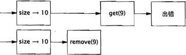

#  目录

[TOC]


# 第1章　简介

线程允许在同一个进程中同时存在多个程序控制流。线程**会共享进程范围内的资源**，例如内存句柄和文件句柄，但每个线程都有**各自的程序计数器（Program Counter）、栈以及局部变量等**。线程还提供了一种直观的分解模式来充分利用多处理器系统中的硬件并行性，而在***同一个程序中的多个线程也可以被同时调度到多个CPU上运行*。**
线程也被称为轻量级进程。在大多数现代操作系统中，都**是以线程为基本的调度单位**，而不是进程

 如果没有明确的协同机制，那么线程将彼此独立执行。由于同一个进程中的所有线程都将共享进程的内存地址空间，因此这些线程都能访问相同的变量并**在同一个堆上分配对象**，这就需要实现一种比在进程间共享数据粒度更细的数据共享机制。如果没有明确的同步机制来协同对共享数据的访问，那么当一个线程正在使用某个变量时，另一个线程可能同时访问这个变量，这将造成不可预测的结果。

 通过使用线程，可以将复杂并且异步的工作流进一步分解为一组简单并且同步的工作流，每个工作流在一个单独的线程中运行，并在特定的同步位置进行交互。

 框架负责解决一些细节问题，例如**请求管理、线程创建、负载平衡，并在正确的时刻将请求分发给正确的应用程序组件**。编写Servlet的开发人员不需要了解有多少请求在同一时刻要被处理，也不需要了解套接字的输入流或输出流是否被阻塞。当调用Servlet的service方法来响应Web请求时，可以以同步方式来处理这个请求，**就好像它是一个单线程程序。**

 > 早期使用非阻塞I/O的原因

 >在单线程应用程序中，这不仅意味着在处理请求的过程中将停顿，而且还意味着在这个线程被阻塞期间，对所有请求的处理都将停顿。为了避免这个问题，单线程服务器应用程序必须使用非阻塞I/O，这种I/O的复杂性要远远高于同步I/O，并且很容易出错。然而，如果每个请求都拥有自己的处理线程，那么在处理某个请求时发生的阻塞将不会影响其他请求的处理。
 >
 >>早期的操作系统通常会将进程中可创建的线程数量限制在一个较低的阈值内，大约在数百个（甚至更少）左右。因此，操作系统提供了一些高效的方法来实现多路I/O，


 安全性的含义是“**永远不发生糟糕的事情**”，而活跃性则关注于另一个目标，即“**某件正确的事情最终会发生**”。

 串行程序中，活跃性问题的形式之一就是**无意中造成的无限循环，从而使循环之后的代码无法得到执**行。线程将带来其他一些活跃性问题。例如，如果线程A在等待线程B释放其持有的资源，而线程B永远都不释放该资源，那么A就会永久地等待下去。

 活跃性意味着**某件正确的事情最终会发生，但却不够好**，因为我们通常希望正确的事情尽快发生。性能问题包括多个方面，例如服务时间过长，响应不灵敏，吞吐率过低，资源消耗过高，或者可伸缩性较低等。

 框架通过在框架线程中调用应用程序代码将并发性引入到程序中。在代码中将不可避免地访问应用程序状态，因此所有访问这些状态的代码路径都必须是线程安全的。


 远程方法调用（Remote Method Invocation, RMI）。****RMI使代码能够调用在其他JVM中运行的对象****。当通过RMI调用某个远程方法时，传递给方法的**参数必须被打包（也称为列集[Marshaled]）到一个字节流中**，通过网络传输给远程JVM，然后由远程JVM拆包（或者称为散集[Unmarshaled]）并传递给远程方法。

当RMI代码调用远程对象时，这个调用将在哪个线程中执行？你并不知道，但肯定不会在你创建的线程中，而是将在一个由RMI管理的线程中调用对象。RMI会创建多少个线程？同一个远程对象上的同一个远程方法会不会在多个RMI线程中被同时调用


远程对象必须**注意两个线程安全性问题**==：***正确地协同在多个对象中共享的状态，以及对远程对象本身状态的访问（*由于同一个对象可能会在多个线程中被同时访问***）==*。与Servlet相同，RMI对象应该做好被多个线程同时调用的准备，并且必须确保它们自身的线程安全性。

 

 # 第2章　线程安全性
-----

 **要编写线程安全的代码，其核心在于要对状态访问操作进行管理，特别是对共享的（Shared）和可变的（Mutable）状态的访问。**

 共享”意味着变量可以由**多个线程同时访问**，而“可变”则意味着变量的值在其生命周期内可以**发生变化。**

一个对象是否需要是线程安全的，取决于它是否被多个线程访问。==这指的是在程序中访问对象的方式，而不是对象要实现的功能==。要使得对象是线程安全的，需要采用同步机制来协同对对象可变状态的访问。

---
当多个线程访问某个状态变量并且其中有一个线程执行写入操作时，必须采用同步机制来协同这些线程对变量的访问。**==Java中的主要同步机制是关键字synchronized，它提供了一种独占的加锁方式，但“同步”这个术语还包括volatile类型的变量，显式锁（Explicit Lock）以及原子变量。==**


如果当多个线程访问同一个可变的状态变量时没有使用合适的同步，那么程序就会出现错误。有三种方式可以修复这个问题：
- 不在线程之间共享该状态变量。
- 将状态变量修改为不可变的变量。
- 在访问状态变量时使用同步。

线程安全的程序是否完全由线程安全类构成？答案是否定的，完全由线程安全类构成的程序并不一定就是线程安全的，而在线程安全类中也可以包含非线程安全的类。

## 2.1　什么是线程安全性
----
可以将单线程的正确性近似定义为“所见即所知（we know it when we see it）”


线程安全性：当多个线程访问某个类时，这个类始终都能表现出正确的行为，那么就称这个类是线程安全的。

当多个线程访问某个类时，不管运行时环境采用何种调度方式或者这些线程将如何交替执行，并且在主调代码中不需要任何额外的同步或协同，这个类都能表现出正确的行为，那么就称这个类是线程安全的

如果某个类在单线程环境[2]中都不是正确的，那么它肯定不会是线程安全的。如果正确地实现了某个对象，那么在任何操作中（包括调用对象的公有方法或者对其公有域进行读/写操作）都不会违背不变性条件或后验条件。在线程安全类的对象实例上执行的任何串行或并行操作都不会使对象处于无效状态。


**示例：一个无状态的Servlet**

框架都能创建多个线程并在这些线程中调用你编写的代码，因此你需要保证编写的代码是线程安全的。通常，线程安全性的需求并非来源于对线程的直接使用，而是使用像Servlet这样的框架。


``` java
@ThreadSafe
public class StatelessFactorizer implements Servlet{
    public void service（ServletRequest req, ServletResponse resp）{
        BigInteger i = extractFromRequest（req）；
        BigInteger[] factors = factor（i）；
        encodeIntoResponse（resp, factors）；
    }
}
```
与大多数Servlet相同，StatelessFactorizer是**无状态的**：==它既不包含任何域，也不包含任何对其他类中域的引用.==

计算过程中的临时状态仅存在于**线程栈上的局部变量中**，并且**只能由正在执行的线程访问**。访问StatelessFactorizer的线程不会影响另一个访问同一个StatelessFactorizer的线程的计算结果，因为这两个线程并没有共享状态，**就好像它们都在访问不同的实例**。由于线程访问无状态对象的行为并不会影响其他线程中操作的正确性，因此无状态对象是线程安全的。

**==无状态对象一定是线程安全的==**

大多数Servlet都是无状态的，从而极大地降低了在实现Servlet线程安全性时的复杂性。只有当Servlet在处理请求时需要保存一些信息，线程安全性才会成为一个问题。


## 2.2 原子性
---
**当我们在无状态对象中增加一个状态时，会出现什么情况？**

假设我们希望增加一个“命中计数器”（Hit Counter）来统计所处理的请求数量。一种直观的方法是在Servlet中增加一个long类型的域，并且每处理一个请求就将这个值加1，如程序清单2-2中的UnsafeCountingFactorizer所示。


``` java
程序清单2-2　在没有同步的情况下统计已处理请求数量的Servlet（不要这么做）
@NotThreadSafe
public class UnsafeCountingFactorizer implements Servlet{
    private long count=0；
    public long getCount（）{return count；}
    public void service（ServletRequest req, ServletResponse resp）{
        BigInteger i = extractFromRequest（req）；
        BigInteger[] factors=factor（i）；
        ++count；
        encodeIntoResponse（resp, factors）；
    }
}

```
这个类很可能会丢失一些更新操作

虽然递增操作++count是一种紧凑的语法，使其看上去只是一个操作，==**但这个操作并非原子的**==，因而它并不会作为一个不可分割的操作来执行。实际上，它包含了三个独立的操作：**读取count的值，将值加1，然后将计算结果写入count**。这是一个“读取-修改-写入”的操作序列，并且其结果状态依赖于之前的状态

如果计数器的初始值为9，那么在某些情况下，每个线程读到的值都为9，接着执行递增操作，并且都将计数器的值设为10。

> [1]。在并发编程中，这种由于不恰当的执行时序而出现不正确的结果是一种非常重要的情况，它有一个正式的名字：竞态条件（Race Condition）

### 2.2.1　竞态条件
---
当某个计算的正确性取决于多个线程的交替**执行时序时**，那么就会发生竞态条件。(就是正确的结果要取决于运气)

最常见的竞态条件类型就是“先检查后执行（Check-Then-Act）”操作，即通过一个可能失效的观测结果来决定下一步的动作。

这种类型的竞态条件称为“先检查后执行”：首先观察到某个条件为真（例如文件X不存在），然后根据这个观察结果采用相应的动作（创建文件X），但事实上，在你观察到这个结果以及开始创建文件之间，观察结果可能变得无效（另一个线程在这期间创建了文件X），从而导致各种问题（未预期的异常、数据被覆盖、文件被破坏等）。

>竞态条件这个术语很容易与另一个相关术语“数据竞争（Data Race）”相混淆。
>**数据竞争是指，如果在访问共享的非final类型的域时没有采用同步来进行协同，那么就会出现数据竞争。**
>当一个线程写入一个变量而另一个线程接下来读取这个变量，或者读取一个之前由另一个线程写入的变量时，并且在这两个线程之间没有使用同步，那么就可能出现数据竞争。在Java内存模型中，如果在代码中存在数据竞争，那么这段代码就没有确定的语义。并非所有的竞态条件都是数据竞争，同样并非所有的数据竞争都是竞态条件，但二者都可能使并发程序失败。在UnsafeCountingFactorizer中既存在竞态条件，又存在数据竞争。==参见第16章了解数据竞争的更详细内容。==


### 2.2.2　示例：延迟初始化中的竞态条件
---
使用“先检查后执行”的一种常见情况就是**延迟初始化**。

**延迟初始化的目的是将对象的初始化操作推迟到实际被使用时才进行，同时要确保只被初始化一次**


```java
程序清单2-3　延迟初始化中的竞态条件（不要这么做）
@NotThreadSafe
public class LazyInitRace{
    private ExpensiveObject instance=null；
    public ExpensiveObject getInstance（）{
        if（instance==null）{
            instance=new ExpensiveObject（）；
        }
        return instance；
    }
}
```
在LazyInitRace中包含了一个竞态条件，它可能会破坏这个类的正确性。

假定线程A和线程B同时执行getInstance。A看到instance为空，因而创建一个新的ExpensiveObject实例。B同样需要判断instance是否为空。**此时的instance是否为空，要取决于不可预测的时序**，包括线程的调度方式，以及A需要花多长时间来初始化ExpensiveObject并设置instance。如果当B检查时，instance为空，那么在两次调用getInstance时可能会得到不同的结果


### 2.2.3　复合操作
----
LazyInitRace和UnsafeCountingFactorizer都包含一组需要**以原子方式执行**（或者说不可分割）的操作。要避免竞态条件问题，就必须在某个线程修改该变量时，通过某种方式防止其他线程使用这个变量，从而确保其他线程只能在修改操作**完成之前或之后**读取和修改状态，而不是在修改状态的过程中。

假定有两个操作A和B，如果从执行A的线程来看，当另一个线程执行B时，要么将B全部执行完，要么完全不执行B，那么A和B对彼此来说是原子的。原子操作是指，对于访问同一个状态的所有操作（包括该操作本身）来说，这个操作是一个以原子方式执行的操作

为了确保线程安全性，“先检查后执行”（例如延迟初始化）和“读取-修改-写入”（例如递增运算）等操作必须是原子的。我们将“先检查后执行”以及“读取-修改-写入”等操作统称为复合操作：包含了一组必须以原子方式执行的操作以确保线程安全性。


```java
程序清单2-4　使用AtomicLong类型的变量来统计已处理请求的数量

@ThreadSafe
public class CountingFactorizer implements Servlet{
    private final AtomicLong count = new AtomicLong（0）；
    public long getCount（）{ return count.get（）；}
    public void service（ServletRequest req, ServletResponse resp）{
        BigInteger i = extractFromRequest（req）；
        BigInteger[] factors=factor（i）；
        count.incrementAndGet（）；
        encodeIntoResponse（resp, factors）；
    }
}
```
在java.util.concurrent.atomic包中包含了一些原子变量类，用于实现在数值和对象引用上的原子状态转换。通过用AtomicLong来代替long类型的计数器，能够确保所有对计数器状态的访问操作都是原子的。[1]由于Servlet的状态就是计数器的状态，并且计数器是线程安全的，因此这里的Servlet也是线程安全的。

当在无状态的类中添加一个状态时，如果该状态完全由线程安全的对象来管理，那么这个类仍然是线程安全的。


## 2.3　加锁机制
---
当在 Serviet 中添加一个状态变量时 ，可以通**过线程安全的对象来管理 Servlet 的状态**以维 护 Servlet 的线程安全性

**但如果想在 Servlet 中添加更多的状态，那么是否只需添加更 多的线 程安全状态变量就足够了 ？**
==并不是这样，这是错误的==


假设我们希望提升 Servlet 的性能：将最近的计算结果缓存起来 ，当两个连续的请求对相同 的数值进行因数分解时，可以直接使用土一次 的计算结果，而无须重新计算 。（这并非一种有 效的缓存策略，5.6 节将给出一种更好的策略。） 要实现该缓存策略 ，需要保存两个状态：最近 执行因数分解的数值 ，以及分解结果 。


```java
程序清单 2-5 该 Serviet 在没有足够原子性保证的情况下对其最近计算结果进行缓存 （不要这么做〉
®NotThreadSafe
public  class UnsafeCachiFactorizer  implements  Servlet  { 
    private final AtomicRef erence<Biglnteger> lastNumer = 
             new AtomicRef erence<Biginteger> () ;
    private final AtomicRef erence<Biginteger []>	lastFactors =
            new AtomicRef erence<Biginteger[]> ( ) ;

    public void service (ServletRequest req, ServletResponse resp) { 
        Biginteger  i = extractFromRequest ( req) ;
        if( i.equals(lastNumer.get () ) )
            encodeIntResponse( resp,lastFactore.get() )  ; 
        else  {
            Biglnteger [] factors=factor ( i) ; 
            lastNumer.set{i) ;  
            laetFactors.set(factors) ;
            encdeintoResponse (resp,  factors) ;
        }
    }
}
```
然而，**这种方怯并不正确** 。==尽管这些原子引用本身都是线程安全的 ，但在UnsafeCaching Factorizer  中存在着竞态条件 ，这可能产生错误的 结果。==

在线程安全性的定义中要求 ，多个线程之间的操作无论采用何种执行 时序或交替方式，都 要保证不变性条件不被破坏 。UnsafeCachingF actorizer 的**不变性条件之一**是 ：**在lastFactors 中 缓存的因数之积应该等于在 lastNumber  中缓存的数值**。只有确保了这个不变性条件不被破坏 ， 上面的 Servlet 才是正确的。**当在不变性条件中涉及多个变量时，各个变量之间并不是彼此独立** 的，而是**某个变量的值会对其他变量的值产生约束**。因此，==当更新某一个变量时，需要在同一 个原子操作中对其他变量同时进行更新 。==
在某些执行时序中 ，UnsafeCachingFactorizer    可能会破坏这个不变性条件 。在使用原子 引用的情况下，尽管对 set 方法的每次调用都是原子的 ，但仍然无法同时更新lastNumber 和 lastFactors 。如果只修改了其中一个变量 ，那么在这两次修改操作之间 ，其他线程将发现不变性 条件被破坏了 。同样，我们也不能保证会同时获取两个值 ：在线程 A 获取这两个值的过程中 ，
线程 B 可能修改了它们，这样线程A也会发现不变性条件被破坏了

> AtomicLong 是一种替代 long 类型整数的线程安全类，类似地，AtomicReference 是一种替代对象引用的钱
> 程安全类。在第 15 章将介绍各种原子变量 （Atomic Variable） 及其优势．

> ==要保持状态的一致性，就需要在单个原子操作中更新所有相关的状态变量==


### 2.3.1   内置锁
---
Java 提供了一种内置的锁机制来支持原子性同步代码块 （ Synchronize Block ）

同步代码块包括两部分 ：
一个 作为锁的对象引用，一个作为由这个锁保护的代码块 。

以关键宇 synchronized  来修饰的方法就 是一种横跨整个方怯体的同步代码块，其中该同步代码块的锁就是方法调用所在的对象  。静态 的.synchronized方法以Class对象作为锁。

每个 Java 对象都可以用做一个实现同步的锁，这些锁被称为内置锁 (Intrinsic Lock）或监视 器锁（Monitor Lock）。线程在进入同步代码块之前会自动获得锁，并且在退出同步代码块时自 动释放锁 **，而无论是通过正常的控制路程退出 ，还是通过从代码块中抛出异常退出** 。获得内置锁的唯一途径就是进入由这个锁保护的同步代码块或方法。

Java 的内置锁相当于一种**互斥体 （或互斥锁）**，这意味着最多只有一个钱程能持有这种锁 。 当线程 A 尝试获取一个由线程 B 持有的锁时 ，线程 A 必须等待或者阻塞 ，直到线程 B释放这 个锁。如果B 永远不释放锁 ，那么A 也将永远地等下去 。

由于每次只能有一个线程执行内置锁保护的代码块，因此，由这个锁保护的同步代码块会 以原子方式执行，多个线程在执行该代码块时也不会相互干扰。井发环境中的原子性与事务应 用程序中的原子性有着相同的含义一一一组语句作为一个不可分割的单元被执行 。任何一个执 行同步代码块的线程，都不可能看到有其他线程正在执行由同一个锁保护的同步代码块。

这种同步机制使得要确保因数分解 Servlet 的钱程安全性变得更简单 。在程序清单 2-6 中使 用了关键宇 synchronized 来修饰 service 方洁 ，因此在同一时间只有一个线程可以执行 servrice 方住。现在的SynchronizedFactoiizer 是线程安全的 。然而，这种方也却过于极端 ，因为多个 客户端无法同时使用因数分解 Setvlet ，服务的响应性非常低，无主主令人接受。这是一个性能问 题，而不是线程安全问题，我们将在 2.5  节解决这个问题。


[程序清单 2-6]: java并发编程.md#2.2.2　示例：延迟初始化中的竞态条件
<span id="code2-6" >
程序清单 2-6 
</span>

```java
程序清单 2-6 这个 Servlet能正确地握存最新的计算结果，但并发性却非常糟糕（不要这么做）
@ThreadSafe
public class SynchronizedFactorizer implements Servlet{
    @GuardedBy（"this"）private BigInteger lastNumber；
    @GuardedBy（"this"）private BigInteger[]lastFactors；
    public synchronized void service（ServletRequest req， ServletResponse resp）{
        BigInteger i=extractFromRequest（req）；
        if（i.equals（lastNumber））
            encodeIntoResponse（resp, lastFactors）；
        else{
            BigInteger[]factors=factor（i）；
            lastNumber=i；
            lastFactors=factors；
            encodeIntoResponse（resp, factors）；
        }
    }
}
```


### 2.3.2  重入
----
当某个线程请求一个由其他线程持有的锁时 ，发出请求的线程就会阻塞 。

然而，由于内置锁是可重人的，因此如果某个线程试图获得一个已经由它自己持有的锁，那么这个请求就会成功。“重入” 意味着获取锁的操作的粒度是"线程" 而不是“调用” 。

重入的一种实现方法是，为每个锁关联一个获取计数值和一个所有者线程 。当计数值为 0 时，这个锁就被认为是没有被任何线程持有 。当线程请求一个未被持有的锁时，JVM  将记下锁的持有者 ，并且将获取计数值置为 1。如果同一个线程再次获取这个锁 ，计数值将递增，而当线程退出同步代码块时 ，计数器会相应地递减 。当计数值为0时，这个锁将被释放 。


重入进一步提升了加锁行为的封装性  ，因此简化了面向对象井发代码的开发。在程序清单
2-7  的代码中，子类改写了父类的synchronized  方法，然后调用父类中的方撞 ，**此时如果没有可重入的锁 ，那么这段代码将产生死锁**。由于Widget 和 LoggingWidget  中doSomething 方法都是 synchronized 方法 ，因此每个 doSomething 方法在执行前都会获取 Widget上的锁。然而，如果内置锁不是可重入的 ，那么在调用 super.doSomething 时将无站获得 Widget 上的锁，因为这 个锁已经被持有 ，从而线程将永远停顿下去，等待一个永远也无法获得 的锁。重入则避免了这 种死锁情况的发生 。


```java
程序清单2-7　如果内置锁不是可重入的，那么这段代码将发生死锁
public class Widget{
    public synchronized void doSomething（）{
    ……
    }
}

public class LoggingWidget extends Widget{
    public synchronized void doSomething（）{
        System.out.println（toString（）+"：calling doSomething"）；
        super.doSomething（）；
    }
}
```

> ==关于“那么在调用 super.doSomething 时将无站获得 Widget 上的锁，因为这 个锁已经被持有 ，从而线程将永远停顿下去，等待一个永远也无法获得的锁”的自我理解==


```

public class Demo01 {
    static{
        System.out.println("静态初始化Demo01");
    }
    public static void main(String[] args) {
        System.out.println("Demo01的main方法");
        A a = new A();
//        System.out.println(A.width);
//        A a2 = new A();
静态初始化Demo01
Demo01的main方法
静态初始化类A_Father
静态初始化类A

创建A_Father类对象 A_Father  init
thread.A@1c6b6478

创建A类对象  A init
thread.A@1c6b6478
    }
}
class A extends A_Father{
    public static int width=100;
    static{
        System.out.println("静态初始化类A");
        width=300;
    }
    public A(){
        System.out.println("创建A类对象  A init");
        System.out.println(this);
    }
}
class A_Father{
    static{
        System.out.println("静态初始化类A_Father");
    }

    public A_Father(){
        System.out.println("创建A_Father类对象 A_Father  init");
        System.out.println(this);
    }
}


```
jvm创建X对象，先按继承链自顶向下执行静态代码块和静态方法 <br/>
静态初始化类A_Father <br/>
width=100;  <br/>
静态初始化类A
width=300;  <br/>
然后自顶向下执行构造函数，但注意此时，执行这些构造函数的对象都是同一个（thread.A@1c6b6478）

因此

```java
public class Demo02 {
    public static void main(String[] args) {
        LoggingWidget loggingWidget = new LoggingWidget();
        loggingWidget.doSomething();
    }

}

class Widget{
    public Widget() {
        System.out.println("widget init: "+this);
    }

    public synchronized void doSomething(){
        System.out.println("widget doSomething : " + this);
    }
}

class LoggingWidget extends Widget{
    public LoggingWidget() {
        System.out.println("LoggingWidget init; " + this);
    }

    public synchronized void doSomething(){
        System.out.println(toString()+"：calling doSomething");
        System.out.println("LoggingWidget doSomething : " + this);
        super.doSomething();
    }
}


widget init: thread.LoggingWidget@1c6b6478
LoggingWidget init; thread.LoggingWidget@1c6b6478

thread.LoggingWidget@1c6b6478：calling doSomething
LoggingWidget doSomething : thread.LoggingWidget@1c6b6478
widget doSomething : thread.LoggingWidget@1c6b6478
```

当LoggingWidget的实例loggingWidget执行doSomething方法时，获取的是thread.LoggingWidget@1c6b6478的锁，当执行到父类的doSomething方法时，获取的依然是thread.LoggingWidget@1c6b6478的锁

----
**补充：<br>**

线程进入LoggingWidget.doSomething()时获取的锁不应该是LoggingWidget对象锁吗?怎会是Widget上的锁?super.doSomething()获取的究竟是哪个对象锁呢？对于喜欢追究细节的我来说，此时有了种种疑问，尤其是写完第一篇博客： java并发编程实践学习（一）java的类锁和对象锁。按照字面的意思，貌似是说：执行子类对象的同步方法时候，也会获取父对象的锁，如果不是可重入锁的话，再次调用super.doSomething()想要第二次获取Widget对象的锁，就不会成功。


>这里就产生了1个问题：什么是子类对象，什么是父类对象？是不是创建子类对象,肯定会创建一个父类的对象?

==**首先创建一个子类对象的时候是不会创建一个父类对象的，父类对象是根本不存在的**==。我们可以使用反证法，假如说创建子类对象的同时会创建一个父类对象，那如果父类是抽象类，不能实例化呢？我们知道使用A a = new A()这种方式创建对象的时候，JVM会在后台给我们分配内存空间，然后调用构造函数执行初始化操作，最后返回内存空间的引用。即构造函数只是进行初始化，并不负责分配内存空间（创建对象）。所以呢其实创建子类对象的时候，JVM会为子类对象分配内存空间，并调用父类的构造函数。我们可以这样理解：创建了一个子类对象的时候，在子类对象内存中，有两份数据，一份继承自父类，一份来自子类，但是他们属于同一个对象（子类对象），只不过是java语法提供了this和super关键字来让我们能够按照需要访问这2份数据而已。这样就产生了子类和父类的概念，但实际上只有子类对象，没有父类对象。

[可重入锁](https://blog.csdn.net/aitangyong/article/details/22695399)

-----


```
package thread;

import org.dom4j.io.SAXReader;

/**
 * Created by ding on 2018/10/12.
 */
public class Demo03 {
    public static void main(String[] args) {
        System.out.println(Thread.currentThread().hashCode()+" = ");
        B b = new B();
        b.show();

    }
}

class B_Father{

    private String key = "B_Father";
    public B_Father() {
        SAXReader saxReader = new SAXReader();
        System.out.println("B_Father : "+ saxReader );
        key = "B_Father11";
    }

    public void show(){
//        System.out.println(Thread.currentThread().hashCode()+" = "+this);
        System.out.println("show key  " + this.key +" "+ this.key.hashCode());
    }
}

class B extends B_Father{
    private String key = "B";
    public B() {
        SAXReader saxReader = new SAXReader();
        System.out.println("B : "+ saxReader );
//        this.show();
//        System.out.println(key.hashCode());
        super.show();
    }
    public void show(){
//        System.out.println(Thread.currentThread().hashCode()+" = "+this);
        System.out.println("show key  " + this.key +" "+ this.key.hashCode());
    }
}
```


关于继承时，子类和父类存在同名属性和方法的问题
B extends  A    

1. B中无属性i  B.i --> B.A.i --> 输出的是A的i
2. B中有属性i  B.i ---> 输出的是B的i
3. B中无方法f()  f()是A的方法，输出i  B.f()--> B.A.f()--->输出的是B.A.i
4. B中有方法f()  B.f()--> 输出的是B.i

## 2.4　用锁来保护状态
----
由于锁能使其保护的代码路径以串行形式[1]来访问，因此可以通过锁来构造一些协议以实现对共享状态的独占访问。只要始终遵循这些协议，就能确保状态的一致性<br>

访问**共享状态**的复合操作，例如命中**计数器的递增操作（读取-修改-写入）或者延迟初始化（先检查后执行），==都必须是原子操作以避免产生竞态条件==**。如果在复合操作的执行过程中持有一个锁，那么会使复合操作成为原子操作。**然而，仅仅将复合操作封装到一个同步代码块中是不够的**。<br>
如果用同步来协调对某个变量的访问，那么在访问这个变量的所有位置上都需要使用同步。而且，当使用锁来协调对某个变量的访问时，在访问变量的所有位置上都要使用同一个锁。
**一种常见的错误是认为，只有在写入共享变量时才需要使用同步，然而事实并非如此**（3.1节将进一步解释其中的原因）。<br>

对于可能被**多个线程同时访问**的**可变**状态变量，在访问它时都需要**持有同一个锁**，在这种情况下，我们称状态变量是由这个锁保护的。


在[程序清单2-6](#code2-6)的SynchronizedFactorizer中，lastNumber和lastFactors这两个变量都是由Servlet对象的内置锁来保护的，在标注@GuardedBy中也已经说明了这一点。

对象的内置锁与其状态之间**没有内在的关联**。虽然大多数类都将内置锁用做一种有效的加锁机制，**但对象的域并不一定要通过内置锁来保护**。<br>**当获取与对象关联的锁时，并不能阻止其他线程访问该对象，某个线程在获得对象的锁之后，只能阻止其他线程获得同一个锁。之所以每个对象都有一个内置锁，只是为了免去显式地创建锁对象**。<br>

> [2]你需要自行构造加锁协议或者同步策略来实现对共享状态的安全访问，并且在程序中自始至终地使用它们。


每个共享的和可变的变量都**应该只由一个锁来保护**，从而使维护人员知道是哪一个锁。

==一种常见的加锁约定是，将所有的可变状态都封装在对象内部，并通过对象的内置锁对所有访问可变状态的代码路径进行同步，使得在该对象上不会发生并发访问。==

在许多线程安全类中都使用了这种模式，例如Vector和其他的同步集合类。在这种情况下，对象状态中的所有变量都由对象的内置锁保护起来。然而，这种模式并没有任何特殊之处，编译器或运行时都不会强制实施这种（或者其他的）模式[3]。==**如果在添加新的方法或代码路径时忘记了使用同步，那么这种加锁协议会很容易被破坏**。==


**并非所有数据都需要锁的保护**，==只有被多个线程同时访问的可变数据才需要通过锁来保护==。

第1章曾介绍，当添加一个简单的异步事件时，例如TimerTask，整个程序都需要满足线程安全性要求，尤其是当程序状态的封装性比较糟糕时。

++考虑一个处理大规模数据的单线程程序，由于任何数据都不会在多个线程之间共享，因此在单线程程序中不需要同步++。现在，假设希望添加一个新功能，即定期地对数据处理进度生成快照，这样当程序崩溃或者必须停止时无须再次从头开始。你可能会选择使用TimerTask，每十分钟触发一次，并将程序状态保存到一个文件中。


由于TimerTask在另一个（由Timer管理的）线程中调用，因此现在就有两个线程同时访问快照中的数据：程序的主线程与Timer线程。这意味着，当访问程序的状态时，不仅TimerTask代码必须使用同步，而且程序中所有访问相同数据的代码路径也必须使用同步。原本在程序中不需要使用同步，现在变成了在程序的各个位置都需要使用同步。


当某个变量由锁来保护时，意味着在每次访问这个变量时都需要首先获得锁，这样就确保在同一时刻只有一个线程可以访问这个变量。当类的不变性条件涉及多个状态变量时，那么还有另外一个需求：**在不变性条件中的每个变量都必须由同一个锁来保护**。因此可以在单个原子操作中访问或更新这些变量，从而确保不变性条件不被破坏。


在SynchronizedFactorizer类中说明了这条规则：缓存的数值和因数分解结果都由Servlet对象的内置锁来保护。对于每个包含多个变量的不变性条件，其中涉及的所有变量都需要由同一个锁来保护。如果同步可以避免竞态条件问题，那么为什么不在每个方法声明时都使用关键字synchronized？事实上，如果不加区别地滥用synchronized，可能导致程序中出现过多的同步。此外，**如果只是将每个方法都作为同步方法，例如Vector，那么并不足以确保Vector上复合操作都是原子的**：

```Java
if（！vector.contains（element））
      vector.add（element）；
```

**虽然contains和add等方法都是原子方法**，==但在上面这个“如果不存在则添加（put-if-absent）”的操作中仍然存在竞态条件。==

虽然synchronized方法可以确保单个操作的原子性，但如果要把多个操作合并为一个复合操作，还是需要额外的加锁机制（请参见4.4节了解如何在线程安全对象中添加原子操作的方法）。此外，将每个方法都作为同步方法还可能导致活跃性问题（Liveness）或性能问题（Performance），我们在SynchronizedFactorizer中已经看到了这些问题。

>[1]对象的串行访问（Serializing Access）与对象的序列化（Serialization，即将对象转化为字节流）操作毫不相干。串行访问意味着多个线程依次以独占的方式访问对象，而不是并发地访问。<br>
>[2]回想起来，这种设计决策或许比较糟糕：不仅会引起混乱，而且还迫使JVM需要在对象大小与加锁性能之间进行权衡。<br>
>[3]如果某个变量在多个位置上的访问操作中都持有一个锁，但并非在所有位置上的访问操作都如此时，那么通过一些代码核查工具，例如FindBugs，就可以发现这种情况，并报告可能出现了一个错误。


**井非所有数据都需要锁的保护 ，只有被多个线程同时访 问的可变数据才需要通过锁来保护。**


## 2.5　活跃性
---

<span id="code2-8"></span>
```java
程序清单2-8　缓存最近执行因数分解的数值及其计算结果的Servlet

@ThreadSafe
public class CachedFactorizer implements Servlet{
    @GuardedBy（"this"）private BigInteger lastNumber；
    @GuardedBy（"this"）private BigInteger[] lastFactors；
    @GuardedBy（"this"）private long hits；
    @GuardedBy（"this"）private long cacheHits；
    public synchronized long getHits（）{ return hits；}
    
    public synchronized double getCacheHitRatio（）{
        return（double）cacheHits/（double）hits；
    }
    
    public void service（ServletRequest req, ServletResponse resp）{
        BigInteger i=extractFromRequest（req）；
        BigInteger[] factors=null；
        
        synchronized（this）{
            ++hits；
            if（i.equals（lastNumber））{ // 复合操作 先检查后执行
                ++cacheHits；
                factors=lastFactors.clone（）；
            }
        }
        
        
        if（factors==null）{
            factors=factor（i）；
            synchronized（this）{ // 复合操作  多个操作同步更新
                lastNumber=i；
                lastFactors=factors.clone（）；
            }
        }
        encodeIntoResponse（resp, factors）；
    }
}
```
程序清单2-8中的CachedFactorizer将Servlet的代码修改为使用两个独立的同步代码块，每个同步代码块都只包含一小段代码。

其中一个同步代码块负责保护判断是否只需返回缓存结果的“先检查后执行”操作序列，另一个同步代码块则负责确保对缓存的数值和因数分解结果进行同步更新。

此外，我们还重新引入了“命中计数器”，添加了一个“缓存命中”计数器，并在第一个同步代码块中更新这两个变量。**由于这两个计数器也是共享可变状态的一部分，因此必须在所有访问它们的位置上都使用同步**。**位于同步代码块之外的代码将以独占方式来访问局部（位于栈上的）变量，这些变量不会在多个线程间共享，因此不需要同步**。

# 第3章　对象的共享
----
第2章介绍了如何通过**同步来避免多个线程在同一时刻访问相同的数据**，而本章将介绍**如何共享和发布对象，从而使它们能够安全地由多个线程同时访问**。这两章合在一起，就形成了构建线程安全类以及通过java.util.concurrent类库来构建并发应用程序的重要基础。

我们已经知道了++同步代码块和同步方法可以确保以原子的方式执行操作++，但一种**常见的误解是，认为关键字synchronized只能用于实现原子性或者确定“临界区（Critical Section）”**。==同步还有另一个重要的方面：内存可见性（Memory Visibility）==。我们**不仅希望防止某个线程正在使用对象状态而另一个线程在同时修改该状态，而且希望确保当一个线程修改了对象状态后，其他线程能够看到发生的状态变化**。如果没有同步，那么这种情况就无法实现。你可以通过显式的同步或者类库中内置的同步来保证对象被安全地发布。


## 3.1　可见性
----
在单线程环境中，如果向某个变量先写入值，然后在没有其他写入操作的情况下读取这个变量，那么总能得到相同的值。这看起来很自然。然而，当读操作和写操作在不同的线程中执行时，情况却并非如此

通常，我们无法确保执行读操作的线程能适时地看到其他线程写入的值，有时甚至是根本不可能的事情。**为了确保多个线程之间对内存写入操作的可见性，必须使用同步机制。**

在程序清单3-1中的NoVisibility说明了当多个线程在没有同步的情况下共享数据时出现的错误

在代码中，主线程和读线程都将访问共享变量ready和number。主线程启动读线程，然后将number设为42，并将ready设为true。读线程一直循环直到发现ready的值变为true，然后输出number的值。虽然NoVisibility看起来会输出42，但事实上很可能输出0，或者根本无法终止。这是因为在代码中没有使用足够的同步机制，因此无法保证主线程写入的ready值和number值对于读线程来说是可见的。

<span id="code3-1"></span>
```java
程序清单3-1　在没有同步的情况下共享变量（不要这么做）
public class NoVisibility{
    private static boolean ready；
    private static int number；
    
    private static class ReaderThread extends Thread{
        public void run（）{
            while（！ready）
            Thread.yield（）；
            System.out.println（number）；
        }
    }
    
    public static void main（String[]args）{
        new ReaderThread（）.start（）；
        number=42；
        ready=true；
    }
}
```
NoVisibility可能会持续循环下去，因为读线程可能永远都看不到ready的值。一种更奇怪的现象是，NoVisibility可能会输出0，因为读线程可能看到了写入ready的值，但却没有看到之后写入number的值，这种现象被称为“重排序（Reordering）”。只要在某个线程中无法检测到重排序情况（即使在其他线程中可以很明显地看到该线程中的重排序），那么就无法确保线程中的操作将按照程序中指定的顺序来执行。[1]当主线程首先写入number，然后在没有同步的情况下写入ready，那么读线程看到的顺序可能与写入的顺序完全相反。


在没有同步的情况下，编译器、处理器以及运行时等都可能对操作的执行顺序进行一些意想不到的调整。在缺乏足够同步的多线程程序中，要想对内存操作的执行顺序进行判断，几乎无法得出正确的结论。
NoVisibility是一个简单的并发程序，只包含两个线程和两个共享变量，但即便如此，在判断程序的执行结果以及是否会结束时仍然很容易得出错误结论。要对那些缺乏足够同步的并发程序的执行情况进行推断是十分困难的。
这听起来有点恐怖，但实际情况也确实如此。幸运的是，有一种简单的方法能避免这些复杂的问题：只要有数据在多个线程之间共享，就使用正确的同步。


### 3.1.1　失效数据   [目录](#目录)
----
NoVisibility展示了在缺乏同步的程序中可能产生错误结果的一种情况：==失效数据==。当读线程查看ready变量时，可能会得到一个已经失效的值。除非在每次访问变量时都使用同步，否则很可能获得该变量的一个失效值。更糟糕的是，**失效值可能不会同时出现：一个线程可能获得某个变量的最新值，而获得另一个变量的失效值。**

程序清单3-2中的Mutablelnteger**不是线程安全的**，因为get和set都是在没有同步的情况下访问value的。与其他问题相比，失效值问题更容易出现：如果某个线程调用了set，那么另一个正在调用get的线程可能会看到更新后的value值，也可能看不到

<span id="code3-2"></span>
```java
程序清单3-2　非线程安全的可变整数类
@NotThreadSafe
public class MutableInteger{
    private int value；
    public int get（）{return value；}
    public void set（int value）{this.value=value；}
}
```

在程序清单3-3的SynchronizedInteger中，通过对get和set等方法进行同步，可以使MutableInteger成为一个线程安全的类。**仅对set方法进行同步是不够的，调用get的线程仍然会看见失效值。**


```
程序清单3-3　线程安全的可变整数类
@ThreadSafe
public class SynchronizedInteger{
    @GuardedBy（"this"）private int value；
    public synchronized int get（）{return value；}
    public synchronized void set（int value）{this.value=value；}
}
```
>[1]这看上去似乎是一种失败的设计，但却能使JVM充分地利用现代多核处理器的强大性能。例如，在缺少同步的情况下，Java内存模型允许编译器对操作顺序进行重排序，并将数值缓存在寄存器中。此外，它还允许CPU对操作顺序进行重排序，并将数值缓存在处理器特定的缓存中。更多细节请参阅第16章。


>[2]在没有同步的情况下读取数据，类似于在数据库中使用READ_UNCOMMITTED隔离级别，在这种级别上将牺牲准确性以获取性能的提升。然而，在非同步的读取操作中则牺牲了更多的准确度，因为线程看到的共享变量值很容易失效


### 3.1.2　非原子的64位操作 [目录](#目录)
----
当线程在没有同步的情况下读取变量时，可能会得到一个失效值，但至少这个值是由之前某个线程设置的值，而**不是一个随机值**。这种安全性保证也被称为**最低安全性**（out-of-thin-air safety）。


最低安全性适用于绝大多数变量，但是**存在一个例外：非volatile类型的64位数值变量（double和long，请参见3.1.4节**）。==Java内存模型要求，变量的读取操作和写入操作都必须是原子操作，但对于非volatile类型的long和double变量，JVM允许将64位的读操作或写操作分解为两个32位的操作==。当读取一个非volatile类型的long变量时，如果对该变量的读操作和写操作在不同的线程中执行，那么很可能会读取到**某个值的高32位和另一个值的低32位**[1]。因此，即使不考虑失效数据问题，在多线程程序中使用共享且可变的long和double等类型的变量也是不安全的，除非用关键字volatile来声明它们，或者用锁保护起来。

>[1]在编写Java虚拟机规范时，许多主流处理器架构还不能有效地提供64位数值的原子操作。


### 3.1.3　加锁与可见性 [目录](#目录)
内置锁可以用于确保某个线程以一种可预测的方式来查看另一个线程的执行结果，如图3-1所示。当线程A执行某个同步代码块时，线程B随后进入由同一个锁保护的同步代码块，在这种情况下可以保证，在锁被释放之前，A看到的变量值在B获得锁后同样可以由B看到。换句话说，**当线程B执行由锁保护的同步代码块时，可以看到线程A之前在同一个同步代码块中的所有操作结果**。如果没有同步，那么就无法实现上述保证。


​                                                     3-1　同步的可见性保证

现在，我们可以进一步理解为什么在访问某个共享且可变的变量时要求所有线程在同一个锁上同步，就是为了**确保某个线程写入该变量的值对于其他线程来说都是可见的**。否则，如果一个线程在未持有正确锁的情况下读取某个变量，那么读到的可能是一个失效值。

**加锁的含义不仅仅局限于互斥行为，还包括内存可见性**。为了确保所有线程都能看到共享变量的最新值，所有==执行读操作或者写操作的线程都必须在同一个锁上同步==。


### 3.1.4　Volatile变量 [目录](#目录)

-----

Java语言提供了一种稍弱的同步机制，即volatile变量，用来确保将变量的更新操作通知到其他线程。当把变量声明为volatile类型后，编译器与运行时都会注意到**这个变量是共享的**，**因此不会将该变量上的操作与其他内存操作一起重排序。**volatile变量**不会被缓存在寄存器或者对其他处理器不可见的地方**，因此在读取volatile类型的变量时总会返回最新写入的值。

理解volatile变量的一种有效方法是，将它们的行为想象成程序清单3-3中SynchronizedInteger的类似行为，并将volaLile变量的读操作和写操作分别替换为get方法和set方法[1]。然而，在访问volatile变量时不会执行加锁操作，因此也就不会使执行线程阻塞，因此volatile变量是一种**比sychronized关键字更轻量级的同步机制**。[2]

volatile变量对可见性的影响比volatile变量本身更为重要。*当线程A首先写入一个volatile变量并且线程B随后读取该变量时，在写入volatile变量之前对A可见的所有变量的值，在B读取了volatile变量后，对B也是可见的*。因此，从内存可见性的角度来看，**写入volatile变量相当于退出同步代码块，而读取volatile变量就相当于进入同步代码块。**然而，我们==并不建议过度依赖volatile变量提供的可见性。如果在代码中依赖volatile变量来控制状态的可见性，通常比使用锁的代码更脆弱，也更难以理解。==

仅当volatile变量能简化代码的实现以及对同步策略的验证时，才应该使用它们。如果在验证正确性时需要对可见性进行复杂的判断，那么就不要使用volatile变量。==volatile变量的正确使用方式包括：==**确保它们自身状态的可见性，确保它们所引用对象的状态的可见性，以及标识一些重要的程序生命周期事件的发生（例如，初始化或关闭）。**

程序清单3-4**给出了volatile变量的一种典型用法：检查某个状态标记以判断是否退出循环**。在这个示例中，线程试图通过类似于数绵羊的传统方法进入休眠状态。为了使这个示例能正确执行，asleep必须为volatile变量。否则，当asleep被另一个线程修改时，执行判断的线程却发现不了[3]。我们也可以用锁来确保asleep更新操作的可见性，但这将使代码变得更加复杂。


<span  name="code3-4" style="display:none">程序清单3-4　数绵羊</span>

```java
程序清单3-4　数绵羊
volatile boolean asleep；
……
while（！asleep）
countSomeSheep（）；
```


虽然volatile变量很方便，但也存在一些局限性。**volatile变量通常用做某个操作完成、发生中断或者状态的==标志==**，例如程序清单3-4中的asleep标志。尽管volatile变量也可以用于表示其他的状态信息，但在使用时要非常小心。例如，==volatile的语义不足以确保递增操作（count++）的**原子性**，除非你能确保只有一个线程对变量执行写操作。==（**原子变量提供了“读-改-写”的原子操作**，并且常常用做一种“更好的volatile变量”。请参见第15章）。

**加锁机制既可以确保可见性又可以确保原子性，而volatile变量只能确保可见性。**

当且仅当满足以下所有条件时，才应该使用volatile变量：

- 对变量的写入操作不依赖变量的当前值，或者你能确保只有单个线程更新变量的值。
- 该变量不会与其他状态变量一起纳入不变性条件中。
- 在访问变量时不需要加锁。


> [1]这种类比并不准确，SynchronizedInteger在内存可见性上的作用比volatile变量更强。请参见第16章。

> [2]在当前大多数处理器架构上，读取volatile变量的开销只比读取非volatile变量的开销略高一些。

> [3]调试小提示：对于服务器应用程序，无论在开发阶段还是在测试阶段，当启动JVM时一定都要指定-server命令行选项。server模式的JVM将比client模式的JVM进行更多的优化，例如将循环中未被修改的变量提升到循环外部，因此在开发环境（client模式的JVM）中能正确运行的代码，可能会在部署环境（server模式的JVM）中运行失败。例如，如果在程序清单3-4中“忘记”把asleep变量声明为volatile类型，那么server模式的JVM会将asleep的判断条件提升到循环体外部（这将导致一个无限循环），但client模式的JVM不会这么做。在解决开发环境中出现无限循环问题时，解决这个问题的开销远小于解决在应用环境出现无限循环的开销。


## 3.2　发布与逸出

“发布（Publish）”一个对象的意思是指，**使对象能够在当前作用域之外的代码中使用**。例如，<u>将一个指向该对象的引用保存到其他代码可以访问的地方，或者在某一个非私有的方法中返回该引用，或者将引用传递到其他类的方法中</u>。在许多情况中，我们要确保对象及其内部状态不被发布。而在某些情况下，我们又需要发布某个对象，但如果在发布时要确保线程安全性，则可能需要同步。**发布内部状态可能会破坏封装性，并使得程序难以维持不变性条件**。例如，如果在对象构造完成之前就发布该对象，就会破坏线程安全性。**当某个不应该发布的对象被发布时，这种情况就被称为逸出（Escape）**。3.5节介绍了如何安全发布对象的一些方法。现在，我们首先来看看一个对象是如何逸出的。

**发布对象的最简单方法是将对 象的引用保存到一个公有的静态变量中 ，以便任何类和线程 都能看见该对象** ，如程序清单 3-5 所示。在 initialize 方楼中实例化一个新的 Hash Set 对象，并 将对象的引用保存到 knownSecrets  中以发布该对象 。	

​	

```java
程序清单 3-5  发布一个对象
public  static Set< Secret >  knownSecrets;
public void initialize ()  {
knownSecrets  = new HashSet<Secret> ( ) ;

```

**当发布某个对象时，可能会间接地发布其他对象**。如果将一个 Secret 对象添加到集合 knownSecrets 中，那么同样会发布这个对象，因为任何代码都可以遍历这个集合，并获得对这 个新 Secret 对象的引用。同样，如果从非私有方法中返回一个引用 那么同样会发布返回的对 象。程序清单3-6 中的UnsafeStates  发布了本应为私有的状态数组。

```java
程序清单 3-6   使内部的可变状态选出 （不要这么做）
class UnsafeStatus{
    private String[] states = new String[] {"a","b"};
    public String[] getStatus(){ return states;}
}
```

如果按照上述方式来发布 states，就会出现问题，因为**任何调用者都能修改这个数组的内容**。在这个示例中 ，数组states 已经逸出了它所在的作用域 ，因为这个**本应是私有的变量已经被发布了**。

当发布一个对象时，在该对象的非私有域中引用的所有对象同样会被发布   。一般来说，如 果一个已经发布的对象能够通过非私有的 变量引用和方陆调用到达其他的对象 ，那么这些对象 也都会被发布 。

假定有一个类 C，对于C来说，“外部（ Alien） 方怯” 是指行为并不完全由 C 来规定的方法，包括其他类中定义的方怯 以及类 C 中可以被改写的方怯 （ 既不是私有 ［private］ 方怯也不是 终结  ［final］   方法）。当把一个对象传递给某个外部方法时 ，就相当于发布了这个对象。你无法 知道哪些代码会执行，也不知道在外部方法中究竟会发布这个对象，还是会保留对象的引用并 在随后由另一个线程使用 。

无论其他的钱程会对 已发布的引用执行何种操作 ，其实都不重要，因为误用该引用的风险 始终存在。当某个对象逸出后，你必须假设有某个类或线程可能会误用该对象。这正是需要 使用封装的最主要原因 ：封装能够使得对程序的正确性进行分析变得可能，并使得无意中破坏 设计约束条件变得更难 。

**<u>最后一种发布对象或其内部状态的机制就是发布一个内部的类实例</u>**，如程序清单 3-7 的 ThisEscape 所示。当 ThisEscape 发布 EventListener时，==也隐含地发布了ThisEscape 实例本身==， **因为在这个内部类的实例中包含了对 ThisEscape实例的隐含引用。**

```java

程序清单 3-7  隐式地使 this 引用逸出 （不要这么做〉
public  class  ThisEscape  {
    public ThisEscape (EventSource source)  { 
        source.registerListener(
            new EventListener ( ) {
                public void onEvent (Event e){
                     doSomething ( e) ;
                }
            });
    }
}

```

安全的对象构造过程

在 ThisEscape  中给出了逸出的一个特殊示例，即**this 引用在构造函数中逸出** 。<u>当内部的 EventListener 实例发布时，在外部封装的 ThisEscape 实例也逸出了</u>。当且仅当对象的构造函数返回时，对象才处于可预测的和一致的状态。因此，当从对象的构造函数中发布对象时   ，只是 发布了一个尚未构造完成的对象 。即使发布对象的语句位于构造函数的 最后一行也是如此。如 果 this  引用在构造过程中逸出 ，那么这种对象就被认为是不正确构造。

> 不要在构造过程中使用this引用溢出


在构造过程中使 this 引用逸出的一个常见错误是，**在构造函数中启动一个线程**。当对象在其构造函数中创建一个线程时 ，无论是显式创建 （通过将它传给构造函数） 还是隐式创建 〈由 于 Thread 或 Runnable 是该对象的一个内部类）, **this 引用都会被新创建的线程共享** 。**在对象尚未完全构造之前 ，新的线程就可以看见它**。在构造函数中创建线程并没有错误 ，但最好不要立即启动它，而是通过一个 start 或 initialize 方法来启动 （请参见第 7 章了解更多关于服务生命 周期的 内容）。在构造函数中调用一个可改写的实例方法时  （既不是私有方法，也不是终结方 法），同样会导致this 引用在构造过程中逸出 。

如果想在构造函数中注册 一个事件监听器或启动线程，那么可以使用一个私有的构造函 数和一个公共的工厂方法 （Factory Method ） ，从而避免不正确的构造过程，如程序清单3-8 中 SafeListener    所示。

```java
程序清单 3-8  使用工厂方法来 防止 this 引用在构造过程中逸出

public class SafeListener{
	private final EventListener listener;
	
	private SafeListener(){
        listener = new EventListener ( ){
            public void onEvent (Event e){
                doSomething ( e ) ;
            }
        };
    }	

public static SafeListener newInstance ( EventSource  source){
	SafeListener safe  =  new  SafeListener ( ) ;
	source.registerListener(safe .listener); 
	return safe;
} 

```


## 3.3    线程封闭

当访问共享的可变数据时 ，通常需要使用同步 。一种避免使用同步的方式就是不共享数据 。如果仅在单线程内访问数据 ，就不需要同步 。这种技术被称为**线程封闭** （Thread Confinement ） ，它是实现线程安全性的最简单方式之一 。当某个对象封闭在一个线程中时 ，这种用也将自动实现线程安全性 ，即使被封闭的对象本身不是线程安全 的［CPJ 2.3.2］ 。

在 Swing 中大量使用了线程封闭技术 。Swing 的可视化组件和数据模型对象都不是线程安 全的，Swing 通过将它们封闭到 <u>Swing 的事件分发线程中来实现线程安全性</u> 。要想正确地使用 Swing，那么在除了事件钱程之外的其他线程中就不能访 问这些对象 （为了进一步简化对 Swing  . 的使用，Swing 还提供了 invokeLater 机制，用于将一个 Runnable 实例调度到事件线程中执行）。 Swing 应用程序的许多并发错误都是由于错误地在另一个线程中使用了这些被封闭的对象 。

线程封闭技术的另一种常见应用是 JDBC(Java Database Connectivity） 的Connection 对象。 **JDBC 规范并不要求 Connection 对象必须是线程安全的** θ。在典型的服务器应用程序中，线程 从连接池中获得一个 Connection  对象，并且用该对象来处理请求 ，使用完后再将对象返还给连 接池。由于大多数请求 （例如 Servlet 请求或 EJB 调用等） 都是由单个线程采用同步的方式来 处理，并且在 Connection 对象返回之前 ，连接地不会再将它分配给其他线程 ，因此，**这种连接 管理模式在处理请求时隐含地将 Connection  对象封闭在线程中** 。

在 Java 语言中井没有强制规定某个变量必须由锁来保护 ，<u>同样在 Java 语言中也**无法强制**将对象封闭在某个钱程中</u> 。钱程封闭是在程序设计中 的一个考虑因素，必须在程序中实现。 Java 语言及其核心库提供了一些机制来帮助维持线程封闭性 ，**例如局部变量和 ThreadLocal 类**， 但即使如此 ，程序员仍然需要负责确保封闭在线程中的对象不会从钱程中逸出 。


### 3.3.1    Ad-hoc 线程封闭

---

Ad-hoc 线程封闭是指，**维护线程封闭性的职责完全由程序实现来承担** 。Ad-hoc 线程封闭是非常脆弱的 ，因为没有任何一种语言特性，例如可见性修饰符或局部变量 ，能将对象封闭到目标线程上。事实上 ，对线程封闭对象 （例如，GUI 应用程序中的可视化组件或数据模型等〉 的引用通常保存在公有变量中。

当决定使用线程封闭技术时，通常是因为要将某个特定的子系统实现为一个单线程子系 统。在某些情况下 ，单线程子系统提供的简便性要胜过 Ad-hoc  线程封闭技术的脆弱性。＠

在 volatile 变量上存在一种特殊的钱程封闭。只要你能确保**只有单个线程对共享的 volatile 变量执行写入操作 ，那么就可以安全地在这些共享的 volatile 变量上执行 “读取 一 修改 一写入” 的操作**。<u>在这种情况下 ，相当于将修改操作封闭在单个线程中以防止发生竟态条件 ，并且 volatile变量的可见性保证还确保了其他线程能看到最新的值。</u>

>θ 应用程序服务器提供的连接地是线程安全的 连接池通常会由多个线程同 时访问，因此非线程安全的连接池是毫无意义的。

> ＠ 使用单线程子系统的另一个原因是为了避免死锁 ，这也是大多数GUI 框架都是单线程的原因。第9 章将进一步介绍单线程子系统 


由于Ad-hoc  线程封闭技术的脆弱性 ，因此在程序中尽量少用它 ，在可能的情况下，应该 使用更强的线程封闭技术 （例如，战封闭或 ThreadLocal 类）。


### 3.3.2   栈封闭

----

栈封闭是线程封闭的一种特例 ，在栈封闭中 ，只能通过局部变量才能访问对象 。正如封装能使得代码更容易维持不变性条件那样 ，同步变量也能使对象更易于封闭在线程中 。**局部变量的固有属性之一就是封闭在执行线程中**   。**它们位于执行线程的按中，其他线程无法访问这个栈**，栈封闭 （也被称为线程内部使用或者线程局部使用 ，不要与核心类库中的 ThreadLocal 混淆） 比Ad-hoc 线程封闭更易于维护，也更加健壮。

对于基本类型的局部变量 ，例如程序清单 3-9 中loadTheArk 方法的 numPairs ，无论如何都 不会破坏栈封闭性 。==由于任何方法都无法获得对基本类型的引用==，因此 Java   语言的这种语义就 **确保了基本类型的局部变量始终封闭在线程内。**

```java
程序清单 3-9   基本类型的局部变量与引用变量的钱程封闭性
public int loadTheArk (Collect ion<Animal>  candidates)   { 
	SortedSet <Animal> animals;
	int numPairs = 0;
	Animal candidate = null;

	// animals 被封闭在方法中 ，不要使它们逸出 ！
	animals = new TreeSet <Animal> (new SpeciesGenderComparator ( ) ) ; 		         animals.addAll(candidates) ;
	for (Animal  a  : animals)  {
		if(candidate == null ||  !candidate .isPotentialMate (a) )
			candidate = a; 
		else{
			ark.load (new  AnimalPair ( candidate ,  a ) ) ;
			++numPairs; 
			candidate = null;
		}
	}
	return numPairs;
}    
```

在维持对象引用的栈封闭性时 ，程序员需要多做一些工作以确保被引用的对象不会逸出。 在 loadTheArk 中实例化一个 TreeSet 对象，井将指向该对象的一个引用保存到 animals 中。此 时 ，只有一个引用指 向集合 animals，这个引用被封闭在局部变量中 ，因此也被封闭在执行线程中。然而，**如果发布了对集合 animals （或者该对象中的任何内部数据） 的引用，那么封闭性将 被破坏 ，井导致对象 animals 的逸出。**

==如果在线程内部 （ Within-Thread ） 上下文中使用非线程安全的对象 ，那么该对象仍然是线 程安全的==。然而，要小心的是，只有编写代码的开发人员才知道哪些对象需要被封闭到执行线 程中，以及被封闭的对象是否是线程安全的 。如果没有明确地说明这些需求，那么后续的维护 人员很容易错误地使对象逸出 。


### 3.3.3   Threadlocal 类

----

维持线程封闭性的一种更规范方怯是使用 ThreadLocal，这个类能使**线程中的某个值与保存值的对象关联起来**。ThreadLocal 提供了 get 与 set 等访问接口或方法，这些方法**==为每个使用该变量的 线程都存有一份独立的副本，因此get    总是返回由当前执行线程在调用 set    时设置的最新值。==**

**==ThreadLocal 对象通常用于防止对可变的单实例变量 （ Singleton ） 或全局变量进行共享==** 。 例如，在单线程应用程序中可能会维持一个全局 的数据库连接 ，并在程序启动时初始化这个连 接对象 ，从而避免在调用每个方怯时都要传递一个 Connection 对象 。由于 JDBC 的连接对象不一定是线程安全的，因此，当多线程应用程序在没有协同的情况下使用全局变量肘，就不是线程安全的。<u>通过将 JDBC 的连接保存到 ThreadLocal 对象中 ，每个线程都会拥有属于自己的连 接</u>，如程序清单 3-10 中的ConnectionHolder 所示。

```java
程序清单 3-10  使用 Thread Local 来维持续程封闭性
private static ThreadLocal<Connection> connectionHolder
			= new ThreadLocal<Connection> ( )  { 
				public  Connection  initialValue (){
						return DriverManager.getConnection (DB_URL) ;
				}
			  };

public  static Connection  getConnection ( ) {
    return  connectionHolder.get ( )  ;
}


```

<u>当某个频繁执行的操作需要一个临时对象，例如一个缓冲区  ，而同时又希望避免在每次执行时都重新分配该临时对象，就可以使用这项技术</u> 。例如，在Java   5.0 之前 ，Integer.toString()方住使用 ThreadLocal 对象来保存一个 12 字节大小的缓冲区，用于对结果进行格式化，而不是 使用共享的静态缓冲区 （这需要使用锁机制〉或者在每次调用时都分配一个新的缓冲区θ。

>θ 除非这个操作的执行频率非常高，或者分配操作的开销非常高，否则这项技术不可能带来性能提升。Java5.0  中，这项技术被一种更直接的方式替代 ，即在每次调用时分配一个新的缓冲区，对于像临时缓冲区这种 简单的对象，该技术并没有什 么性能优势．

​    

当某个线程**初次**调用 ThreadLocal.get 方法时，**就会调用 initialValue 来获取初始值** 。从概念上看 ，你可以将 ThreadLocal<T＞**视为包含了 Map< Thread,T＞对象 ，其中保存了特定于该线 程的值**，==但ThreadLocal 的实现并非如此。==这些特定于线程的值保存在 Thread 对象中 ，当线程 终止后，这些值会作为垃圾回收 。

假设你需要将一个单线程应用程序移植到多线程环境中 ，通过将共享的全局变量转换为 ThreadLocal 对象 （如果全局变量的语义允许〉 ，可以维持线程安全性 。然而，如果将应用程序 \范围内的缓存转换为线程局部的缓存，就不会有太大作用 。

**在实现应用程序框架时大量使用了ThreadLocal** 。例如，在EIB 调用期间，J2EE 容器需要将 一个事务上下文 CTransaction Context) 与某个执行中的线程关联起来。通过将事务上下文保存在 静态的ThreadLocal  对象中，可以很容易地实现这个功能 ：**当框架代码需要判断当前运行的是哪一个事务时 ，只需从这个 ThreadLocal 对象中读取事务上下文 。**这种机制很方便 ，因为它避免了 在调用每个方站时都要传递执行上下文信息 ，然而这也将使用该机制 的代码与框架藕合在一起。 开发人员经常滥用 ThreadLocal ，例如将所有全局变量都作为 ThreadLocal 对象 ，或者作为一种 “隐藏” 方陆参数的手段 。ThreadLocal 变量**类似于全局变量 ，它能降低代码的可重用性** ， 并在类之间引人隐含的搞合性，因此在使用时要格外小心。


## 3.4     不变性

==**满足同步需求的另一种方法是使用不可变对象**== <Immutable Object ) [EJ Item 13］ 。到目前 为止，我们介绍了许多与原子性和可见性相关的问题 ，例如得**<u>到失效数据 ，丢失更新操作或者观察到某个对象处于不一致 的状态等等，都与多线程试图同时访问同一个可变的状态相关</u>** 。如 果对象的状态不会改变 ，那么这些问题与复杂性也就自然消失了 。

如果==某个对象在被创建后其状态就不能被修改  ，那么这个对象就称为不可变对象== 。线程安全性是不可变对象的固有属性之一 ，它们的不变性条件是由构造函数创建 的，只要它们的状态 不改变 ，那么这些不变性条件就能得 以维持。

> 不可 变对象一定是线程安全 的。

不可变对象很简单 。它们只有一种状态 ，井且该状态由构造函数来控制 。在程序设计中 ， 一个最困难的地方就是判断复杂对象的可能状态 。然而 ，判断不可变对象的状态却很简单 。

同样，不可变对象也更加安全 。如果将一个可变对象传递给不可信 的代码，或者将该对象发布到不可信代码可以访问它的地方 ，那么就很危险一一不可信代码会改变它们的状态  ，更糟的是，在代码中将保留一个对该对象的引用并稍后在其他线程中修改对象的状态 。另一方面 ， 不可变对象不会像这样被恶意代码或者有问题 的代码坏，因此可以安全地共享和发布这些对 象，而无须创建保护性的副本 ［EJ Item 24］ 。

虽然在 Java 语言规范和 Java 内存模型中都没有给出不可变性的正式定义 ，**==但不可变性并不等于将对象中所有的域都声明为 final 类型 ，即使对象中所有的域都是 final 类型的 ，这个对 象也仍然是可变的 ，因为在 final 类型的域中可以保存对可变对象的引用。==**


**==当满足以下条件时，对象是不可变的==**

- 对象创建后其状态就不能修改
- 对象的所有域都是final类型＠
- 对象是正确创建的（在对象创建时，this引用没有溢出）


> ＠     从技术上来看 ．不可变对象并不需要将其所有的域都声明为final   类型，例如String  就是这种情况 ，这就 要对类的良性数据竞争 （ Benign  Data Race ） 情况做精确分析 ，因此需要深入理解Java 内存模型．（ 注意 ： **String 会将散列值的计算推迟到第一次调用 hash Code 时进行，并将计算得到的散列值缓存到非final 类型的 域中 ，但这种方式之所以可行 ，是因为这个域有一个非默认 的值，并且在每次计算中都得到相同的 结果 ［ 因 为基于一个不可变的状态 ］** 。自己在编写代码时不要这么做 。）


**在不可变对象的内部仍可以使用可变对象来管理它们的状态** ，如程序清单3-11 中的 ThreeStooges 所示。尽管保存姓名的 Set 对象是可变的，但从ThreeStooges 的设计中可以看到 ， 在 Set 对象构造完成后无法对其进行修改。stooges ·是一个 final 类型的引用变量 ，因此所有的对 象状态都通过一个 final 域来访问。最后一个要求是 “正确地构造对象气 这个要求很容易满足 ， 因为构造函数能使该引 用由除了构造函数及其调用者之外的代码来问。

```java
程序清单 3-11   在可变对象基础上构建的不可变类
@Immutable
public  final  class ThreeStooges  {
	private final Set<String> stooges = new HashSet<String> ( ) ;

	public  ThreeStooges ( ){ 
		stooges.add ｛ ” Moe ”） ； 
		stooges .add （” Larry ”） ; 
		stooges .add ( "Curly”) ；
	}
	public boolean isStooge (String name){ 
		return  stooges .contains (name) ;
	}
}
```

由于程序的状态总在不断地变化 ，你可能会认为需要使用不可变对象的地方不多 ，但实际 情况井非如此 。在 “不可变的对象” 与 “不可变的对象引用” 之间存在着差异 。<u>保存在不可变对象中的程序状态仍然可以更新，即通过将一个保存新状态的实例来 “替换” 原有的不可变对 象</u>。下一节将给出使用这项技术的示例。e

>e 许多开发人员都担心这种方法会带来佳能问题，但这是没有必要的 内存分配的开销比你想象的还要低，并 且不可变对象还会带来其他的 性能优势，例如减少了对加锁或者保护性副本的需求 以及降低对基于
>“代” 的垃圾收集机制的影响．


### 3.4.1   Final

-----

 关键字 final 可以视为 C＋＋ 中const 机制的一种受限版本 ，用于构造不可变性对象 。**final 类型的域是不能修改 的 （但如果 final 域所引用的对象是可变的 ，那么这些被引用的对象是可以 修改的**〉。然而，在 Java 内存模型中 ，==final 域还有着特殊的语义 。final 域能确保初始化过程的安全性，从而可以不受限制地访问不可变对象  ，并在共享这些对象时无须同步== 。

即使对象是可变的 ，通过将对象的某些域声明为 final 类型，仍然可以简化对状态的判断， <u>因此限制对象的可变性也就相当于限制了该对象可能的状态集合</u>  。仅包含一个或两个可变状态的 “基本不可变” 对象仍然比包含多个可变状态的对象简单。通过将域声明为final 类型，也相 当于告诉维护人员这些域是不会变化的。

> 正如“除非需要更高的可见性，否则应将所有的域都声明为私有”是一个好的编程习惯。
>
> “除非需要某个域是可变的，否则应将其声明为final域”也是一个好习惯


### 3.4.2  示例 ：使用 Volatile 类型来发布不可变对象

---

在前面的 UnsafeCachingFactorizer  类中，我们尝试用两个AtomicReferences 变量来保存 最新的数值及其因数分解结果 ，**但这种方式并非是线程安全的**，因为我们==无法以原子方式来同时读取或更新这两个相关的值== 。同样，用**volatile  类型的变量来保存这些值也不是线程安全的** 。 然而，在某些情况下，不可变对象能提供一种弱形式的原子性。

因式分解 Serviet 将执行两个原子操作 ：更新缓存的结果，以及通过判断缓存中的数值是否 等于请求的数值来决定是否直接读取缓存中的 因数分解结果。每当需要对一组相关数据以原子 方式执行某个操作时，就可以考虑创建一个不可变的 类来包含这些数据 ，例如程序清单 3-12 中 的OneValueCache  ＠

```java
程序清单 3-12    对数值及其因数分解结果进行提存的不可变容器类
@Immutable
class OneValueCache {
	private final Biginteger lastNumber ; 
	private  final  Biginteger[] lastFactors;

    public OneValueCache (Biginteger i,Biginteger [] factors){
		lastNumbe r	=  i;
		lastFactors  =  Arrays.copyOf ( tactors,   factors.length) ;
    }
	public  Biginteger []  getFactors (Big工nteger  i)  {
		if ( lastNumber ==null || !lastNumber.equals ( i) ) 
			return   null ;
		else
 			return  Arrays.copyOf( lastFactors ,  lastFactors.length) ;
	}
}
```

**对于在访问和更新多个相关变量时出 现的竞争条件问题，可以通过将这些变量全部保存在 一个不可变对象中来消除**。**如果是一个可变的对象，那么就必须使用锁来确保原子性** 。如果是 一个不可变对象 ，那么当线程获得了对该对象的引用后，就不必担心另一个线程会修改对象的 状态。如果要更新这些变量 ，那么==可以创建一个新的容器对象，但其他使用原有对象的线程仍 然会看到对象处于一致的状态。==

>＠ 如果在 OneValueCache 和构造函数中没有调用 copyOf，那么OneValueCache 就不是不可变的Arrays.copyOf是在 Java 6 中引入的，同样还可以使用 clone.


程序清单 3-13中的 VolatileCachedFactorizer 使用了 OneValueCache 来保存缓存的数值及其 因数。**当一个线程将volatile 类型的 cache 设置为引用一个新的 OneValueCache时，其他线程 就会立即看到新缓存 的数据。**

```java
程序清单 3-13   使用指向不可变容器对象的volatile 类型引用以缓存最新的结果
®ThreadSafe
public class VolatileCachedFactorizer implements Servlet{ 
	private vlatile OneValueCache  cache = new OneValueCache (null , null) ;
	
	public void service (ServletRequest req, ServletResponse resp}){
		Biginteger i = extractFromRequest (req) ;
		Biginteger[] factors  = cache.getFactors(i) ;
		if ( factors == null){
			factors = factor(i) ;
			cache = new OneValueCache(i ,factors); 
		}
		encodeIntoRespnse (resp,factors)  ;
	}
}
```

与 cache 相关的操作不会相互干扰 ，因为 **OneValueCache 是不可变的** ，并且在每条相应的代码路径中只会访问它一次。通过使用包含多个状态变量的容器对象来维持不变性条件，**并使 用一个 volatile 类型的引用来确保可见性**, 使得 Volatile Cached Factorizer 在没有显式地使用锁 的情况下仍然是线程安全的。


## 3.5    安全发布

到目前为止，我们重点讨论的是**==如何确保对象不被发布 ，例如让对象封闭在线程或另 一个 对象的 内部==**。当然，丘某些情况下我们希望在多个线程间共享对象 ，此时必须确保安全地进行 共享。然而，<u>如果只是像程序清单 3-14 那样将对象引用保存到公有域中 ，那么还不足以安全地 发布这个对象 。</u>

```java
／／不安全的发布
public  Holder  holder ;
public void   initialize ( ){
    holder  =  new  Holder(42);
}
```

你可能会奇怪，这个看似没有问题的示例何以会运行失败 。**由于存在可见性问题，其他线 程看到的 Holder 对象将处于不一致的状态，即便在该对象的构造函数中已经正确地构建了不变性条件**。这种==不正确的发布导致其他线程看到尚未创建完成 的对象==


### 3.5.1  不正确的发布 正确的对象被破坏

-----

**你不能指望一个尚未被完全创建 的对象拥有完整性**。某个观察该对象的钱程将看到对象 处于不一致的状态   ，然后看到对象的状态突然发生变化，即使线程在对象发布后还没有修改过 它。事实上，如果程序清单 3-15 中的 Holder 使用程序清单 3-14 中的不安全发布方式 ，那么另一个钱程在调用 assertSanity 时将抛出 AssertionError 。e

>e 问题并不在于 Holder 类本身，而是在于Holder 类未被正确地发布。然而，如果将n 声明为 final 类型，那么Holder 将不可变 ，从而避免出现不正确发布的问题。请参见 3.5.2 节

```java
程序清单 3-15    由于未被正确发布，因此这个类可能出现故障
public class Holder{
	private int n;
	public Holder(int n ){ this.n = n;}
    public void assertSanity (){
        if(n !=n){
			thr	new AssertionError （ ” This  statement  is f alse . " )  ;
        }
    }
}

```

**由于没有使用同步来确保 Holder 对象对其他线程可见 ，因此将 Holder 称为 “未被正确发 布”**。在未被正确发布的对象中存在两个 问题。首先，除了发布对象的线程外 ，其他线程可以 看到的 Holder   域是一个失效值 ，因此将看到一个空引用或者之前的旧值。然而，更糟糕的情况 是，线程看到 Holder  引用的值是最新的，但Holder 状态的值却是失效的＠。情况变得更加不可 预测的是 ，某个线程在第一次读取域时得到失效值 ，而再次读取这个域时会得到一个更新值， 这也是 assertSainty 抛出 AssertionError 的原因。

如果没有足够的 同步，那么当在多个线程间共享数据时将发生一些非常奇怪的事情 。

>＠   尽管在构造函数中设置的域值似乎是第 一次向这些域中写人的值 ，因此不会有“更旧的” 值被视为失效值， 但 Object  的构造函数会在子类构造函数运行之前先将默认值 写人所有的域。因此，某个域的默认值都可能被 视为失效值 。

​    

### 3.5.2     不可变对象与初始化安全性

----

由于不可变对象是一种非常重要的对象，因此**Java 内存模型为不可变对象的共享提供了一 种特殊的初始化安全性保证 。**我们已经知道 ，==即使某个对象的引用对其他线程是可见的 ，也并 不意味着对象状态对于使用该对象的线程来说 一定是可见的 。==为了确保对象状态能 呈现出一致 的视图，就必须使用同步。

另一方面，==即使在发布不可变对象的引用时没有使用同步 ，也仍然可以安全地访问该对 象==。为了维持这种初始化安全性 的保证，必须满足不可变性 的所有需求 ：**==状态不可修改，所有 域都是 final 类型 ，以及正确的构造过程。==**（ 如果程序清单 3-15 中的Holder 对象是不可变的 ， 那么即使 Holder 没有被正确地发布 ，在 assertSanity 中也不会抛出 AssertionError 。〉


> 任何线程都可以在不需妥额外同 步的情况下安全地访问不可 变对象 ，即使在发布这 些对象时没有使用同步 。

 

这种保证还将延伸到被正确创建对象中所有 final 类型的域。在没有额外 同步的情况下 ，也可以安全地访问 final 类型的域 。然而 ，如果final 类型的域所指向的是可变对象 ，那么在访问 这些域所指向的对象的状态时仍然需要同步。


### 3.5.3   安全发布的常用模式

----

**可变对象必须通过安全的方式来发布，这通常意味着在发布和使用该对象的线程时都必须使用同步**。现在，我们将重点介绍<u>如何确保使用对象的线程能够看到该对象处于已发布的状 态，井稍后介绍如何在对象发布后对其可见性进行修改  。</u>


>要安全地发布一个对象，对象的引用以及对象的状态必须==同时==对其他线程可 见。一个正确构造的对象可以通过以下方式来安全地发布 ：
>
>- 在静态初始化函数中初始化一个对象引用 。
>
>- 将对象的引用保存到 volatile 类型的域或者 AtomicReferance对象中。
>
>- 将对象的引用保存到呆个正确构造对象的final 类型域中 。
>- 将对象的引到保存到一个由锁保护的域中。


**==在线程安全容器内部的同步意味着，在将对象放入到某个容器 ，例如 Vector 或 synchro血ec!List 时，将满足上述最后一条需求。==**如果线程A 将对象 X 放入一个线程安全的容器 ，随后线程 B 读取这个对象 ，那么可以确保 B 看到 A 设置的 X 状态，即便在这段读／写X 的应用程序代码 中没有包含显式的同步。尽管 Javadoc 任这个主题上没有给出很清晰 的说明，但钱程安全库中 的容器类提供了以下的安全发布保证 ：

- 通过将一个键或者值放入 Hashtable 、synchronizedMap 或者 ConcurrentMap 中，可以安全地将它发布给任何从这些容器中访 问它的线程 （无论是直接访问还是通过迭代器访 问〉。

- 通过将某个元素放入 Vector 、CopyOnWriteArrayList 、CopyOnWriteArraySet 、synchronizec!List或 synchronizedSet  中，可以将该元素安全地发布到任何从这些容器中访问 该元素的线程 。

- 通过将某个元素放入 BIockinQueue 或者 ConcurrentLinkedQueue 中，可以将该元素安全 地发布到任何从这些队列中访问 该元素的线程。

类库中的其他数据传递机制  （例如 Future  和 Exchanger  ）   同样能实现安全发布，在介绍这 些机制时将讨论它们的安全发布功能。

通常，**要发布一个静态构造的对象，最简单和最安全的方式是使用静态的初始化器** ：

```java
public  static Holder  holder  =  new  Holder ( 42 ) ;
```

==静态初始化器由JVM 在类的初始化阶段执行 。由于在 JVM  内部存在着同步机制 ，因此通 过这种方式初始化的任何对象都可以被安全地发布== ［JLS 12.4.2］ 。


### 3.5.4 事实不可变对象

----

如果对象在发布后不会被修改 ，那么对于其他在没有额外同步的情况 下安全地访问这些对 象的线程来说，安全发布是足够的。**所有的安全发布机制都能确保 ，当对象的引用对所有访问 该对象的线程可见时，对象发布时的状态对于所有钱程也将是可见的 ，并且如果对象状态不会 再改变 ，那么就足以确保任何访 问都是安全的。**

如果对象从技术上来看是可变的 ，但其状态在发布后不会再改变 ，那么把这种对象称为 “事实不可变对象 (Effectively Immutable Object)  这些对象不需要满足 3.4 节中提出的不可 变性的严格定义。在这些对象发布后，程序只需将它们视为不可变对象 即可。通过使用事实不 可变对象，不仅可以简化开发过程 ，而且还能由于减少了同步而提高性能。

> 在没有额外的同步的情况下，任何线程都可以安全地使用被安全发布的事实不可变对象.

 例如 ，Date 本身是可变的θ，但如果将它作为不可变对象来使用，那么在多个钱程之间共 享 Date 对象时；就可以省去对锁的使用 。假设需要维护一个 Map 对象 ，其中保存了每位用户 的最近登录时间 ：

> θ 这或许是类库设计中的 一个错误


```java
public  Map<String,  Date>  lastLogin  =
	Collections.synchronizedMap(new HashMap<String, Date > ( )  )  ;

```

**如果 Date对象的值在被放入 Map 后就不会改变 ，那么 synchronizedMap 中的同步机制就足 以使 Date  值被安全地发布 ，井且在访问这些 Date  值时不需要额外的同步。**


### 3.5.5  可变对象

------

如果**对象在构造后可 以修改**，**那么安全发布只能确保 “发布当时” 状态的可见性** 。对于可 变对象，不仅在发布对象时需要使用同步 ，而且在==每次对象访问时同样需要使用同步来确保后 续修改操作的可见性== 。**要安全地共享可变对象 ，这些对象就必须被安全地发布 ，井且必须是线 程安全的或者由某个锁保护起来。**

> ==对象的发布需求取决于它的可变性：==
>
> - 不可变对象可以通过任意机制发布
> - 事实不可变对象必须通过安全方式来发布
> - 可变对象必须通过安全方式来发布，并且必须是线程安全的或者由某个锁保护起来


### 3.5.6  安全地共享对象

-----

当获得对象的一个引用时，你需要知道在这个引用上可以执行哪些操作。在使用它之前是 否需要获得一个锁？是否可以修改它的状态，或者只能读取它？许多井发错误都是由于没有理解共享对象的这些  “既定规则” 而导致的 。当发布一个对象时 ，必须明确地说明对象的访问 方式。


# 第4章  对象的组合

到目前为止 ，我们已经介绍了关于线程安全与同步 的一些基础知识 。然而，我们并不希望 对每一次内存访问都进行分析以确保程序是线程安全的   ，而是希望将一些现有的线程安全组件 组合为更大规模的组件或程序   。本章将介绍一些组合模式，这些模式能够使一个类更容易成为 线程安全的 ，并且在维护这些类时不会无意中破坏类的安全性保证


## 4.1    设计线程安全的类

在线程安全的程序中 ，虽然可以将程序的所有状态都保存在公有的静态域中 ，但与那些将状态封装起来的程序相比 ，这些程序的线程安全性更难以得到验证 ，井且在修改时也更难以始 终确保其线程安全性。通过使用封装技术 ，可以使得在不对整个程序进行分析 的情况下就可以 判断一个类是否是线程安全 的。

> 在设计线程安全的过程中，需要包含以下三个基本要素：
>
> - 找出构成对象状态的所有变量
> - 找出约束状态变量的不变性条件
> - 建立对象状态的并发访问管理策略

要分析对象的状态，首先从对象的域开始。**如果对象中所有的域都是基本类型的变量 ，那么这些域将构成对象的全部状态。**程序清单4-1 中的Counter 只有一个域 value ，因此这个域就 是 Counter 的全部状态 。**对于含有 n 个基本类型域的对象 ，其状态就是这些域构成的n 元组。** 例如，二维点的状态就是它的坐标值 （x,  y）。如果在对象的域中引用了其他对象 ，<u>那么该对象 的状态将包含被引用对象的域</u>。例如，**LinkedList  的状态就包括该链表中所有节点对象的状态。**

```java
程序清单 4-1 使用 Java 监视器模式的结程安全计数器
@ThreadSafe
public final class Counter{
	@GuardedBy("this") private long value = 0;
	
	public synchronized  long getValue(){ 
		return value;
	}
    public synchronized long incrment(){
        if(value == Long.MAX_VALUE){
			throw new IlleagalStateException("counter overflow");
        }
        return value++;
    }
}
```

同步策略 （ Synchronization Policy ） 定义了如何在不违背对象不变条件或后验条件的情况 下对其状态的访问操作进行协同。同步策略规定了如何将不可变性、线程封闭与加锁机制等结 合起来以维护线程的安全性，并且还规定了哪些变量由哪些锁来保护    。要确保开发人员可以对 这个类进行分析与维护，就必须将同步策略写为正式文挡。


### 4.1.1  收集同步需求

----

**要确保类的线程安全性 ，就需要确保它的不变性条件不会在井发访问 的情况下被破坏 ，这就需要对其状态进行推断**。对象与变量都有一个状态空间   ，即所有可能的取值。<u>状态空间越 小，就越容易判断线程的状态 。final  类型的域使用得越多 ，就越能简化对象可能状态的 分析过 程。</u>（在极端的情况中 ，不可变对象只有唯一的状态 。）

**在许多类中都定义了一些不可变条件 ，用于判断状态是有效的还是无效的** 。Counter 中的 value 域是 long 类型的变量 ，其状态空间为从 Long.MIN_VALUE 到 Long.MAX_ VALUE ，但 **Counter 中 value 在取值范围上存在着 个限制，即不能是负值。**

同样，**在操作中还会包含一些后验条件来判断状态迁移是否是有效的** 。如果 Counter 的当 前状态为 17，那么下一个有效状态只能是 18。==当下一个状态需要依赖当前状态时 ，这个操作就必须是一个复合操作==。并非所有的操作都会在状态转换上施加限制，例如，当更新一个保存 当前温度的变量时，该变量之前的状态并不会影响计算结果。

==由于不变性条件以及后验条件在状态及状态转换上施加了各种约束   ，因此就需要额外的同 步与封装== 。如果某些状态是无效的，那么必须对底层的状态变量进行封装，否则客户代码可能 会使对象处于无效状态 。如果在某个操作中存在无效 的状态转换，那么该操作必须是原子的 。 另外，如果在类中没有施加这种约束 ，那么就可以放宽封装性或序列化等需求，以便获得更 高 的灵活性或性能。

**在类中也可以包含同时约束多个状态变 量的不变性条件**。在一个表示数值范 围的类 （例如 程序清单 4-10 中的Number Range ） 中可以包含两个状态变 量，分别表示范围 的上界和下界。 这些变量必须遵循的约束是，**<u>下界值应该小于或等于上界值</u>**  。**类似于这种包含多个变 量的不变 性条件将带来原子性需求：这些相关的变量必须在单个原子操作中进行读取或更新。**==<u>不能首先更新一个变量 ，然后释放锁并再次获得锁 ，然后再更新其他的变量 。因为释放锁后，可能会使 对象处于无效状态。</u>==**如果在一个不变性条件中包含多个变量 ，那么在执行任何访 问相关变量的 操作时，都必须持有保护这些变量的锁 。**

> 如果不了解对象的不变性条件与后验条件，那么久不能确保线程安全性。要满足在状态变量的有效值或状态转换上的各种约束条件，就需要借助于原子性和封装性


### 4.1.2   依赖状态的操作

------

类的不变性条件与后验条件约束了在对象上有哪 些状态和状态转换是有效的。**==在某些对象的方法中还包含一些基于状态的先验条件 （ Precondition）==**。例如，不能从空队列中移除一个元 素，在删除元素前，队列必须处于“非空的” 状态。==**如果在某个操作 中包含有基于状态的先验 条件，那么这个操作就称为依赖状态的操作**==。

在单线程程序中 ，如果某个操作无法满足先验条件，那么就只能失败。**但在并发程序中 ， 先验条件可能会由于其他线程执行 的操作而变成真。**在并发程序中要一直等到先验条件为真， 然后再执行该操作。

在 Java 中，等待某个条件为真的各种内置机制 （ 包括等待和通知等机制〉 都与内置加 锁机制紧  密关联，要想正确地使用它们并不容易    。**要想实现某个等待先验条件为真时才执行的操作，一种更简单的方站是通过现有 库中的类 （ 例如阻塞队列 ［Blocking Queue］ 或信号 量 ［Semaphore］ ） 来实现依赖状态的行为** 。第 5 章将介绍一些阻塞类，例如 BlockingQueue 、 Semaphore  以及其他的同步工具类。第 14 章将介绍如何使用在平台与类库 中提供的各种底层机制来创建依赖状态的类 。


### 4.1.3 状态的所有权

------

4.1 节曾指出，如果以某个对象为根节点构造一张对象图，那么**该对象的状态将是对象图 中所有对象包含的域的**一个子集。为什么是一个 “子集”？ **在从对象可以达到的所有域中 ，需 要满足哪些条件才不属于对象状态的 一部分？**

 在定义哪些变 量将构成对 象的状态时，只考虑对象拥有的数据 。所有权 （ Ownership) 在 Java 中并没有得到充分的体现 ，而是属于类设计中的一个要素。==**如果分配并填充了一个 HashMap 对象，那么就相当于创建了多个对象 ：HashMap 对象，在 HashMap 对象中包含的多 个对象 ，以及在 Map.Entry 中可能包含的内部对象。**==HashMap 对象的逻辑状态包括所有的 Map.Entry     对象以及内部对象，即使这些对象都是一些独立的对象。


无论如何 ，垃圾回收机制使我们避免了如何处 理所有权的问题。在 C＋＋ 中，当把一个对象传递给某个方法时，必须认真考虑这种操作是否传递对象的所有权 ，是短期的所有权还是长期 的所有权。在 Java 中同样存在这些所有权模型 ，只不过垃圾回收器为我们减少了许多在引用共 享方面常见的错误，因此降低了在所有权处理上的开销。


许多情况下 ，所有权与封装性总是相互关联的 **==：对象封装它拥有的状态，反之也成立，即 对它封装的状态拥有所有权 。==**状态变量的所有者将决定采用何种加 锁协议来维持变量状态的完 整性。所有权意味着控制权 。**然而，如果发布了某个==可变对象的引用==，那么就不再拥有独占的 控制权 ，最多是 “共享控制权**” 。**对于从构造函数或者从方法中传递 进来的对象，类通常并不拥有这些对象**，除非这些方法是被专门设计为转移传递进来的对象的所有权 （例如，**同步容器 封装器的工厂方法**〉

==容器类通常表现出一种 “ 所有权分离 ” 的形式，其中 容器类拥有其自身的状态 ，而客户代码则拥 有容器中各个对象的状态==。Servlet 框架中的 ServletContext 就是其 中一个示例。ServletContext 为 Servlet  提供了类似于 Map  形式的对象容器 服务，在 ServletContext 中可以通过名称来注册 （ setAttribute ）  或获取 （ getAttribute ）  应用程序对象 。由 Servlet 容 器 实现的 ServletContext 对象必须是线程安全的 ，因为它肯定会被多个线程同时访问  。当调用 setAttribute  和 getAttribute   时，Servlet 不需要使用同步，**但当使用保存在ServletContext中的对 象时，则可能需要使用同步。这些对象由应用程序拥有，Servlet 容器只是替应用程序保管它们** 。与**所有共享对象一样 ，它们必须安全地被共享**。为了防止多个线程在并发访问 同一个对象时产生的相互干扰 ，这些对象应该**要么是线程安全的对象，要么是事实不可变的对象 ，或者由锁来 保护的对象** 。e

  > e 需要注意的是，虽然 HttpSession 对象在功能上类似于 Servlet 框架，但可能有着更严格的要求          
  >
  >由于Servlet容器可能需要访问HttpSession 中的对象，以便在复制操作或者钝化操作 .＜ Passivation，指的是将状态保存 到持久性存储）中对它们序列化 ，因此这些对象必须是线程安全的 ，因为容器可能与 Web Application 程序 同时访问它们。〈之所以说 “可能”，是因为在 Servlet 的规范中并没有明确定义复制与钝化等操作，这只是 大多数 Servlet 容器的一个常见功能。）
  >
  >


## 4.2    实例封闭

-----

如果某对象不是线程安全的 ，那么可以通过多种技术使其在多线程程序中安全地使用 。 **你可以确保该对象只能由单个钱程访问 （ 线程封闭），或者通过一个锁来保护对该对象的所有 访问。**

封装简化了线程安全类的实现过程 ，它提供了一种实例封闭机制 （ Instance Confinement ), 通常也简称为 “封闭” ［CPJ 2.3.3］ 。当一个对象被封装到另一个对象中时 ，能够访问被封装对 象的所有代码路径都是已知的。与对象可以 由整个程序访问的情况相比，更易于对代码进行分 析。==通过将封闭机制与合适的加锁策略结合起来，可以确保以线程安全的方式来使用非线程安 全的对象。==


> 将数据封装在对象内部，可以将数据的访问限制在对象的方法上，从而更容易确保线程在访问数据时总能持有正确的锁


**被封闭对象一定不能超出它们既定的作用域** 。==对象可以封闭在类的一个实例 （例如咋为类的一个私有成员〉==
==中，或者封闭在某个作用域 内 （ 例如作为一个局部变量），再或者封闭在线 程内 （例如在某个线程中将对象从一个方法传递到另一个方法 ，而不是在多个线程之间共享该 对象〉== 。当然，对象本身不会逸出---------出现逸出情况的原因通常是由于开发人员在发布对象时 **超出了对象既定的作用域**。

程序清单 4-2  中的PersonSet 说明了==**如何通过封闭与加锁等机制使一个类成为线程安全 的 〈 即使这个类的状态变量并不是线程安全的 ）**==。Person Set 的状态由 HashSet 来管理的 ，而 **HashSet  并非线程安全**的 。但**由于 mySet  是私有的井且不会逸出 ，因此 Hash Set 被封闭在 PersonSet  中**。唯一能**访问 mySet 的代码**路径是 addPerson 与 containsPerson ，在**执行它们时都 要获得 PersonSet  上的锁**。Person Set 的状态完全由它的内置锁保护，因而PersonS et 是一个线程安全的类 。


```java
程序清单 4-2 通过封闭机制来确保线程安全

@ThreadSafe
public class Person{
	@GuardedBy("this") private final Set<Person> mySet = new HashSet<Person>();
	
    public synchronized void addPerson(Person p){
    	mySet.add(p);
    }
    
    public  synchronized  boolean  containsPerson ( Person  p ) {
    	return  mySet.contains (p) ;
    }
    	
}
```

这个示例并未对 Person  的线程安全性做任何假设 ，但如果Person 类是可变的 ，那么在访 问从 PersonSet 中获得的 Person 对象时，还需要额外的同步。要想安全地使用 Person 对象 ，最可靠的方法就是使 Person 成为一个线程安全的类 。另外，也可以使用锁来保护 Person 对象， 并确保所有客户代码在访 问Person对象之前都已经获得正确的锁。

**==实例封闭==是构建线程安全类的一 个最简单方式 ，它还使得在锁 策略的选择上拥有了更多的灵活性**。在PersonSet 中使用了它的内置锁来保护它的状态，但对于其他形式的锁来说 ，只要自始至终都使用同一个锁，就可以保护状态 。**实例封闭还使得不同的状态变量可以由不同的锁 来保护**。（后面章节的 ServerStatus   中就使用了多个锁来保护类的状态 。）

在 Java 平台的类库中还有很多线程封闭的示例 ，其中**有些类的唯一用途就是将非线程安全的类转化为线程安全的类** 。==一些基本的容器类并非线程安全的 ，例如 ArrayList 和 HashMp,== 但类库提供了==包装器工厂方法 （例如 Collections.synhronizedList 及其类似方法==〕 ，使得这些非 线程安全的类可以在多线程环境中安全地使用 **。这些工厂方法能通过 “装饰器 （ Decorator 〕”模 式（Gamma et al., 1995） 将容器类封装在一个同步的包装器对象中，而包装器能将接口中的每个 方法都实现为同步方法 ，并将调用请求转发到底层的容器对象上** 。==**只要包装器对象拥有对底层 容器对象的唯一引用 （即把底层容器对象封闭 在包装器中），那么它就是线程安全的**== 。在这些方法的 Javadoc 中指出，==对底层容器对象的所有访问必须通过包装器来进行== 。

当然，如果将一个本该被封闭 的对象发布出去，那么也能破坏封闭性 。如果一个对象本应 该封闭在特定的作用域内，那么让该对象逸出作用域就 是一个错误。当发布其他对象时 ，例如 **迭代器或内部的类实例，可能会间接地发布被封 闭对象，同样会使被封闭对象逸出。**

> 封闭机制史易于构造线程安全的类，因为当封闭类的状态时，在分析类的线程安全性时就无须检查整个程序。


### 4.2 .1 Java 监视器模式

-------

从线程封闭原则及其逻辑推论可以得出 Java 监视器模式＠。**遵循 Java 监视器模式的对象会把==对象的所有可变状态都封装起来 ，并由对象自己的内置锁来保护== 。**

>＠ 虽然 Java 监视器模式来自于 Hoare 对监视器机制的研究工作 （Hoare, 1974），但这种模式与真正的监视器类之间存在一些重要的差异。进入和退出同步代码块的字节指令也称为 monitorenter 和monitorexit，而 Java 的内置锁也称为监视器锁或监视器 。


在程序清单 4-1 的Counter 中给出了这种模式的一个典型示例。**在 Counter 中封装了一个状态变量value ，对该变量的所有访问都需要通过 Counter 的方陆来执行 ，并且这些方法都是同步的**。

在许多类中都使用了 ==Java 监视器模式 ，例如 Vector 和 Hashtable== 。在某些情况下 ，程序需要一种更复杂的同步策略。第 11 章将介绍如何通过细粒度的加锁策略来提高可伸缩性 。Java  监 视器模式的主要优势就在于它的简单性。

Java 监视器模式仅仅是一种编写代码的约定，对于任何一种锁对象 ，只要自始至终都使用该锁对象，都可以用来保护对象的状态。程序清单 4-3 给出了如何使用私有锁来保护状态 。

```java
程序清单 4-3   通过一个私有锁来保护状态
public class PrivateLock{
	private final Object myLock = new Object();
	@GuardedBy("myLock") Widget widget;
	
    void someMethod(){
        synchronized(myLock){
            //访问或修改widget的状态
        }
    }
}

```


==使用私有的锁对象而不是对象的内置锁== （或任何其他可通过公有方式访问的锁〉，有许多优点。**私有的锁对象可以将锁封装起来，==使客户代码无怯得到锁==，但客户代码可以通过公有方能来访问锁，以便（ 正确或者不正确地） 参与到色的同步策略中。**如果客户代码错误地获得了另一个对象的锁，那么可能会产生活跃性问题。此外，要想验证某个公 有访问的锁在程序中是否被正确地使用 ，则需要检查整个程序 ，而不是单个的类。


### 4.2.2     示例 ：车辆追踪

------

程序清单 4-1 中的 Counter 是一个简单但用处不大的 Java 监视器模式示例 。我们来看一个 更有用处的示例：一个用于调度车辆的 “车辆追踪器”，例如出租车、警车、货车等。首先使用监视器模式来构建车辆追踪器 ，然后再尝试放宽某些封装性需求同时又保持线程安全性 。

每台车都由一个 String 对象来标识，井且拥有一个相应的位置坐标 （x,   y）。在 VehicleTracker 类中封装了车辆的标识和位置，因而它非常适合作为基于 MVC(Model-View-Controller    ，模 型视图 控制器 ） 模式的 GUI  应用程序中的数据模型，井且该模型将由一个视图线程和多个执行更新操作的线程共享。视图线程会读取车辆的名字和位置 ，并将它们显示在界面上

```java
Map<String,Point>locations = vehicles.getLocations ( ) ; 
for(String key  : locations.keySet () ){
    renderVehicle(key, locations.get (key) ) ;
}
```

类似地，执行更新操作的线程通过从 GPS 设备上获取的数据或者调度员从 GUI 界面上输入的数据来修改车辆的位置。

```JAVA
void vehicleMoved (VehicleMovedEvent  evt ){ 
    Pointloc = evt.getNewLocation ( ) ;
	vehicles.setLocation (evt.getVehicleid ( ) ,loc.x,loc.y) ;

```

视图线程与执行更新操作的线程将**并发**地访问数据模型，因此该模型必须是线程安全的。程 序清单 4-4 给出了一个基于 Java 监视器模式实现的 “车辆追踪器飞 其中使用了程序清单 4-5 中 的MutablePoint 来表示车辆的位置 。

```java
程序清单4-4    基于监视器模式的车辆追踪
public class MonitrVehicleTracker{
	@GuardedBy("this")private final  Map< String,  MutablePoint >  locations ;
	
    public MonitorVehicleTracker(Map<String, MutablePoint > locations){
    	this.locations = deepCopy(locations) ;
    }
	
    public synchronized Map< String,MutablePoint> getLocations(){
    	return deepCopy(locations) ;
    }
    
    public synchronized MutablePoint getLocation(String id){
    	MutablePoint loc  = locations.get(id) ;
    	return loc == null?null :new MutablePoint(loc) ;
    } 
	
    public synchronized	void setLocation(String id,int x,int y){
    	MutablePoint loc = locations.get(id) ;
        if(loc == null){
        	throw new IllegalArgumentException（”No such ID ：” ＋ id) ; 
        }
		loc.x  = x;
		loc.y =  y;
    }

    private static Map<String,MutablePoint> deepCopy(Map<String,MutablePoint> m){
		Map<String,MutablePoint> result =
					new HashMap<String,MutablePoint>( ) ;
        for(String id : m.keySet( ) ){
        	result.put( id,  new MutablePoint(m.get(id) ) ) ;
        }
 		return  Collections.unmodifiableMap( result ) ;
    }
}

public class MutablePoint {  / *	程序清羊 4-5	*/  }


```


**虽然类 MutablePoint 不是线程安全的 ，但追踪器类是线程安全的** 。它所包含的 Map对象和可变的Point 对象都未曾发布 。当需要返回车辆的位置时 ，通过MutablePoint 拷贝构造函数或者deepCopy方法来复制正确的值，从而生成一个新的Map 对象，并且该对象中的值与原有Map 对象中的 key 值和 value 值都相同 。＠

>＠ 注意，deepCopy 并不只是用 unrnodifiableMap 来包装 Map 的，==因为这只能防止容器对象被修改，而 不能防止调用者修改保存在容器中的可变对象== 。基于同样的原因，如果只是通过拷贝构造函数来填充 deepCopy 中的HashMap ，那么同样是不正确的，因为这样做只复制了指向Point 对象的引用，而不是 Point 对象本身
>
>
>


```java
程序清单 4-5  与 Java.awt.Point 类似的可变 Point 类 （不要这么做）
@NotThreadSafe
public class MutablePoint{ 
	public int x,y;
	
	public MutablePoint(){x  =  O ; y  =  O;}

	public MutablePoint (MutablePoint p){ 
		this .x  =  p.x;
		this.y  =  p.y;
	}
}

```


在某种程度上，**这种实现方式是通过在返回客户代码之前复制可变的数据来维持线程安全性的**。通常情况下 ，这并不存在性能问题，但在==车辆容器非常大的情况下将极大地降低性能==＠。 此外，<u>由于每次调用getLocation    就要复制数据 ，因此将出现一种错误情况一一虽然车辆的实际位置发生了变化 ，但返回的信息却保持不变</u> 。这种情况是好还是坏 ，要取决于你的需求。如果在 location 集合上存在内部的一致性需求，那么这就是优点，在这种情况下返回一致的快照就 非常重要。然而，如果调用者需要每辆车的最新信 息，那么这就是缺点，因为这需要非常频繁地刷新快照。

>＠  由于d.eepCopy 是从一个 synchronized 方泣中调用的，因此在执行时间较长的复制操作中 ，tracer的内置锁将一直被占有，当有大量车辆需要追踪时，会严重降低用户界面的响应灵敏度。


## 4.3   线程安全性的委托

大多数对象都是组合对象。**当从头开始构建一个类，或者将多个非线程安全的类组合为一 个类时，Java 监视器模式是非常有用的**。==但是，如果类中的各个组件都已经是线程安全的 ，会 **是**什么情况呢 ？==我们是否需要再增加一个额外的线程安全层 ？答案是 “视情况而定”。在某些 情况下 ，通过多个线程安全类组合而成的类是线程安全的  （如程序清单 4-7 和程序清单 4-9 所 示），而在某些情况下，这仅仅是一个好的开端 （ 如程序清单 4-10 所示）。

在前面的 CountingFactorizer 类中 ，我们在一个**无状态的类中增加了一个 Atomic Long 类型的域 ，并且得到的组合对象仍然是线程安全的** 。由于 CountingFactorizer 的状态就是 AtomicLong 的状态，而 AtomicLong 是线程安全的 ，因此 CountingFactorizer 不会对 counter 的 状态施加额外的有效性约束 ，所以很容易知道 CountingFactorizer 是线程安全的 。我们可以说 CountingFactorizer 将它的线程安全性委托给 AtomicLong  来保证：之所以CountingF actorizer  是线程安全的 ，是因为 AtomicLong 是线程安全的 。θ

>θ 如 果 count 不 是 final 类 型，那么要分析 CountingFactorizer 的 线 程 安 全 性 将 变 得 更 复 杂．如 果 CountingFactorizer 将 count 修改为指向另一个 Atomic Long 域的引用，那么必须确保count 的更新操作对于所有访问 count 的线程都是可见的，并且还要确保在count 的值上不存在竞态条件 ，这也是尽可能使用 final 类型域的另一个原因。


### 4.3.1    示例 ：基于委托的车辆追踪器

------

下面将介绍一个更实际的委托示例 ，构造一个委托给线程安全类的车辆追踪器 。我 们 将 车 辆 的位 置 保 存 到 一·个 Map 对 象 中，因此 首 先 要 实现 一 个 ==线 程 安 全 的Map 类， ConcurrentHashMap== 。我们还可以用一个不可变的 Point 类来代替 MutablePoint 以保存位置 ，如 程序清单 4-6 所示。

```java
程序清单 4-6    在 DelegatingVehicleTracker  中使用的不可变 Point 类
@Immutable
public class Point{
	public final int x,y;
    public Point(){
    	this.x = x;
    	this.y = y;
    }
}

```

==由于Point 类是不可变的 ，因而它是线程安全的== 。**==不可变的值可以被自由地共享与发布==** ， 因此在返回 location 时不需要复制。

在程序清单 4-7 的 Delegating VehicleTracker 中没有使用任何显式的同步 ，所有对状态的访 问都由 ConcurrentHashMap  来管理 ，而且 Map 所有的键和值都是不可变的 。

```java
程序清单 4-7   将线程安全委托给 ConcurrentHashMap
@ThreadSafe
public class DelegatingVehicleTracker{
	private final ConcurrerentMap<String,Point >locations; 
	private final Map<String,Point> unmodifiableMap;

    public DelegatingVehicleTracker(Map<String,Point> points ){
         locations  = new ConcurrentHashMap<String,Point>(points)  ;
         unmodifiableMap  = Collections.unmodifiableMap(locations)  ;
    }
    
    public Map<String,Point> getLocations(){
    	return unmodifiableMap;
    } 
    
    public Point getLocation(String id){
    	return  locations.get(id);
    } 

    public void setLocation(String id ,int x,int y){
        if(locations.replace(id,new Point(x,  y))   ==   null ){
            throw new IllegalArgumentException (
        			” invalid vehicle name ：”＋ id ) ;
        }
    }
}

```


如果使用最初的MutablePoint类而不是Point  类，就会破坏封装性 ，**因为 getLocations会发布一个指向可变状态的引用 ，而这个引用不是线程安全的**。需要注意的是，我们稍微改变了 车辆追踪器类的行为。**在使用监视器模式的车辆追踪器中返回的是车辆位置的快照，而在使用委托的车辆追踪器中返回的是一个不可修改但却实时的车辆位置视图 。**这意味着，如果线程 A 调用 getLocations ，而线程B 在随后修改了某些点的位置，那么在返回给线程A 的Map中将反 映出这些变化 。在前面提到过，这可能是一种优点 （ 更新的数据〉，也可能是一种缺点 （ 可能导致不一致的车辆位置视图〉，具体情况取决于你的 需求。

如果需要一个不发生变化的车辆视图 ，那么getLocations 可以返回对 locations 这个 Map 对象的一个浅拷贝（Shallow Copy）。由于 Map 的内容是不可变的，因此只需复制 Map 的结构，而不用复制它的内容，如程序清单 4-8 所示 （其中只返回一个 HashMap ，因为getLocations 并不 能保证返回一个线程安全的Map  ）。

```java
程序清单 4-8 返回locations 的静态拷贝而非实时拷贝
public Map< String,Point> getLocations (){ 
	return   Collections.unmodifiableMap (
				new  HashMap<String,Point >(locat ions) ) ;
}
```


### 4.3.2   独立的状态变量

-----

到目前为止，这些委托示例都仅仅委托给 了单个线程安全的状态变量。我们还可以将线程 安全性委托给多个状态变量 ，只要这些变量是彼此独立的，即**组合而成的类并不会在其包含的 多个状态变量上增加任何不变性条件** 。

程序清单 4-9 中的 VisualComponent 是一个图形组件 ，允许客户程序注册监控鼠标和键盘 等事件的监听器 。它为每种类型的事件都备有 一个已注册监昕器列表，因此当某个事件发生 时，就会调用相应的监听器。然而，在鼠标事件监听器与键盘 事件监听器之间不存在任何关 联，二者是彼此独立的，因此VisualComponent 可以将其线程安全性委托给这两个线程安全的 监昕器列表。


```java
程序清单 4-9    将线程安全性委托给多个状态变量
public class VisualComponent{
	private final List<KeyListener> keyListeners 
		=  new  CopyOnWriteArrayList<KeyListener>  ( ) ;
	private final List<MouseListener> mouseListeners
		=  new CopyOnWriteArrayList<MouseListener> ( )  ;	
		
        public void addKeyListener( KeyListener  listener) {
        	keyListeners.add ( listener) ;	
        }
        
        public void addMouseListener (MouseListener listener ) {
        	mouseListeners.add ( listener) ;
        }
        public void  removeKeyListener (KeyListener  listener){
        	keyListeners .remove ( listener) ;
        } 
        
        public void removeMouseListener(MouseListener listener){
       	 	mouseListeners.remove (listener) ;
        }
        
}
```


VisualComponent使用 CopyOnWriteArrayList 来保存各个监听 器 列表。==**它是一个线程安全的链表，特别适用于管理监听器列表 （ 参见 5.2.3 节）。每个链表都是线程安全的**== ，此 外，由于各个状态之间不存在耦合关系 ，因此VisualComponent可以将它的钱程安全性委托给 mouseListeners   和 keyListeners 等对象。


### 4.3.3    当委托失效时

---

大多数组合对象都不会像 VisualComponent 这样简单 ：在它们的状态变量之间存在着某些 不变性条件 。程序清单4-10 中的NumberRange 使用了两个 Atomiclnteger 来管理状态，并且含 有一个约束条件，即第一个数值要小于或等于第二个数值。

 ```java
程序清单 4-10    NumberRange 类并不足以保护它的不变性条件 （不要这么做）

public  class NumberRange   {
	//不变性条件 ：lower  < =  upper
	private  final Atomicinteger  lower  =  new  Atomicinteger ( O ) ; 
	private  final Atomicinteger  upper  =  new  Atomicinteger ( O ) ;
	
    public void setLower ( int  i)  {
    	//注意一一不安全的 “先检查后执行”
        if( i >  upper .get ( ) ){
        	throw  new   IllegalArgumentException (
                ”can’t set lower t	”  ＋ i ＋ ” ＞ upper ”）;
        }
         lower.set ( i) ;
    }

    public  void  setUpper ( int  i){
		//注意 一一 不安全的 “允检查后执行”
        if( i < lower .get ( ) ){
        	throw  new  IllegalArgumentException (
        	”can ' t set upper t	” ＋ i ＋ ” ＜ lower” ） ;
        }
		upper.set (i) ;
    }
    public  boolean isinRange ( int  i) {
    	return  ( i >=  lower. get ( )   &&   i <=  upper .get () 
    }
}
 ```


**==NumberRange 不是线程安全的 ，没有维持对下界和上界进行约束的不变性条件==** 。setLower 和 setUpper等方法都尝试维持不变性条件 ，但却无法做到。s**==etLower 和 setUpper 都是 “先检查后执行” 的操作==**，**但它们没有使用足够的加锁机制来保证这些操作的 原子性**。假设取值范围为 (0,  10），如果一个线程调用 setLower(5)，而另一个线程调用 setUpper(4），那么在一些错误 的执行时序中，这两个调用都将通过检查 ，并且都能设置成功 。结果得到的取值范围就是(5，4)， 那么这是一个无效的状态。因此，==**虽然 Atomiclnteger 是线程安全的 ，但经过组合得到的类却 不 是。**==由于状态变量 lower 和 upper 不是彼此独立的 ，因此NumberRange 不能将线程安全性委托 给它的线程安全状态变量。

NumberRange 可以通过**加锁机制来维护不变性条件以确保其线程安全性** ，例如使用一个锁 来保护 lower 和 upper 。此外，它还必须避免发布 lower 和 upper ，从而防止客户代码破坏其不变性条件 。

如果某个类含有复合操作 ，例如Number Range，那么仅靠委托并不足以实现线程安全性 。 **在这种情况下 ，这个类必须提供自己的加锁机制 以保证这些==复合操作都是原子操作==** ，除非整个 复合操作都可以委托给状态变 量。

> 如果一个类是由多个独立且线程安全的状态变量组成，并且在所有的操作中都不包含无效状态转换，那么可以将线程安全性委托给底层的状态变量


即使 Number Range 的各个状态组成部分都是线程安全的，也不能确保 NumberRange 的线 程安全性 ，这种问题非常类似于 3.1.4 节介绍的volatile 变量规则 ：==仅当一个变量参与到包含其他状态、变量的不变性条件时，才可以声明为 volatile  类型。==？？？


4.3.4    发布底层的状态变量

---

当把线程安全性委托给某个对象的底层状态变量时，<u>在什么条件下才可以发布这些变量从而使其他类能修改它们 ？答案仍然取决于在类中对这些变量施加了哪些不变性条件</u> 。虽然 Counter 中的value 域可以为任意整数值，但Counter 施加的**约束条件是只能取正整数**，此外**递增操作同样约束了下一个状态的有效取值范围** 。如果将 value 声明为一个公有域，那么客户代 码可以将它修改为一个无效值，因此发布value  会导致这个类出错 。另一方面，如果某个变量 表示的是当前温度或者最近登录用户的ID，那么即使另一个类在某个时刻修改了这个值 ，也不会破坏任何不变性条件 ，因此发布这个变量也是可以接受的 。（这或许不是个好主意 ，因为发 布可变的变量将对下一步的开发和 派生子类带来限制 ，但不会破坏类的线程安全性 。）

>如果一个状态变量是线程安全的，并且没有任何不变性条件来约束它的值，在变量的操作上也不存在任何不允许的状态转换，那么就可以安全的发布这个变量。
>
>

例如发布Visual Component 中的mouseListeners 或 keyListeners 等变量就是安全的 。由于 VisualComponent 并没有在其监听器链表的合法状态上施加任何约束 ，因此这些域可以声明 为公有域或者发布  ，而不会破坏线程安全性。

### 4.3.5  示例 ：发布状态的车辆追踪器    

------

 我们来构造车辆追踪器的另一个版本 ，井在这个版本中发布底层的可变状态  。我们需要修改接口以适应这种变化 ，即使用可变且线程安全的 Point 类。

程序清单 4-11 中的 SafePoint 提供的 get 方陆同时获得 x 和 y 的值，并将二者放在一个数 组中返回@。

>@   如果将拷贝构造函数实现为 this   (p.x   p.y），那么会产生竞态条件，而私有构造函数则可以避免这种竞态条件。这是私有构造函数捕获模式 （ Private Constructor Capture Idiom,Bloch and Gafter,2005 ） 的 ·个实例
>
>

**如果为x 和 y 分别提供 get 方法，那么在获得这两个不同坐 标的操作之间，x 和 y 的值发生变化，从而导致调用者看到不 一致的值** ：车辆从来没有到达过位置 （x, y ）。通过使 用 SafePoint ，可以构造一个发布其底层可变状态的车辆追踪器 ，还能确保其线程安全性不被破 坏，如程序清单4-12  中的PublishingVehicleTracker  类所示。

```java
程序清单 4-11  线程安全且可变的Point 类

/**
 * SafePoint
 */
@ThreadSafe
public class SafePoint {
    @GuardedBy("this") private int x, y;

    private SafePoint(int[] a) {
        this(a[0], a[1]);
    }

    public SafePoint(SafePoint p) {
        this(p.get());
    }

    public SafePoint(int x, int y) {
        this.set(x, y);
    }

    public synchronized int[] get() {
        return new int[]{x, y};
    }

    public synchronized void set(int x, int y) {
        this.x = x;
        this.y = y;
    }
}

```


```java
程序清单 4-12  安全发布底层状态 的车辆追踪器
package net.jcip.examples;

import java.util.*;
import java.util.concurrent.*;

import net.jcip.annotations.*;

/**
 * PublishingVehicleTracker
 * <p/>
 * Vehicle tracker that safely publishes underlying state
 *
 * @author Brian Goetz and Tim Peierls
 */
@ThreadSafe
public class PublishingVehicleTracker {
    private final Map<String, SafePoint> locations;
    private final Map<String, SafePoint> unmodifiableMap;

    public PublishingVehicleTracker(Map<String, SafePoint> locations) {
        this.locations = new ConcurrentHashMap<String, SafePoint>(locations);
        this.unmodifiableMap = Collections.unmodifiableMap(this.locations);
    }

    public Map<String, SafePoint> getLocations() {
        return unmodifiableMap;
    }

    public SafePoint getLocation(String id) {
        return locations.get(id);
    }

    public void setLocation(String id, int x, int y) {
        if (!locations.containsKey(id)){
                throw new IllegalArgumentException("invalid vehicle name: " + id);
        }
        
        locations.get(id).set(x, y);
    }
}

```


PublishingVehicleTracker将其线程安全性**委托给底层的 ConcurrentHashMap** ，只是 Map中的元素是线程安全的且可变的 Point ，而并非不可变的 。getLocation 方法返回底层 Map 对象的 一个**==不可变副本==** 。**调用者不能增加或删除车辆 ，但却可以通过修改返回 Map 中的SafePoint 值 来改变车辆的位置** 。再次指出，Map 的这种 “实时” 特性究竟是带来好处还是坏处 ，仍然取决 于实际的需求。**PublishingVehicleTracker 是线程安全的，但如果它在车辆位置的有效值上施加 了任何约束，那么就不再是线程安全的**  。如果需要对车辆位置的变化进行判断或者当位置变化 肘执行一些操作 ，那么PublishingVehicleTracker  中采用的方法并不合适 。

 

## 4.4    在现有的线程安全类中添加功能

----

Java 类库包含许多有用的 “基础模块” 类 。通常 ，我们应该==优先选择重用这些现有的 类而不是创建新的类== ：重用能降低开发工作量、开发风险 （ 因为现有的类都已经通过测试） 以及维护成本。有时候   ，某个现有的钱程安全类能支持我们需要的所有操作，但更多时候， 现有的类只能支持大部分的操作 ，此时就需要在不破坏线程安全性的情况下添加一个新的 操作。

例如，假设需要一个线程安全的链表 ，它需要提供一个原子的 “ 若没有则添加 （ Put -if - Absent ） ” 的操作。同步的 List 类已经实现了大部分的功能 ，我们可以根据它提供的 contains 方 法和 add 方陆来构造一个 “若没有则添加” 的操作。

“若没有则添加” 的概念很简单 ，在向容器中添加元素前 ，首先检查该元素是否已经存在， 如果存在就不再添加 。（ 回想 “**==先检查再执行==**” 的注意事项。） **由于这个类必须是线程安全的** ， 因此就隐含地增加了另一个需求 ，即 “ 若没有则添加” 这个操作==必须是原子操作== 。这意味着 ， **如果在链表中没有包含对象 X ，那么在执行两次 “若没有则添加” X 后，在容器中只能包含一 个 X 对象 。**然而 ，如果 “若没有则添加” 操作**不是原子操作 ，那么在某些执行情况下 ，有两个 线程都将看到 X 不在容器中 ，并且都执行了添加 X  的操作，从而使容器中包含两个相同的 X 对象。**

要添加一个新的原子操作 ，最安全的方法是==**修改原始 的类，但这通常无怯做到**== ，因为你可能无怯访问或修改类的源代码 。要想修改原始的类 ，就需要理解代码中的同步策略 ，这样增加 的功能才能与原有的设计保持一致 。如果直接将新方法添加到类中 ，那么意味着实现同步策略 的所有代码仍然处于一个源代码文件中 ，从而更容易理解与维护 。

**==另一种方法是扩展这个类==** ，假定在设计这个类时考虑了可扩展性 。程序清单 4-13 中的 BetterVector 对 Vector 进行了扩展 ，井添加了一个新方法 putlfAbsent 。扩展 Vector 很简单 ，但 并非所有的类都像 Vector 那样将状态向子类公开 ，因此也就不适合采用这种方法 。

```java
程序清单 4-13  扩展 Vector 并增加一个 “若没有则添加” 方法
package net.jcip.examples;

import java.util.*;

import net.jcip.annotations.*;

/**
 * BetterVector
 * <p/>
 * Extending Vector to have a put-if-absent method
 *
 * @author Brian Goetz and Tim Peierls
 */
@ThreadSafe
public class BetterVector <E> extends Vector<E> {
    // When extending a serializable class, you should redefine serialVersionUID
    static final long serialVersionUID = -3963416950630760754L;

    public synchronized boolean putIfAbsent(E x) {
        boolean absent = !contains(x);
        if (absent){
            add(x);   
        }
        return absent;
    }
}

```


“扩展” 方怯比直接将代码添加到类中**==更加脆弱==** ，因为**==现在的同步策略实现被分布到多个单独维护的源代码文件中==** 。如果底层的类改变了同步策略并选择了不同的锁来保护它 的状态变 量 ，**那么子类会被破坏 ，因为在同步策略改变后它无法再使用正确的锁来控制对基类状态的并发访问。**（在 Vector 的规范中定义了它的同步策略，因此 BetterVector 不存在这个问题。）


### 4.4.1     客户端加锁机制

----

对于由 Collections.synchronizedList 封装的 ArrayList ，这两种方陆在原始类**==中添加一个方法或者对类进行扩展都行不通==** ，因为客户代码并不知道在同步封装器工厂方住中返回的 List 对 象的类型 。**==第三种策略是扩展类 的功能，但井不是扩展类本身 ，而是将扩展代码放入一个 “辅 助类” 中。==**


程序清单 4-14 实现了一个包含 “若没有则添加” 操作的辅助类 ，用于对线程安全的 List 执行操作，但其中的代码是错误的 。

```java
程序清单 4-14   非线程安全的 “若没有则添加” （不要这么做）
package net.jcip.examples;

import java.util.*;

import net.jcip.annotations.*;

/**
 * ListHelder
 * <p/>
 * Examples of thread-safe and non-thread-safe implementations of
 * put-if-absent helper methods for List
 *
 * @author Brian Goetz and Tim Peierls
 */

@NotThreadSafe
class BadListHelper <E> {
    public List<E> list = Collections.synchronizedList(new ArrayList<E>());

    public synchronized boolean putIfAbsent(E x) {
        boolean absent = !list.contains(x);
        if (absent)
            list.add(x);
        return absent;
    }
}

@ThreadSafe
class GoodListHelper <E> {
    public List<E> list = Collections.synchronizedList(new ArrayList<E>());

    public boolean putIfAbsent(E x) {
        synchronized (list) {
            boolean absent = !list.contains(x);
            if (absent)
                list.add(x);
            return absent;
        }
    }
}

```


 **==为什么这种方式不能实现线程安全性==** ？毕竟，putlfAbsent  已经声明为 synchronized  类型的变量 ，对不对？==**问题在于在错误的锁上进行了同步。**==**无论 List 使用哪一个锁来保护它 的状态， 可以确定的是，这个锁并不是 ListHelper 上的锁** 。ListHelper只是带来了同步的假象，尽管所有的链表操作都被声明为synchronized ，**==但却使用了不同的锁==** ，这意味着**putlfAbsent 相对于 List  的其他操作来说并不是原子的** ，因此就无法确保putlfAbsent 执行时另一个钱程不会修改链表。

要想使这个方法能正确执行 ，**必须使 List 在实现客户端加锁或外部加锁时使用同一个锁**。 客户端加锁是指，对于使用某个对象 X 的客户端代码 ，使用 X 本身用于保护其状态的锁来保护这段客户代码 。要使用客户端加锁 ，你必须知道对象 X 使用的是哪一个锁。

在 Vector 和同步封装器类的文档中指出 ，它们通过使用Vector 或封装器容器的内置锁来支持客户端加锁 。程序清单午15 给出了在线程安全的 List 上执行 putlfAbsent 操作，其中使用了 正确的客户端加锁。

```java
程序清单 4-15 通过害户端加锁来实现 “若没有则添加”
@ThreadSafe
class GoodListHelper <E> {
    public List<E> list = Collections.synchronizedList(new ArrayList<E>());

    public boolean putIfAbsent(E x) {
        synchronized (list) {
            boolean absent = !list.contains(x);
            if (absent)
                list.add(x);
            return absent;
        }
    }
}

```

**==通过添加一个原子操作来扩展类是脆弱的，因为它将类的加锁代码分布到多个类中 。然而，客户端加锁却更加脆弱，==**因为它将类 C 的加锁代码放到与 C 完全无关的其他类中 。当在那些并不承诺遵循加锁策略的类上使用客户端加锁时，要特别小心。

**客户端加锁机制与扩展类机制有许多共同点，二者都是将派生类的行为与基类的实现辑合在一起**。正如扩展会破坏实现的封装性 ［EJ  Item   14］ ，客户端加锁同样会破坏同步策略的封装性。

### 4.4.2   组合

---

**==当为现有的类添加一个原子操作时 ，有一种更好的方法：组合(Composition)==** 。程序清单 4-16 中的ImprovedList 通过将 List 对象的操作委托给底层的 List 实例来实现 List 的操作，同时还添加了一个原子的putlfAbsent方法。（与Collections .synchronizedList  和其他容器封装器一 样，ImprovedList假设把某个链表对象传给构造函数 以后，客户代码不会再直接使用这个对 象， 而只能通过 ImprovedList来访问它。）

```java
程序清单 4-16 通过组合实现 “若没有则添加”
package net.jcip.examples;

import java.util.*;

import net.jcip.annotations.*;

/**
 * ImprovedList
 *
 * Implementing put-if-absent using composition
 *
 * @author Brian Goetz and Tim Peierls
 */
@ThreadSafe
public class ImprovedList<T> implements List<T> {
    private final List<T> list;

    /**
     * PRE: list argument is thread-safe.
     */
    public ImprovedList(List<T> list) { this.list = list; }

    public synchronized boolean putIfAbsent(T x) {
        boolean contains = list.contains(x);
        if (contains)
            list.add(x);
        return !contains;
    }

    // Plain vanilla delegation for List methods.
    // Mutative methods must be synchronized to ensure atomicity of putIfAbsent.
    //按照类似的方法委托List的其他方法
    public int size() {
        return list.size();
    }

    public boolean isEmpty() {
        return list.isEmpty();
    }

    public boolean contains(Object o) {
        return list.contains(o);
    }

    public Iterator<T> iterator() {
        return list.iterator();
    }

    public Object[] toArray() {
        return list.toArray();
    }

    public <T> T[] toArray(T[] a) {
        return list.toArray(a);
    }

    public synchronized boolean add(T e) {
        return list.add(e);
    }

    public synchronized boolean remove(Object o) {
        return list.remove(o);
    }

    public boolean containsAll(Collection<?> c) {
        return list.containsAll(c);
    }

    public synchronized boolean addAll(Collection<? extends T> c) {
        return list.addAll(c);
    }

    public synchronized boolean addAll(int index, Collection<? extends T> c) {
        return list.addAll(index, c);
    }

    public synchronized boolean removeAll(Collection<?> c) {
        return list.removeAll(c);
    }

    public synchronized boolean retainAll(Collection<?> c) {
        return list.retainAll(c);
    }

    public boolean equals(Object o) {
        return list.equals(o);
    }

    public int hashCode() {
        return list.hashCode();
    }

    public T get(int index) {
        return list.get(index);
    }

    public T set(int index, T element) {
        return list.set(index, element);
    }

    public void add(int index, T element) {
        list.add(index, element);
    }

    public T remove(int index) {
        return list.remove(index);
    }

    public int indexOf(Object o) {
        return list.indexOf(o);
    }

    public int lastIndexOf(Object o) {
        return list.lastIndexOf(o);
    }

    public ListIterator<T> listIterator() {
        return list.listIterator();
    }

    public ListIterator<T> listIterator(int index) {
        return list.listIterator(index);
    }

    public List<T> subList(int fromIndex, int toIndex) {
        return list.subList(fromIndex, toIndex);
    }

    public synchronized void clear() { list.clear(); }
}

```

**==ImprovedList 通过自身的内置锁增加了一层额外的加锁==**。**它并不关心底层的 List 是否是线 程安全的** ，即使 List 不是线程安全的或者修改了它的加锁实现 ，ImprovedList 也会提供一致的 加锁机制来实现线程安全性 。虽然额外的同步层可能导致轻微的性能损失θ，但与模拟另一个 对象的加锁策略相 比，lmprovedList 更为健壮 。事实上，我们使用了 Java 监视器模式来封装现 有的 List，井且只要在类中拥有指 向底层 List 的唯一外部引用，就能确保结程安全性 。

 >θ 全能损失很小，因为在底层List  k的同步不存在竞争，所以速度很快 ，请参见第11章
 >
 >

## 4.5     将同步策略文档化

在维护线程安全性时，文档是最强大的 （同时也是最未被充分利用的） 工具之一。用户可以通过查阅文档来判断某个类是 否是线程安全的 ，而维护人员也可以通过查阅文档来理解其中的实现策略，避免在维护过程中破坏安全性 。然而 ，通常人们从文档中获取的信息却是少 之又少。

>在文档中说明客户代码需要了 解的线程安全性保证，以及代码给护人员需了解的同步策略
>
>

synchronized 、volatile 或者任何一个线程安全类都对应于某种同步策略 ，用于在并发访问 时确保数据的完整性。这种策略是程序设计的要素之一，因此应该将其文档化 。当然，设计阶 段是编写设计决策文档的最佳时间 。这之后的几周或几个月后，一些设计细节会逐渐变得模 糊，因此一定要在忘记之前将它们记录下来 。

在设计同步策略时需要考虑多个方面 ，例如，**==将哪些变量声明为 volatile 类型，哪些变量用锁来保护 ，哪些锁保护哪些变量，哪些变量必须是不可变的或者被封闭在线程中的 ，哪些操 作必须是原子操作等==** 。其中某些方面是严格的实现细节 ，应该将它们文档化 以便于日后的维护。还有一些方面会影响类中加锁行为的 外在表现，也应该将其作为规范 的一部分写入文档 。

最起码，应该保证将类中 的线程安全性文档化 。它是否是线程安全的？在执行回调时是否持有一个锁 ？是否有某些特定的锁会影响其行为 ？不要让客户冒着风险去猜测 。如果你不想支持客户端加锁也是可以的，但定要明确地指出来 。如果你希望客户代码能够在类中添加新的原子操作 ，如 4.4 节所示 ，那么就需要在文档中说明需要获得哪些锁才能实现安全的 原子操 作。如果使用锁来保护状态 ，那么也要将其写入文档 以便日后维护 ，这很简单 ，只需使用标注@GuardedBy 即可。如果要使用更复杂 的方站来维护线程安全性，那么一定要将它们 写入文档 ， 因为维护者通常很难发现它们 。

甚至在平台的类库中，线程安全性穷面的文档也是很难令人满意。当你阅读某个类的 Javadoc 时，是否曾怀疑过它是否是线 程安全的？θ   大多数类都没有给出任何提示  。许多正式的 Java  技术规范 ，例如 Servlet 和 JDBC ，也没有在它们的文档中给出线程安全性 的保证和需求。 尽管我们不应该对规范之外的行为进行猜测，但有时候出于工作需要，将不得不面对各种 糟糕的假设。我们是否应该因为某个对象看上去是线程安全的而就假设它是安全的？是否可以 假设通过获取对象的锁来确保对象访问的钱程安全性 ？ （只有当我们能控制所有访 问该对象的 代码时，才能使用这种带风险的技术 ，否则，这只能带来线程安全性的假象 。）无论做出哪种选择都难以令人满意。

更糟糕的是，我们的直觉通常是错误的 ：我们认为“可能是线程安全“的类通常并不是线 程安全的。例如，java. **==text.SimpleDateFormat 并不是线程安全的==**，但JDK 1.4 之前的Javadoc并没有提到这点 。许多开发人员都对这个类不是线程安全的而感到惊讶。有多少程序已经错误地 生成了这种非线程安全的对象，并在多线程中使用它？这些程序没有意识到这将在高负载的情 况下导致错误的结果。

如果某个类没有明确地 声明是线程安全的，那么就不要假设它是线程安全的，从而有效地避免类似于 SimpleDateFormat 的问题。而 另一方面，如果不对容器提供对象 （ 例如 HttpSession） 的线程安全性做某种有问题的假设，也就不可能开发出一个基于 Servlet 的应用程 序。不要使你的客户或同事也做这样的猜测。


解释含糊的文档

   许 多 Java 技 术 规 范 都 没 有 （ 或 者 至 少不 愿意 ） 说明接 口的 线程 安 全性，**例 如 ServletContext 、HttpSession 或 Data Source @**。这些接口是由容器或数据库供应商来实现的，而你通常无怯通过查看其实现代码来了解细节功能 。此外，你也不希望依赖于某个特定JDBC 驱 动的实现细节一一你希望遵从标准，这样代码可以基于任何一个 JDBC 驱动工作 。但在 JDBC的规范中从未出现 “线程” 和 “并发” 这些术语 ，同样在 Servlet 规范中也很少提到 。那么你该 做些什么呢？

你只能去猜测。一个提高猜测准确性的方法是，**从实现者 （例如容器或数据库的供应商） 的角度去解释规范，而不是从使用者的角度去解释** 。Servlet 通常是在容器管理的 （ Container­ Managed ） 线程中调用的，因此可以安全地假设 ：如果有多个这种线程在运行，那么容器是 知道这种情况的 。**Servlet 容器能生成一些为多个  Servlet  提供服务的对象 ，例如 HttpSession 或 ServletContext** 。因此，Servlet 容器应该预见到这些对象将被并发访问 ，因为它创建了多 个线程 ，井且从这些线程中调用像  Servlet.service   这样的方法 ，而这个方在是很可能会访问ServletContext "

由于这些对象在单线程的上下文中很少是有用的，因此我们不得不假设它们已被实现为线 程安全的，即使在规范中没有明确地说明。此外，如果它们需要客户端加锁 ，那么客户端代码 **应该在哪个锁上进行同步**？在文档中没有说明这一点，而要猜测的话也不知从何猜起 。在规范和正式手册中给出的如何访问ServletContext 或 HttpSession 的示例中进一步强调了这种 “合理 的假设”，并且没有使用任何客户端 同步。

另一方面，通过把 setAttribute 放到 ServletContext 中或者将 HttpSession 的对象由 Web 应用程序拥有，而不是Servlet容器拥有 。**在 Serviet 规范中没有给出任何机制来协调对这些共 享属性的并发访问**。因此，由容器代替 Web 应用程序来保存这些属性应该是线程安全的 ，或 者是不可变的 。如果容器 的工作只是代替 Web 应用程序来保存这些属性，那么当从 servlet应用程序代码访问它们时，应该确保它们始终由同一个锁保护。但由于容器可能需要序列化 HttpSession 中的对象以实现复制或钝化等操作 ，并且容器不可能知道你的加锁协议 ，因此你要 自己确保这些对象是线程安全的。

可以对 JDBC DataSource 接口做出类似的推断，该接口表示一个可重用的数据库连接池。DataSource 为应用程序提供服务，它在单线程应用程序中没有太大意义。**==我们很难想象不在多线程情况下使用getConnection==** 。并且，与Servlet 一样，在使用 DataSource 的许多示例代码中，JDBC 规范并没有说明需要使用任何客户端加锁。因此，尽管JDBC 规范没有说明 DataSource 是否是线程安全的，或者要求生产商提供线程安全的实现，但同样由于
“如果不这么做将是不可思议的， 所以我们只能假设 DataSource.getConnection 不需要额外的客户端 加锁。

另一方面 ，在 DataSource 分配 JDBC Connection 对象上没有这样的争议，因为在它们返回连接池之前 ，不会有其他操作将它们共享。因此，如果某个获取JDBC Connection 对象的操作 跨越了多个线程 ，那么它必须通过同步来保护对 Connection 对象的访问 。（大多数应用程序 在实现使用 JDBC Connection 对象的操作时，通常都会把Connection 对象封闭在某个特定的线程中。）

  

# 第5章 构建基础模块

第 4 章介绍了构造线程安全类时采用的一些技术 ，**==例如将线程安全性委托给现有的线程安全类 。委托是创建线程安全类的一个最有效的策略  ：只需让现有的线程安全类管理所有的状态 即可。==**

Java 平台类库包含了丰富的并发基 础构建模块 ，例如线程安全的容器类 以及各种用于协调 多个相互协作的结程控制流的同步工具类 （ Synchronizer ） 。本章将介绍其中一些最有用的并发 构建模块 ，特别是在 Java 5.0 和 Java 6 中51入的一些新模块 ，以及在使用这些模块来构造井发 应用程序时的一些常用模式。 


## 5.1  同步容器类

**==同步容器类包括 Vector 和 Hashtable==** ，二者是早期JDK 的一部分，此外还包括在 JDK  1,2 中添加的一些功能相似的类，这些同步的封装器类是由 Collections .synchronizedXxx  等工厂方法创建的。这些类实现线程安全的方式是 ：**==将它们的状态封装起来 ，并对每个公有方法都进行同步，使得每次只有一个线程能访问容器的状态。==**

### 5.1.1 同步容器类的问题

**==同步容器类都是线程安全的==** ，但在某些情况下可能需要**==额外的客户端加锁来保护复合操作==**。容器上常见的复合操作包括  ：**迭代（ 反复访问元素，直到遍历完容器中所有元素 ）、跳转（根据指定顺序找到当前元素的下一个元素） 以及条件运算，例如 “若没有则添加 ” （检查在 Map   中是否存在键值 K，如果没有，就加入二元组（k,v），V））。**在同步容器类中 ，这些复合操作在 没有客户端加锁的情况下仍然是线程安全的，但当其他线程并发地修改容器时，它们可能会表现出意料之外的行为。

程序清单 5-l 结出了在 Vector 中定义的两个方怯 ：getLast 和 deleteLast ，它们都会执行 “先检查再运行” 操作。每个方法首先都获得数组的大小 ，然后通过结果来获取或删除最后 一 个元素 。

```java
程序清单 5-1  Vector 上可能导致混乱结果的复合操作
public static Object getLast (Vector list){
	int  lastIndex  =  list.size () - 1;
	return list.get(lastIndex) ;
}
public static void deleteLast (Vector list ){
	int  lastIndex  =  list.size () - 1;
	list.remove(lastindex) ;
} 
```


这些方怯看似没有任何 问题，从某种程度上来看也确实如此一一无论多少个线程同时调用 它们，也不破坏 Vector 。但从这些方法的调用者角度来看，情况就不同了 。如果线程A 在包含10 个元素的 Vector 上调用 getLast ，同时线程B 在同一个 Vector 上调用 deleteLast ，这些操作 的交替执行如图5-1 所示，getLast 将抛出 ArrayIndexOutOfBoundsException异常。**在调用size与调用 getLast 这两个操作之间 ，Vector 变小了，因此在调用size 时得到的索引值将不再有效** 。 这种情况很好地遵循了 Vector 的规范一一如果请求一个不存在的元素 ，那么将抛出一个异常 。 但这并不是 getLast的调用者所希望得到的结果 （即使在并发修改的情况下也不希望看到） ，除 非 Vector 从一开始就是空的



图 5-1    交替调用 getLast 和 deleteLast 时将抛出 ArraylndexOutOfBoundsException

由于同步容器类要遵守同步策略 ，即支持客户端加锁 ，因此可能会创建一些新的操作，只要我们知道应该使用哪一个锁，那么这些新操作就与容器的其他操作一样都是原子操作 。**==同 步容器类通过其自身的锁来保护它的每个方法 。通过获得容器类的锁 ，我们可以使 getLast 和 deleteLast 成为原子操作 ，并确保 Vector的大小在调用 size 和 get 之间不会安生变化==** ，如程序 清单 5-2 所示。

```java
程序清单 5-2   在使用客户端加锁的Vector 上的复合操作
public static Object getLast (Vector list){
    synchronized(this){
    	int  lastIndex  =  list.size () - 1;
		return list.get(lastIndex) ;
    }
}
public static void deleteLast (Vector list ){
    synchronized(this){
    	int  lastIndex  =  list.size () - 1;
		list.remove(lastindex) ;
    }
} 
```

在调用 size 和相应的 get 之间 ，Vector 的长度可能会发生变化 ，这种风险在对 Vector 中的 元素进行迭代时仍然会出现 ，如程序清单 5-3 所示。

```java
程序清单 5-3   可能抛出 ArraylndexOutOfBoundsException  的迭代操作
for( int  i =  O ;  i <  vector.size () ;  i++ ) {
	doSomething ( vector.get ( i) ) ;
}
```

 

这种迭代操作的正确性要依赖于运气 ，**==即在调用 size 和 get 之间没有线程会修改 Vector==** 。 在单线程环境中 ，这种假设完全成立 ，但在有其他线程并发地修改 Vector 时，则可能导致麻 烦。与 getLast 一样，如果在对 Vector 进行迭代时 ，另一小线程删除了一个元素 ，并且这两个 操作交替执行 ，那么这种迭代方法将抛出 ArraylndexOutOtBoundsException 异常。

虽然在程序清单 5-3 的迭代操作中可能抛出异常 ，但并不意味着 Vector 就不是线程安全 的。Vector 的状态仍然是有效的 ，而抛出的异常也与其规范保持一致 。然而，像在读取最后一 个元素或者迭代等这样的简单操作中抛出异常显然不是人们所期望的 。

**==我们可以通过在客户端加锁来解决不可靠迭代的 问题，但要牺性一些伸缩性==** 。通过在迭代 期间持有 Vector 的锁，可以防止其他线程在迭代期间修改 Vector ，如程序清单 5-4 所示 。然而 ， 这同样会导致其他线程在迭代期间无怯访问它 ，因此降低了并发性 。

```java
程序清单 5-4   带有客户端加锁的迭代
synchronized(vector ) {
    for( int  i =  O ;  i <  vector.size () ;  i++ ) {
        doSomething ( vector.get ( i) ) ;
    }
} ；

```


5.1.2  迭代器与 Concu rrentModificationException

为了将问题阐述清楚 ，我们使用了 Vector ，虽然这是 一个 “ 古老” 的容器类。然而 ，**==许 多 “ 现代” 的容器类也并没有消除复合操作中的问题==** 。无论在直接迭代还是在 Java 5.0  引 入的 for-each 循环语法中 ，对容器 类进行迭代的标准方式都是使用 Iterator 。然而，**如果有其他线程并发地修改容器 ，那么即使是使用迭代器也无战避免在迭代期间对容器加锁** 。在 ==设计同步容器 类的迭代器时并没有考虑到并发修改的问题 ，并且它们表现出的行为是 “ 及时失败”==（ fail-fast ） 的。这意味着 ，当它们发现容器在迭代过程中被修改时 ，就会抛出一个 ConcurrentModificationException 异常。

这种 “ 及时失 败 ” 的迭代 器 并不是一 种完 备的处理 机制，而只是 “ 善意地 ” 捕获 并发 错误 ，因此只能作为
并 发问题的预警指示器 。**==它们 采 用的实现方式是 ，将 计数 器 的变化与容 器 关 联起来 ：如果 在 迭 代 期 间计数 器 被修 改，那 么 hasNext 或 next 将抛出 ConcurrentModificationException==** 。然而 ，**这种检查是在没有同步的情况下进行的 ，因此可 能会看到失效的计数值 ，而迭代器可能并没有意识到已经发生了修改**   。这是一种设计上的权衡 ，从而降低并发修改操作的检测代码 ＠对程序性能带来的影响。

>＠ 在单线程代码中也可能抛出 ConcurrentModificationException 异常。当对象直接从容器中删除而不是通过Iterator.remove 来删除肘 ，就会抛出这个异常。


程序清单 5-5 说明了如何使用 for-each 循环语陆对 List 容器进行选代 。从内部来看 ，javac 将生成使用 Iterator 的代码，反复调用 hasNext 和 next 来迭代 List 对象。与迭代 Vector 一样， 要想避免出现 ConcurrentModificationException     ，就必须在迭代过程持有容器的锁。

```java
程序清单 5-5  通过 Iterator 来迭代 List 
List<Widget> widgetList
		=  Collections.synchronizedList (new ArrayList <Widget > ( ) ) ;
//可能抛出 ConcurrentModificationException 
for(Widget w  : widgetList){
    doSomething (w) ;
}
```


然而 ，**==有时候开发人员并不希望在迭代期间对容器加锁==** 。例如，某些线程在可以访问容 器之前 ，必须等待迭代过程结束 ，如果容器的规模很大，或者在每个元素上执行操作的时间 很长，那么这些线程将长时间等待 。同样，如果容器像程序清单5-4   中那样加锁，那么在调用 doSomething 时将持有一个锁，这可能会产生死锁 （请参见第 10 章〉。即使不存在饥饿或者死 锁等风险 ，长时间地对容器加锁也会降低程序的 可伸缩性。持有锁的时间越长，那么在锁上的 竞争就可能越激烈 ，如果许多线程都在等待锁被释放 ，那么将极大地降低吞吐量和 CPU  的利用 率 （请参见第 11 章〉。

**==如果不希望在迭代期间对容器加锁 ，那么一种替代方怯就是  “克隆” 容器，井在副本上进 行迭代==** 。由于副本被封闭在线程内 ，因此其他线程不会在选代期间对其进行修改  ，这样就避免 了抛出 ConcurrentModificationException    （ 在克隆过程中仍然需要对容器加锁） 。**==在克隆容器时 存在显著的性能开销==**。这种方式的好坏取决于多个因素  ，包括容器的大小  ，在每个元素上执行 的工作，迭代操作相对于容器其他操作 的调用频率 ，以及在响应时间和吞吐量等方面的需求。


### 5.1.3   隐藏迭代器

**==虽然加锁可以防止迭代器抛出 ConcurrentModificationException   ，但你必须要记住在所有对共享容器进行选代的地方都 需要加锁==**。实际情况要更加复杂 ，**==因为在某些情况下，迭代器会隐 藏起来==**，如程序清单5-6  中的 Hiddenlterator  所示。在Hiddenlterator   中没有显式的迭代操作， 但在**粗体标出的代码中将执行迭代操作** 。编译器将字符串的连接操作转换为调用  StringBuilder. append(Object），而这个方怯又会调用容器的 toString 方棒，标准容器的toString 方法将迭代容 器，并在每个元素上调用toString  来生成容器内容的格式化表示。

```java
package net.jcip.examples;

import java.util.*;

import net.jcip.annotations.*;

/**
 * HiddenIterator
 * <p/>
 * Iteration hidden within string concatenation
 *
 * @author Brian Goetz and Tim Peierls
 */
public class HiddenIterator {
    @GuardedBy("this") private final Set<Integer> set = new HashSet<Integer>();

    public synchronized void add(Integer i) {
        set.add(i);
    }

    public synchronized void remove(Integer i) {
        set.remove(i);
    }

    public void addTenThings() {
        Random r = new Random();
        for (int i = 0; i < 10; i++){
             add(r.nextInt());           
        }
        System.out.println("DEBUG: added ten elements to " + set);// 粗体代码
    }
}

```

**System.out.println("DEBUG: added ten elements to " + set);**


addTenThings 方住可能会抛出 ConcurrentModificationException ，因为在生成调试消息的 过程中 ，**toString 对容器进行迭代 。**当然，真正的问题在于 **Hiddenlteracor 不是线程安全的** 。==在 使用 println 中的 set 之前必须首先获取 Hiddenlterator 的锁，但在调试代码和日志代码中通常会 忽视这个要求 。==

这里得到的教训是 ，如果状态与保护它的同步代码之间相隔越远 ，那么开发人员就越容 易忘记在访问状态时使用正确 的同步。==**如果 Hiddenlterator 用 synchronizedSet 来包装 HashSet, 并且对同步代码进行封装 ，那么就不会发生这种错误 。**==

> 正如封装对象的状态有助于维持不变性条件一样， 封装对象的同步机制用样有助于 确保实施同步策略。

**容器的 hashCode 和 equals 等方法也会间接地执行迭代操作 ，当容器作为另一个容器 的元素或键值时，就会出现这种情况。同样，containsAll, reinoveAll 和 retainAll 等方法，以及把 容器作为参数的构造函数 ，都会对容器进行迭代 。所有这些间接 的迭代操作都可能抛出 ConcurrentModificationException **


## 5.2    并发容器

Java 5.0 提供了多种并发容器类来改进同步容器 的性能。**同步容器将所有对容器状态的访 问都串行化 ，以实现它们的线程安全性 。这种方蓓的代价是严重降低井发性，当多个钱程竞争 容器的锁肘 ，吞吐量将严重减低。**

**==另一方面，并发容器是针对多个钱程井发访问设计的 。在 Java 5.0 中增加了 Concurrent­ HashMap ，用来替代同步且基散列的Map ，以及 CopyOnWriteArrayList ，用于在遍历操作为主要操作的情况下代替同步的List。 在新的 ConcurrentMap 接口中增加了对一些常见复合操作 的支持，例如“若没有则添加”、替换以及有条件删除等。==**

> 通过并发容器来代替同步容器 可以极大地提高伸缩性并降低风险。

 

Java 5.0 增加了两种新的容器类型 ：Queue 和 BlockingQueue 。

Queue 用来临时保存一组等 待处理的元素。它提供了几种实现 ，包括 ：**ConcurrentLinkedQueue   ，这是一个传统的先进先出 队列，以及PriorityQueue ，这是一个（非并发的〉 优先队列**。Queue 上的操作**不会阻塞** ，**如果 队列为空，那么获取元素的操作将返回空值** 。虽然可以用 List 来模拟 Queue 的行为一一事实 上，正是通过==LinkedList 来实现 Queue 的==，但还需要一个 Queue 的类**，因为它能去掉 List 的随 机访问需求，从而实现更高效的并发 。**

BlockingQueue 扩展了 Queue ，**==增加了可阻塞的插入和获取等操作==** 。**==如果队列为空 ，那么 获取元素的操作将一直阻塞 ，直到队列中出现一个可用的元素。如果队列已满 （对于有界队列 来说〉，那么插入元素的操作将一直阻 塞，直到队列中出现可用的空间。==**在“生产者 一 消费者” 这种设计模式中 ，阻塞队列是非常有用的，5.3 节将会详细介绍 。

**正如 ConcurrentHashMap 用于代替基于散列的同步 Map, Java 6 也引入了 Concurrent­SkipListMap 和 ConcurrentSkipListSet ，分别作为同步的SortedMap 和 SortedSet 的井发替代品（例如用 synchronizedMap 包装的 TreeMap 或 TreeSet ）。**


### 5.2.1     ConcurrentHashMap

**==同步容器类在执行每个操作期间都持有一个锁==** 。在一些操作中 ，例如 HashMap.get 或 List. contains   ，可能包含大量的工作 ：当遍历散列桶或链表来查找某个特定的对象时，必须在许多元 素上调用 equals （而 equals 本身还包含一定的计算量）。在基于散列的容器中 ，如果hash Code 不能很均匀地分布散列值 ，那么容器中的元素就不会均匀地分布在整个容器中  。某些情况下 ， 某个糟糕的散列函数还会把一个散列表变成线性链表  。当遍历很长的链表并且在某些或者全部 元素上调用 equals  方法时，会花费很长的时间，**而其他线程在这段时 间内都不能访问该容器 。**

与 HashMap 一样，**==ConcurrentHashMap 也是一个基于散列的Map==**，但它使用了一种完全不同的加锁策略来提供更高的并发性和伸缩性 。**==ConcurrentHashMap  井不是将每个方法都在同 一 个锁上同步并使得每次只能有一个 钱程访问容器 ，而是使用一种粒度更细的加锁机制来实现更大程度的共享 ，这种机制称为分段锁==** （ Lock Striping ，请参见 11.4.3 节）。 在这种机制中 ，**==任意数量的读取钱程可以并发地访问 Map==** ，**==执行读取操作的线程和执行写入操作的线程可以并发地 访问 Map==** ，**==并且一定数量的写入线程可以井发地修改 Map==** 。ConcurrentHashMap  带来的结果是， 在并发访问环境下将实现更高的吞吐量  ，而在单线程环境中只损失非常小的性能。

ConcurrentHashMap 与其他并井发容器一起增强了 同步容器类 ：**它们提供的选代器不会抛出 ConcurrentModificationException ，因此不需要在迭代过程中对容器加锁** 。ConcurrentHashMap **==返回的迭代器具有弱一致性==**（ Weakly Consistent ），而并非“及时失败“。 弱一致性的迭代器可以容忍并发的修改 ，当创建选代器时会遍历已有的元素，并可以 （但是不保证） 在迭代器被构造后将修改操作反映给容器。

尽管有这些改进 ，但仍然有一些需要权衡的因素**。对于一些需要在整个 Map 上进行计算的方法** ，例如 size 和 isEmpty，这些方法的语义被略微减弱了以反映容器的并发特性。由于size 返回的结果在**计算时可能已经过期了** ，它实际上只是一个估计值 ，因此允许 size 返回一个**近似值而不是一个精确值** 。虽然这看上去有些令人不安 ，但<u>**事实上size 和 isEmpty 这样的方法在并发环境下的用处很小，因为它们的返回值总在不断变化**</u>。因此，这些操作的需求被弱化了 ，以 换取对其他更重要操作的性能优化，包括get、put 、containsKey  和 remove  等。

**==在ConcurrentHashMap 中没有实现对 Map 加锁以提供独占访问==**。**==在 Hashtable 和 synchronized­ Map  中，获得 Map 的锁能防止其他线程访问这个 Map==** 。在一些不常见的情况中需 要这种功能， 例如通过原子方式添加一些 映射，或者对Map 迭代若干次并在此期间保持元素顺序相同 。然 而，总体来说这种权衡还是合理的，因为并发容器的内容会持续变化 。

与 Hashtable 和 synchronizedMap 相比，ConcurrentHashMap 有着更多的优势以及更少的劣势， 因此在大多数情况下，用ConcurrentHashMap 来代替同步Map 能进一步提高代码的可伸缩性 。 **只有当应用程序需要加锁 Map 以进行独 占访问 时@，才应该放弃使用 ConcurrentHashMap 。**

> @或者需要依赖于同步Map 带来的一些其他作用。
>
>

### 5.2.2   额外的原子 Map 操作

由于ConcurrentHashMap 不能被加锁来执行独 占访问，因此我们无法使用客户端加锁来创建新的原子操作 ，例如 4.4.1 节中对 Vector 增加原子操作 “若没有则添加”。但是，**一些常见的复合操作** ，例如“若没有则添加”、“若相等则移除（ Remove-If-Equal ）” 和 “若相等则替换 ( Replace-If-Equal ）” 等，**都已经实现为原子操作井且在ConcurrentMap 的接口中声明**，如程序 清单 5-7 所示。如果你需要在现有的同步 Map 中添加这样的功能，那么很可能就意味着应该考 虑使用 ConcurrentMap   了。

```java
程序清单 5-7   ConcurrentMap 接口
public  interface ConcurrentMap<K, V> extends Map<K ,V>  {
	//仅当 K 没有相应的映射位时才插入
	v putifAbsent ( K key, v value) ;

    //仅当 K被映射到 v 时才移除
    boolean  remove (K key,  V Value) ;

    //仅当 K 被映射到 oldValue 时才替换为 newValue
    boolean  replace ( K  key,  V  oldValue,  V  newValue) ;

    //仅当 K 被映射到某个佳时才替换为 newValue 
    v  replace ( K  key ,  v  newValue) ;

```


5.2.3  CopyOnWriteArraylist

**==CopyOnWriteArrayList  用于替代同步 List，在某些情况下它提供了更好的并发性能 ，并且 在迭代期间不需要对容器进行加锁或 复制。==**（类似地，**CopyOnWriteArraySet     的作用是替代同步 Set**。）

“ 写入时复制（Copy-On-Write）” 容器的线程安全性在于 ，只要正确地发布一个事实不可变的对象 ，那么在访问该对象时就不再需要进一步的同步 。在每次修改时 ，都会创建并重新发布一个新的容器副本 ，从而实现可变性。“**写入时复制” 容器的迭代器保留一个指向底层基础数组的引用 ，这个数组当前位于迭代器的起始位置，由于它不会被修改，因此在对其进行同步时只需确保数组内容的可见性 。因此，多个线程可以同时对这个容器进行迭代 ，而 不会彼此干扰或者与修改容器的线程相互干扰 。“写入时复制” 容器返回的选代器不会抛出 ConcurrentModificationException ，并且返回的元素与迭代器创建时的元素完全一致 ，而不必考 虑之后修改操作所带来的影响 。**

显然，**==每当修改容器时都会复制底层数组 ，这需要一定的开销，特别是当容器的规模较大 时。仅当选代操作远远多于修改操作时，才应该使用“ 写入时复制”   容器==**。这个准则很好地描 述了许多**==事件通知系统==**    ：在分发通知时需要迭代已注册监听器链表，并调用每一个监听器，在 大多数情况下，注册和注销事件监听器的操作远少于接收事件通知的操作。（关于   “写入时复 制” 的更多信息请参见 ［CPJ 2.4.4］ 。）

 

## 5.3    阻塞队列和生产者 一 消费者模式

**阻塞队列提供了可阻塞的 put 和 take 方怯，以及支持定时的offer 和 poll 方怯 。如果队列 已经满了，那么 put 方陆将阻塞直到有空间可用 ：如果队列为空，那么take 方陆将会阻塞直到有元素可用 。队列可以是有界的也可以是无界的，无界队列永远都不会充满，因此无界队列上 的put 方法也永远不会阻塞 。**

**==阻塞队列支持生产者 消费者这种设计模式==** 。该模式将 “找出需要完成的工作” 与 “执行 工作” 这两个过程分离开来 ，并把工作项放入一个 “待完成” 列表中以便在随后处理，而不是 找出后立即处理。生产者一 消费者模式能简化开发过程 ，因为它消除了**生产者类和消费者类之 间的代码依赖性**，此外，该模式还将**生产数据的过程与使用数据 的过程解藕开**来以简化工作负 载的管理，因为这两个过程在处理数据的速率上有所不同。

在基于阻塞队列构建的生产者 一 消费者设计中 **，当数据生成时，生产者把数据放入队列 ， 而当消费者准备处理数据时 ，将从队列中获取数据 。生产者不需要知道消费者的标识或数量， 或者它们是否是唯一的生产者 ，而只需将数据放入队列即可  。同样，消费者也不需要知道生产 者是谁 ，或者工作来自何处 。****==BlockingQueue**== 简化了生产者 一 消费者设计的实现过程 ，它**==支持任意数量的生产者和消费者==**。一种最常见的生产者 一 消费者设计模式就是线程也与工作 队列的 组合，在 Executor 任务执行框架中就体现了这种模式 ，这也是第 6 章和第 8 章的主题。

以两个人洗盘子为例，二者的劳动分工也是一种生产者 一消费者模式 ：其中一个人把洗好 的盘子放在盘架上
，而另一个人从盘架上取出盘子并把它们烘干。在这个示例中，盘架相当于 阻塞队列。如果盘架上没有盘子，那么消费者会一直等待，直到有盘子需要烘干。如果盘架放 满了，那么生产者会停止清洗直到盘架 上有更多的空间。我们可以将这种类比扩展为多个生产 者 （虽然可能存在对水槽的竞争〉 和多个消费者，每个工人只需与盘架打交道 。人们不需要知 道究竟有多少生产者或消费者，或者谁生产了某个指定的工作项。

“生产者” 和 “消费者” 的角色是相对的，某种环境中的消费者在另一种不同的环境中可 能会成为生产者 。烘干盘子的工人将 “消费” 洗干净的湿盘子 ，而产生烘干的盘子。第三个人把洗干净的盘子整理好 ，在这种情况中，烘干盘子的工人既是消费者 ，也是生产者 ，从而就有 了两个共享的工作队列 （**每个队列都可能阻塞烘干工作的运行**）。

阻塞队列简化了消费者程序的编码，因为 **take 操作会一直阻塞直到有可用的数据** 。如果 生产者不能尽快地产生工作项使消费者保持忙碌 ，那么消费者就只能一直等待 ，直到有工作可做。在某些情况下，这种方式是非常合适的 （例如，在服务器应用程序中 ，没有任何客户请求 服务），而在其他一些情况下 ，这也表示需要调整生产者线程数量和消费者线程数量之间的比 率，从而实现更高的资源利用率 （例如，在 “网页爬虫 ［Web Crawler］” 或其他应用程序中 ，有无穷的工作需要完成）。                                                                                  

如果生产者生成工作 的速率比消费者处理工作的速率快，那么工作项会在队列中累积起来，最终耗尽内存 。同样，put 方法的阻塞特性也极大地简化了生产者的编码 。**如果使用有界队列，那么当队列充满时 ，生产者将阻塞并且不能继续生成工作 ，而消费者就有时间来赶上工 作处理进度** 。

**==阻塞队列同样提供了一个 offer 方住，如果数据项不能被添加到队列中 ，那么将返回一个 失败状态==**。这样你就能够创建更多灵活的策略来处理负荷过载的情况 ，例如减轻负载，将多余 的工作项序列化并写入磁盘 ，减少生产者线程的数量，或者通过某种方式来抑制 生产者线程 。

>。在构建高可靠的应用程序时，有界队列是一种强大的资源管理工具： 它们能抑制并防止生产过多的工作项，使应用程序在负荷过载的情况下变得更加强壮


虽然生产者 一 消费者模式能够将生产者和消费者的代码彼此解辑开来 ，但它们的**行为仍然会通过共享工作队列间接地耦合在一起**。开发人员总会假设消费者处理工作的速率能赶上生产 者生成工作项的速率 ，因此通常不会为工作队列的大小设置边界，但这将导致在之后需要重新设计系统架构 。因此，应该尽早地通过阻塞队列在设计中构建资源管理机制  一这件事情做得 越早，就越容易。在许多情况下，阻塞队列能使这项工作更加简单，如果阻塞队列井不完全符合设计需求，那么还可以通过信号量 （ Semaphore） 来创建其他的阻塞数据结构 （请参见 5五3 节）。

在类库中包含了 BlockingQueue 的多种实现，其中，**LinkedBlockingQueue 和 ArrayBlocking­ Queue 是 FIFO 队列，二者分别与 LinkedList 和 ArrayList 类似，但比同步 List 拥有更好的井发性 能。PriorityBlockingQueue 是一个按优先级排序的队列，当你希望按照某种顺序而不是 FIFO 来 处理元素时，这个队列将非常有用。**正如其他有序的容器一样，**PriorityBlockingQueue 既可以 根据元素的自然顺序来比较元素 （ 如果它们实现了 Comparable 方拉），也可以使用 Comparator 来比较。**


最后一个 BlockingQueue 实现是 SynchronousQueue ，实际上它**不是一个真正的队列**，因为它不会为队列中元素维护存储空间。与其他队列不同的是，**==它维护一组线程 ，这些线程在等待 着把元素加入或移出队列。==**如果以洗盘子的比喻为例，那么这就相当于没有盘架 ，而是将洗好 的盘子直接放入下一个空闲的烘干机中 。这种实现队列的方式看似很奇怪 ，但由于可以直接交付工作，**从而降低了将数据从生产者移动到消费者的延迟** 。（在传统的队列中，在一个工作单 元可以交付之前 ，必须通过串行方式首先完成入列 ［Enqueue］ 或者出列 ［Dequeue］ 等操作。） 直**接交付方式还会将更多关于任务状态的信息反馈给生产者**   。当交付被接受时，它就知道消费者已经得到了任务 ，而不是简单地把任务放入一个队列一  一这种区别就好比将文件直接交给同 事，还是将文件放到她 的邮箱中并希望她能尽快拿到文件 。**因为SynchronousQueue  没有存储 功能，因此 put和 take 会一直阻塞 ，直到有另一个线程已经准备好参与到交付过程中** 。==仅当有 足够多的消费者，并且总是有一个消费者准备好获取交付的工作时，才适合使用同步队列。==


### 5.3.1   示例 ：桌面搜索

 有一种类型的程序适合被分解为生产者和消费者  ，例如代理程序，它将扫描本地驱动器上 的文件并建立索引以便随后进行搜索 ，类似于某些桌面搜索程序或者Windows 索引服务 。在 程序清单 5-8 的 DiskCrawler 中给出了一个生产者任务，即在某个文件层次结构中搜索符合索 引标准的文件，并将它们的名称放入工作队列。而且，在 Indexer   中还给出了一个消费者任务， 即从队列中取出文件名称并对它们建立索引。

```java
程序清单 5-8   桌面搜索应用程序 中的生产者任务和消费者任务

```

