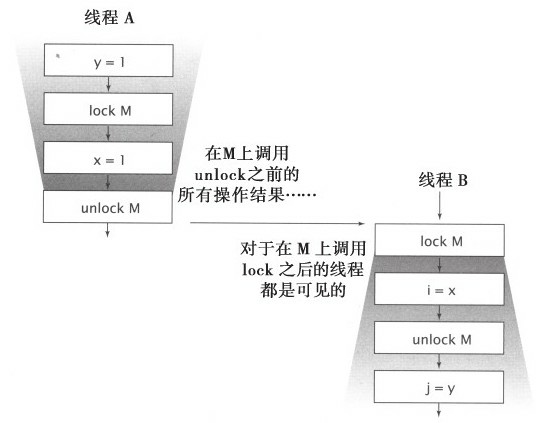
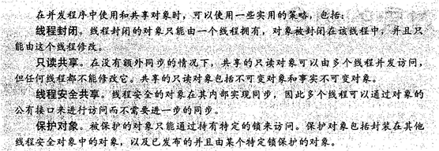

#  目录

[TOC]


# 第1章　简介

线程允许在同一个进程中同时存在多个程序控制流。线程**会共享进程范围内的资源**，例如内存句柄和文件句柄，但每个线程都有**各自的程序计数器（Program Counter）、栈以及局部变量等**。线程还提供了一种直观的分解模式来充分利用多处理器系统中的硬件并行性，而在***同一个程序中的多个线程也可以被同时调度到多个CPU上运行*。**
线程也被称为轻量级进程。在大多数现代操作系统中，都**是以线程为基本的调度单位**，而不是进程

 如果没有明确的协同机制，那么线程将彼此独立执行。由于同一个进程中的所有线程都将共享进程的内存地址空间，因此这些线程都能访问相同的变量并**在同一个堆上分配对象**，这就需要实现一种比在进程间共享数据粒度更细的数据共享机制。如果没有明确的同步机制来协同对共享数据的访问，那么当一个线程正在使用某个变量时，另一个线程可能同时访问这个变量，这将造成不可预测的结果。

 通过使用线程，可以将复杂并且异步的工作流进一步分解为一组简单并且同步的工作流，每个工作流在一个单独的线程中运行，并在特定的同步位置进行交互。

 框架负责解决一些细节问题，例如**请求管理、线程创建、负载平衡，并在正确的时刻将请求分发给正确的应用程序组件**。编写Servlet的开发人员不需要了解有多少请求在同一时刻要被处理，也不需要了解套接字的输入流或输出流是否被阻塞。当调用Servlet的service方法来响应Web请求时，可以以同步方式来处理这个请求，**就好像它是一个单线程程序。**

 > 早期使用非阻塞I/O的原因

 >在单线程应用程序中，这不仅意味着在处理请求的过程中将停顿，而且还意味着在这个线程被阻塞期间，对所有请求的处理都将停顿。为了避免这个问题，单线程服务器应用程序必须使用非阻塞I/O，这种I/O的复杂性要远远高于同步I/O，并且很容易出错。然而，如果每个请求都拥有自己的处理线程，那么在处理某个请求时发生的阻塞将不会影响其他请求的处理。
 >
 >>早期的操作系统通常会将进程中可创建的线程数量限制在一个较低的阈值内，大约在数百个（甚至更少）左右。因此，操作系统提供了一些高效的方法来实现多路I/O，


 安全性的含义是“**永远不发生糟糕的事情**”，而活跃性则关注于另一个目标，即“**某件正确的事情最终会发生**”。

 串行程序中，活跃性问题的形式之一就是**无意中造成的无限循环，从而使循环之后的代码无法得到执**行。线程将带来其他一些活跃性问题。例如，如果线程A在等待线程B释放其持有的资源，而线程B永远都不释放该资源，那么A就会永久地等待下去。

 活跃性意味着**某件正确的事情最终会发生，但却不够好**，因为我们通常希望正确的事情尽快发生。性能问题包括多个方面，例如服务时间过长，响应不灵敏，吞吐率过低，资源消耗过高，或者可伸缩性较低等。

 框架通过在框架线程中调用应用程序代码将并发性引入到程序中。在代码中将不可避免地访问应用程序状态，因此所有访问这些状态的代码路径都必须是线程安全的。


 远程方法调用（Remote Method Invocation, RMI）。****RMI使代码能够调用在其他JVM中运行的对象****。当通过RMI调用某个远程方法时，传递给方法的**参数必须被打包（也称为列集[Marshaled]）到一个字节流中**，通过网络传输给远程JVM，然后由远程JVM拆包（或者称为散集[Unmarshaled]）并传递给远程方法。

当RMI代码调用远程对象时，这个调用将在哪个线程中执行？你并不知道，但肯定不会在你创建的线程中，而是将在一个由RMI管理的线程中调用对象。RMI会创建多少个线程？同一个远程对象上的同一个远程方法会不会在多个RMI线程中被同时调用


远程对象必须**注意两个线程安全性问题**==：***正确地协同在多个对象中共享的状态，以及对远程对象本身状态的访问（*由于同一个对象可能会在多个线程中被同时访问***）==*。与Servlet相同，RMI对象应该做好被多个线程同时调用的准备，并且必须确保它们自身的线程安全性。

 

 # 第2章　线程安全性
-----

 **要编写线程安全的代码，其核心在于要对状态访问操作进行管理，特别是对共享的（Shared）和可变的（Mutable）状态的访问。**

 共享”意味着变量可以由**多个线程同时访问**，而“可变”则意味着变量的值在其生命周期内可以**发生变化。**

一个对象是否需要是线程安全的，取决于它是否被多个线程访问。==这指的是在程序中访问对象的方式，而不是对象要实现的功能==。要使得对象是线程安全的，需要采用同步机制来协同对对象可变状态的访问。

---
当多个线程访问某个状态变量并且其中有一个线程执行写入操作时，必须采用同步机制来协同这些线程对变量的访问。**==Java中的主要同步机制是关键字synchronized，它提供了一种独占的加锁方式，但“同步”这个术语还包括volatile类型的变量，显式锁（Explicit Lock）以及原子变量。==**


如果当多个线程访问同一个可变的状态变量时没有使用合适的同步，那么程序就会出现错误。有三种方式可以修复这个问题：
- 不在线程之间共享该状态变量。
- 将状态变量修改为不可变的变量。
- 在访问状态变量时使用同步。

线程安全的程序是否完全由线程安全类构成？答案是否定的，完全由线程安全类构成的程序并不一定就是线程安全的，而在线程安全类中也可以包含非线程安全的类。

## 2.1　什么是线程安全性
----
可以将单线程的正确性近似定义为“所见即所知（we know it when we see it）”


线程安全性：当多个线程访问某个类时，这个类始终都能表现出正确的行为，那么就称这个类是线程安全的。

当多个线程访问某个类时，不管运行时环境采用何种调度方式或者这些线程将如何交替执行，并且在主调代码中不需要任何额外的同步或协同，这个类都能表现出正确的行为，那么就称这个类是线程安全的

如果某个类在单线程环境[2]中都不是正确的，那么它肯定不会是线程安全的。如果正确地实现了某个对象，那么在任何操作中（包括调用对象的公有方法或者对其公有域进行读/写操作）都不会违背不变性条件或后验条件。在线程安全类的对象实例上执行的任何串行或并行操作都不会使对象处于无效状态。


**示例：一个无状态的Servlet**

框架都能创建多个线程并在这些线程中调用你编写的代码，因此你需要保证编写的代码是线程安全的。通常，线程安全性的需求并非来源于对线程的直接使用，而是使用像Servlet这样的框架。


``` java
@ThreadSafe
public class StatelessFactorizer implements Servlet{
    public void service（ServletRequest req, ServletResponse resp）{
        BigInteger i = extractFromRequest（req）；
        BigInteger[] factors = factor（i）；
        encodeIntoResponse（resp, factors）；
    }
}
```
与大多数Servlet相同，StatelessFactorizer是**无状态的**：==它既不包含任何域，也不包含任何对其他类中域的引用.==

计算过程中的临时状态仅存在于**线程栈上的局部变量中**，并且**只能由正在执行的线程访问**。访问StatelessFactorizer的线程不会影响另一个访问同一个StatelessFactorizer的线程的计算结果，因为这两个线程并没有共享状态，**就好像它们都在访问不同的实例**。由于线程访问无状态对象的行为并不会影响其他线程中操作的正确性，因此无状态对象是线程安全的。

**==无状态对象一定是线程安全的==**

大多数Servlet都是无状态的，从而极大地降低了在实现Servlet线程安全性时的复杂性。只有当Servlet在处理请求时需要保存一些信息，线程安全性才会成为一个问题。


## 2.2 原子性
---
**当我们在无状态对象中增加一个状态时，会出现什么情况？**

假设我们希望增加一个“命中计数器”（Hit Counter）来统计所处理的请求数量。一种直观的方法是在Servlet中增加一个long类型的域，并且每处理一个请求就将这个值加1，如程序清单2-2中的UnsafeCountingFactorizer所示。


``` java
程序清单2-2　在没有同步的情况下统计已处理请求数量的Servlet（不要这么做）
@NotThreadSafe
public class UnsafeCountingFactorizer implements Servlet{
    private long count=0；
    public long getCount（）{return count；}
    public void service（ServletRequest req, ServletResponse resp）{
        BigInteger i = extractFromRequest（req）；
        BigInteger[] factors=factor（i）；
        ++count；
        encodeIntoResponse（resp, factors）；
    }
}

```
这个类很可能会丢失一些更新操作

虽然递增操作++count是一种紧凑的语法，使其看上去只是一个操作，==**但这个操作并非原子的**==，因而它并不会作为一个不可分割的操作来执行。实际上，它包含了三个独立的操作：**读取count的值，将值加1，然后将计算结果写入count**。这是一个“读取-修改-写入”的操作序列，并且其结果状态依赖于之前的状态

如果计数器的初始值为9，那么在某些情况下，每个线程读到的值都为9，接着执行递增操作，并且都将计数器的值设为10。

> [1]。在并发编程中，这种由于不恰当的执行时序而出现不正确的结果是一种非常重要的情况，它有一个正式的名字：竞态条件（Race Condition）

### 2.2.1　竞态条件
---
当某个计算的正确性取决于多个线程的交替**执行时序时**，那么就会发生竞态条件。(就是正确的结果要取决于运气)

最常见的竞态条件类型就是“先检查后执行（Check-Then-Act）”操作，即通过一个可能失效的观测结果来决定下一步的动作。

这种类型的竞态条件称为“先检查后执行”：首先观察到某个条件为真（例如文件X不存在），然后根据这个观察结果采用相应的动作（创建文件X），但事实上，在你观察到这个结果以及开始创建文件之间，观察结果可能变得无效（另一个线程在这期间创建了文件X），从而导致各种问题（未预期的异常、数据被覆盖、文件被破坏等）。

>竞态条件这个术语很容易与另一个相关术语“数据竞争（Data Race）”相混淆。
>**数据竞争是指，如果在访问共享的非final类型的域时没有采用同步来进行协同，那么就会出现数据竞争。**
>当一个线程写入一个变量而另一个线程接下来读取这个变量，或者读取一个之前由另一个线程写入的变量时，并且在这两个线程之间没有使用同步，那么就可能出现数据竞争。在Java内存模型中，如果在代码中存在数据竞争，那么这段代码就没有确定的语义。并非所有的竞态条件都是数据竞争，同样并非所有的数据竞争都是竞态条件，但二者都可能使并发程序失败。在UnsafeCountingFactorizer中既存在竞态条件，又存在数据竞争。==参见第16章了解数据竞争的更详细内容。==


### 2.2.2　示例：延迟初始化中的竞态条件
---
使用“先检查后执行”的一种常见情况就是**延迟初始化**。

**延迟初始化的目的是将对象的初始化操作推迟到实际被使用时才进行，同时要确保只被初始化一次**


```java
程序清单2-3　延迟初始化中的竞态条件（不要这么做）
@NotThreadSafe
public class LazyInitRace{
    private ExpensiveObject instance=null；
    public ExpensiveObject getInstance（）{
        if（instance==null）{
            instance=new ExpensiveObject（）；
        }
        return instance；
    }
}
```
在LazyInitRace中包含了一个竞态条件，它可能会破坏这个类的正确性。

假定线程A和线程B同时执行getInstance。A看到instance为空，因而创建一个新的ExpensiveObject实例。B同样需要判断instance是否为空。**此时的instance是否为空，要取决于不可预测的时序**，包括线程的调度方式，以及A需要花多长时间来初始化ExpensiveObject并设置instance。如果当B检查时，instance为空，那么在两次调用getInstance时可能会得到不同的结果


### 2.2.3　复合操作
----
LazyInitRace和UnsafeCountingFactorizer都包含一组需要**以原子方式执行**（或者说不可分割）的操作。要避免竞态条件问题，就必须在某个线程修改该变量时，通过某种方式防止其他线程使用这个变量，从而确保其他线程只能在修改操作**完成之前或之后**读取和修改状态，而不是在修改状态的过程中。

假定有两个操作A和B，如果从执行A的线程来看，当另一个线程执行B时，要么将B全部执行完，要么完全不执行B，那么A和B对彼此来说是原子的。原子操作是指，对于访问同一个状态的所有操作（包括该操作本身）来说，这个操作是一个以原子方式执行的操作

为了确保线程安全性，“先检查后执行”（例如延迟初始化）和“读取-修改-写入”（例如递增运算）等操作必须是原子的。我们将“先检查后执行”以及“读取-修改-写入”等操作统称为复合操作：包含了一组必须以原子方式执行的操作以确保线程安全性。


```java
程序清单2-4　使用AtomicLong类型的变量来统计已处理请求的数量

@ThreadSafe
public class CountingFactorizer implements Servlet{
    private final AtomicLong count = new AtomicLong（0）；
    public long getCount（）{ return count.get（）；}
    public void service（ServletRequest req, ServletResponse resp）{
        BigInteger i = extractFromRequest（req）；
        BigInteger[] factors=factor（i）；
        count.incrementAndGet（）；
        encodeIntoResponse（resp, factors）；
    }
}
```
在java.util.concurrent.atomic包中包含了一些原子变量类，用于实现在数值和对象引用上的原子状态转换。通过用AtomicLong来代替long类型的计数器，能够确保所有对计数器状态的访问操作都是原子的。[1]由于Servlet的状态就是计数器的状态，并且计数器是线程安全的，因此这里的Servlet也是线程安全的。

当在无状态的类中添加一个状态时，如果该状态完全由线程安全的对象来管理，那么这个类仍然是线程安全的。


## 2.3　加锁机制
---
当在 Serviet 中添加一个状态变量时 ，可以通**过线程安全的对象来管理 Servlet 的状态**以维 护 Servlet 的线程安全性

**但如果想在 Servlet 中添加更多的状态，那么是否只需添加更 多的线 程安全状态变量就足够了 ？**
==并不是这样，这是错误的==


假设我们希望提升 Servlet 的性能：将最近的计算结果缓存起来 ，当两个连续的请求对相同 的数值进行因数分解时，可以直接使用土一次 的计算结果，而无须重新计算 。（这并非一种有 效的缓存策略，5.6 节将给出一种更好的策略。） 要实现该缓存策略 ，需要保存两个状态：最近 执行因数分解的数值 ，以及分解结果 。


```java
程序清单 2-5 该 Serviet 在没有足够原子性保证的情况下对其最近计算结果进行缓存 （不要这么做〉
®NotThreadSafe
public  class UnsafeCachiFactorizer  implements  Servlet  { 
    private final AtomicRef erence<Biglnteger> lastNumer = 
             new AtomicRef erence<Biginteger> () ;
    private final AtomicRef erence<Biginteger []>	lastFactors =
            new AtomicRef erence<Biginteger[]> ( ) ;

    public void service (ServletRequest req, ServletResponse resp) { 
        Biginteger  i = extractFromRequest ( req) ;
        if( i.equals(lastNumer.get () ) )
            encodeIntResponse( resp,lastFactore.get() )  ; 
        else  {
            Biglnteger [] factors=factor ( i) ; 
            lastNumer.set{i) ;  
            laetFactors.set(factors) ;
            encdeintoResponse (resp,  factors) ;
        }
    }
}
```
然而，**这种方怯并不正确** 。==尽管这些原子引用本身都是线程安全的 ，但在UnsafeCaching Factorizer  中存在着竞态条件 ，这可能产生错误的 结果。==

在线程安全性的定义中要求 ，多个线程之间的操作无论采用何种执行 时序或交替方式，都 要保证不变性条件不被破坏 。UnsafeCachingF actorizer 的**不变性条件之一**是 ：**在lastFactors 中 缓存的因数之积应该等于在 lastNumber  中缓存的数值**。只有确保了这个不变性条件不被破坏 ， 上面的 Servlet 才是正确的。**当在不变性条件中涉及多个变量时，各个变量之间并不是彼此独立** 的，而是**某个变量的值会对其他变量的值产生约束**。因此，==当更新某一个变量时，需要在同一 个原子操作中对其他变量同时进行更新 。==
在某些执行时序中 ，UnsafeCachingFactorizer    可能会破坏这个不变性条件 。在使用原子 引用的情况下，尽管对 set 方法的每次调用都是原子的 ，但仍然无法同时更新lastNumber 和 lastFactors 。如果只修改了其中一个变量 ，那么在这两次修改操作之间 ，其他线程将发现不变性 条件被破坏了 。同样，我们也不能保证会同时获取两个值 ：在线程 A 获取这两个值的过程中 ，
线程 B 可能修改了它们，这样线程A也会发现不变性条件被破坏了

> AtomicLong 是一种替代 long 类型整数的线程安全类，类似地，AtomicReference 是一种替代对象引用的钱
> 程安全类。在第 15 章将介绍各种原子变量 （Atomic Variable） 及其优势．

> ==要保持状态的一致性，就需要在单个原子操作中更新所有相关的状态变量==


### 2.3.1   内置锁
---
Java 提供了一种内置的锁机制来支持原子性同步代码块 （ Synchronize Block ）

同步代码块包括两部分 ：
一个 作为锁的对象引用，一个作为由这个锁保护的代码块 。

以关键宇 synchronized  来修饰的方法就 是一种横跨整个方怯体的同步代码块，其中该同步代码块的锁就是方法调用所在的对象  。静态 的.synchronized方法以Class对象作为锁。

每个 Java 对象都可以用做一个实现同步的锁，这些锁被称为内置锁 (Intrinsic Lock）或监视 器锁（Monitor Lock）。线程在进入同步代码块之前会自动获得锁，并且在退出同步代码块时自 动释放锁 **，而无论是通过正常的控制路程退出 ，还是通过从代码块中抛出异常退出** 。获得内置锁的唯一途径就是进入由这个锁保护的同步代码块或方法。

Java 的内置锁相当于一种**互斥体 （或互斥锁）**，这意味着最多只有一个钱程能持有这种锁 。 当线程 A 尝试获取一个由线程 B 持有的锁时 ，线程 A 必须等待或者阻塞 ，直到线程 B释放这 个锁。如果B 永远不释放锁 ，那么A 也将永远地等下去 。

由于每次只能有一个线程执行内置锁保护的代码块，因此，由这个锁保护的同步代码块会 以原子方式执行，多个线程在执行该代码块时也不会相互干扰。井发环境中的原子性与事务应 用程序中的原子性有着相同的含义一一一组语句作为一个不可分割的单元被执行 。任何一个执 行同步代码块的线程，都不可能看到有其他线程正在执行由同一个锁保护的同步代码块。

这种同步机制使得要确保因数分解 Servlet 的钱程安全性变得更简单 。在程序清单 2-6 中使 用了关键宇 synchronized 来修饰 service 方洁 ，因此在同一时间只有一个线程可以执行 servrice 方住。现在的SynchronizedFactoiizer 是线程安全的 。然而，这种方也却过于极端 ，因为多个 客户端无法同时使用因数分解 Setvlet ，服务的响应性非常低，无主主令人接受。这是一个性能问 题，而不是线程安全问题，我们将在 2.5  节解决这个问题。


[程序清单 2-6]: java并发编程.md#2.2.2　示例：延迟初始化中的竞态条件
<span id="code2-6" >
程序清单 2-6 
</span>

```java
程序清单 2-6 这个 Servlet能正确地握存最新的计算结果，但并发性却非常糟糕（不要这么做）
@ThreadSafe
public class SynchronizedFactorizer implements Servlet{
    @GuardedBy（"this"）private BigInteger lastNumber；
    @GuardedBy（"this"）private BigInteger[]lastFactors；
    public synchronized void service（ServletRequest req， ServletResponse resp）{
        BigInteger i=extractFromRequest（req）；
        if（i.equals（lastNumber））
            encodeIntoResponse（resp, lastFactors）；
        else{
            BigInteger[]factors=factor（i）；
            lastNumber=i；
            lastFactors=factors；
            encodeIntoResponse（resp, factors）；
        }
    }
}
```


### 2.3.2  重入
----
当某个线程请求一个由其他线程持有的锁时 ，发出请求的线程就会阻塞 。

然而，由于内置锁是可重人的，因此如果某个线程试图获得一个已经由它自己持有的锁，那么这个请求就会成功。“重入” 意味着获取锁的操作的粒度是"线程" 而不是“调用” 。

重入的一种实现方法是，为每个锁关联一个获取计数值和一个所有者线程 。当计数值为 0 时，这个锁就被认为是没有被任何线程持有 。当线程请求一个未被持有的锁时，JVM  将记下锁的持有者 ，并且将获取计数值置为 1。如果同一个线程再次获取这个锁 ，计数值将递增，而当线程退出同步代码块时 ，计数器会相应地递减 。当计数值为0时，这个锁将被释放 。


重入进一步提升了加锁行为的封装性  ，因此简化了面向对象井发代码的开发。在程序清单
2-7  的代码中，子类改写了父类的synchronized  方法，然后调用父类中的方撞 ，**此时如果没有可重入的锁 ，那么这段代码将产生死锁**。由于Widget 和 LoggingWidget  中doSomething 方法都是 synchronized 方法 ，因此每个 doSomething 方法在执行前都会获取 Widget上的锁。然而，如果内置锁不是可重入的 ，那么在调用 super.doSomething 时将无站获得 Widget 上的锁，因为这 个锁已经被持有 ，从而线程将永远停顿下去，等待一个永远也无法获得 的锁。重入则避免了这 种死锁情况的发生 。


```java
程序清单2-7　如果内置锁不是可重入的，那么这段代码将发生死锁
public class Widget{
    public synchronized void doSomething（）{
    ……
    }
}

public class LoggingWidget extends Widget{
    public synchronized void doSomething（）{
        System.out.println（toString（）+"：calling doSomething"）；
        super.doSomething（）；
    }
}
```

> ==关于“那么在调用 super.doSomething 时将无站获得 Widget 上的锁，因为这 个锁已经被持有 ，从而线程将永远停顿下去，等待一个永远也无法获得的锁”的自我理解==


```

public class Demo01 {
    static{
        System.out.println("静态初始化Demo01");
    }
    public static void main(String[] args) {
        System.out.println("Demo01的main方法");
        A a = new A();
//        System.out.println(A.width);
//        A a2 = new A();
静态初始化Demo01
Demo01的main方法
静态初始化类A_Father
静态初始化类A

创建A_Father类对象 A_Father  init
thread.A@1c6b6478

创建A类对象  A init
thread.A@1c6b6478
    }
}
class A extends A_Father{
    public static int width=100;
    static{
        System.out.println("静态初始化类A");
        width=300;
    }
    public A(){
        System.out.println("创建A类对象  A init");
        System.out.println(this);
    }
}
class A_Father{
    static{
        System.out.println("静态初始化类A_Father");
    }

    public A_Father(){
        System.out.println("创建A_Father类对象 A_Father  init");
        System.out.println(this);
    }
}


```
jvm创建X对象，先按继承链自顶向下执行静态代码块和静态方法 <br/>
静态初始化类A_Father <br/>
width=100;  <br/>
静态初始化类A
width=300;  <br/>
然后自顶向下执行构造函数，但注意此时，执行这些构造函数的对象都是同一个（thread.A@1c6b6478）

因此

```java
public class Demo02 {
    public static void main(String[] args) {
        LoggingWidget loggingWidget = new LoggingWidget();
        loggingWidget.doSomething();
    }

}

class Widget{
    public Widget() {
        System.out.println("widget init: "+this);
    }

    public synchronized void doSomething(){
        System.out.println("widget doSomething : " + this);
    }
}

class LoggingWidget extends Widget{
    public LoggingWidget() {
        System.out.println("LoggingWidget init; " + this);
    }

    public synchronized void doSomething(){
        System.out.println(toString()+"：calling doSomething");
        System.out.println("LoggingWidget doSomething : " + this);
        super.doSomething();
    }
}


widget init: thread.LoggingWidget@1c6b6478
LoggingWidget init; thread.LoggingWidget@1c6b6478

thread.LoggingWidget@1c6b6478：calling doSomething
LoggingWidget doSomething : thread.LoggingWidget@1c6b6478
widget doSomething : thread.LoggingWidget@1c6b6478
```

当LoggingWidget的实例loggingWidget执行doSomething方法时，获取的是thread.LoggingWidget@1c6b6478的锁，当执行到父类的doSomething方法时，获取的依然是thread.LoggingWidget@1c6b6478的锁

----
**补充：<br>**

线程进入LoggingWidget.doSomething()时获取的锁不应该是LoggingWidget对象锁吗?怎会是Widget上的锁?super.doSomething()获取的究竟是哪个对象锁呢？对于喜欢追究细节的我来说，此时有了种种疑问，尤其是写完第一篇博客： java并发编程实践学习（一）java的类锁和对象锁。按照字面的意思，貌似是说：执行子类对象的同步方法时候，也会获取父对象的锁，如果不是可重入锁的话，再次调用super.doSomething()想要第二次获取Widget对象的锁，就不会成功。


>这里就产生了1个问题：什么是子类对象，什么是父类对象？是不是创建子类对象,肯定会创建一个父类的对象?

==**首先创建一个子类对象的时候是不会创建一个父类对象的，父类对象是根本不存在的**==。我们可以使用反证法，假如说创建子类对象的同时会创建一个父类对象，那如果父类是抽象类，不能实例化呢？我们知道使用A a = new A()这种方式创建对象的时候，JVM会在后台给我们分配内存空间，然后调用构造函数执行初始化操作，最后返回内存空间的引用。即构造函数只是进行初始化，并不负责分配内存空间（创建对象）。所以呢其实创建子类对象的时候，JVM会为子类对象分配内存空间，并调用父类的构造函数。我们可以这样理解：创建了一个子类对象的时候，在子类对象内存中，有两份数据，一份继承自父类，一份来自子类，但是他们属于同一个对象（子类对象），只不过是java语法提供了this和super关键字来让我们能够按照需要访问这2份数据而已。这样就产生了子类和父类的概念，但实际上只有子类对象，没有父类对象。

[可重入锁](https://blog.csdn.net/aitangyong/article/details/22695399)

-----


```
package thread;

import org.dom4j.io.SAXReader;

/**
 * Created by ding on 2018/10/12.
 */
public class Demo03 {
    public static void main(String[] args) {
        System.out.println(Thread.currentThread().hashCode()+" = ");
        B b = new B();
        b.show();

    }
}

class B_Father{

    private String key = "B_Father";
    public B_Father() {
        SAXReader saxReader = new SAXReader();
        System.out.println("B_Father : "+ saxReader );
        key = "B_Father11";
    }

    public void show(){
//        System.out.println(Thread.currentThread().hashCode()+" = "+this);
        System.out.println("show key  " + this.key +" "+ this.key.hashCode());
    }
}

class B extends B_Father{
    private String key = "B";
    public B() {
        SAXReader saxReader = new SAXReader();
        System.out.println("B : "+ saxReader );
//        this.show();
//        System.out.println(key.hashCode());
        super.show();
    }
    public void show(){
//        System.out.println(Thread.currentThread().hashCode()+" = "+this);
        System.out.println("show key  " + this.key +" "+ this.key.hashCode());
    }
}
```


关于继承时，子类和父类存在同名属性和方法的问题
B extends  A    

1. B中无属性i  B.i --> B.A.i --> 输出的是A的i
2. B中有属性i  B.i ---> 输出的是B的i
3. B中无方法f()  f()是A的方法，输出i  B.f()--> B.A.f()--->输出的是B.A.i
4. B中有方法f()  B.f()--> 输出的是B.i

## 2.4　用锁来保护状态
----
由于锁能使其保护的代码路径以串行形式[1]来访问，因此可以通过锁来构造一些协议以实现对共享状态的独占访问。只要始终遵循这些协议，就能确保状态的一致性<br>

访问**共享状态**的复合操作，例如命中**计数器的递增操作（读取-修改-写入）或者延迟初始化（先检查后执行），==都必须是原子操作以避免产生竞态条件==**。如果在复合操作的执行过程中持有一个锁，那么会使复合操作成为原子操作。**然而，仅仅将复合操作封装到一个同步代码块中是不够的**。<br>
如果用同步来协调对某个变量的访问，那么在访问这个变量的所有位置上都需要使用同步。而且，当使用锁来协调对某个变量的访问时，在访问变量的所有位置上都要使用同一个锁。
**一种常见的错误是认为，只有在写入共享变量时才需要使用同步，然而事实并非如此**（3.1节将进一步解释其中的原因）。<br>

对于可能被**多个线程同时访问**的**可变**状态变量，在访问它时都需要**持有同一个锁**，在这种情况下，我们称状态变量是由这个锁保护的。


在[程序清单2-6](#code2-6)的SynchronizedFactorizer中，lastNumber和lastFactors这两个变量都是由Servlet对象的内置锁来保护的，在标注@GuardedBy中也已经说明了这一点。

对象的内置锁与其状态之间**没有内在的关联**。虽然大多数类都将内置锁用做一种有效的加锁机制，**但对象的域并不一定要通过内置锁来保护**。<br>**当获取与对象关联的锁时，并不能阻止其他线程访问该对象，某个线程在获得对象的锁之后，只能阻止其他线程获得同一个锁。之所以每个对象都有一个内置锁，只是为了免去显式地创建锁对象**。<br>

> [2]你需要自行构造加锁协议或者同步策略来实现对共享状态的安全访问，并且在程序中自始至终地使用它们。


每个共享的和可变的变量都**应该只由一个锁来保护**，从而使维护人员知道是哪一个锁。

==一种常见的加锁约定是，将所有的可变状态都封装在对象内部，并通过对象的内置锁对所有访问可变状态的代码路径进行同步，使得在该对象上不会发生并发访问。==

在许多线程安全类中都使用了这种模式，例如Vector和其他的同步集合类。在这种情况下，对象状态中的所有变量都由对象的内置锁保护起来。然而，这种模式并没有任何特殊之处，编译器或运行时都不会强制实施这种（或者其他的）模式[3]。==**如果在添加新的方法或代码路径时忘记了使用同步，那么这种加锁协议会很容易被破坏**。==


**并非所有数据都需要锁的保护**，==只有被多个线程同时访问的可变数据才需要通过锁来保护==。

第1章曾介绍，当添加一个简单的异步事件时，例如TimerTask，整个程序都需要满足线程安全性要求，尤其是当程序状态的封装性比较糟糕时。

++考虑一个处理大规模数据的单线程程序，由于任何数据都不会在多个线程之间共享，因此在单线程程序中不需要同步++。现在，假设希望添加一个新功能，即定期地对数据处理进度生成快照，这样当程序崩溃或者必须停止时无须再次从头开始。你可能会选择使用TimerTask，每十分钟触发一次，并将程序状态保存到一个文件中。


由于TimerTask在另一个（由Timer管理的）线程中调用，因此现在就有两个线程同时访问快照中的数据：程序的主线程与Timer线程。这意味着，当访问程序的状态时，不仅TimerTask代码必须使用同步，而且程序中所有访问相同数据的代码路径也必须使用同步。原本在程序中不需要使用同步，现在变成了在程序的各个位置都需要使用同步。


当某个变量由锁来保护时，意味着在每次访问这个变量时都需要首先获得锁，这样就确保在同一时刻只有一个线程可以访问这个变量。当类的不变性条件涉及多个状态变量时，那么还有另外一个需求：**在不变性条件中的每个变量都必须由同一个锁来保护**。因此可以在单个原子操作中访问或更新这些变量，从而确保不变性条件不被破坏。


在SynchronizedFactorizer类中说明了这条规则：缓存的数值和因数分解结果都由Servlet对象的内置锁来保护。对于每个包含多个变量的不变性条件，其中涉及的所有变量都需要由同一个锁来保护。如果同步可以避免竞态条件问题，那么为什么不在每个方法声明时都使用关键字synchronized？事实上，如果不加区别地滥用synchronized，可能导致程序中出现过多的同步。此外，**如果只是将每个方法都作为同步方法，例如Vector，那么并不足以确保Vector上复合操作都是原子的**：

```Java
if（！vector.contains（element））
      vector.add（element）；
```

**虽然contains和add等方法都是原子方法**，==但在上面这个“如果不存在则添加（put-if-absent）”的操作中仍然存在竞态条件。==

虽然synchronized方法可以确保单个操作的原子性，但如果要把多个操作合并为一个复合操作，还是需要额外的加锁机制（请参见4.4节了解如何在线程安全对象中添加原子操作的方法）。此外，将每个方法都作为同步方法还可能导致活跃性问题（Liveness）或性能问题（Performance），我们在SynchronizedFactorizer中已经看到了这些问题。

>[1]对象的串行访问（Serializing Access）与对象的序列化（Serialization，即将对象转化为字节流）操作毫不相干。串行访问意味着多个线程依次以独占的方式访问对象，而不是并发地访问。<br>
>[2]回想起来，这种设计决策或许比较糟糕：不仅会引起混乱，而且还迫使JVM需要在对象大小与加锁性能之间进行权衡。<br>
>[3]如果某个变量在多个位置上的访问操作中都持有一个锁，但并非在所有位置上的访问操作都如此时，那么通过一些代码核查工具，例如FindBugs，就可以发现这种情况，并报告可能出现了一个错误。


**井非所有数据都需要锁的保护 ，只有被多个线程同时访 问的可变数据才需要通过锁来保护。**


## 2.5　活跃性
---

<span id="code2-8"></span>
```java
程序清单2-8　缓存最近执行因数分解的数值及其计算结果的Servlet

@ThreadSafe
public class CachedFactorizer implements Servlet{
    @GuardedBy（"this"）private BigInteger lastNumber；
    @GuardedBy（"this"）private BigInteger[] lastFactors；
    @GuardedBy（"this"）private long hits；
    @GuardedBy（"this"）private long cacheHits；
    public synchronized long getHits（）{ return hits；}
    
    public synchronized double getCacheHitRatio（）{
        return（double）cacheHits/（double）hits；
    }
    
    public void service（ServletRequest req, ServletResponse resp）{
        BigInteger i=extractFromRequest（req）；
        BigInteger[] factors=null；
        
        synchronized（this）{
            ++hits；
            if（i.equals（lastNumber））{ // 复合操作 先检查后执行
                ++cacheHits；
                factors=lastFactors.clone（）；
            }
        }
        
        
        if（factors==null）{
            factors=factor（i）；
            synchronized（this）{ // 复合操作  多个操作同步更新
                lastNumber=i；
                lastFactors=factors.clone（）；
            }
        }
        encodeIntoResponse（resp, factors）；
    }
}
```
程序清单2-8中的CachedFactorizer将Servlet的代码修改为使用两个独立的同步代码块，每个同步代码块都只包含一小段代码。

其中一个同步代码块负责保护判断是否只需返回缓存结果的“先检查后执行”操作序列，另一个同步代码块则负责确保对缓存的数值和因数分解结果进行同步更新。

此外，我们还重新引入了“命中计数器”，添加了一个“缓存命中”计数器，并在第一个同步代码块中更新这两个变量。**由于这两个计数器也是共享可变状态的一部分，因此必须在所有访问它们的位置上都使用同步**。**位于同步代码块之外的代码将以独占方式来访问局部（位于栈上的）变量，这些变量不会在多个线程间共享，因此不需要同步**。

# 第3章　对象的共享
----
第2章介绍了如何通过**同步来避免多个线程在同一时刻访问相同的数据**，而本章将介绍**如何共享和发布对象，从而使它们能够安全地由多个线程同时访问**。这两章合在一起，就形成了构建线程安全类以及通过java.util.concurrent类库来构建并发应用程序的重要基础。

我们已经知道了++同步代码块和同步方法可以确保以原子的方式执行操作++，但一种**常见的误解是，认为关键字synchronized只能用于实现原子性或者确定“临界区（Critical Section）”**。==同步还有另一个重要的方面：内存可见性（Memory Visibility）==。我们**不仅希望防止某个线程正在使用对象状态而另一个线程在同时修改该状态，而且希望确保当一个线程修改了对象状态后，其他线程能够看到发生的状态变化**。如果没有同步，那么这种情况就无法实现。你可以通过显式的同步或者类库中内置的同步来保证对象被安全地发布。


## 3.1　可见性
----
在单线程环境中，如果向某个变量先写入值，然后在没有其他写入操作的情况下读取这个变量，那么总能得到相同的值。这看起来很自然。然而，当读操作和写操作在不同的线程中执行时，情况却并非如此

通常，我们无法确保执行读操作的线程能适时地看到其他线程写入的值，有时甚至是根本不可能的事情。**为了确保多个线程之间对内存写入操作的可见性，必须使用同步机制。**

在程序清单3-1中的NoVisibility说明了当多个线程在没有同步的情况下共享数据时出现的错误

在代码中，主线程和读线程都将访问共享变量ready和number。主线程启动读线程，然后将number设为42，并将ready设为true。读线程一直循环直到发现ready的值变为true，然后输出number的值。虽然NoVisibility看起来会输出42，但事实上很可能输出0，或者根本无法终止。这是因为在代码中没有使用足够的同步机制，因此无法保证主线程写入的ready值和number值对于读线程来说是可见的。

<span id="code3-1"></span>
```java
程序清单3-1　在没有同步的情况下共享变量（不要这么做）
public class NoVisibility{
    private static boolean ready；
    private static int number；
    
    private static class ReaderThread extends Thread{
        public void run（）{
            while（！ready）
            Thread.yield（）；
            System.out.println（number）；
        }
    }
    
    public static void main（String[]args）{
        new ReaderThread（）.start（）；
        number=42；
        ready=true；
    }
}
```
NoVisibility可能会持续循环下去，因为读线程可能永远都看不到ready的值。一种更奇怪的现象是，NoVisibility可能会输出0，因为读线程可能看到了写入ready的值，但却没有看到之后写入number的值，这种现象被称为“重排序（Reordering）”。只要在某个线程中无法检测到重排序情况（即使在其他线程中可以很明显地看到该线程中的重排序），那么就无法确保线程中的操作将按照程序中指定的顺序来执行。[1]当主线程首先写入number，然后在没有同步的情况下写入ready，那么读线程看到的顺序可能与写入的顺序完全相反。


在没有同步的情况下，编译器、处理器以及运行时等都可能对操作的执行顺序进行一些意想不到的调整。在缺乏足够同步的多线程程序中，要想对内存操作的执行顺序进行判断，几乎无法得出正确的结论。
NoVisibility是一个简单的并发程序，只包含两个线程和两个共享变量，但即便如此，在判断程序的执行结果以及是否会结束时仍然很容易得出错误结论。要对那些缺乏足够同步的并发程序的执行情况进行推断是十分困难的。
这听起来有点恐怖，但实际情况也确实如此。幸运的是，有一种简单的方法能避免这些复杂的问题：只要有数据在多个线程之间共享，就使用正确的同步。


### 3.1.1　失效数据   [目录](#目录)
----
NoVisibility展示了在缺乏同步的程序中可能产生错误结果的一种情况：==失效数据==。当读线程查看ready变量时，可能会得到一个已经失效的值。除非在每次访问变量时都使用同步，否则很可能获得该变量的一个失效值。更糟糕的是，**失效值可能不会同时出现：一个线程可能获得某个变量的最新值，而获得另一个变量的失效值。**

程序清单3-2中的Mutablelnteger**不是线程安全的**，因为get和set都是在没有同步的情况下访问value的。与其他问题相比，失效值问题更容易出现：如果某个线程调用了set，那么另一个正在调用get的线程可能会看到更新后的value值，也可能看不到

<span id="code3-2"></span>
```java
程序清单3-2　非线程安全的可变整数类
@NotThreadSafe
public class MutableInteger{
    private int value；
    public int get（）{return value；}
    public void set（int value）{this.value=value；}
}
```

在程序清单3-3的SynchronizedInteger中，通过对get和set等方法进行同步，可以使MutableInteger成为一个线程安全的类。**仅对set方法进行同步是不够的，调用get的线程仍然会看见失效值。**


```
程序清单3-3　线程安全的可变整数类
@ThreadSafe
public class SynchronizedInteger{
    @GuardedBy（"this"）private int value；
    public synchronized int get（）{return value；}
    public synchronized void set（int value）{this.value=value；}
}
```
>[1]这看上去似乎是一种失败的设计，但却能使JVM充分地利用现代多核处理器的强大性能。例如，在缺少同步的情况下，Java内存模型允许编译器对操作顺序进行重排序，并将数值缓存在寄存器中。此外，它还允许CPU对操作顺序进行重排序，并将数值缓存在处理器特定的缓存中。更多细节请参阅第16章。


>[2]在没有同步的情况下读取数据，类似于在数据库中使用READ_UNCOMMITTED隔离级别，在这种级别上将牺牲准确性以获取性能的提升。然而，在非同步的读取操作中则牺牲了更多的准确度，因为线程看到的共享变量值很容易失效


### 3.1.2　非原子的64位操作 [目录](#目录)
----
当线程在没有同步的情况下读取变量时，可能会得到一个失效值，但至少这个值是由之前某个线程设置的值，而**不是一个随机值**。这种安全性保证也被称为**最低安全性**（out-of-thin-air safety）。


最低安全性适用于绝大多数变量，但是**存在一个例外：非volatile类型的64位数值变量（double和long，请参见3.1.4节**）。==Java内存模型要求，变量的读取操作和写入操作都必须是原子操作，但对于非volatile类型的long和double变量，JVM允许将64位的读操作或写操作分解为两个32位的操作==。当读取一个非volatile类型的long变量时，如果对该变量的读操作和写操作在不同的线程中执行，那么很可能会读取到**某个值的高32位和另一个值的低32位**[1]。因此，即使不考虑失效数据问题，在多线程程序中使用共享且可变的long和double等类型的变量也是不安全的，除非用关键字volatile来声明它们，或者用锁保护起来。

>[1]在编写Java虚拟机规范时，许多主流处理器架构还不能有效地提供64位数值的原子操作。


### 3.1.3　加锁与可见性 [目录](#目录)
内置锁可以用于确保某个线程以一种可预测的方式来查看另一个线程的执行结果，如图3-1所示。当线程A执行某个同步代码块时，线程B随后进入由同一个锁保护的同步代码块，在这种情况下可以保证，在锁被释放之前，A看到的变量值在B获得锁后同样可以由B看到。换句话说，**当线程B执行由锁保护的同步代码块时，可以看到线程A之前在同一个同步代码块中的所有操作结果**。如果没有同步，那么就无法实现上述保证。




​                                                     3-1　同步的可见性保证

现在，我们可以进一步理解为什么在访问某个共享且可变的变量时要求所有线程在同一个锁上同步，就是为了**确保某个线程写入该变量的值对于其他线程来说都是可见的**。否则，如果一个线程在未持有正确锁的情况下读取某个变量，那么读到的可能是一个失效值。

**加锁的含义不仅仅局限于互斥行为，还包括内存可见性**。为了确保所有线程都能看到共享变量的最新值，所有==执行读操作或者写操作的线程都必须在同一个锁上同步==。


### 3.1.4　Volatile变量 [目录](#目录)

-----

Java语言提供了一种稍弱的同步机制，即volatile变量，用来确保将变量的更新操作通知到其他线程。当把变量声明为volatile类型后，编译器与运行时都会注意到**这个变量是共享的**，**因此不会将该变量上的操作与其他内存操作一起重排序。**volatile变量**不会被缓存在寄存器或者对其他处理器不可见的地方**，因此在读取volatile类型的变量时总会返回最新写入的值。

理解volatile变量的一种有效方法是，将它们的行为想象成程序清单3-3中SynchronizedInteger的类似行为，并将volaLile变量的读操作和写操作分别替换为get方法和set方法[1]。然而，在访问volatile变量时不会执行加锁操作，因此也就不会使执行线程阻塞，因此volatile变量是一种**比sychronized关键字更轻量级的同步机制**。[2]

volatile变量对可见性的影响比volatile变量本身更为重要。*当线程A首先写入一个volatile变量并且线程B随后读取该变量时，在写入volatile变量之前对A可见的所有变量的值，在B读取了volatile变量后，对B也是可见的*。因此，从内存可见性的角度来看，**写入volatile变量相当于退出同步代码块，而读取volatile变量就相当于进入同步代码块。**然而，我们==并不建议过度依赖volatile变量提供的可见性。如果在代码中依赖volatile变量来控制状态的可见性，通常比使用锁的代码更脆弱，也更难以理解。==

仅当volatile变量能简化代码的实现以及对同步策略的验证时，才应该使用它们。如果在验证正确性时需要对可见性进行复杂的判断，那么就不要使用volatile变量。==volatile变量的正确使用方式包括：==**确保它们自身状态的可见性，确保它们所引用对象的状态的可见性，以及标识一些重要的程序生命周期事件的发生（例如，初始化或关闭）。**

程序清单3-4**给出了volatile变量的一种典型用法：检查某个状态标记以判断是否退出循环**。在这个示例中，线程试图通过类似于数绵羊的传统方法进入休眠状态。为了使这个示例能正确执行，asleep必须为volatile变量。否则，当asleep被另一个线程修改时，执行判断的线程却发现不了[3]。我们也可以用锁来确保asleep更新操作的可见性，但这将使代码变得更加复杂。


<span  name="code3-4" style="display:none">程序清单3-4　数绵羊</span>

```java
程序清单3-4　数绵羊
volatile boolean asleep；
……
while（！asleep）
countSomeSheep（）；
```


虽然volatile变量很方便，但也存在一些局限性。**volatile变量通常用做某个操作完成、发生中断或者状态的==标志==**，例如程序清单3-4中的asleep标志。尽管volatile变量也可以用于表示其他的状态信息，但在使用时要非常小心。例如，==volatile的语义不足以确保递增操作（count++）的**原子性**，除非你能确保只有一个线程对变量执行写操作。==（**原子变量提供了“读-改-写”的原子操作**，并且常常用做一种“更好的volatile变量”。请参见第15章）。

**加锁机制既可以确保可见性又可以确保原子性，而volatile变量只能确保可见性。**

当且仅当满足以下所有条件时，才应该使用volatile变量：

- 对变量的写入操作不依赖变量的当前值，或者你能确保只有单个线程更新变量的值。
- 该变量不会与其他状态变量一起纳入不变性条件中。
- 在访问变量时不需要加锁。


> [1]这种类比并不准确，SynchronizedInteger在内存可见性上的作用比volatile变量更强。请参见第16章。

> [2]在当前大多数处理器架构上，读取volatile变量的开销只比读取非volatile变量的开销略高一些。

> [3]调试小提示：对于服务器应用程序，无论在开发阶段还是在测试阶段，当启动JVM时一定都要指定-server命令行选项。server模式的JVM将比client模式的JVM进行更多的优化，例如将循环中未被修改的变量提升到循环外部，因此在开发环境（client模式的JVM）中能正确运行的代码，可能会在部署环境（server模式的JVM）中运行失败。例如，如果在程序清单3-4中“忘记”把asleep变量声明为volatile类型，那么server模式的JVM会将asleep的判断条件提升到循环体外部（这将导致一个无限循环），但client模式的JVM不会这么做。在解决开发环境中出现无限循环问题时，解决这个问题的开销远小于解决在应用环境出现无限循环的开销。


## 3.2　发布与逸出

“发布（Publish）”一个对象的意思是指，**使对象能够在当前作用域之外的代码中使用**。例如，<u>将一个指向该对象的引用保存到其他代码可以访问的地方，或者在某一个非私有的方法中返回该引用，或者将引用传递到其他类的方法中</u>。在许多情况中，我们要确保对象及其内部状态不被发布。而在某些情况下，我们又需要发布某个对象，但如果在发布时要确保线程安全性，则可能需要同步。**发布内部状态可能会破坏封装性，并使得程序难以维持不变性条件**。例如，如果在对象构造完成之前就发布该对象，就会破坏线程安全性。**当某个不应该发布的对象被发布时，这种情况就被称为逸出（Escape）**。3.5节介绍了如何安全发布对象的一些方法。现在，我们首先来看看一个对象是如何逸出的。

**发布对象的最简单方法是将对 象的引用保存到一个公有的静态变量中 ，以便任何类和线程 都能看见该对象** ，如程序清单 3-5 所示。在 initialize 方楼中实例化一个新的 Hash Set 对象，并 将对象的引用保存到 knownSecrets  中以发布该对象 。	

​	

```java
程序清单 3-5  发布一个对象
public  static Set< Secret >  knownSecrets;
public void initialize ()  {
knownSecrets  = new HashSet<Secret> ( ) ;

```

**当发布某个对象时，可能会间接地发布其他对象**。如果将一个 Secret 对象添加到集合 knownSecrets 中，那么同样会发布这个对象，因为任何代码都可以遍历这个集合，并获得对这 个新 Secret 对象的引用。同样，如果从非私有方法中返回一个引用 那么同样会发布返回的对 象。程序清单3-6 中的UnsafeStates  发布了本应为私有的状态数组。

```java
程序清单 3-6   使内部的可变状态选出 （不要这么做）
class UnsafeStatus{
    private String[] states = new String[] {"a","b"};
    public String[] getStatus(){ return states;}
}
```

如果按照上述方式来发布 states，就会出现问题，因为**任何调用者都能修改这个数组的内容**。在这个示例中 ，数组states 已经逸出了它所在的作用域 ，因为这个**本应是私有的变量已经被发布了**。

当发布一个对象时，在该对象的非私有域中引用的所有对象同样会被发布   。一般来说，如 果一个已经发布的对象能够通过非私有的 变量引用和方陆调用到达其他的对象 ，那么这些对象 也都会被发布 。

假定有一个类 C，对于C来说，“外部（ Alien） 方怯” 是指行为并不完全由 C 来规定的方法，包括其他类中定义的方怯 以及类 C 中可以被改写的方怯 （ 既不是私有 ［private］ 方怯也不是 终结  ［final］   方法）。当把一个对象传递给某个外部方法时 ，就相当于发布了这个对象。你无法 知道哪些代码会执行，也不知道在外部方法中究竟会发布这个对象，还是会保留对象的引用并 在随后由另一个线程使用 。

无论其他的钱程会对 已发布的引用执行何种操作 ，其实都不重要，因为误用该引用的风险 始终存在。当某个对象逸出后，你必须假设有某个类或线程可能会误用该对象。这正是需要 使用封装的最主要原因 ：封装能够使得对程序的正确性进行分析变得可能，并使得无意中破坏 设计约束条件变得更难 。

**<u>最后一种发布对象或其内部状态的机制就是发布一个内部的类实例</u>**，如程序清单 3-7 的 ThisEscape 所示。当 ThisEscape 发布 EventListener时，==也隐含地发布了ThisEscape 实例本身==， **因为在这个内部类的实例中包含了对 ThisEscape实例的隐含引用。**

```java

程序清单 3-7  隐式地使 this 引用逸出 （不要这么做〉
public  class  ThisEscape  {
    public ThisEscape (EventSource source)  { 
        source.registerListener(
            new EventListener ( ) {
                public void onEvent (Event e){
                     doSomething ( e) ;
                }
            });
    }
}

```

安全的对象构造过程

在 ThisEscape  中给出了逸出的一个特殊示例，即**this 引用在构造函数中逸出** 。<u>当内部的 EventListener 实例发布时，在外部封装的 ThisEscape 实例也逸出了</u>。当且仅当对象的构造函数返回时，对象才处于可预测的和一致的状态。因此，当从对象的构造函数中发布对象时   ，只是 发布了一个尚未构造完成的对象 。即使发布对象的语句位于构造函数的 最后一行也是如此。如 果 this  引用在构造过程中逸出 ，那么这种对象就被认为是不正确构造。

> 不要在构造过程中使用this引用溢出


在构造过程中使 this 引用逸出的一个常见错误是，**在构造函数中启动一个线程**。当对象在其构造函数中创建一个线程时 ，无论是显式创建 （通过将它传给构造函数） 还是隐式创建 〈由 于 Thread 或 Runnable 是该对象的一个内部类）, **this 引用都会被新创建的线程共享** 。**在对象尚未完全构造之前 ，新的线程就可以看见它**。在构造函数中创建线程并没有错误 ，但最好不要立即启动它，而是通过一个 start 或 initialize 方法来启动 （请参见第 7 章了解更多关于服务生命 周期的 内容）。在构造函数中调用一个可改写的实例方法时  （既不是私有方法，也不是终结方 法），同样会导致this 引用在构造过程中逸出 。

如果想在构造函数中注册 一个事件监听器或启动线程，那么可以使用一个私有的构造函 数和一个公共的工厂方法 （Factory Method ） ，从而避免不正确的构造过程，如程序清单3-8 中 SafeListener    所示。

```java
程序清单 3-8  使用工厂方法来 防止 this 引用在构造过程中逸出

public class SafeListener{
	private final EventListener listener;
	
	private SafeListener(){
        listener = new EventListener ( ){
            public void onEvent (Event e){
                doSomething ( e ) ;
            }
        };
    }	

public static SafeListener newInstance ( EventSource  source){
	SafeListener safe  =  new  SafeListener ( ) ;
	source.registerListener(safe .listener); 
	return safe;
} 

```


## 3.3    线程封闭

当访问共享的可变数据时 ，通常需要使用同步 。一种避免使用同步的方式就是不共享数据 。如果仅在单线程内访问数据 ，就不需要同步 。这种技术被称为**线程封闭** （Thread Confinement ） ，它是实现线程安全性的最简单方式之一 。当某个对象封闭在一个线程中时 ，这种用也将自动实现线程安全性 ，即使被封闭的对象本身不是线程安全 的［CPJ 2.3.2］ 。

在 Swing 中大量使用了线程封闭技术 。Swing 的可视化组件和数据模型对象都不是线程安 全的，Swing 通过将它们封闭到 <u>Swing 的事件分发线程中来实现线程安全性</u> 。要想正确地使用 Swing，那么在除了事件钱程之外的其他线程中就不能访 问这些对象 （为了进一步简化对 Swing  . 的使用，Swing 还提供了 invokeLater 机制，用于将一个 Runnable 实例调度到事件线程中执行）。 Swing 应用程序的许多并发错误都是由于错误地在另一个线程中使用了这些被封闭的对象 。

线程封闭技术的另一种常见应用是 JDBC(Java Database Connectivity） 的Connection 对象。 **JDBC 规范并不要求 Connection 对象必须是线程安全的** θ。在典型的服务器应用程序中，线程 从连接池中获得一个 Connection  对象，并且用该对象来处理请求 ，使用完后再将对象返还给连 接池。由于大多数请求 （例如 Servlet 请求或 EJB 调用等） 都是由单个线程采用同步的方式来 处理，并且在 Connection 对象返回之前 ，连接地不会再将它分配给其他线程 ，因此，**这种连接 管理模式在处理请求时隐含地将 Connection  对象封闭在线程中** 。

在 Java 语言中井没有强制规定某个变量必须由锁来保护 ，<u>同样在 Java 语言中也**无法强制**将对象封闭在某个钱程中</u> 。钱程封闭是在程序设计中 的一个考虑因素，必须在程序中实现。 Java 语言及其核心库提供了一些机制来帮助维持线程封闭性 ，**例如局部变量和 ThreadLocal 类**， 但即使如此 ，程序员仍然需要负责确保封闭在线程中的对象不会从钱程中逸出 。


### 3.3.1    Ad-hoc 线程封闭

---

Ad-hoc 线程封闭是指，**维护线程封闭性的职责完全由程序实现来承担** 。Ad-hoc 线程封闭是非常脆弱的 ，因为没有任何一种语言特性，例如可见性修饰符或局部变量 ，能将对象封闭到目标线程上。事实上 ，对线程封闭对象 （例如，GUI 应用程序中的可视化组件或数据模型等〉 的引用通常保存在公有变量中。

当决定使用线程封闭技术时，通常是因为要将某个特定的子系统实现为一个单线程子系 统。在某些情况下 ，单线程子系统提供的简便性要胜过 Ad-hoc  线程封闭技术的脆弱性。＠

在 volatile 变量上存在一种特殊的钱程封闭。只要你能确保**只有单个线程对共享的 volatile 变量执行写入操作 ，那么就可以安全地在这些共享的 volatile 变量上执行 “读取 一 修改 一写入” 的操作**。<u>在这种情况下 ，相当于将修改操作封闭在单个线程中以防止发生竟态条件 ，并且 volatile变量的可见性保证还确保了其他线程能看到最新的值。</u>

>θ 应用程序服务器提供的连接地是线程安全的 连接池通常会由多个线程同 时访问，因此非线程安全的连接池是毫无意义的。

> ＠ 使用单线程子系统的另一个原因是为了避免死锁 ，这也是大多数GUI 框架都是单线程的原因。第9 章将进一步介绍单线程子系统 


由于Ad-hoc  线程封闭技术的脆弱性 ，因此在程序中尽量少用它 ，在可能的情况下，应该 使用更强的线程封闭技术 （例如，战封闭或 ThreadLocal 类）。


### 3.3.2   栈封闭

----

栈封闭是线程封闭的一种特例 ，在栈封闭中 ，只能通过局部变量才能访问对象 。正如封装能使得代码更容易维持不变性条件那样 ，同步变量也能使对象更易于封闭在线程中 。**局部变量的固有属性之一就是封闭在执行线程中**   。**它们位于执行线程的按中，其他线程无法访问这个栈**，栈封闭 （也被称为线程内部使用或者线程局部使用 ，不要与核心类库中的 ThreadLocal 混淆） 比Ad-hoc 线程封闭更易于维护，也更加健壮。

对于基本类型的局部变量 ，例如程序清单 3-9 中loadTheArk 方法的 numPairs ，无论如何都 不会破坏栈封闭性 。==由于任何方法都无法获得对基本类型的引用==，因此 Java   语言的这种语义就 **确保了基本类型的局部变量始终封闭在线程内。**

```java
程序清单 3-9   基本类型的局部变量与引用变量的钱程封闭性
public int loadTheArk (Collect ion<Animal>  candidates)   { 
	SortedSet <Animal> animals;
	int numPairs = 0;
	Animal candidate = null;

	// animals 被封闭在方法中 ，不要使它们逸出 ！
	animals = new TreeSet <Animal> (new SpeciesGenderComparator ( ) ) ; 		         animals.addAll(candidates) ;
	for (Animal  a  : animals)  {
		if(candidate == null ||  !candidate .isPotentialMate (a) )
			candidate = a; 
		else{
			ark.load (new  AnimalPair ( candidate ,  a ) ) ;
			++numPairs; 
			candidate = null;
		}
	}
	return numPairs;
}    
```

在维持对象引用的栈封闭性时 ，程序员需要多做一些工作以确保被引用的对象不会逸出。 在 loadTheArk 中实例化一个 TreeSet 对象，井将指向该对象的一个引用保存到 animals 中。此 时 ，只有一个引用指 向集合 animals，这个引用被封闭在局部变量中 ，因此也被封闭在执行线程中。然而，**如果发布了对集合 animals （或者该对象中的任何内部数据） 的引用，那么封闭性将 被破坏 ，井导致对象 animals 的逸出。**

==如果在线程内部 （ Within-Thread ） 上下文中使用非线程安全的对象 ，那么该对象仍然是线 程安全的==。然而，要小心的是，只有编写代码的开发人员才知道哪些对象需要被封闭到执行线 程中，以及被封闭的对象是否是线程安全的 。如果没有明确地说明这些需求，那么后续的维护 人员很容易错误地使对象逸出 。


### 3.3.3   Threadlocal 类

----

维持线程封闭性的一种更规范方怯是使用 ThreadLocal，这个类能使**线程中的某个值与保存值的对象关联起来**。ThreadLocal 提供了 get 与 set 等访问接口或方法，这些方法**==为每个使用该变量的 线程都存有一份独立的副本，因此get    总是返回由当前执行线程在调用 set    时设置的最新值。==**

**==ThreadLocal 对象通常用于防止对可变的单实例变量 （ Singleton ） 或全局变量进行共享==** 。 例如，在单线程应用程序中可能会维持一个全局 的数据库连接 ，并在程序启动时初始化这个连 接对象 ，从而避免在调用每个方怯时都要传递一个 Connection 对象 。由于 JDBC 的连接对象不一定是线程安全的，因此，当多线程应用程序在没有协同的情况下使用全局变量肘，就不是线程安全的。<u>通过将 JDBC 的连接保存到 ThreadLocal 对象中 ，每个线程都会拥有属于自己的连 接</u>，如程序清单 3-10 中的ConnectionHolder 所示。

```java
程序清单 3-10  使用 Thread Local 来维持续程封闭性
private static ThreadLocal<Connection> connectionHolder
			= new ThreadLocal<Connection> ( )  { 
				public  Connection  initialValue (){
						return DriverManager.getConnection (DB_URL) ;
				}
			  };

public  static Connection  getConnection ( ) {
    return  connectionHolder.get ( )  ;
}


```

<u>当某个频繁执行的操作需要一个临时对象，例如一个缓冲区  ，而同时又希望避免在每次执行时都重新分配该临时对象，就可以使用这项技术</u> 。例如，在Java   5.0 之前 ，Integer.toString()方住使用 ThreadLocal 对象来保存一个 12 字节大小的缓冲区，用于对结果进行格式化，而不是 使用共享的静态缓冲区 （这需要使用锁机制〉或者在每次调用时都分配一个新的缓冲区θ。

>θ 除非这个操作的执行频率非常高，或者分配操作的开销非常高，否则这项技术不可能带来性能提升。Java5.0  中，这项技术被一种更直接的方式替代 ，即在每次调用时分配一个新的缓冲区，对于像临时缓冲区这种 简单的对象，该技术并没有什 么性能优势．

​    

当某个线程**初次**调用 ThreadLocal.get 方法时，**就会调用 initialValue 来获取初始值** 。从概念上看 ，你可以将 ThreadLocal<T＞**视为包含了 Map< Thread,T＞对象 ，其中保存了特定于该线 程的值**，==但ThreadLocal 的实现并非如此。==这些特定于线程的值保存在 Thread 对象中 ，当线程 终止后，这些值会作为垃圾回收 。

假设你需要将一个单线程应用程序移植到多线程环境中 ，通过将共享的全局变量转换为 ThreadLocal 对象 （如果全局变量的语义允许〉 ，可以维持线程安全性 。然而，如果将应用程序 \范围内的缓存转换为线程局部的缓存，就不会有太大作用 。

**在实现应用程序框架时大量使用了ThreadLocal** 。例如，在EIB 调用期间，J2EE 容器需要将 一个事务上下文 CTransaction Context) 与某个执行中的线程关联起来。通过将事务上下文保存在 静态的ThreadLocal  对象中，可以很容易地实现这个功能 ：**当框架代码需要判断当前运行的是哪一个事务时 ，只需从这个 ThreadLocal 对象中读取事务上下文 。**这种机制很方便 ，因为它避免了 在调用每个方站时都要传递执行上下文信息 ，然而这也将使用该机制 的代码与框架藕合在一起。 开发人员经常滥用 ThreadLocal ，例如将所有全局变量都作为 ThreadLocal 对象 ，或者作为一种 “隐藏” 方陆参数的手段 。ThreadLocal 变量**类似于全局变量 ，它能降低代码的可重用性** ， 并在类之间引人隐含的搞合性，因此在使用时要格外小心。


## 3.4     不变性

==**满足同步需求的另一种方法是使用不可变对象**== <Immutable Object ) [EJ Item 13］ 。到目前 为止，我们介绍了许多与原子性和可见性相关的问题 ，例如得**<u>到失效数据 ，丢失更新操作或者观察到某个对象处于不一致 的状态等等，都与多线程试图同时访问同一个可变的状态相关</u>** 。如 果对象的状态不会改变 ，那么这些问题与复杂性也就自然消失了 。

如果==某个对象在被创建后其状态就不能被修改  ，那么这个对象就称为不可变对象== 。线程安全性是不可变对象的固有属性之一 ，它们的不变性条件是由构造函数创建 的，只要它们的状态 不改变 ，那么这些不变性条件就能得 以维持。

> 不可 变对象一定是线程安全 的。

不可变对象很简单 。它们只有一种状态 ，井且该状态由构造函数来控制 。在程序设计中 ， 一个最困难的地方就是判断复杂对象的可能状态 。然而 ，判断不可变对象的状态却很简单 。

同样，不可变对象也更加安全 。如果将一个可变对象传递给不可信 的代码，或者将该对象发布到不可信代码可以访问它的地方 ，那么就很危险一一不可信代码会改变它们的状态  ，更糟的是，在代码中将保留一个对该对象的引用并稍后在其他线程中修改对象的状态 。另一方面 ， 不可变对象不会像这样被恶意代码或者有问题 的代码坏，因此可以安全地共享和发布这些对 象，而无须创建保护性的副本 ［EJ Item 24］ 。

虽然在 Java 语言规范和 Java 内存模型中都没有给出不可变性的正式定义 ，**==但不可变性并不等于将对象中所有的域都声明为 final 类型 ，即使对象中所有的域都是 final 类型的 ，这个对 象也仍然是可变的 ，因为在 final 类型的域中可以保存对可变对象的引用。==**


**==当满足以下条件时，对象是不可变的==**

- 对象创建后其状态就不能修改
- 对象的所有域都是final类型＠
- 对象是正确创建的（在对象创建时，this引用没有溢出）


> ＠     从技术上来看 ．不可变对象并不需要将其所有的域都声明为final   类型，例如String  就是这种情况 ，这就 要对类的良性数据竞争 （ Benign  Data Race ） 情况做精确分析 ，因此需要深入理解Java 内存模型．（ 注意 ： **String 会将散列值的计算推迟到第一次调用 hash Code 时进行，并将计算得到的散列值缓存到非final 类型的 域中 ，但这种方式之所以可行 ，是因为这个域有一个非默认 的值，并且在每次计算中都得到相同的 结果 ［ 因 为基于一个不可变的状态 ］** 。自己在编写代码时不要这么做 。）


**在不可变对象的内部仍可以使用可变对象来管理它们的状态** ，如程序清单3-11 中的 ThreeStooges 所示。尽管保存姓名的 Set 对象是可变的，但从ThreeStooges 的设计中可以看到 ， 在 Set 对象构造完成后无法对其进行修改。stooges ·是一个 final 类型的引用变量 ，因此所有的对 象状态都通过一个 final 域来访问。最后一个要求是 “正确地构造对象气 这个要求很容易满足 ， 因为构造函数能使该引 用由除了构造函数及其调用者之外的代码来问。

```java
程序清单 3-11   在可变对象基础上构建的不可变类
@Immutable
public  final  class ThreeStooges  {
	private final Set<String> stooges = new HashSet<String> ( ) ;

	public  ThreeStooges ( ){ 
		stooges.add ｛ ” Moe ”） ； 
		stooges .add （” Larry ”） ; 
		stooges .add ( "Curly”) ；
	}
	public boolean isStooge (String name){ 
		return  stooges .contains (name) ;
	}
}
```

由于程序的状态总在不断地变化 ，你可能会认为需要使用不可变对象的地方不多 ，但实际 情况井非如此 。在 “不可变的对象” 与 “不可变的对象引用” 之间存在着差异 。<u>保存在不可变对象中的程序状态仍然可以更新，即通过将一个保存新状态的实例来 “替换” 原有的不可变对 象</u>。下一节将给出使用这项技术的示例。e

>e 许多开发人员都担心这种方法会带来佳能问题，但这是没有必要的 内存分配的开销比你想象的还要低，并 且不可变对象还会带来其他的 性能优势，例如减少了对加锁或者保护性副本的需求 以及降低对基于
>“代” 的垃圾收集机制的影响．


### 3.4.1   Final

-----

 关键字 final 可以视为 C＋＋ 中const 机制的一种受限版本 ，用于构造不可变性对象 。**final 类型的域是不能修改 的 （但如果 final 域所引用的对象是可变的 ，那么这些被引用的对象是可以 修改的**〉。然而，在 Java 内存模型中 ，==final 域还有着特殊的语义 。final 域能确保初始化过程的安全性，从而可以不受限制地访问不可变对象  ，并在共享这些对象时无须同步== 。

即使对象是可变的 ，通过将对象的某些域声明为 final 类型，仍然可以简化对状态的判断， <u>因此限制对象的可变性也就相当于限制了该对象可能的状态集合</u>  。仅包含一个或两个可变状态的 “基本不可变” 对象仍然比包含多个可变状态的对象简单。通过将域声明为final 类型，也相 当于告诉维护人员这些域是不会变化的。

> 正如“除非需要更高的可见性，否则应将所有的域都声明为私有”是一个好的编程习惯。
>
> “除非需要某个域是可变的，否则应将其声明为final域”也是一个好习惯


### 3.4.2  示例 ：使用 Volatile 类型来发布不可变对象

---

在前面的 UnsafeCachingFactorizer  类中，我们尝试用两个AtomicReferences 变量来保存 最新的数值及其因数分解结果 ，**但这种方式并非是线程安全的**，因为我们==无法以原子方式来同时读取或更新这两个相关的值== 。同样，用**volatile  类型的变量来保存这些值也不是线程安全的** 。 然而，在某些情况下，不可变对象能提供一种弱形式的原子性。

因式分解 Serviet 将执行两个原子操作 ：更新缓存的结果，以及通过判断缓存中的数值是否 等于请求的数值来决定是否直接读取缓存中的 因数分解结果。每当需要对一组相关数据以原子 方式执行某个操作时，就可以考虑创建一个不可变的 类来包含这些数据 ，例如程序清单 3-12 中 的OneValueCache  ＠

```java
程序清单 3-12    对数值及其因数分解结果进行提存的不可变容器类
@Immutable
class OneValueCache {
	private final Biginteger lastNumber ; 
	private  final  Biginteger[] lastFactors;

    public OneValueCache (Biginteger i,Biginteger [] factors){
		lastNumbe r	=  i;
		lastFactors  =  Arrays.copyOf ( tactors,   factors.length) ;
    }
	public  Biginteger []  getFactors (Big工nteger  i)  {
		if ( lastNumber ==null || !lastNumber.equals ( i) ) 
			return   null ;
		else
 			return  Arrays.copyOf( lastFactors ,  lastFactors.length) ;
	}
}
```

**对于在访问和更新多个相关变量时出 现的竞争条件问题，可以通过将这些变量全部保存在 一个不可变对象中来消除**。**如果是一个可变的对象，那么就必须使用锁来确保原子性** 。如果是 一个不可变对象 ，那么当线程获得了对该对象的引用后，就不必担心另一个线程会修改对象的 状态。如果要更新这些变量 ，那么==可以创建一个新的容器对象，但其他使用原有对象的线程仍 然会看到对象处于一致的状态。==

>＠ 如果在 OneValueCache 和构造函数中没有调用 copyOf，那么OneValueCache 就不是不可变的Arrays.copyOf是在 Java 6 中引入的，同样还可以使用 clone.


程序清单 3-13中的 VolatileCachedFactorizer 使用了 OneValueCache 来保存缓存的数值及其 因数。**当一个线程将volatile 类型的 cache 设置为引用一个新的 OneValueCache时，其他线程 就会立即看到新缓存 的数据。**

```java
程序清单 3-13   使用指向不可变容器对象的volatile 类型引用以缓存最新的结果
®ThreadSafe
public class VolatileCachedFactorizer implements Servlet{ 
	private vlatile OneValueCache  cache = new OneValueCache (null , null) ;
	
	public void service (ServletRequest req, ServletResponse resp}){
		Biginteger i = extractFromRequest (req) ;
		Biginteger[] factors  = cache.getFactors(i) ;
		if ( factors == null){
			factors = factor(i) ;
			cache = new OneValueCache(i ,factors); 
		}
		encodeIntoRespnse (resp,factors)  ;
	}
}
```

与 cache 相关的操作不会相互干扰 ，因为 **OneValueCache 是不可变的** ，并且在每条相应的代码路径中只会访问它一次。通过使用包含多个状态变量的容器对象来维持不变性条件，**并使 用一个 volatile 类型的引用来确保可见性**, 使得 Volatile Cached Factorizer 在没有显式地使用锁 的情况下仍然是线程安全的。


## 3.5    安全发布

到目前为止，我们重点讨论的是**==如何确保对象不被发布 ，例如让对象封闭在线程或另 一个 对象的 内部==**。当然，丘某些情况下我们希望在多个线程间共享对象 ，此时必须确保安全地进行 共享。然而，<u>如果只是像程序清单 3-14 那样将对象引用保存到公有域中 ，那么还不足以安全地 发布这个对象 。</u>

```java
／／不安全的发布
public  Holder  holder ;
public void   initialize ( ){
    holder  =  new  Holder(42);
}
```

你可能会奇怪，这个看似没有问题的示例何以会运行失败 。**由于存在可见性问题，其他线 程看到的 Holder 对象将处于不一致的状态，即便在该对象的构造函数中已经正确地构建了不变性条件**。这种==不正确的发布导致其他线程看到尚未创建完成 的对象==


### 3.5.1  不正确的发布 正确的对象被破坏

-----

**你不能指望一个尚未被完全创建 的对象拥有完整性**。某个观察该对象的钱程将看到对象 处于不一致的状态   ，然后看到对象的状态突然发生变化，即使线程在对象发布后还没有修改过 它。事实上，如果程序清单 3-15 中的 Holder 使用程序清单 3-14 中的不安全发布方式 ，那么另一个钱程在调用 assertSanity 时将抛出 AssertionError 。e

>e 问题并不在于 Holder 类本身，而是在于Holder 类未被正确地发布。然而，如果将n 声明为 final 类型，那么Holder 将不可变 ，从而避免出现不正确发布的问题。请参见 3.5.2 节

```java
程序清单 3-15    由于未被正确发布，因此这个类可能出现故障
public class Holder{
	private int n;
	public Holder(int n ){ this.n = n;}
    public void assertSanity (){
        if(n !=n){
			thr	new AssertionError （ ” This  statement  is f alse . " )  ;
        }
    }
}

```

**由于没有使用同步来确保 Holder 对象对其他线程可见 ，因此将 Holder 称为 “未被正确发 布”**。在未被正确发布的对象中存在两个 问题。首先，除了发布对象的线程外 ，其他线程可以 看到的 Holder   域是一个失效值 ，因此将看到一个空引用或者之前的旧值。然而，更糟糕的情况 是，线程看到 Holder  引用的值是最新的，但Holder 状态的值却是失效的＠。情况变得更加不可 预测的是 ，某个线程在第一次读取域时得到失效值 ，而再次读取这个域时会得到一个更新值， 这也是 assertSainty 抛出 AssertionError 的原因。

如果没有足够的 同步，那么当在多个线程间共享数据时将发生一些非常奇怪的事情 。

>＠   尽管在构造函数中设置的域值似乎是第 一次向这些域中写人的值 ，因此不会有“更旧的” 值被视为失效值， 但 Object  的构造函数会在子类构造函数运行之前先将默认值 写人所有的域。因此，某个域的默认值都可能被 视为失效值 。

​    

### 3.5.2     不可变对象与初始化安全性

----

由于不可变对象是一种非常重要的对象，因此**Java 内存模型为不可变对象的共享提供了一 种特殊的初始化安全性保证 。**我们已经知道 ，==即使某个对象的引用对其他线程是可见的 ，也并 不意味着对象状态对于使用该对象的线程来说 一定是可见的 。==为了确保对象状态能 呈现出一致 的视图，就必须使用同步。

另一方面，==即使在发布不可变对象的引用时没有使用同步 ，也仍然可以安全地访问该对 象==。为了维持这种初始化安全性 的保证，必须满足不可变性 的所有需求 ：**==状态不可修改，所有 域都是 final 类型 ，以及正确的构造过程。==**（ 如果程序清单 3-15 中的Holder 对象是不可变的 ， 那么即使 Holder 没有被正确地发布 ，在 assertSanity 中也不会抛出 AssertionError 。〉


> 任何线程都可以在不需妥额外同 步的情况下安全地访问不可 变对象 ，即使在发布这 些对象时没有使用同步 。

 

这种保证还将延伸到被正确创建对象中所有 final 类型的域。在没有额外 同步的情况下 ，也可以安全地访问 final 类型的域 。然而 ，如果final 类型的域所指向的是可变对象 ，那么在访问 这些域所指向的对象的状态时仍然需要同步。


### 3.5.3   安全发布的常用模式

----

**可变对象必须通过安全的方式来发布，这通常意味着在发布和使用该对象的线程时都必须使用同步**。现在，我们将重点介绍<u>如何确保使用对象的线程能够看到该对象处于已发布的状 态，井稍后介绍如何在对象发布后对其可见性进行修改  。</u>


>要安全地发布一个对象，对象的引用以及对象的状态必须==同时==对其他线程可 见。一个正确构造的对象可以通过以下方式来安全地发布 ：
>
>- 在静态初始化函数中初始化一个对象引用 。
>
>- 将对象的引用保存到 volatile 类型的域或者 AtomicReferance对象中。
>
>- 将对象的引用保存到呆个正确构造对象的final 类型域中 。
>- 将对象的引到保存到一个由锁保护的域中。


**==在线程安全容器内部的同步意味着，在将对象放入到某个容器 ，例如 Vector 或 synchro血ec!List 时，将满足上述最后一条需求。==**如果线程A 将对象 X 放入一个线程安全的容器 ，随后线程 B 读取这个对象 ，那么可以确保 B 看到 A 设置的 X 状态，即便在这段读／写X 的应用程序代码 中没有包含显式的同步。尽管 Javadoc 任这个主题上没有给出很清晰 的说明，但钱程安全库中 的容器类提供了以下的安全发布保证 ：

- 通过将一个键或者值放入 Hashtable 、synchronizedMap 或者 ConcurrentMap 中，可以安全地将它发布给任何从这些容器中访 问它的线程 （无论是直接访问还是通过迭代器访 问〉。

- 通过将某个元素放入 Vector 、CopyOnWriteArrayList 、CopyOnWriteArraySet 、synchronizec!List或 synchronizedSet  中，可以将该元素安全地发布到任何从这些容器中访问 该元素的线程 。

- 通过将某个元素放入 BIockinQueue 或者 ConcurrentLinkedQueue 中，可以将该元素安全 地发布到任何从这些队列中访问 该元素的线程。

类库中的其他数据传递机制  （例如 Future  和 Exchanger  ）   同样能实现安全发布，在介绍这 些机制时将讨论它们的安全发布功能。

通常，**要发布一个静态构造的对象，最简单和最安全的方式是使用静态的初始化器** ：

```java
public  static Holder  holder  =  new  Holder ( 42 ) ;
```

==静态初始化器由JVM 在类的初始化阶段执行 。由于在 JVM  内部存在着同步机制 ，因此通 过这种方式初始化的任何对象都可以被安全地发布== ［JLS 12.4.2］ 。


### 3.5.4 事实不可变对象

----

如果对象在发布后不会被修改 ，那么对于其他在没有额外同步的情况 下安全地访问这些对 象的线程来说，安全发布是足够的。**所有的安全发布机制都能确保 ，当对象的引用对所有访问 该对象的线程可见时，对象发布时的状态对于所有钱程也将是可见的 ，并且如果对象状态不会 再改变 ，那么就足以确保任何访 问都是安全的。**

如果对象从技术上来看是可变的 ，但其状态在发布后不会再改变 ，那么把这种对象称为 “事实不可变对象 (Effectively Immutable Object)  这些对象不需要满足 3.4 节中提出的不可 变性的严格定义。在这些对象发布后，程序只需将它们视为不可变对象 即可。通过使用事实不 可变对象，不仅可以简化开发过程 ，而且还能由于减少了同步而提高性能。

> 在没有额外的同步的情况下，任何线程都可以安全地使用被安全发布的事实不可变对象.

 例如 ，Date 本身是可变的θ，但如果将它作为不可变对象来使用，那么在多个钱程之间共 享 Date 对象时；就可以省去对锁的使用 。假设需要维护一个 Map 对象 ，其中保存了每位用户 的最近登录时间 ：

> θ 这或许是类库设计中的 一个错误


```java
public  Map<String,  Date>  lastLogin  =
	Collections.synchronizedMap(new HashMap<String, Date > ( )  )  ;

```

**如果 Date对象的值在被放入 Map 后就不会改变 ，那么 synchronizedMap 中的同步机制就足 以使 Date  值被安全地发布 ，井且在访问这些 Date  值时不需要额外的同步。**


### 3.5.5  可变对象

------

如果**对象在构造后可 以修改**，**那么安全发布只能确保 “发布当时” 状态的可见性** 。对于可 变对象，不仅在发布对象时需要使用同步 ，而且在==每次对象访问时同样需要使用同步来确保后 续修改操作的可见性== 。**要安全地共享可变对象 ，这些对象就必须被安全地发布 ，井且必须是线 程安全的或者由某个锁保护起来。**

> ==对象的发布需求取决于它的可变性：==
>
> - 不可变对象可以通过任意机制发布
> - 事实不可变对象必须通过安全方式来发布
> - 可变对象必须通过安全方式来发布，并且必须是线程安全的或者由某个锁保护起来


### 3.5.6  安全地共享对象

-----

当获得对象的一个引用时，你需要知道在这个引用上可以执行哪些操作。在使用它之前是 否需要获得一个锁？是否可以修改它的状态，或者只能读取它？许多井发错误都是由于没有理解共享对象的这些  “既定规则” 而导致的 。当发布一个对象时 ，必须明确地说明对象的访问 方式。




# 第4章  对象的组合

到目前为止 ，我们已经介绍了关于线程安全与同步 的一些基础知识 。然而，我们并不希望 对每一次内存访问都进行分析以确保程序是线程安全的   ，而是希望将一些现有的线程安全组件 组合为更大规模的组件或程序   。本章将介绍一些组合模式，这些模式能够使一个类更容易成为 线程安全的 ，并且在维护这些类时不会无意中破坏类的安全性保证


## 4.1    设计线程安全的类

在线程安全的程序中 ，虽然可以将程序的所有状态都保存在公有的静态域中 ，但与那些将状态封装起来的程序相比 ，这些程序的线程安全性更难以得到验证 ，井且在修改时也更难以始 终确保其线程安全性。通过使用封装技术 ，可以使得在不对整个程序进行分析 的情况下就可以 判断一个类是否是线程安全 的。

> 在设计线程安全的过程中，需要包含以下三个基本要素：
>
> - 找出构成对象状态的所有变量
> - 找出约束状态变量的不变性条件
> - 建立对象状态的并发访问管理策略

要分析对象的状态，首先从对象的域开始。如果对象中所有的域都是基本类型的变量 ，那 么这些域将构成对象 的全部状态。程序清单4-1 中的Counter 只有一个域 value ，因此这个域就 是 Counter 的全部状态 。对于含有 n 个基本类型域的对象 ，其状态就是这些域构成的n 元组。 例如，二维点的状态就是它的坐标值 （x,  
 y）。如果在对象的域中引用了其他对象 ，那么该对象 的状态将包含被引用对象的域。例如，LinkedList    
 的状态就包括该链表中所有节点对象的状态。