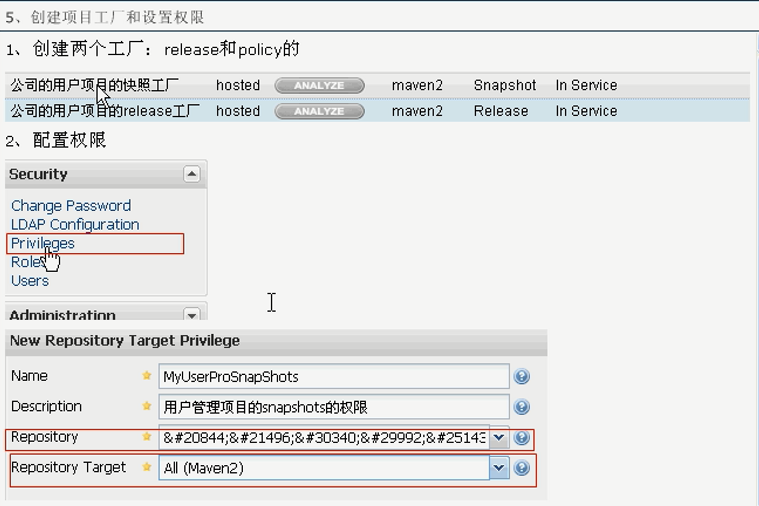

[TOC]


# 1.maven简介

```xml
<?xml version="1.0" encoding="UTF-8"?>
<project xmlns="http://maven.apache.org/POM/4.0.0"	
	     xmlns:xsi="http://www.w3.org/2001/XMLSchema-instance" 
		 xsi:schemaLocation="http://maven.apache.org/POM/4.0.0 http://maven.apache.org/maven-v4_0_0.xsd">
<modelVersion>4.0.0</modelVersion>

<groupId>cn.edu.zttc.hello</groupId>  
<artifactId>hello-first</artifactId>
<version>SNAPSHOT-0.0.1</version>

    <dependencies>
    <dependency>
      <groupId>junit</groupId>
      <artifactId>junit</artifactId>
      <scope>test</scope>  #默认是compile
    </dependency>
    </dependencies>
</project>    
```


项目的坐标：
**groupId**表示项目的名称
**artifactId**表示项目的模块名称，建议使用  **项目名称-模块名称** 的形式
**version**表示项目的版本

源代码应该放置在： src/main/java

源代码的资源文件应该放置在: src/main/resurces

测试代码应该放在: src/test/java

测试代码的资源文件应该放置在: src/test/resurces

```
mvn clean  清理操作，会把target文件夹中的数据清理

mvn clean compile 先清理后编译，会将代码编译到target文件夹中
mvn clean test   运行清理和测试
mvn clean package 运行清理和打包
mvn clean install 运行清理和安装，会将打好的包安装到本地仓库中，以便其他项目可以使用
mvn clean deploy 运行清理和发布 发布到私服

mvn archetype:generate   自动生成项目骨架

```


# 2.依赖

- 所有的依赖都是通过坐标来进行存储的 GAV -- groupId  artifactId  version
- mvn.repository.com
- sonatype.org/nexus


##2.1**maven 是如何搜索依赖的？**

首先会在本地仓库查询，如果本地仓库没有，就去中央仓库查询

依赖是会传递的：

A--->C     B-->  ====>  B ---> C  **这种依赖是基于compile范围进行传递的**

如果scope没有写默认是compile

对于依赖的传递而言，主要是针对compile作用域传递


##2.2**依赖的范围：**

- test 	测试范围有效，在编译和打包时都不会使用这个依赖
	 compile	编译范围有效，在编译和打包时都会讲依赖存储进去    **默认依赖**
	 provided	在编译和测试的范围有效，最后生成war包不会加入，例如：servlet-api   因为servlet-api 在Tomcat中已经存在，如果再打包后冲突
- runtime   在运行的时候依赖，在编译时不依赖


##2.3**传递的冲突性问题**

1.

A--->B.1.0   C-->B.1.1    D---A C  ,这个时候在D的pom文件中，哪一个依赖先写就使用先写的依赖版本

如果D--->   <d>A</d><d>C</d>   则依赖的版本是B.1.0 

2.

A--->B.1.0   

C-->B.1.1   

D--->A C=====》依赖B.1.0   

F-->D C ======》


F--->D--->A-->B.1.0

F--->C--->B .1.1

**如果路径的长短不一致，就选择最小路径的依赖**  ，所以F-->B.1.1

如果希望自己选择，可以手动排除

```xml
<dependencies>
    <dependency>
      <groupId>org.konghao.user</groupId>
      <artifactId>user-dao</artifactId>
      <version>1.0</version>
      <exclusions>  #排除user-dao項目中引用的log4j版本
      	<exclusion>
            <groupId>log4j</groupId>
            <artifactId>log4j</artifactId>
        </exclusion>  
      </exclusions>  
    </dependency>
  </dependencies>
```

----

## 2.4模块聚合

```xml
<project xmlns="http://maven.apache.org/POM/4.0.0" xmlns:xsi="http://www.w3.org/2001/XMLSchema-instance"
  xsi:schemaLocation="http://maven.apache.org/POM/4.0.0 http://maven.apache.org/xsd/maven-4.0.0.xsd">
  <modelVersion>4.0.0</modelVersion>
  	<groupId>org.konghao.user</groupId>
  	<artifactId>user-aggregation</artifactId>
	<version>0.0.1-SNAPSHOT</version>
    <package>pom</package>
    
  <modules>
  	<module>../user-core</module>  聚合的项目和其他项目在同一级目录下
    <module>../user-log</module>
  </modules>  
</project>
    

----------------------------
user-core
	|----...
	|----pom.xml  <package>jar</package>
user-log
	|----....
	|----pom.xml <package>jar</package>
user-aggregation
	|---pom.xml
    可以在一个地方编译多个模块
```

## 2.5模块继承

```xml
<project xmlns="http://maven.apache.org/POM/4.0.0" xmlns:xsi="http://www.w3.org/2001/XMLSchema-instance"
  xsi:schemaLocation="http://maven.apache.org/POM/4.0.0 http://maven.apache.org/xsd/maven-4.0.0.xsd">
  <modelVersion>4.0.0</modelVersion>
  <groupId>org.konghao.user</groupId>
  <artifactId>user-parent</artifactId>
  <version>0.0.1-SNAPSHOT</version>
  <packaging>pom</packaging>
  
  <modules>  #parent-pom.xml即是做聚合又是做继承
  	<module>../user-core</module>
  	<module>../user-dao</module>
  	<module>../user-log</module>
  	<module>../user-service</module>
  </modules>
  
  <url>http://maven.apache.org</url>
  
  <distributionManagement>
  	<snapshotRepository>
  		<id>user-snapshots</id>
  		<name>User Project SNAPSHOTS</name>
  		<url>http://192.168.0.199:8081/nexus/content/repositories/MyUserReposSnapshots/</url>
  	</snapshotRepository>
  	
  	<repository>
  		<id>user-releases</id>
  		<name>User Project Release</name>
  		<url>http://192.168.0.199:8081/nexus/content/repositories/MyUserReposRelease/</url>
  	</repository>
  	
  </distributionManagement>
  
  <properties>
    <project.build.sourceEncoding>UTF-8</project.build.sourceEncoding>
    <junit.version>4.10</junit.version>
    <mysql.driver>com.mysql.jdbc.Driver</mysql.driver>
    <mysql.url>jdbc:mysql://localhost:3306/mysql</mysql.url>
    <mysql.username>root</mysql.username>
    <mysql.password>123456</mysql.password>
  </properties>
  
  
  <dependencyManagement>  ##parent-pom.xml中定义所有的包，子类pom可以选择要继承的包
  	<dependencies>
	  	<dependency>
	  		<groupId>junit</groupId>
	  		<artifactId>junit</artifactId>
	  		<version>${junit.version}</version>
	  		<scope>test</scope>
	  	</dependency>
	  
	    <dependency>
	    	<groupId>${project.groupId}</groupId>
	    	<artifactId>user-core</artifactId>
	    	<version>${project.version}</version>
	    </dependency>
	    <dependency>
	    	<groupId>${project.groupId}</groupId>
	    	<artifactId>user-dao</artifactId>
	    	<version>${project.version}</version>
	    	<type>jar</type>
	    	<scope>compile</scope>
	    </dependency>
	    <dependency>
	    	<groupId>${project.groupId}</groupId>
	    	<artifactId>user-log</artifactId>
	    	<version>${project.version}</version>
	    	<type>jar</type>
	    	<scope>compile</scope>
	    	<exclusions>
	    		<exclusion>
	    			<groupId>log4j</groupId>
	    			<artifactId>log4j</artifactId>
	    		</exclusion>
	    	</exclusions>
    	</dependency>
		<dependency>
			<groupId>log4j</groupId>
			<artifactId>log4j</artifactId>
			<version>1.2.16</version>
		</dependency>
  	</dependencies>
  </dependencyManagement>
    #对于依赖继承而言，都需要通过dependencyManagement来管理，如果不管理，子类会全部继承，可能会导致一些模块存在不需要的依赖
</project>    


-------子类pom
<project xmlns="http://maven.apache.org/POM/4.0.0" xmlns:xsi="http://www.w3.org/2001/XMLSchema-instance"
  xsi:schemaLocation="http://maven.apache.org/POM/4.0.0 http://maven.apache.org/xsd/maven-4.0.0.xsd">
  <modelVersion>4.0.0</modelVersion>

 <parent> #继承
  	<groupId>org.konghao.user</groupId>
  	<artifactId>user-parent</artifactId>
	<version>0.0.1-SNAPSHOT</version>
	<relativePath>../user-parent/pom.xml</relativePath>
  </parent>
  
  <artifactId>user-service</artifactId>
    
  <dependencies>
    <dependency>
      <groupId>junit</groupId>
      <artifactId>junit</artifactId>
    </dependency>
    <dependency>
    	<groupId>org.konghao.user</groupId>
    	<artifactId>user-dao</artifactId>
    </dependency>
    <dependency>
    	<groupId>org.konghao.user</groupId>
    	<artifactId>user-log</artifactId>
    </dependency>
    
  </dependencies>
</project>
```

## 2.6版本管理

**总版本号.分支版本号.小版本号--里程碑版本**

总版本号的变动一般表示框架的变动

分之版本号： 一般表示增加一些功能

小版本号：	在分支版本上进行bug修复

里程碑版本：	SNAPSHOT--->alpha--->beta--->release-->GA

SNAPSHOT 开发中的版本

alpha  内部测试版本

beta    外部公测版本

release    发布版本

GA		稳定版本

（bundle 打包发布版本）


# 3.仓库

------

## 3.1本地仓库

​	

## 3.2中心仓库


##3.3私有仓库

nexus	局域网内的   内置jetty 的web项目

nexus下载解压，将其添加到环境变量中

修改nexus/bin/jsw/conf/wrapper.conf文件

**set the jvm executable**

**wrappre.java.command=path**(d:/software/java/jdk/bin)

在命令行中 

nexus  install  （将nexus服务安装到windows的服务中）

nexus start     （启动服务）

http://localhost:8081/nexus/

admin  admin123


1.host的仓库。内部项目的发布仓库


2.proxy的仓库。从远程中央仓库寻找数据的仓库

3.group的仓库。 组仓库用来方便开发人员进行设置的仓库

4.

**私有仓库的设置**

-----

1.更新私有仓库的索引

​	在nexus的configuration中，download remote index  设为true或者直接下载索引文件覆盖到

nexus/sonatype-work/nexus/indexer/central-ctx/

2.设置镜像

在maven的conf/setting.xml中设置nexus public repository的镜像，这样maven下载就会到nexus中去找

```xml
<mirrors>
	 <mirror>
      <id>central</id>
      <mirrorOf>*</mirrorOf>  #*表示所有的  也可以指定 central，nexus等
      <name>Human Readable Name for this Mirror.</name>
      <url>http://192.168.0.199:8081/nexus/content/groups/public/</url>
    </mirror>
</mirrors>
```

3.在maven的setting.xml配置仓库，此时所有的maven项目都去私有仓库中查询依赖

```xml
<profiles>
	<profile>
	  <id>central-repos</id>
      <repositories>
        <repository>
          <id>central</id>
          <name>Central</name>
          <url>http://central</url> #配置了镜像后这个URL就没有意义了
		  <releases><enable>true</enable></releases> #打开对release的依赖
		  <snapshots>
				<enabled>true</enabled>#打开快照的依赖
		 </snapshots>
        </repository>
      </repositories>
    </profile>
</profiles>
<activeProfiles>  #激活当前的profile设置
    <activeProfile>central-repos</activeProfile>
  </activeProfiles>
```


## 3.4项目的发布


1.在项目的pom文件中设置release工厂和snapshot工厂

```xml
<project xmlns="http://maven.apache.org/POM/4.0.0" xmlns:xsi="http://www.w3.org/2001/XMLSchema-instance"
  xsi:schemaLocation="http://maven.apache.org/POM/4.0.0 http://maven.apache.org/xsd/maven-4.0.0.xsd">
  <modelVersion>4.0.0</modelVersion>
  <groupId>org.konghao.user</groupId>
  <artifactId>user-parent</artifactId>
  <version>0.0.1-SNAPSHOT</version>
  <packaging>pom</packaging>
  
  <modules>
  	<module>../user-core</module>
  	<module>../user-dao</module>
  	<module>../user-log</module>
  	<module>../user-service</module>
  </modules>
  
  <url>http://maven.apache.org</url>
  
  <distributionManagement>
  	<snapshotRepository>
  		<id>user-snapshots</id>
  		<name>User Project SNAPSHOTS</name>
  		<url>http://192.168.0.199:8081/nexus/content/repositories/MyUserReposSnapshots/</url>
  	</snapshotRepository>
  	
  	<repository>
  		<id>user-releases</id>
  		<name>User Project Release</name>
  		<url>http://192.168.0.199:8081/nexus/content/repositories/MyUserReposRelease/</url>
  	</repository>
  	
  </distributionManagement>
  

  <properties>
    <project.build.sourceEncoding>UTF-8</project.build.sourceEncoding>
    <junit.version>4.10</junit.version>
  </properties>
  
  <dependencyManagement>
  	<dependencies>
	    <dependency>
	    	<groupId>${project.groupId}</groupId>
	    	<artifactId>user-dao</artifactId>
	    	<version>${project.version}</version>
	    	<type>jar</type>
	    	<scope>compile</scope>
	    </dependency>
	    
	    <dependency>
	    	<groupId>${project.groupId}</groupId>
	    	<artifactId>user-log</artifactId>
	    	<version>${project.version}</version>
	    	<type>jar</type>
	    	<scope>compile</scope>
	    	<exclusions>
	    		<exclusion>
	    			<groupId>log4j</groupId>
	    			<artifactId>log4j</artifactId>
	    		</exclusion>
	    	</exclusions>
    	</dependency>
		<dependency>
			<groupId>log4j</groupId>
			<artifactId>log4j</artifactId>
			<version>1.2.16</version>
		</dependency>
		
  	</dependencies>
  </dependencyManagement>
</project>

```


2.设置访问权限

在maven的setting.xml中配置发布仓库的访问权限

```xml
<servers>
	 <server>
      <id>user-snapshots</id> #这里的ID和上面的ID要一致
      <username>deployment</username>  #可以nexus中的user查看角色和访问密码
      <password>deployment123</password>
    </server>

	<server>
      <id>user-releases</id>
      <username>kh</username>
      <password>123456</password>
    </server>
```


## 3.5创建工厂和设置权限





4.创建用户


5.创建发布的工厂

```xml
<project xmlns="http://maven.apache.org/POM/4.0.0" xmlns:xsi="http://www.w3.org/2001/XMLSchema-instance"
  xsi:schemaLocation="http://maven.apache.org/POM/4.0.0 http://maven.apache.org/xsd/maven-4.0.0.xsd">
  <modelVersion>4.0.0</modelVersion>
  <groupId>org.konghao.user</groupId>
  <artifactId>user-parent</artifactId>
  <version>0.0.1-SNAPSHOT</version>
  <packaging>pom</packaging>
  
  <modules>
  	<module>../user-core</module>
  	<module>../user-dao</module>
  	<module>../user-log</module>
  	<module>../user-service</module>
  </modules>
  
  <url>http://maven.apache.org</url>
  
  <distributionManagement>
  
  	<snapshotRepository>
  		<id>user-snapshots</id>
  		<name>User Project SNAPSHOTS</name>
  		<url>http://192.168.0.199:8081/nexus/content/repositories/MyUserReposSnapshots/</url>
  	</snapshotRepository>
  	
  	<repository>
  		<id>user-releases</id>
  		<name>User Project Release</name>
  		<url>http://192.168.0.199:8081/nexus/content/repositories/MyUserReposRelease/</url>
  	</repository>
  	
  </distributionManagement>
    
    --------------------
    
    
    
    <servers>
	 <server>
      <id>user-snapshots</id>
      <username>kh</username>
      <password>123456</password>
    </server>

	<server>
      <id>user-releases</id>
      <username>kh</username>
      <password>123456</password>
    </server>
  
```

