😈  🙂

```
this.applicationContext.getBeansWithAnnotation(MessageListener.class);
public List<HystrixProperty> getCommandProperties() {
        if (!isCommandAnnotationPresent()) return Collections.emptyList();
        return getOrDefault(new Supplier<List<HystrixProperty>>() {
            @Override
            public List<HystrixProperty> get() {
                return ImmutableList.copyOf(hystrixCommand.commandProperties());
            }
        }, new Supplier<List<HystrixProperty>>() {
            @Override
            public List<HystrixProperty> get() {
                return hasDefaultProperties()
                        ? ImmutableList.copyOf(defaultProperties.commandProperties())
                        : Collections.<HystrixProperty>emptyList();
            }
        }, this.<HystrixProperty>nonEmptyList());
    }

```


[Sentinel](https://github.com/alibaba/Sentinel)  : 替代 Hystrix


针对分布式领域著名的CAP理论（C——数据一致性，A——服务可用性，P——服务对网络分区故障的容错性），**Zookeeper 保证的是CP ，但对于服务发现而言，可用性比数据一致性更加重要 ，而 Eureka 设计则遵循AP原则** 。


git:

<https://github.com/hollischuang/toBeTopJavaer?utm_source=gold_browser_extension>

<https://github.com/Snailclimb/JavaGuide?utm_source=gold_browser_extension>

<https://github.com/CyC2018/CS-Notes?utm_source=gold_browser_extension>

<https://github.com/doocs/advanced-java?utm_source=gold_browser_extension>


# 😈 maven 

```xml
<dependency>
	<groupId>org.codehaus.groovy</groupId>
	<artifactId>groovy-all</artifactId>
	<version>2.5.4</version>
	<type>pom</type>
	<scope>provided</scope>
</dependency>
<dependency>
      <groupId>org.apache.commons</groupId>
      <artifactId>commons-lang3</artifactId>
      <version>3.8</version>
</dependency>


<dependency>
            <groupId>ma.glasnost.orika</groupId>
            <artifactId>orika-core</artifactId>
            <version>1.5.2</version><!-- or latest version -->
</dependency>

     <!--  spring retry  -->
        <dependency>
            <groupId>org.springframework.retry</groupId>
            <artifactId>spring-retry</artifactId>
        </dependency>
        <dependency>
            <groupId>org.springframework.boot</groupId>
            <artifactId>spring-boot-starter-aop</artifactId>
        </dependency>


<!-- 规则引擎-->
<dependency>
  <groupId>org.jeasy</groupId>
  <artifactId>easy-rules-core</artifactId>
  <version>3.2.0</version>
</dependency>

<dependency>
 	<groupId>org.codehaus.groovy</groupId>
 	<artifactId>groovy-all</artifactId>
 	<version>2.5.4</version>
 	<type>pom</type>
 	<scope>provided</scope>
</dependency>

<!--  支付 UnitRuleGroup-->
<dependency>
  <groupId>org.jeasy</groupId>
  <artifactId>easy-rules-support</artifactId>
  <version>3.2.0</version>
</dependency>

<!-- 支付读取yml配置的规则-->
<dependency>
  <groupId>org.jeasy</groupId>
  <artifactId>easy-rules-mvel</artifactId>
  <version>3.2.0</version>
</dependency>	


<!-- https://mvnrepository.com/artifact/org.projectlombok/lombok -->
<dependency>
	<groupId>org.projectlombok</groupId>
	<artifactId>lombok</artifactId>
	<version>1.18.2</version>
	<scope>provided</scope>
</dependency>
```


```
	<insert id="insertForEach" parameterType="com.lvmama.comm.pet.po.pay.PayPaymentNotifiers"  >
		insert into PAY_PAYMENT_NOTIFIERS (
			OBJECT_ID, ORI_ID,
			NOTIFY_TYPE, PAYMENT_TRADE_NO, REFUND_SERIAL, NOTIFY_STATUS,
			CREATE_TIME, UPDATE_TIME, REMARK, NOTIFY_SYSTEM)
			values 
			<foreach collection="list" item="item" index="index" separator=",">
				(#{item.objectId}, #{item.oriId}, #{item.notifyType}, #{item.paymentTradeNo}, #{item.refundSerial}, #{item.notifyStatus},
				NOW(), NOW(), #{item.remark}, #{item.notifySystem})
			</foreach>

	</insert>
```


[spring-Scheduled   CronSequenceGenerator](https://docs.spring.io/spring/docs/current/javadoc-api/org/springframework/scheduling/support/CronSequenceGenerator.html)


## plugin

[Java 代码规约扫描插件 ](https://github.com/alibaba/p3c/wiki/IDEA插件使用文档)


properties	

```properties
spring.datasource.username=root
spring.datasource.password=xxxxx
spring.datasource.url=jdbc:mysql://localhost:3306/springCache
spring.datasource.driver-class-name=com.mysql.jdbc.Driver

#开启驼峰命名法
mybatis.configuration.map-underscore-to-camel-case=true

#打印sql语句日志
logging.level.com.lxj.cache.mappers=debug

#控制台打印配置信息
debug=true

```


# 😈  nginx

```nginx
在ng的pay.lvmama.com域名http和https两个协议server下添加如下location
location /channel {           
 proxy_pass   http://http_payment_channel_servers/channel/;
} 

upstream http_payment_channel_servers{
        server 192.168.10.51:8083;
	server 192.168.30.238:8083;
}
```


# 😈 ZooKeeper


>[curator api](https://www.jianshu.com/p/8311bff69f7c)
>
>

# 😈  linux

```shell
[qa@testtech4-195 ~]$ printf %d  0xac
172
[qa@testtech4-195 ~]$ printf %0x 172
ac


```


😈 

```

AopUtils				package org.springframework.util;
AopTargetUtils
AnnotationUtils			org.springframework.core.annotation
BeanUtils				org.springframework.beans
BeanUtils				org.apache.commons.beanutils
ClassHelper				org.apache.dubbo.common.utils
ClassUtils				org.springframework.util
Collections				java.util
ObjectUtils				package org.springframework.util;
ReflectUtils			org.apache.dubbo.common.utils
ReflectionUtils			org.springframework.util
StringUtils				org.springframework.util
StringUtils				org.apache.dubbo.common.utils
NetUtils				com.alibaba.dubbo.common.utils
```


```
AopUtils.isAopProxy(proxy)
可以判断一个对象是不是代理对象(JDK代理 cglib代理)
Class<?> targetClass = AopUtils.getTargetClass(proxy);
获取一个代理对象的实际对象的class
AnnotationUtils.getAnnotation() 
Objects.equals() 
StringUtils.collectionToCommaDelimitedString
ClassHelper.getClassLoader
class.isAssignableFrom(cls) class是否cls或cls的父类、父接口
class.isAnnotationPresent(annotation) class上是否存在annotation注解
class.isInterface()
if (method.getName().startsWith("set")
                            && method.getParameterTypes().length == 1
                            && Modifier.isPublic(method.getModifiers()))
ClassHelper.isGetter(method) 
ReflectUtils.isPrimitives(clazz)
Collections.sort()
Collections.unmodifiableList(list);
StringUtils.camelToSplitName("ThisIsADemoStr",".")-->this.is.a.demo.str  
ReflectionUtils.makeAccessible(Constructor); 
BeanUtils.instantiateClass(class) 实例化一个指定class class不能是一个接口  Instantiate a class using its no-arg constructor.
BeanUtils.findMethodWithMinimalParameters(class,methodName ) //匹配 方法名相同，参数最少的方法
BeanUtils.cloneBean()
// org.springframework.util  将,组成的str 分割成array
StringUtils.commaDelimitedListToStringArray
```


😈 

Assert.isInstanceOf(ConfigurableEnvironment.class, environment);
Assert.notNull(prefix, "The prefix of Configuration Properties must not be null");
Assert.notEmpty()                                                                                                                                                             Assert.isTrue                                                                                                                                                       Assert.assertEquals("hello", applicationConfig.getName());

😈 

😈 


😈 
集合

CollectionUtils.isEmpty(properties)
Collections.singleton(resolveSingleBeanName(properties, configClass, registry));  // java.util.Collections

SortedMap<String, Object> dubboProperties = new TreeMap<>();                                                                                            return Collections.unmodifiableSortedMap(dubboProperties); 

Collections.unmodifiableMap(map) //返回指定map的一个只读(read-only)视图


😈 获取类加载器

1. Thread.currentThread().getContextClassLoader()
2. ClassUtils.class.getClassLoader(); // No thread context class loader -> use class loader of this class.    XXX.class.getClassLoader();
3. ClassLoader.getSystemClassLoader();  //getClassLoader() returning null indicates the bootstrap ClassLoader

```java
public static ClassLoader getDefaultClassLoader() {
	ClassLoader cl = null;
	try {
		cl = Thread.currentThread().getContextClassLoader();
	}
	catch (Throwable ex) {
		// Cannot access thread context ClassLoader - falling back...
	}
	if (cl == null) {
		// No thread context class loader -> use class loader of this class.
		cl = ClassUtils.class.getClassLoader();
		if (cl == null) {
			// getClassLoader() returning null indicates the bootstrap ClassLoader
			try {
				cl = ClassLoader.getSystemClassLoader();
			}
			catch (Throwable ex) {
				// Cannot access system ClassLoader - oh well, maybe the caller can live with null...
			}
		}
	}
	return cl;
}
```


attribute.getValue() instanceof String[]


Map<Class<? extends Annotation>, List<Method>>


# 😈  Concurrency

### SynchronousQueue

[SynchronousQueue](http://docs.oracle.com/javase/6/docs/api/java/util/concurrent/SynchronousQueue.html)是一个没有数据缓冲的[BlockingQueue](http://docs.oracle.com/javase/6/docs/api/java/util/concurrent/BlockingQueue.html)，生产者线程对其的插入操作put必须等待消费者的移除操作take，反过来也一样

1. 不像ArrayBlockingQueue或LinkedListBlockingQueue，SynchronousQueue内部并**没有数据缓存空间**，你不能调用peek()方法来看队列中是否有数据元素
2. 遍历这个队列的操作也是不允许的
3. 队列头元素是第一个排队要插入数据的**线程**，而**不是要交换的数据**。数据是在配对的生产者和消费者线程之间直接传递的，并不会将数据缓冲数据到队列中。可以这样来理解：生产者和消费者互相等待对方，握手，然后**一起**离开。


> 参考   [SynchronousQueue](http://ifeve.com/java-synchronousqueue/) 


### sleep/wait/notify

1. sleep

   sleep是**线程类（Thread）的方法**，导致此线程暂停执行指定时间，给执行机会给其他线程，但是监控状态依然保持，到时后会自动恢复。**调用sleep不会释放对象锁**。

   sleep就是正在执行的线程主动让出cpu，cpu去执行其他线程，在sleep指定的时间过后，cpu才会回到这个线程上继续往下执行，如果当前线程进入了同步锁，sleep方法并不会释放锁，即使当前线程使用sleep方法让出了cpu，但其他被同步锁挡住了的线程也无法得到执行。

2. wait

   wait是**Object类的方法**，对此对象调用wait方法导致本线程放弃对象锁，进入等待此对象的等待锁定池，只有针对此对象发出notify方法（或notifyAll）后，本线程才进入对象锁定池准备获得对象锁进入运行状态。

   wait是指在一个已经进入了同步锁的线程内，让自己暂时让出同步锁，以便**其他**正在等待此锁的**线程可以得到同步锁并运行**，只有其他线程调用了notify方法（**notify并不释放锁，只是告诉调用过wait方法的线程可以去参与获得锁的竞争了，但不是马上得到锁，因为锁还在别人手里，别人还没释放**。如果notify方法后面的代码还有很多，需要这些代码执行完后才会释放锁，可以在notfiy方法后增加一个等待和一些代码，看看效果），调用wait方法的线程就会解除wait状态和程序可以再次得到锁后继续向下运行。


### Semaphore

Semaphore是一种计数信号量，用于管理一组资源，内部是基于AQS的共享模式。它相当于给线程规定一个量从而控制允许活动的线程数。 从概念上讲信号量维护了一个**许可集**,只有当资源获取许可以后即(得到相应的acquire)才会执行相应的操作,**否则就为等待的状态**,在释放release之后 下一个相应的线程才会进入方法之中,semaphore并**不使用实际的许可对象**,只是仅仅的进行技术,并采取相应的行动,限制访问某些资源的线程数目

Semaphore主要方法：

1. Semaphore(int permits):构造方法，创建具有给定许可数的计数信号量并设置为非公平信号量。
2. Semaphore(int permits,boolean fair):构造方法，当fair等于true时，创建具有给定许可数的计数信号量并设置为公平信号量
3. void acquire():从此信号量获取一个许可前线程将一直阻塞。
4. void acquire(int n):从此信号量获取给定数目许可，在提供这些许可前一直将线程阻塞。
5. void release():释放一个许可，将其返回给信号量。
6. void release(int n):释放n个许可。
7. int availablePermits()：当前可用的许可数。

关于semaphore的参数值问题new Semaphore(0);

>```
>fred = Semaphore(1)
>```
>
>The function `Semaphore` is a constructor; it creates and returns a new Semaphore. **The initial value of the semaphore is passed as a parameter to the constructor.**
>
>If the value is positive, then it represents the number of threads that can decrement without blocking. If it is negative, then it represents the number of threads that have blocked and are waiting. **If the value is zero, it means there are no threads waiting, but if a thread tries to decrement, it will block.**
>
>[Semaphore(0)问题](https://stackoverflow.com/questions/14793416/zero-permit-semaphores)
>
>


>[seamphore 停车场](https://blog.csdn.net/carson0408/article/details/79475723 )


## **CopyOnWrite** 

CopyOnWrite思想是什么，以及在Java并发包中的具体体现，包括在Kafka内核源码中是如何运用这个思想来优化并发性能的。

### 1、读多写少的场景下引发的问题？

大家可以设想一下现在我们的内存里有一个ArrayList，这个ArrayList默认情况下肯定是**线程不安全**的，要是多个线程并发读和写这个ArrayList可能会有问题。

好，问题来了，我们应该怎么让这个ArrayList变成线程安全的呢？有一个非常简单的办法，对这个ArrayList的**访问都加上线程同步的控制**。比如说一定要在synchronized代码段来对这个ArrayList进行访问，这样的话，就能同一时间就让一个线程来操作它了，或者是用ReadWriteLock读写锁的方式来控制，都可以。

我们假设就是用ReadWriteLock读写锁的方式来控制对这个ArrayList的访问。这样多个读请求可以**同时执行从ArrayList里读取数据，但是读请求和写请求之间互斥，写请求和写请求也是互斥的**。大家看看，代码大概就是类似下面这样：

```java
public Object  read() {
    lock.readLock().lock();
    // 对ArrayList读取
    lock.readLock().unlock();
}
public void write() {
    lock.writeLock().lock();
    // 对ArrayList写
    lock.writeLock().unlock();
}
```

大家想想，类似上面的代码有什么问题呢？最大的问题，==其实就在于写锁和读锁的互斥==。**假设写操作频率很低，读操作频率很高，是写少读多的场景**。那么偶尔执行一个写操作的时候，是不是会加上写锁，此时**大量的读操作过来是不是就会被阻塞住，无法执行？这个就是读写锁可能遇到的最大的问题。**


### 2、引入 CopyOnWrite 思想解决问题

这个时候就要引入CopyOnWrite思想来解决问题了。他的思想就是，**不用加什么读写锁，锁统统给我去掉，有锁就有问题，有锁就有互斥，有锁就可能导致性能低下**，你阻塞我的请求，导致我的请求都卡着不能执行。

那么他==怎么保证多线程并发的安全性呢==？很简单，顾名思义，利用“CopyOnWrite”的方式，这个英语翻译成中文，大概就是“写数据的时候利用拷贝的副本来执行”。**你在读数据的时候，其实不加锁也没关系，大家左右都是一个读罢了，互相没影响**。问题主要是在写的时候，**写的时候你既然不能加锁了**，那么就得采用一个策略。假如说你的ArrayList底层是一个数组来存放你的列表数据，那么这时比如**你要修改这个数组里的数据，你就必须先拷贝这个数组的一个副本。然后你可以在这个数组的副本里写入你要修改的数据**，但是在这个过程中实际上==你都是在操作一个副本而已==。这样的话，读操作是不是可以同时正常的执行？这个写操作对读操作是没有任何的影响的吧！大家看下面的图，一起来体会一下这个过程

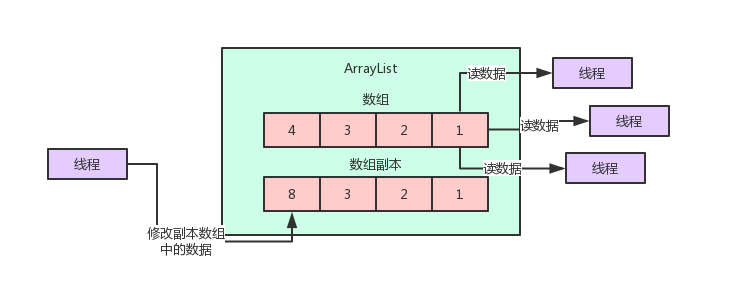

关键问题来了，那那个**写线程现在把副本数组给修改完了，现在怎么才能让读线程感知到这个变化呢**？

**关键点来了，划重点！**这里要配合上volatile关键字的使用。

笔者之前写过文章，给大家解释过volatile关键字的使用，**核心就是让一个变量被写线程给修改之后，立马让其他线程可以读到这个变量引用的最近的值，这就是volatile最核心的作用**。

所以一旦写线程搞定了副本数组的修改之后，那么就可以用**volatile写的方式**，把这个副本数组赋值给volatile修饰的那个数组的引用变量了。只要一赋值给那个volatile修饰的变量，立马就会对读线程可见，大家都能看到最新的数组了。

下面是JDK里的 CopyOnWriteArrayList 的源码。大家看看写数据的时候，他是怎么拷贝一个数组副本，然后修改副本，接着通过volatile变量赋值的方式，把修改好的数组副本给更新回去，立马让其他线程可见的。

```java
// 这个数组是核心的，因为用volatile修饰了
    // 只要把最新的数组对他赋值，其他线程立马可以看到最新的数组
    private transient volatile Object[] array;

    public boolean add(E e) {
        final ReentrantLock lock = this.lock;
        lock.lock();
        try {
            Object[] elements = getArray();
            int len = elements.length;
            // 对数组拷贝一个副本出来
            Object[] newElements = Arrays.copyOf(elements, len + 1);
            // 对副本数组进行修改，比如在里面加入一个元素
            newElements[len] = e;
            // 然后把副本数组赋值给volatile修饰的变量
            setArray(newElements);
            return true;
        } finally {
            lock.unlock();
        }
    }
```


然后大家想，因为是通过副本来进行更新的==，万一要是多个线程都要同时更新呢==？那搞出来多个副本会不会有问题？

**当然不能多个线程同时更新了**，这个时候就是看上面源码里，**加入了lock锁的机制，也就是同一时间只有一个线程可以更新。**

那么更新的时候，会对读操作有任何的影响吗？

绝对不会，因为读操作就是非常简单的对那个数组进行读而已，不涉及任何的锁。而且只要**他更新完毕对volatile修饰的变量赋值，那么读线程立马可以看到最新修改后的数组**，这是volatile保证的。

```java
  private E get(Object[] a, int index) {
        // 最简单的对数组进行读取
        return (E) a[index];
    } 
```


这样就完美解决了我们之前说的读多写少的问题。

如果用读写锁互斥的话，会导致写锁阻塞大量读操作，影响并发性能。**但是如果用了CopyOnWriteArrayList，就是用空间换时间，更新的时候基于副本更新，避免锁，然后最后用volatile变量来赋值保证可见性，更新的时候对读线程没有任何的影响**！


### 3、CopyOnWrite 思想在Kafka源码中的运用

在Kafka的内核源码中，有这么一个场景，客户端在向Kafka写数据的时候，会把消息先写入客户端本地的内存缓冲，然后在内存缓冲里形成一个Batch之后再一次性发送到Kafka服务器上去，这样有助于提升吞吐量。

话不多说，大家看下图：

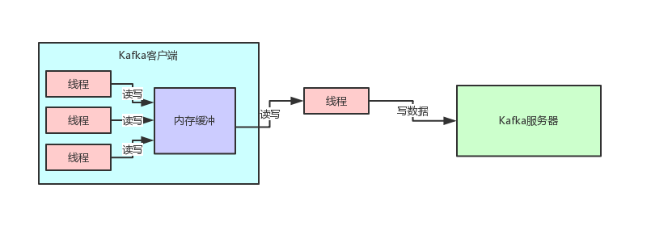

这个时候Kafka的内存缓冲用的是什么数据结构呢？大家看源码：

```java
private final ConcurrentMap<TopicPartition, Deque<RecordBatch>> batches = 
new CopyOnWriteMap<TopicPartition, Deque<RecordBatch>>();
```

这个数据结构就是核心的用来存放写入内存缓冲中的消息的数据结构，要看懂这个数据结构需要对很多Kafka内核源码里的概念进行解释，这里先不展开。

但是大家关注一点，他是自己实现了一个CopyOnWriteMap，这个**CopyOnWriteMap采用的就是CopyOnWrite思想**。

我们来看一下这个CopyOnWriteMap的源码实现：

```java
// 典型的volatile修饰普通Map
    private volatile Map<K, V> map;
    @Override
    public synchronized V put(K k, V v) {
        // 更新的时候先创建副本，更新副本，然后对volatile变量赋值写回去
        Map<K, V> copy = new HashMap<K, V>(this.map);
        V prev = copy.put(k, v);
        this.map = Collections.unmodifiableMap(copy);
        return prev;
    }
    @Override
    public V get(Object k) {
        // 读取的时候直接读volatile变量引用的map数据结构，无需锁
        return map.get(k);
    }
```

所以Kafka这个核心数据结构在这里之所以采用CopyOnWriteMap思想来实现，就是因为这个Map的key-value对，其实没那么频繁更新。

也就是TopicPartition-Deque这个key-value对，更新频率很低。

但是他的get操作却是高频的读取请求，因为会高频的读取出来一个TopicPartition对应的Deque数据结构，来对这个队列进行入队出队等操作，所以**对于这个map而言，高频的是其get操作**。

这个时候，Kafka就采用了CopyOnWrite思想来实现这个Map，避免更新key-value的时候阻塞住高频的读操作，实现无锁的效果，优化线程并发的性能。

相信大家看完这个文章，对于CopyOnWrite思想以及适用场景，包括JDK中的实现，以及在Kafka源码中的运用，都有了一个切身的体会了。


如果你能在面试时说清楚这个思想以及他在JDK中的体现，并且还能结合知名的开源项目 Kafka 的底层源码进一步向面试官进行阐述，面试官对你的印象肯定大大的加分。


# 线程

Executors.newSingleThreadExecutor().execute


## [Java 8 中 Date与LocalDateTime、LocalDate、LocalTime互转](https://www.cnblogs.com/exmyth/p/6425878.html)

```java
 

Java 8中 java.util.Date 类新增了两个方法，分别是from(Instant instant)和toInstant()方法

// Obtains an instance of Date from an Instant object.
public static Date from(Instant instant) {
    try {
        return new Date(instant.toEpochMilli());
    } catch (ArithmeticException ex) {
        throw new IllegalArgumentException(ex);
    }
}

// Converts this Date object to an Instant.
public Instant toInstant() {
    return Instant.ofEpochMilli(getTime());
}

 

这两个方法使我们可以方便的实现将旧的日期类转换为新的日期类，具体思路都是通过Instant当中介，然后通过Instant来创建LocalDateTime（这个类可以很容易获取LocalDate和LocalTime），新的日期类转旧的也是如此，将新的先转成LocalDateTime，然后获取Instant，接着转成Date，具体实现细节如下：

// 01. java.util.Date --> java.time.LocalDateTime
public void UDateToLocalDateTime() {
    java.util.Date date = new java.util.Date();
    Instant instant = date.toInstant();
    ZoneId zone = ZoneId.systemDefault();
    LocalDateTime localDateTime = LocalDateTime.ofInstant(instant, zone);
}

// 02. java.util.Date --> java.time.LocalDate
public void UDateToLocalDate() {
    java.util.Date date = new java.util.Date();
    Instant instant = date.toInstant();
    ZoneId zone = ZoneId.systemDefault();
    LocalDateTime localDateTime = LocalDateTime.ofInstant(instant, zone);
    LocalDate localDate = localDateTime.toLocalDate();
}

// 03. java.util.Date --> java.time.LocalTime
public void UDateToLocalTime() {
    java.util.Date date = new java.util.Date();
    Instant instant = date.toInstant();
    ZoneId zone = ZoneId.systemDefault();
    LocalDateTime localDateTime = LocalDateTime.ofInstant(instant, zone);
    LocalTime localTime = localDateTime.toLocalTime();
}


// 04. java.time.LocalDateTime --> java.util.Date
public void LocalDateTimeToUdate() {
    LocalDateTime localDateTime = LocalDateTime.now();
    ZoneId zone = ZoneId.systemDefault();
    Instant instant = localDateTime.atZone(zone).toInstant();
    java.util.Date date = Date.from(instant);
}


// 05. java.time.LocalDate --> java.util.Date
public void LocalDateToUdate() {
    LocalDate localDate = LocalDate.now();
    ZoneId zone = ZoneId.systemDefault();
    Instant instant = localDate.atStartOfDay().atZone(zone).toInstant();
    java.util.Date date = Date.from(instant);
}

// 06. java.time.LocalTime --> java.util.Date
public void LocalTimeToUdate() {
    LocalTime localTime = LocalTime.now();
    LocalDate localDate = LocalDate.now();
    LocalDateTime localDateTime = LocalDateTime.of(localDate, localTime);
    ZoneId zone = ZoneId.systemDefault();
    Instant instant = localDateTime.atZone(zone).toInstant();
    java.util.Date date = Date.from(instant);
}
```


# jvm

### jstack

1、top后按c查看最耗cpu的进程，得到pid

2、top -Hp pid 查看该进程里的线程资源使用情况，找到最耗资源的线程的pid

3、jstack pid来查看进程的各个线程栈，注意这里的pid是第一步中进程的pid，不是第二步得到的线程id

4、将第二步得到的pid转成16进制之后在线程栈信息里查找nid等于pid16进制的，就找到最耗资源的线程的栈信息

5、在thread dump中每个线程都有一个nid，找到对应的nid即可；隔段时间再执行一次stack命令获取thread dump，区分两份dump是否有差别，在nid=0x246c的线程调用栈中，发现该线程一直在执行JstackCase类第33行的calculate方法，得到这个信息，就可以检查对应的代码是否有问题 ( printf %0x  pid 把pid转为十六进制)

参考：

[如何使用jstack分析线程状态](https://www.jianshu.com/p/6690f7e92f27)


# 😈 queue

 java Queue中 add/offer，element/peek，remove/poll中的三个方法均为重复的方法，在选择使用时不免有所疑惑，这里简单区别一下：

1、add()和offer()区别:

add()和offer()都是向队列中添加一个元素。一些队列有大小限制，因此如果想在一个满的队列中加入一个新项，调用 add() 方法就会抛出一个 unchecked 异常，而调用 offer() 方法会返回 false。因此就可以在程序中进行有效的判断！

 2、poll()和remove()区别：

remove() 和 poll() 方法都是从队列中删除第一个元素。如果队列元素为空，调用remove() 的行为与 Collection 接口的版本相似会抛出异常，但是新的 poll() 方法在用空集合调用时只是返回 null。因此新的方法更适合容易出现异常条件的情况。

3、element() 和 peek() 区别：

element() 和 peek() 用于在队列的头部查询元素。与 remove() 方法类似，在队列为空时， element() 抛出一个异常，而 peek() 返回 null。
下面是Java中Queue的一些常用方法：
add         增加一个元索                      如果队列已满，则抛出一个IIIegaISlabEepeplian异常
remove   移除并返回队列头部的元素     如果队列为空，则抛出一个NoSuchElementException异常
element  返回队列头部的元素              如果队列为空，则抛出一个NoSuchElementException异常
offer       添加一个元素并返回true        如果队列已满，则返回false
poll         移除并返问队列头部的元素     如果队列为空，则返回null
peek       返回队列头部的元素              如果队列为空，则返回null
put         添加一个元素                       如果队列满，则阻塞                                                                                                take        移除并返回队列头部的元素    

---------------------


# 😈 Class

class.isAnonymousClass() 

class.getSuperclass()  //返回class代表的实体类的父类class

class.getGenericSuperclass()  

class.isInterface()

class.isAnnotationPresent(SPI.class)  是否有SPI注解

```
if ("getParameters".equals(name)// Map public getParameters()
        && Modifier.isPublic(method.getModifiers())
        && method.getParameterTypes().length == 0
        && method.getReturnType() == Map.class)
```

wrapper类

```java
public class XxxProtocolWrapper implements Protocol {
    Protocol impl;
 
    public XxxProtocolWrapper(Protocol protocol) { impl = protocol; }
 
    // 接口方法做一个操作后，再调用extension的方法
    public void refer() {
        //... 一些操作
        impl.refer();
        // ... 一些操作
    }
 
    // ...
}
```


java

```java
private static final Pattern NAME_SEPARATOR = Pattern.compile("\\s*[,]+\\s*");
String[] names = NAME_SEPARATOR.split(value);
```


# 😈 雪花算法(snowflake)

### 1.雪花算法


Twitter_Snowflake<br>
 * SnowFlake的结构如下(每部分用-分开):<br>
 * 0 - 0000000000 0000000000 0000000000 0000000000 0 - 00000 - 00000 - 000000000000 <br>
 * 1位标识，由于long基本类型在Java中是带符号的，最高位是符号位，正数是0，负数是1，所以id一般是正数，最高位是0<br>
 * 41位时间截(毫秒级)，注意，**41位时间截不是存储当前时间的时间截，而是存储时间截的差值**（当前时间截 - 开始时间截)得到的值，这里的的开始时间截，一般是我们的id生成器开始使用的时间，由我们程序来指定的（如下下面程序IdWorker类的startTime属性）。41位的时间截，可以使用69年，年T = (1L << 41) / (1000L * 60 * 60 * 24 * 365) = 69<br>
 * 10位的数据机器位，可以部署在1024个节点，包括5位datacenterId和5位workerId<br>
 * 12位序列，毫秒内的计数，12位的计数顺序号支持每个节点每毫秒(同一机器，同一时间截)产生4096个ID序号<br>
 * 加起来刚好64位，为一个Long型。<br>
 * SnowFlake的优点是，**整体上按照时间自增排序**，并且整个分布式系统内不会产生ID碰撞(由数据中心ID和机器ID作区分)，并且效率较高，经测试，SnowFlake每秒能够产生26万ID左右。
---------------------
```java
import com.google.common.base.Preconditions;

public class SnowflakeIdWorker {
    // ==============================Fields===========================================
    /** 开始时间截 (2019-04-15 14-11-12) */
    private final long twepoch = 1555308671804L;

    /** 机器id所占的位数 */
    private final long workerIdBits = 5L;

    /** 数据标识id所占的位数 */
    private final long dataCenterIdBits = 5L;

    /** 支持的最大机器id，结果是31 (这个移位算法可以很快的计算出几位二进制数所能表示的最大十进制数) */
    private final long maxWorkerId = -1L ^ (-1L << workerIdBits);

    /** 支持的最大数据标识id，结果是31 */
    private final long maxDataCenterId = -1L ^ (-1L << dataCenterIdBits);


    /** 序列在id中占的位数 */
    private final long sequenceBits = 12L;

    /** 机器ID向左移12位 */
    private final long workerIdShift = sequenceBits;

    /** 生成序列的掩码，这里为4095 (0b111111111111=0xfff=4095) */
    private final long sequenceMask = -1L ^ (-1L << sequenceBits);


    /** 数据标识id向左移17位(12+5) */
    private final long dataCenterIdShift = sequenceBits + workerIdBits;

    /** 时间截向左移22位(5+5+12) */
    private final long timestampLeftShift = sequenceBits + workerIdBits + dataCenterIdBits;


    /** 工作机器ID(0-31) */
    private long workerId;

    /** 数据中心ID(0-31) */
    private long dataCenterId;

    /** 毫秒内序列(0-4095) */
    private long sequence = 0L;

    /** 上次生成ID的时间截 */
    private long lastTimestamp = -1L;


    //==============================Constructors=====================================

    /**
     *
     * @param workerId
     * @param dataCenterId
     */
    public SnowflakeIdWorker(long workerId, long dataCenterId) {
       Preconditions.checkArgument(workerId >= 0L && workerId < maxWorkerId,
                String.format("workerId can't be greater than %d or less than 0", maxWorkerId));
        if(dataCenterId > maxDataCenterId || dataCenterId < 0 ){
            throw new IllegalArgumentException(String.format("dataCenterId can't be greater than %d or less than 0", maxDataCenterId));
        }
        this.workerId = workerId;
        this.dataCenterId = dataCenterId;
    }


// ==============================Methods==========================================
    /**
     * 返回以毫秒为单位的当前时间
     * @return 当前时间(毫秒)
     */
    protected long timeGen() {
        return System.currentTimeMillis();
    }
    public synchronized long nextId(){
        long timestamp = timeGen();
        //如果当前时间小于上一次ID生成的时间戳，说明系统时钟回退过这个时候应当抛出异常
        if (timestamp < lastTimestamp) {
            throw new RuntimeException( String.format("Clock moved backwards.  Refusing to generate id for %d milliseconds", lastTimestamp - timestamp));
        }
        //如果是同一时间生成的，则进行毫秒内序列
        if (lastTimestamp == timestamp) {
            // 如果超过（2^12=4096 即最大值是4095  超过4095的数 & 4095  = 0）
            sequence = (sequence + 1) & sequenceMask;
            if (sequence == 0) {
                //阻塞到下一个毫秒,获得新的时间戳
                timestamp = tilNextMillis(lastTimestamp);
            }
        }else{//时间戳改变，毫秒内序列重置 重新从0开始
            sequence = 0L;
        }

        //上次生成ID的时间截
        lastTimestamp = timestamp;

        //移位并通过或运算拼到一起组成64位的ID
        return ((timestamp - twepoch) << timestampLeftShift)
                | (dataCenterId << dataCenterIdShift)
                | (workerId << workerIdShift)
                | sequence;

    }

    /**
     *  阻塞到下一个毫秒，直到获得新的时间戳
     * @param lastTimestamp
     * @return
     */
    protected long tilNextMillis(long lastTimestamp) {
        long timestamp = timeGen();
        while (timestamp <= lastTimestamp) {
            timestamp = timeGen();
        }
        return timestamp;
    }


    //==============================Test=============================================
    /** 测试 */
    public static void main(String[] args) {
        System.out.println(System.currentTimeMillis());
        SnowflakeIdWorker idWorker = new SnowflakeIdWorker(30, 30);
        long startTime = System.nanoTime();
        for (int i = 0; i < 50000; i++) {
            long id = idWorker.next
                Id();
            System.out.println(id);
        }
        System.out.println((System.nanoTime()-startTime)/1000000+"ms");
    }


}

```


版本二：

```java
import com.google.common.base.Preconditions;

import java.net.InetAddress;
import java.net.UnknownHostException;
import java.util.Calendar;

public class DefaultKeyGenerator {
    public static final long EPOCH;

    // 自增长序列的长度（单位是位时的长度）
    private static final long SEQUENCE_BITS = 12L;

    // workerId的长度（单位是位时的长度）
    private static final long WORKER_ID_BITS = 10L;

    private static final long SEQUENCE_MASK = (1 << SEQUENCE_BITS) - 1;

    private static final long WORKER_ID_LEFT_SHIFT_BITS = SEQUENCE_BITS;

    private static final long TIMESTAMP_LEFT_SHIFT_BITS = WORKER_ID_LEFT_SHIFT_BITS + WORKER_ID_BITS;

    // 位运算计算workerId的最大值（workerId占10位，那么1向左移10位就是workerId的最大值）
    private static final long WORKER_ID_MAX_VALUE = 1L << WORKER_ID_BITS;

    private static TimeService timeService = new TimeService();

    private static long workerId;

    // EPOCH就是起始时间，从2016-11-01 00:00:00开始的毫秒数
    static {
        Calendar calendar = Calendar.getInstance();
        calendar.set(2016, Calendar.NOVEMBER, 1);
        calendar.set(Calendar.HOUR_OF_DAY, 0);
        calendar.set(Calendar.MINUTE, 0);
        calendar.set(Calendar.SECOND, 0);
        calendar.set(Calendar.MILLISECOND, 0);
        EPOCH = calendar.getTimeInMillis();
    }

    private long sequence;

    private long lastTime;

    /**
     * 得到分布式唯一ID需要先设置workerId，workId的值范围[0, 1024)
     * @param workerId work process id
     */
    public static void setWorkerId(final long workerId) {
        // google-guava提供的入参检查方法：workerId只能在0~WORKER_ID_MAX_VALUE之间；
        Preconditions.checkArgument(workerId >= 0L && workerId < WORKER_ID_MAX_VALUE);
        DefaultKeyGenerator.workerId = workerId;
    }

    /**
     * 调用该方法，得到分布式唯一ID
     * @return key type is @{@link Long}.
     */
//    @Override
    public synchronized Number generateKey() {
        long currentMillis = timeService.getCurrentMillis();
        // 每次取分布式唯一ID的时间不能少于上一次取时的时间
        Preconditions.checkState(lastTime <= currentMillis, "Clock is moving backwards, last time is %d milliseconds, current time is %d milliseconds", lastTime, currentMillis);
        // 如果同一毫秒范围内，那么自增，否则从0开始
        if (lastTime == currentMillis) {
            // 如果自增后的sequence值超过4096，那么等待直到下一个毫秒
            if (0L == (sequence = ++sequence & SEQUENCE_MASK)) {
                currentMillis = waitUntilNextTime(currentMillis);
            }
        } else {
            sequence = 0;
        }
        // 更新lastTime的值，即最后一次获取分布式唯一ID的时间
        lastTime = currentMillis;
        // 从这里可知分布式唯一ID的组成部分；
        return ((currentMillis - EPOCH) << TIMESTAMP_LEFT_SHIFT_BITS) | (workerId << WORKER_ID_LEFT_SHIFT_BITS) | sequence;
    }

    // 获取下一毫秒的方法：死循环获取当前毫秒与lastTime比较，直到大于lastTime的值；
    private long waitUntilNextTime(final long lastTime) {
        long time = timeService.getCurrentMillis();
        while (time <= lastTime) {
            time = timeService.getCurrentMillis();
        }
        return time;
    }


static   class TimeService {
        public Long getCurrentMillis(){
           return  System.currentTimeMillis();
        }
 }
}        
```


参考：

[ID生成器，Twitter的雪花算法（Java）](https://blog.csdn.net/xiaopeng9275/article/details/72123709)

[sharding-jdbc源码之分布式ID](https://www.jianshu.com/p/7f0661ddd6dd)

[分布式ID增强篇--优化时钟回拨问题](https://www.jianshu.com/p/98c202f64652?utm_campaign=haruki&utm_content=note&utm_medium=reader_share&utm_source=weixin)

### 2.雪花算法缺点

1. 机器ID（5位）和数据中心ID（5位）配置没有解决，分布式部署的时候会使用相同的配置，任然有ID重复的风险。

2. 使用的时候需要实例化对象，没有形成开箱即用的工具类。

3. 时钟回拨问题；强依赖时间，如果时钟回拨，就会生成重复的ID

4. 趋势递增，而不是绝对递增；

   趋势递增并不是严格的，比如，1，2，3，5，4，6，7，8这是趋势递增，5和4由于并发，可能5先插入。而绝对递增必须是1，2，3，4，5，6，7，8。snowflakes算法由于workid这个因素，所以基本上不可能做到绝对递增的。而分布式环境下如果像做到绝对递增，那么必然会引入分布式锁，从而导致性能急剧下降

5. 不能在一台服务器上部署多个分布式ID服务

dsfd

### 3.优化

#### workerID获取

获取workerId的三种方式

```java
//    HostNameKeyGenerator  根据hostname获取，源码如下（HostNameKeyGenerator.java）：

    /**
     * 根据机器名最后的数字编号获取工作进程Id.如果线上机器命名有统一规范,建议使用此种方式.
     * 例如机器的HostName为:dangdang-db-sharding-dev-01(公司名-部门名-服务名-环境名-编号)
     * ,会截取HostName最后的编号01作为workerId.
     *
     * @author DonneyYoung
     **/
    static void initWorkerId() {
        InetAddress address;
        Long workerId;
        try {
            address = InetAddress.getLocalHost();
        } catch (final UnknownHostException e) {
            throw new IllegalStateException("Cannot get LocalHost InetAddress, please check your network!");
        }
        // 先得到服务器的hostname，例如JTCRTVDRA44，linux上可通过命令"cat /proc/sys/kernel/hostname"查看；
        String hostName = address.getHostName();
        try {
            // 计算workerId的方式：
            // 第一步hostName.replaceAll("\\d+$", "")，即去掉hostname后纯数字部分，例如JTCRTVDRA44去掉后就是JTCRTVDRA
            // 第二步hostName.replace(第一步的结果, "")，即将原hostname的非数字部分去掉，得到纯数字部分，就是workerId
            workerId = Long.valueOf(hostName.replace(hostName.replaceAll("\\d+$", ""), ""));
        } catch (final NumberFormatException e) {
            throw new IllegalArgumentException(String.format("Wrong hostname:%s, hostname must be end with number!", hostName));
        }
        DefaultKeyGenerator.setWorkerId(workerId);
    }


//    IPKeyGenerator  根据IP获取，源码如下（IPKeyGenerator.java）

    /**
     * 根据机器IP获取工作进程Id,如果线上机器的IP二进制表示的最后10位不重复,建议使用此种方式
     * ,列如机器的IP为192.168.1.108,二进制表示:11000000 10101000 00000001 01101100
     * ,截取最后10位 01 01101100,转为十进制364,设置workerId为364.
     */
    static void initWorkerId2() {
        InetAddress address;
        try {
            // 首先得到IP地址，例如192.168.1.108
            address = InetAddress.getLocalHost();
        } catch (final UnknownHostException e) {
            throw new IllegalStateException("Cannot get LocalHost InetAddress, please check your network!");
        }
        // IP地址byte[]数组形式，这个byte数组的长度是4，数组0~3下标对应的值分别是192，168，1，108
        byte[] ipAddressByteArray = address.getAddress();
        // 由这里计算workerId源码可知，workId由两部分组成：
        // 第一部分(ipAddressByteArray[ipAddressByteArray.length - 2] & 0B11) << Byte.SIZE：ipAddressByteArray[ipAddressByteArray.length - 2]即取byte[]倒数第二个值，即1，然后&0B11，即只取最后2位（IP段倒数第二个段取2位，IP段最后一位取全部8位，总计10位），然后左移Byte.SIZE，即左移8位（因为这一部分取得的是IP段中倒数第二个段的值）；
        // 第二部分(ipAddressByteArray[ipAddressByteArray.length - 1] & 0xFF)：ipAddressByteArray[ipAddressByteArray.length - 1]即取byte[]最后一位，即108，然后&0xFF，即通过位运算将byte转为int；
        // 最后将第一部分得到的值加上第二部分得到的值就是最终的workId
        DefaultKeyGenerator.setWorkerId((long) (((ipAddressByteArray[ipAddressByteArray.length - 2] & 0B11) << Byte.SIZE) + (ipAddressByteArray[ipAddressByteArray.length - 1] & 0xFF)));
    }

//IPSectionKeyGenerator  根据IP段获取，源码如下（IPSectionKeyGenerator.java）
    /**
     * 浏览 {@link IPKeyGenerator} workerId生成的规则后，感觉对服务器IP后10位（特别是IPV6）数值比较约束.
     *
     * <p>
     * 有以下优化思路：
     * 因为workerId最大限制是2^10，我们生成的workerId只要满足小于最大workerId即可。
     * 1.针对IPV4:
     * ....IP最大 255.255.255.255。而（255+255+255+255) < 1024。
     * ....因此采用IP段数值相加即可生成唯一的workerId，不受IP位限制。
     * 2.针对IPV6:
     * ....IP最大ffff:ffff:ffff:ffff:ffff:ffff:ffff:ffff
     * ....为了保证相加生成出的workerId < 1024,思路是将每个bit位的后6位相加。这样在一定程度上也可以满足workerId不重复的问题。
     * </p>
     * 使用这种IP生成workerId的方法,必须保证IP段相加不能重复
     *
     * @author DogFc
     */
    static void initWorkerId3() {
        InetAddress address;
        try {
            address = InetAddress.getLocalHost();
        } catch (final UnknownHostException e) {
            throw new IllegalStateException("Cannot get LocalHost InetAddress, please check your network!");
        }
        // 得到IP地址的byte[]形式值
        byte[] ipAddressByteArray = address.getAddress();
        long workerId = 0L;
        //如果是IPV4，计算方式是遍历byte[]，然后把每个IP段数值相加得到的结果就是workerId
        if (ipAddressByteArray.length == 4) {
            for (byte byteNum : ipAddressByteArray) {
                workerId += byteNum & 0xFF;
            }
            //如果是IPV6，计算方式是遍历byte[]，然后把每个IP段后6位（& 0B111111 就是得到后6位）数值相加得到的结果就是workerId
        } else if (ipAddressByteArray.length == 16) {
            for (byte byteNum : ipAddressByteArray) {
                workerId += byteNum & 0B111111;
            }
        } else {
            throw new IllegalStateException("Bad LocalHost InetAddress, please check your network!");
        }
        DefaultKeyGenerator.setWorkerId(workerId);
    }

```


#### 时钟回拨问题

snowflake算法给workerId预留了10位，即workId的取值范围为[0, 1023]，事实上实际生产环境不大可能需要部署1024个分布式ID服务，所以：**将workerId取值范围缩小为[0, 511]，[512, 1023]这个范围的workerId当做备用workerId**。workId为0的备用workerId是512，workId为1的备用workerId是513，以此类推……

```java
package com.test.IdGenerator;


import com.google.common.base.Preconditions;
import org.slf4j.Logger;
import org.slf4j.LoggerFactory;

import java.text.SimpleDateFormat;
import java.util.Calendar;
import java.util.Date;
import java.util.Map;
import java.util.concurrent.ConcurrentHashMap;

// snowflake 优化时间回拨
public class MyKeyGenerator {
    private static Logger log = LoggerFactory.getLogger(DefaultKeyGenerator2.class);
    private static final long EPOCH;

    private static final long SEQUENCE_BITS = 12L;

    private static final long WORKER_ID_BITS = 10L;

    private static final long SEQUENCE_MASK = (1 << SEQUENCE_BITS) - 1;

    private static final long WORKER_ID_LEFT_SHIFT_BITS = SEQUENCE_BITS;

    private static final long TIMESTAMP_LEFT_SHIFT_BITS = WORKER_ID_LEFT_SHIFT_BITS + WORKER_ID_BITS;

    /**
     * 每台workerId服务器有3个备份workerId, 备份workerId数量越多, 可靠性越高, 但是可部署的sequence ID服务越少
     */
    private static final long BACKUP_COUNT = 3;

    /**
     * 实际的最大workerId的值<br/>
     * workerId原则上上限为1024, 但是需要为每台sequence服务预留BACKUP_AMOUNT个workerId,
     */
    private static final long WORKER_ID_MAX_VALUE = (1L << WORKER_ID_BITS) / (BACKUP_COUNT + 1);

    /**
     * 目前用户生成ID的workerId
     */
    private static long workerId;

    static {
        Calendar calendar = Calendar.getInstance();
        calendar.set(2018, Calendar.NOVEMBER, 1);
        calendar.set(Calendar.HOUR_OF_DAY, 0);
        calendar.set(Calendar.MINUTE, 0);
        calendar.set(Calendar.SECOND, 0);
        calendar.set(Calendar.MILLISECOND, 0);
        // EPOCH是服务器第一次上线时间点, 设置后不允许修改
        EPOCH = calendar.getTimeInMillis();
    }

    private long sequence;

    private long lastTime;

    /**
     * 保留workerId和lastTime, 以及备用workerId和其对应的lastTime
     */
    private static Map<Long, Long> workerIdLastTimeMap = new ConcurrentHashMap<>();

    static {
        // 初始化workerId和其所有备份workerId与lastTime
        // 假设workerId为0且BACKUP_AMOUNT为4, 那么map的值为: {0:0L, 256:0L, 512:0L, 768:0L}
        // 假设workerId为2且BACKUP_AMOUNT为4, 那么map的值为: {2:0L, 258:0L, 514:0L, 770:0L}
        for (int i = 0; i<= BACKUP_COUNT; i++){
            workerIdLastTimeMap.put(workerId + (i * WORKER_ID_MAX_VALUE), 0L);
        }
        System.out.println("workerIdLastTimeMap:" + workerIdLastTimeMap);
    }

    /**
     * 最大容忍时间, 单位毫秒, 即如果时钟只是回拨了该变量指定的时间, 那么等待相应的时间即可;
     * 考虑到sequence服务的高性能, 这个值不易过大
     */
    private static final long MAX_BACKWARD_MS = 3;

    /**
     * Set work process id.
     * @param workerId work process id
     */
    public static void setWorkerId(final long workerId) {
        Preconditions.checkArgument(workerId >= 0L && workerId < WORKER_ID_MAX_VALUE);
        MyKeyGenerator.workerId = workerId;
    }

    /**
     * Generate key. 考虑时钟回拨, 与sharding-jdbc源码的区别就在这里</br>
     * 缺陷: 如果连续两次时钟回拨, 可能还是会有问题, 但是这种概率极低极低
     */
    public synchronized Number generateKey() {
        long currentMillis = System.currentTimeMillis();

        // 当发生时钟回拨时
        if (lastTime > currentMillis){
            // 如果时钟回拨在可接受范围内, 等待即可
            if (lastTime - currentMillis < MAX_BACKWARD_MS){
                try {
                    Thread.sleep(lastTime - currentMillis);
                } catch (InterruptedException e) {
                    e.printStackTrace();
                }
            }else {
                tryGenerateKeyOnBackup(currentMillis);
            }
        }

        // 如果和最后一次请求处于同一毫秒, 那么sequence+1
        if (lastTime == currentMillis) {
            if (0L == (sequence = ++sequence & SEQUENCE_MASK)) {
                currentMillis = waitUntilNextTime(currentMillis);
            }
        } else {
            // 如果是一个更近的时间戳, 那么sequence归零
            sequence = 0;
        }


        lastTime = currentMillis;
        // 更新map中保存的workerId对应的lastTime
        workerIdLastTimeMap.put(MyKeyGenerator.workerId, lastTime);

        if (log.isDebugEnabled()) {
            log.debug("{}-{}-{}", new SimpleDateFormat("yyyy-MM-dd HH:mm:ss.SSS").format(new Date(lastTime)), workerId, sequence);
        }

        System.out.println(new SimpleDateFormat("yyyy-MM-dd HH:mm:ss.SSS").format(new Date(lastTime))
                +" -- "+workerId+" -- "+sequence+" -- "+workerIdLastTimeMap);
        return ((currentMillis - EPOCH) << TIMESTAMP_LEFT_SHIFT_BITS) | (workerId << WORKER_ID_LEFT_SHIFT_BITS) | sequence;
    }

    /**
     * 尝试在workerId的备份workerId上生成
     * @param currentMillis 当前时间
     */
    private long tryGenerateKeyOnBackup(long currentMillis){
        System.out.println("try GenerateKey OnBackup, map:" + workerIdLastTimeMap);

        // 遍历所有workerId(包括备用workerId, 查看哪些workerId可用)
        for (Map.Entry<Long, Long> entry:workerIdLastTimeMap.entrySet()){
            MyKeyGenerator.workerId = entry.getKey();
            // 取得备用workerId的lastTime
            Long tempLastTime = entry.getValue();
            lastTime = tempLastTime==null?0L:tempLastTime;

            // 如果找到了合适的workerId    //        取出的lastTime < currentMills(回拨后的当前时间)  则当前的workerID才是可用的
            if (lastTime < currentMillis){
                return lastTime;
            }
        }

        // 如果所有workerId以及备用workerId都处于时钟回拨, 那么抛出异常
        throw new IllegalStateException("Clock is moving backwards, current time is "
                +currentMillis+" milliseconds, workerId map = " + workerIdLastTimeMap);
    }

    private long waitUntilNextTime(final long lastTime) {
        long time = System.currentTimeMillis();
        while (time <= lastTime) {
            time = System.currentTimeMillis();
        }
        return time;
    }
}

```


# 😈 注解

### @PostConstruct

从Java EE5规范开始，Servlet中增加了两个影响Servlet生命周期的注解，@PostConstruct和@PreDestroy，这两个注解被用来修饰一个非静态的void（）方法。

```java
@PostConstruct
public void someMethod(){}
或者
public @PostConstruct void someMethod(){}
```

被@PostConstruct修饰的方法会在服务器加载Servlet的时候运行，**并且只会被服务器执行一次**。**PostConstruct在构造函数之后执行，init（）方法之前执行。PreDestroy（）方法在destroy（）方法之后执行**

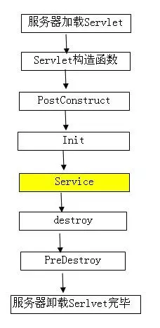


**spring中Constructor、@Autowired、@PostConstruct的顺序(Constructor >> @Autowired >> @PostConstruct)**

其实从依赖注入的字面意思就可以知道，要将对象p注入到对象a，那么首先就必须得生成对象a和对象p，才能执行注入。所以，如果一个类A中有个成员变量p被@Autowried注解，那么@Autowired注入是发生在A的构造方法执行完之后的。

如果想在生成对象时完成某些初始化操作，而偏偏这些初始化操作又依赖于依赖注入，那么久无法在构造函数中实现。为此，可以使用@PostConstruct注解一个方法来完成初始化，@PostConstruct注解的方法将会在依赖注入完成后被自动调用。

```java
public class Test {
    @Autowired
    private BBB b;
    public Test() {
        System.out.println("此时b还未被注入: b = " + b);
    }
    @PostConstruct
    private void init() {
        System.out.println("@PostConstruct将在依赖注入完成后被自动调用: b = " + b);
    }
}

```


### @Value

@value不能直接注入值给静态属性，spring 不允许/不支持把值注入到静态变量

1.注入私有属性

```java
    @Value("${jms.event_type.payment_waring.destinations}")
    private  String paymentWarningDests;
```

2.注入static 属性的替代方法

```java
private static String paymentWarningDests;
@Value("${jms.event_type.payment_waring.destinations}")
private void setPaymentWarningDests(String paymentWarningDests) {//public private都可以,不能用static
    JMSProducer.paymentWarningDests = paymentWarningDests;
}
```

3.用于方法参数注入

```java
 @Bean
    public ConnectionFactory connectionFactory(@Value("${jms_server}") String brokerURL) {
        ActiveMQConnectionFactory connectionFactory = new ActiveMQConnectionFactory(brokerURL);
        return connectionFactory;
    }
```


### @Import

1.普通类 

@Import(Dog.class) 直接导入指定类，改类会被注入SpringIOC , 类上不需要加任何注解

```java
@SpringBootApplication(scanBasePackages={"retryTest","com"})
@Import(Dog.class)
public class DemoApplication {}

public class Dog {
}

```

2.configuration

```java
@SpringBootApplication(scanBasePackages={"retryTest","com"})
@Import(MyConfig.class)
public class DemoApplication {}

// @Configuration  加和不加都可以
public class MyConfig {
    @Bean
    public Dog dog(){
        return new Dog();
    }
}

```

3.ImportSelector

导入实现 ImportSelector 接口的自定义选择器

4.ImportBeanDefinitionRegistrar

导入实现ImportBeanDefinitionRegistrar口的自定义类


### @ImplementedBy 

@ImplementedBy(**DiscoveryClient.class**)
public interface EurekaClient extends LookupService {}

指定接口的实现类


### @Order @Primary @Qualifer

`@Order是`控制配置类的加载顺序，还能控制List<XXX> 里面放的XXX的实现注入的顺序

独使用@Order(1), @Order(2) Order注解仅仅用于控制组件的加载顺序，**不能控制注入优先级**

遇到接口多实现的问题，那么要具体注入那个接口的实现就需要@Primary或@Qualifier控制了

参考：https://blog.csdn.net/weixin_42465125/article/details/88574670


### @EnableConfigurationProperties

```java

1.
@ConfigurationProperties(prefix = "spring.mvc")
public class WebMvcProperties {
	private Locale locale;
    public Locale getLocale() {
		return this.locale;
	}
	public void setLocale(Locale locale) {
		this.locale = locale;
	}
}
在配置文件中加载prefix对应属性
spring.mvc.locale=xxxxx


2.导入importSelector，EnableConfigurationPropertiesImportSelector会调用 selectImports(AnnotationMetadata metadata) 方法，返回需要加载的bean的类名
@Import(EnableConfigurationPropertiesImportSelector.class)
public @interface EnableConfigurationProperties {
    Class<?>[] value() default {};
}

3.根据EnableConfigurationProperties的value是否有值，返回指定beanDefinitionRegister
class EnableConfigurationPropertiesImportSelector implements ImportSelector {
    
@Override
public String[] selectImports(AnnotationMetadata metadata) {
    //获取所有的EnableConfigurationProperties注解，MultiValueMap一个key对应一个list<V>
	MultiValueMap<String, Object> attributes = metadata.getAllAnnotationAttributes(
			EnableConfigurationProperties.class.getName(), false);
	//判断注解是否有值
    Object[] type = attributes == null ? null
			: (Object[]) attributes.getFirst("value");
	if (type == null || type.length == 0) {
		return new String[] {
				ConfigurationPropertiesBindingPostProcessorRegistrar.class
						.getName() };
	}
    //如果注解value有值，返回如下两个类名，加载这两个类
	return new String[] { ConfigurationPropertiesBeanRegistrar.class.getName(),
			ConfigurationPropertiesBindingPostProcessorRegistrar.class.getName() };
} 
}

4.实际的bean加载过程
public static class ConfigurationPropertiesBeanRegistrar
	implements ImportBeanDefinitionRegistrar {

	@Override
	public void registerBeanDefinitions(AnnotationMetadata metadata,
			BeanDefinitionRegistry registry) {
        //获取EnableConfigurationProperties注解
		MultiValueMap<String, Object> attributes = metadata
				.getAllAnnotationAttributes(
						EnableConfigurationProperties.class.getName(), false);
		//获取多个EnableConfigurationProperties注解中的value值，统一放到一个list<Class<?>>
        List<Class<?>> types = collectClasses(attributes.get("value"));
		//遍历types，加载types中的类
        for (Class<?> type : types) {
			String prefix = extractPrefix(type);
			String name = (StringUtils.hasText(prefix) ? prefix + "-" + type.getName()
					: type.getName());
			if (!registry.containsBeanDefinition(name)) {
				registerBeanDefinition(registry, type, name);
			}
		}
	}

	private String extractPrefix(Class<?> type) {
        //根据指定类上的注解ConfigurationProperties
        //WebMvcProperties---》@ConfigurationProperties(prefix = "spring.mvc")
		ConfigurationProperties annotation = AnnotationUtils.findAnnotation(type,
				ConfigurationProperties.class);
		if (annotation != null) {
			return annotation.prefix();
		}
		return "";
	}

	private List<Class<?>> collectClasses(List<Object> list) {
		ArrayList<Class<?>> result = new ArrayList<Class<?>>();
		for (Object object : list) {
			for (Object value : (Object[]) object) {
				if (value instanceof Class && value != void.class) {
					result.add((Class<?>) value);
				}
			}
		}
		return result;
	}

	private void registerBeanDefinition(BeanDefinitionRegistry registry,
			Class<?> type, String name) {
        //构建beanDefinition
		BeanDefinitionBuilder builder = BeanDefinitionBuilder
				.genericBeanDefinition(type);
		AbstractBeanDefinition beanDefinition = builder.getBeanDefinition();
		registry.registerBeanDefinition(name, beanDefinition);

        //找到指定类type上的注解@ConfigurationProperties
		ConfigurationProperties properties = AnnotationUtils.findAnnotation(type,
				ConfigurationProperties.class);
		Assert.notNull(properties,
				"No " + ConfigurationProperties.class.getSimpleName()
						+ " annotation found on  '" + type.getName() + "'.");
	}

}    

综上，@EnableConfigurationProperties({ WebMvcProperties.class,ResourceProperties.class}) 就是通过beanDefinitionRegister加载是value={WebMvcProperties.class,ResourceProperties.class}中的指定类


@Configuration
@Import(EnableWebMvcConfiguration.class)
@EnableConfigurationProperties({ WebMvcProperties.class, ResourceProperties.class })
public static class WebMvcAutoConfigurationAdapter extends WebMvcConfigurerAdapter {
    private final WebMvcProperties mvcProperties;
    
    public WebMvcAutoConfigurationAdapter(ResourceProperties resourceProperties,
				WebMvcProperties mvcProperties, ListableBeanFactory beanFactory,
				@Lazy HttpMessageConverters messageConverters,
				ObjectProvider<ResourceHandlerRegistrationCustomizer> resourceHandlerRegistrationCustomizerProvider) {
			this.resourceProperties = resourceProperties;
        //通过参数注入
			this.mvcProperties = mvcProperties;
			this.beanFactory = beanFactory;
			this.messageConverters = messageConverters;
			this.resourceHandlerRegistrationCustomizer = resourceHandlerRegistrationCustomizerProvider
					.getIfAvailable();
		}
}
```


### @WebFilter


|     **属性**      |     **类型**     | **是否必需** |                           **说明**                           |
| :---------------: | :--------------: | :----------: | :----------------------------------------------------------: |
|  asyncSupported   |     boolean      |      否      |                  指定Filter是否支持异步模式                  |
|  dispatcherTypes  | DispatcherType[] |      否      | 指定Filter对哪种方式的请求进行过滤。 支持的属性：ASYNC、ERROR、FORWARD、INCLUDE、REQUEST； 默认过滤所有方式的请求 |
|    filterName     |      String      |      否      |                          Filter名称                          |
|    initParams     |  WebInitParam[]  |      否      |                           配置参数                           |
|    displayName    |      String      |      否      |                         Filter显示名                         |
|   servletNames    |     String[]     |      否      |                  指定对哪些Servlet进行过滤                   |
| urlPatterns/value |     String[]     |      否      |               两个属性作用相同，指定拦截的路径               |


**过滤器的urlPatterns的过滤路径规则：**

1.全路径匹配： /abc/myServlet1.do

2.部分路径匹配： /abc/*

3.通配符匹配 ：/*

4.后缀名匹配 ：*.do (注意:前面不加/)


注入方式：


1. **Application启动类添加@ServletComponentScan注解**

```JAVA
@SpringBootApplication
@ServletComponentScan   //Servlet、Filter、Listener 可以直接通过 @WebServlet、@WebFilter、@WebListener 注解自动注册，无需其他代码。
public class Application {
	public static void main(String[] args) {
		SpringApplication.run(Application.class, args);
	}
}
```


2.  bean配置注入

```java
/**
 * web层配置
 */
@Configuration
public class WebConfiguration {
    
    @Bean
    public FilterRegistrationBean companyUrlFilterRegister() {
        FilterRegistrationBean registration = new FilterRegistrationBean();
        //注入过滤器
        registration.setFilter(new SessionFilter());
        //拦截规则
        registration.addUrlPatterns("/*");
        //过滤器名称
        registration.setName("sessionFilter");
        //过滤器顺序
        registration.setOrder(FilterRegistrationBean.LOWEST_PRECEDENCE);
        return registration;
    } 
}

@WebFilter(filterName = "sessionFilter", urlPatterns = "/*")
public class SessionFilter implements Filter{
    
    private static final Logger LOGGER = LoggerFactory.getLogger(SessionFilter.class);

    private static final PathMatcher pathMatcher = new AntPathMatcher();

    private static final Set<String> ignores;

    static {
        ignores = new HashSet<>();
        ignores.add("/**/page/**");
        ignores.add("/**/static/**");
    }


    @Override
    public void init(FilterConfig filterConfig) throws ServletException {

    }

    @Override
    public void doFilter(ServletRequest servletRequest, ServletResponse servletResponse, FilterChain chain)
            throws IOException, ServletException {

        HttpServletRequest request = (HttpServletRequest) servletRequest;
        HttpServletResponse response = (HttpServletResponse) servletResponse;
        String uri = request.getRequestURI().toLowerCase();
        if (isIgnore(uri)) {
            chain.doFilter(request, response);
            return;
        }
        
        PermUser session = (PermUser) ServletUtil.getSession(request, response, Constant.SESSION_BACK_USER);
        
        // TODO 到时候要删掉
        session = new PermUser();
        session.setUserId(111L);
        session.setUserName("XB");
        ProcessException.check(isLogin(session), CodeMsgEnum.PERMISSION_ERROR);
        
        SessionThreadLocal.set(session);
        chain.doFilter(request, response);
        SessionThreadLocal.remove();
        
    }
    
    private boolean isLogin(PermUser user) {
        return user != null && user.getUserId() != null;
    }

    
    private boolean isIgnore(String path) {
        for (String resource : ignores) {
            if (pathMatcher.match(resource, path)) {
                return true;
            }
        }
        return false;
    }

    @Override
    public void destroy() {
        
    }

}

```


例子

实现一个Filter进行鉴权及页面重定向（未登录认证状态下跳转到登录页面）

```JAVA
@WebFilter(filterName = "WebAuthFilter", urlPatterns = "/web/*",
        initParams = {
            @WebInitParam(name = "excludedUrls", value = "/web/login")
        }
)
public class WebAuthFilter implements Filter {

    private List<String> excludedUrlList;

    @Override
    public void init(FilterConfig filterConfig) throws ServletException {
        String excludedUrls = filterConfig.getInitParameter("excludeUrls");
        excludedUrlList= Splitter.on(",").omitEmptyStrings().splitToList(excludedUrls);
    }

    @Override
    public void doFilter(ServletRequest request, ServletResponse response, FilterChain chain) throws IOException, ServletException {
        String url = ((HttpServletRequest) request).getRequestURI();
        if (excludedUrlList.contains(url)) {
            chain.doFilter(request, response);
        } else {
            String sToken = ((HttpServletRequest) request).getHeader("Authorization");
            if (sToken != null) {
                Map<String, Object> map = TokenUtils.parseToken(sToken);
                if (map == null) {
                    ((HttpServletResponse)response).sendRedirect("/web/login");
                }
            } else {
                ((HttpServletResponse)response).sendRedirect("/web/login");
            }
        }
    }

    @Override
    public void destroy() {

    }
}
```


### @dubbo过滤器

```java
import com.alibaba.dubbo.rpc.Filter;
@Activate(group = Constants.CONSUMER, order = -999)
public class ConsumerFiltter implements Filter,  Constant {
    
    private static final Logger logger = LoggerFactory.getLogger(ConsumerFiltter.class);

    private static String MONITORSERVICE = "MonitorService";

    @Override
    public Result invoke(Invoker<?> invoker, Invocation invocation) throws RpcException {

        String interfacName = invocation.getInvoker().getInterface().getName();
        String methodName = invocation.getMethodName() ;
       
        // 监控日志直接放过
        if (interfacName.indexOf(MONITORSERVICE) > -1) {
            return invoker.invoke(invocation);
        }

        try {

            Object[] arguments = invocation.getArguments();
            logger.info(LOG_RPC_CON_REQ, interfacName, methodName,  LogFormat.toString(arguments));
            Result result = invoker.invoke(invocation);
            logger.info(LOG_RPC_CON_RESP,  interfacName, methodName, LogFormat.toString(result.getValue()));
            
            return result;
        }  catch (Throwable t) {
            logger.error(LOG_RPC_CON_EXCEPTION, interfacName, methodName, t.getMessage(), t);
            return new RpcResult(new BaseResp<>(false, CodeMsgEnum.SERVICE_EXCEPTION.msg(), CodeMsgEnum.SERVICE_EXCEPTION.code()));
        }
    }
}


@Activate(group =Constants.PROVIDER, order = 1)
public class ProviderFiltter implements Filter,  Constant {
    
    private static final Logger logger = LoggerFactory.getLogger(ProviderFiltter.class);

    private static String MONITORSERVICE = "MonitorService";

    @Override
    public Result invoke(Invoker<?> invoker, Invocation invocation) throws RpcException {

        String interfacName = invocation.getInvoker().getInterface().getName();
        String methodName = invocation.getMethodName() ;
       
        // 监控日志直接放过
        if (interfacName.indexOf(MONITORSERVICE) > -1) {
            return invoker.invoke(invocation);
        }

        Object[] arguments = invocation.getArguments();
        logger.info(LOG_RPC_PRO_REQ, interfacName, methodName,  LogFormat.toString(arguments));
        Result result = invoker.invoke(invocation);
        
        if (result.getException() == null) {
            
            logger.info(LOG_RPC_PRO_RESP,  interfacName, methodName, LogFormat.toString(result.getValue()));
            return result;
        } else if (result.getException() instanceof ProcessException)  {
            
            ProcessException e = (ProcessException) result.getException();
            logger.error(LOG_RPC_PRO_EXCEPTION , interfacName, methodName, e.getMessage());
            return new RpcResult(new BaseResp<>(false, e.getMessage(), e.getCode()));
        } else {
            
            logger.error(LOG_RPC_PRO_EXCEPTION ,interfacName, methodName, result.getException().getMessage(), result.getException());
            return new RpcResult(new BaseResp<>(false, CodeMsgEnum.SERVICE_EXCEPTION.msg(), CodeMsgEnum.SERVICE_EXCEPTION.code()));
        }
    }

}
```


在resources/META-INFO/dubbo/ 创建com.alibaba.dubbo.rpc.Filter文件，内容如下

```
consumerFiltter=com.lvmama.fintech.funds.process.biz.common.ConsumerFiltter
providerFiltter=com.lvmama.fintech.funds.process.biz.common.ProviderFiltter
```


# 😈 lambda

```java
package com.test.lambda;

import com.google.common.collect.Maps;

import java.util.*;
import java.util.stream.Collectors;

public class EmployeeTest {
    public static List<Employee> generateData() {
        return Arrays.asList(new Employee("Matt", 5000, "New York"),
                new Employee("Steve", 6000, "London"),
                new Employee("Carrie", 10000, "New York"),
                new Employee("Peter", 7000, "New York"),
                new Employee("Alec", 60000, "London"),
                new Employee("Sarah", 8000, "London"),
                new Employee("Rebecca", 4000, "New York"),
                new Employee("Pat", 20000, "New York"),
                new Employee("Tammy", 9000, "New York"),
                new Employee("Fred", 15000, "Tokyo"));
    }

    public static Map<String, Integer> generateMapData() {
        Map<String, Integer> items = Maps.newHashMap();
        items.put("A", 10);
        items.put("B", 20);
        items.put("C", 30);
        items.put("D", 40);
        items.put("E", 50);
        items.put("F", 60);

        return items;
    }

    public static void main(String[] args) {
        EmployeeTest employeeTest = new EmployeeTest();
        employeeTest.testEmployee();
        employeeTest.testEmployeeExample();

    }


    public void testEmployee() {
        List<Employee> results = generateData();

        //打印出名字是Steve的员工信息
        results.forEach(c -> {
            if (c.getName().equals("Steve")) {
                System.out.println(c);
            }
        });

        System.out.println("---------");

        //找出年薪超过60000的员工
        results.stream().filter(c -> c.getSalary() >= 60000).forEach(c -> System.out.println(c));

        System.out.println("--->>>>>>----");

        //java8遍历map
        Map<String, Integer> map_ = generateMapData();
        map_.forEach((key, value) -> System.out.println("key:" + key + "," + "value:" + value));

        System.out.println("---->>>>分组>>>-----");

        //java8 分组操作
        Map<String, List<Employee>> groupMap = results.stream().collect(Collectors.groupingBy(c -> c.getOffice()));
        System.out.println(groupMap);

        System.out.println("---->>>>List转化为Map>>>----");
        //List转化Map
        Map<String, Object> map = results.stream().collect(Collectors.toMap(Employee::getName, Employee::getOffice));
        map.forEach((key, value) -> System.out.println("key:" + key + "," + "value:" + value));

        System.out.println("---->>>>>>> key 不能重复----");
        Map<Integer, Employee> employeeMap = results.stream().collect(Collectors.toMap((key -> key.getSalary()), (value -> value)));
        employeeMap.forEach((key, value) -> System.out.println(key + "," + value));

        System.out.println("---->>遍历map>>>----");
        //打印出值大于30的map
        Map<String, Integer> resultMap = map_.entrySet().stream().filter(c -> c.getValue() > 30).collect(Collectors.toMap(p -> p.getKey(), p -> p.getValue()));
        resultMap.forEach((key, value) -> System.out.println(key + "=" + value));

        System.out.println(">>>>>>>>>>>>>>>");
        //打印key=D的map
        Map<String, Integer> mapResults = map_.entrySet().stream().filter(c -> c.getKey().equals("D")).collect(Collectors.toMap(p -> p.getKey(), p -> p.getValue()));
        mapResults.forEach((key, value) -> System.out.println(key + ">>>>" + value));

        System.out.println(">>>>>>>Optional>>>>>>>");
        Optional<String> optional = Optional.of("hello");
        System.out.println(optional.isPresent());

    }


    public void testEmployeeExample() {
        //anyMatch
        List<Employee> employeeList = generateData();
        boolean isMatch = employeeList.stream().anyMatch(employee -> employee.getOffice().equals("London"));
        System.out.println(isMatch);

        //allMatch
        boolean matched = employeeList.stream().allMatch(employee -> employee.getOffice().equals("London"));
        System.out.println(matched);

        //找出工资最高的
        Optional<Employee> employeeOptional = employeeList.stream().max((e1,e2)->Integer.compare(e1.getSalary(),e2.getSalary()));
        System.out.println(employeeOptional);

        //找出工资最少的
        Optional<Employee> employee = employeeList.stream().min((e1,e2)->Integer.compare(e1.getSalary(),e2.getSalary()));
        System.out.println(employee);

        //返回姓名列表
        List<String> names = employeeList.stream().map(c->c.getName()).collect(Collectors.toList());
        System.out.println(names);

        System.out.println(">>>>>>>>>>>");
        //List转化Map
        Map<String,Employee> employeeMap = employeeList.stream().collect(Collectors.toMap((key->key.getName()),(value->value)));
        employeeMap.forEach((key,value)-> System.out.println(key + "=" + value));

        //统计办公室是New York的个数
        long officeCount =  employeeList.stream().filter(c->c.getOffice().equals("New York")).count();
        System.out.println(officeCount);

        long salaryCount = employeeList.stream().filter(c->c.getSalary()>60000).count();
        System.out.println(salaryCount);

        //List转化为Set
        Set<String> officeSet = employeeList.stream().map(c->c.getOffice()).distinct().collect(Collectors.toSet());
        System.out.println(officeSet);

        Set<Integer> salarySet = employeeList.stream().map(c->c.getSalary()).distinct().collect(Collectors.toSet());
        System.out.println(salarySet);

        //查找办公室地点是New York的员工
        Optional<Employee> optionals = employeeList.stream().filter(c->c.getOffice().equals("New York")).findAny();
        System.out.println(optionals);

        System.out.println(">>>>>工资降序排序>>>>>");
        //按照工资的降序来列出员工信息
        List<Employee> sortSalaryEmployeeList = employeeList.stream().sorted((e1,e2)->Integer.compare(e2.getSalary(),e1.getSalary())).collect(Collectors.toList());
        System.out.println(sortSalaryEmployeeList);

        System.out.println(">>>>>姓名升序排序>>>>>");
        List<Employee> sortNameEmployeeList = employeeList.stream().sorted((e1,e2)->e1.getName().compareTo(e2.getName())).collect(Collectors.toList());
        System.out.println(sortNameEmployeeList);

        System.out.println(">>>>获取工资最高的前2条员工信息");
        List<Employee> dispaly2EmployeeList = employeeList.stream().sorted((e1,e2)->Integer.compare(e2.getSalary(),e1.getSalary())).limit(2).collect(Collectors.toList());
        System.out.println(dispaly2EmployeeList);

        System.out.println(">>>>获取平均工资");
        OptionalDouble averageSalary = employeeList.stream().mapToInt(c->c.getSalary()).average();
        System.out.println(averageSalary);

        System.out.println(">>>>获取工作地点的平均工资");
        OptionalDouble optionalDouble = employeeList.stream().filter(c->c.getOffice().equals("New York")).mapToInt(c->c.getSalary()).average();
        System.out.println(optionalDouble);

        System.out.println(">>>>>>Java8 Optional用法>>>>>>");
        Optional<String> stringOptional = Optional.of("test");
        System.out.println(stringOptional.get());

        Optional<String> isOptional = Optional.ofNullable("hello");
        System.out.println(isOptional.isPresent());
        System.out.println(isOptional.get());
        System.out.println(isOptional.orElse("0"));

        System.out.println(">>>>>>>>>>>>");
        //Optional<String> optionalVal = Optional.of(null);
        // System.out.println(optionalVal);
        Optional<String> optional = Optional.ofNullable("optional");
        System.out.println(optional);
        System.out.println(optional.isPresent());
        System.out.println(optional.get());
        System.out.println(optional.orElse("haha"));
        System.out.println(">>>>>>>>>>>>");

        Optional<Employee> employeeOptional_ = employeeList.stream().filter(c->c.getOffice().equals("New York")).findFirst();
        System.out.println(employeeOptional_);

    }


}

```


# 😈函数式接口 


  函数式接口的定义

在java8中，满足下面任意一个条件的接口都是函数式接口：

1、被@FunctionalInterface注释的接口，满足@FunctionalInterface注释的约束。

2、没有被@FunctionalInterface注释的接口，但是满足@FunctionalInterface注释的约束

<br/>
@FunctionalInterface注释的约束：

1、接口**有且只能有一个**抽象方法，只有方法定义，没有方法体

2、在接口中覆写Object类中的public方法，不算是函数式接口的方法。


所谓的函数式接口，当然首先是一个接口，然后就是在这个接口里面只能有一个抽象方法。
这种类型的接口也称为SAM接口，即Single Abstract Method interfaces

**特点**
1. 接口有且仅有一个抽象方法
2. 允许定义静态方法
3. 允许定义默认方法
4. 允许java.lang.Object中的public方法
5. 该注解不是必须的，如果一个接口符合"函数式接口"定义，那么加不加该注解都没有影响。加上该注解能够更好地让编译器进行检查。如果编写的不是函数式接口，但是加上了@FunctionInterface，那么编译器会报错

<br/>
**java8中常用的函数式接口：**

常用的函数式接口主要有四种类型，是通过其输入和输出的参数来进行区分的。定义了编码过程中主要的使用场景。


| 接口名              | 说明                                                  |
| ------------------- | ----------------------------------------------------- |
| Function<T,R>       | 接收一个T类型的参数，返回一个R类型的结果              |
| Function< T >       | 接收一个T类型的参数，不返回值                         |
| Predicate< T>       | 接收一个T类型的参数，返回一个boolean类型的结果        |
| Supplier< T>        | 不接受参数，返回一个T类型的结果                       |
| BiFunction<T, U, R> | 接收T类型和U类型的两个参数，返回一个R类型的结果       |
| BiConsumer<T , U>   | 接收T类型和U类型的两个参数，不返回值                  |
| BiPredicate<T, U>   | 接收T类型和U类型的两个参数，返回一个boolean类型的结果 |


### 1.Function接口的andThen方法和compose方法

```java

default <V> Function<V, R> compose(Function<? super V, ? extends T> before) {
        Objects.requireNonNull(before);
        return (V v) -> apply(before.apply(v));
}
 
default <V> Function<T, V> andThen(Function<? super R, ? extends V> after) {
        Objects.requireNonNull(after);
        return (T t) -> after.apply(apply(t));


```

 说明:

 - Compose方法：方法接收一个Function类型的参数，返回一个值。这也是一个标准的Function类型的定义。在compose方法内部也有一个apply方法。在执行compose方法中的apply方法之前，它先执行了before接口的apply方法，也是compose方法的输入参数。然后将before方法执行的返回值作为compose中apply方法的输入参数。实际上是形成了一种链式组合。

 - andThen方法：该方法与compose方法很类似。不同之处在于，andThen是先执行自身的apply方法，将apply的返回值作为after接口的输入值。相对于compose方法，只是方向的不同


### 2、Consumer接口的andThen方法

```java

default Consumer<T> andThen(Consumer<? super T> after) {
        Objects.requireNonNull(after);
        return (T t) -> { accept(t); after.accept(t); };
}
```

说明：

 1. 将输入参数分别赋给andThen内部的accept方法和after内部的accept方法。After的计算在andThen之后，起到了后置连接的作用。在这里没有compose方法，因为后置连接反过来就是前置连接，所以不需要一个多余的compose方法了。只需要在传递时，交换两个consumer的顺序即可。


### 3、 predicate接口的and、or、negate方法

```java

default Predicate<T> and(Predicate<? super T> other) {
        Objects.requireNonNull(other);
        return (t) -> test(t) && other.test(t);
}
 
default Predicate<T> negate() {
        return (t) -> !test(t);
}
 
default Predicate<T> or(Predicate<? super T> other) {
        Objects.requireNonNull(other);
        return (t) -> test(t) || other.test(t);
}
```

说明：
 - 源码已经很清晰了，就不一一说明了。分别是&&, || 和取反操作。


    此外，java8针对原生类型int，long，double都提供了相应的函数式接口。如：DoubleConsumer， DoubleFunction，IntConsumer等等，使用方式都相同，见java.util.function包。


### 4.示例

```java
public class Wrapper<T> {
    public T t;

    public T getT() {
        return t;
    }

    public void setT(T t) {
        this.t = t;
    }
}


============
public class FunctionInterfaceTest {

    @FunctionalInterface
    public interface Service<T>{
        Wrapper<T> doInvoke();
    }

    @FunctionalInterface
    public interface WrapService<T>{
        Wrapper<T> wrap(T t);
    }

    public static <T> T invoke(Service<T> service){
        T result = null;
        try {
            result = service.doInvoke().getT();
        } catch (Exception e) {
            e.printStackTrace();
        }
        System.out.println("result="+result);
        return  result;
    }


    public static <T> Wrapper<T> wrap(WrapService<T>  service,T t){
        Wrapper<T> wrapper = null;
        try {
            wrapper  = service.wrap(t);
        } catch (Exception e) {
            e.printStackTrace();
        }
        System.out.println("=== wrap t, return "+ wrapper+" , "+wrapper.getT());
        return wrapper;
    }


    public static void main(String[] args) {
        // 匿名实现了interface Service接口，()->{}即调用了doInvoke
        FunctionInterfaceTest.invoke(()->{
            Wrapper<String> wrapper = new Wrapper<>();
            wrapper.setT("success");
            return wrapper;
        });

        String s = "hello";
        FunctionInterfaceTest.wrap((String param)->{
            Wrapper<String> wrapper = new Wrapper<>();
            wrapper.setT(s);
            return wrapper;
        },s);

        // 
        FunctionInterfaceTest.wrap((String param)->{
            Wrapper<String> wrapper = new Wrapper<>();
            wrapper.setT(param);
            return wrapper;
        },"hi");

         Wrapper<String> wrap = FunctionInterfaceTest.wrap((String param) -> {
            Wrapper<String> wrapper = new Wrapper<>();
            wrapper.setT(param);
            return wrapper;
        }, "hi");

        System.out.println("=== got wrapper "+ wrap+" "+wrap.getT());
    }
}	

result=success
=== wrap t, return com.test.functionalInterface.pack.Wrapper@7a4f0f29 , hello
=== wrap t, return com.test.functionalInterface.pack.Wrapper@2077d4de , hi

=== wrap t, return com.test.functionalInterface.pack.Wrapper@77a567e1 , hi
=== got wrapper com.test.functionalInterface.pack.Wrapper@77a567e1 hi


```


# 😈 Orika

常用自定义解析

map转对象

```java

import ma.glasnost.orika.CustomMapper;
import ma.glasnost.orika.MappingContext;
import org.slf4j.Logger;
import org.slf4j.LoggerFactory;
import org.springframework.beans.BeanUtils;
import org.springframework.stereotype.Component;
import java.lang.reflect.Method;
import java.util.Map;
@Component
public class Map2Object extends CustomMapper<Map, Object> {
    private static Logger logger = LoggerFactory.getLogger(TradeReqDTO2TradReq.class);
    @Override
    public void mapAtoB(Map map, Object o, MappingContext context) {
        long start = System.currentTimeMillis();
        Class<?> clazz = o.getClass();

        map.keySet().stream().forEach( key ->{
            //匹配 方法名相同，参数最少的方法
            Method method = BeanUtils.findMethodWithMinimalParameters(clazz, getSetMethodName((String) key));
            if(method!=null){
                try {
                    method.invoke(o,map.get(key));
                } catch (Exception e) {
                    logger.warn("objectId={},paymentTradeNo={},key={}反射fail ", map.get("objectId"),map.get("paymentTradeNo"),key);
                }
            }
        });

/*
        map.keySet().stream().forEach( key -> {
            String methodName = "";
//            Method[] methods = clazz.getMethods();
            try {
//               for(Method method: methods){
//                    String name = method.getName();
//                    if(Modifier.PUBLIC == method.getModifiers()
//                            && method.getParameterCount() == 1
//                            && isSetMethod(name,String.valueOf(key))){
//                        method.invoke(o,map.get(key));
//                    }
//                }

                methodName = getSetMethodName((String)key);
                Method method = clazz.getMethod(methodName,map.get(key).getClass());
                method.invoke(o,map.get(key));
            } catch (Exception e) {
                Class<?> wrappClass = ClassUtil.primitiveWrapperTypeMap.getOrDefault(map.get(key).getClass(), null) ;
                Class<?> wrapperClass = ClassUtil.primitiveTypeToWrapperMap.getOrDefault(map.get(key).getClass(), null);
                Class<?> paraClass = Objects.isNull(wrappClass) ? ( Objects.isNull(wrapperClass)? null: wrapperClass  ) : wrappClass;
                if(!Objects.isNull(paraClass)){
                    try {
                        Method method = clazz.getMethod(methodName,paraClass);
                        method.invoke(o,map.get(key));
                    } catch (Exception e1) {

                    }
                }
            }
        });*/
        long end = System.currentTimeMillis();
        logger.warn("start={},end={},delay={}",start,end,(end - start));

    }

    private static String getSetMethodName(String key){
        if(key.startsWith("is")){
            // isSuccess -->  setSuccess
            return "set".concat(key.substring(2,3).toUpperCase()).concat(key.substring(3));
        }
        return "set".concat(key.substring(0,1).toUpperCase()).concat(key.substring(1));
    }


}
```


# 😈 规则引擎

1. 引入相关依赖

   ```xml
   <!-- 规则引擎-->
   <dependency>
     <groupId>org.jeasy</groupId>
     <artifactId>easy-rules-core</artifactId>
     <version>3.2.0</version>
   </dependency>
   <!--  支付 UnitRuleGroup-->
   <dependency>
     <groupId>org.jeasy</groupId>
     <artifactId>easy-rules-support</artifactId>
     <version>3.2.0</version>
   </dependency>
   <!-- 支付读取yml配置的规则-->
   <dependency>
     <groupId>org.jeasy</groupId>
     <artifactId>easy-rules-mvel</artifactId>
     <version>3.2.0</version>
   </dependency>	
   ```

   

2.  通过java注解设置规则

   ```java
   
   import org.jeasy.rules.annotation.Action;
   import org.jeasy.rules.annotation.Condition;
   import org.jeasy.rules.annotation.Fact;
   import org.jeasy.rules.annotation.Rule;
   import org.jeasy.rules.support.UnitRuleGroup;
   
   public class RuleClass {
       @Rule(priority = 1)
       public static class FizzRule{
           @Condition
           public boolean fitFizz(@Fact("number")Integer number){
               return number % 5 == 0;
           }
           @Action
           public void printFizz() {
               System.out.print("fizz");
           }
       }
       @Rule(priority = 2)
       public static class BuzzRule {
           @Condition
           public boolean isBuzz(@Fact("number") Integer number) {
               return number % 7 == 0;
           }
           @Action
           public void printBuzz() {
               System.out.print("buzz");
           }
       }
       @Rule(priority = 1)
       public static class Bug{
           @Condition
           public boolean isBug(){
               return true;
           }
           @Action
           public void doAction(){
               System.out.println("=====**** bug **====");
           }
       }
       // 组合规则
       public static class FizzBuzzRule extends UnitRuleGroup {
           public FizzBuzzRule(Object... rules) {
               for (Object rule : rules) {
                   addRule(rule);
               }
           }
           @Override
           public int getPriority() {
               return 0;
           }
       }
   
       @Rule(priority = 3)
       public static class NonFizzBuzzRule {
   
           @Condition
           public boolean isNotFizzNorBuzz(@Fact("number") Integer number) {
               // can return true, because this is the latest rule to trigger according to
               // assigned priorities
               // and in which case, the number is not fizz nor buzz
               return number % 5 != 0 || number % 7 != 0;
           }
           @Action
           public void printInput(@Fact("number") Integer number) {
               System.out.print(number);
           }
       }
   
   }
   
   ```

   

3. 使用规则

   ```java
   import org.jeasy.rules.api.Facts;
   import org.jeasy.rules.api.Rules;
   import org.jeasy.rules.core.DefaultRulesEngine;
   import org.jeasy.rules.core.RulesEngineParameters;
   import org.jeasy.rules.mvel.MVELRuleFactory;
   
   import java.io.FileReader;
   import java.io.InputStream;
   import java.io.InputStreamReader;
   
   public class RuleClient {
       public static void main(String[] args) throws Exception{
           /**
            * RulesEngine rulesEngine = new DefaultRulesEngine();
            * 未设置任何属性，从priority由高到底（值越小优先级越高），符合规则就执行（可能匹配到多条规则）
            *
            *  skipOnFirstAppliedRule
            *  从priority由高到底（值越小优先级越高）执行匹配到的第一条规则，后面的规则不执行
            *
            *  skipOnFirstNonTriggeredRule
            *  从priority由高到底（值越小优先级越高）执行匹配。如果满足当前的规则，则执行相应的操作，
            *  直到遇到不满足条件的规则为止，并且也不会对其他规则进行判断了
            *
            *  rulePriorityThreshold (1)
            *  在创建规则引擎时，我们将其属性 rulePriorityThreshold 的值设置为了 1，这样的设置后的效果相当于在定义的所有规则中将 priority > 1 的规则去掉，
            *  换种说法就是只考虑 priority 的值小于等于 1 的规则。
            *
            *  RulesEngineParameters parameters = new RulesEngineParameters()
            *                 .priorityThreshold(10)
            *                 .skipOnFirstAppliedRule(true)
            *                 .skipOnFirstFailedRule(true)
            *                 .skipOnFirstNonTriggeredRule(true);
            */
   
   
   
           RulesEngineParameters rulesEngineParameters = new RulesEngineParameters()
                   .priorityThreshold(1);
   //                .skipOnFirstAppliedRule(true);
           DefaultRulesEngine rulesEngine = new DefaultRulesEngine(rulesEngineParameters);
   
   
           // 方式一：
           Rules rules = new Rules();
           rules.register(new RuleClass.FizzRule());
           rules.register(new RuleClass.BuzzRule());
           rules.register(new RuleClass.FizzBuzzRule(new RuleClass.FizzRule(), new RuleClass.BuzzRule()));
           rules.register(new RuleClass.NonFizzBuzzRule());
           rules.register(new RuleClass.Bug());
   
           // 方式二：通过读取yml文件中配置的规则  /xx文件 会到target/classes下去找
   //        InputStream inputStream = Thread.currentThread().getClass().getResourceAsStream("/rules.yml");
   //        InputStreamReader streamReader = new InputStreamReader(inputStream);
   //        Rules rules = MVELRuleFactory.createRulesFrom(streamReader);
   
   //        Rules rules = MVELRuleFactory.createRulesFrom(new FileReader("/rules.yml"));
   
   
           Facts facts = new Facts();
           for (int i = 10; i <= 20; i++) {
               System.out.println("num="+i);
               facts.put("number", i);
               rulesEngine.fire(rules, facts);
               System.out.println("");
           }
       }
   }
   
   ```

   

4. 如果使用yml配置规则

   放在src/resources/rules.yml   通过MVELRuleFactory.createRulesFrom方法从reader对象中读取配置规则

   ```yaml
   ---
   name: "fizz rule"
   description: "print fizz if the number is multiple of 5"
   priority: 1
   condition: "number % 5 == 0"
   actions:
     - "System.out.println(\"fizz\")"
   
   ---
   name: "buzz rule"
   description: "print buzz if the number is multiple of 7"
   priority: 2
   condition: "number % 7 == 0"
   actions:
     - "System.out.println(\"buzz\")"
   
   ---
   name: "fizzbuzz rule"
   description: "print fizzbuzz if the number is multiple of 5 and 7"
   priority: 0
   condition: "number % 5 == 0 && number % 7 == 0"
   actions:
     - "System.out.println(\"fizzbuzz\")"
   
   ---
   name: "non fizzbuzz rule"
   description: "print the number itself otherwise"
   priority: 3
   condition: "number % 5 != 0 || number % 7 != 0"
   actions:
     - "System.out.println(number)"
   ```

   


# 😈 Java Lombok 

常用的 lombok 注解
@EqualsAndHashCode：实现equals()方法和hashCode()方法 @ToString：实现toString()方法 
@Data ：注解在类上；提供类所有属性的 getting 和 setting 方法，此外还提供了equals、canEqual、hashCode、toString 方法 
@Setter：注解在属性上；为属性提供 setting 方法 
@Getter：注解在属性上；为属性提供 getting 方法 
@Log4j ：注解在类上；为类提供一个 属性名为log 的 log4j 日志对象 
@NoArgsConstructor：注解在类上；为类提供一个无参的构造方法 
@AllArgsConstructor：注解在类上；为类提供一个全参的构造方法 
@Cleanup：关闭流 @Synchronized：对象同步 @SneakyThrows：抛出异常

```java
package com.test.lambda;

import lombok.AllArgsConstructor;
import lombok.Builder;
import lombok.Data;
import lombok.NoArgsConstructor;

@Data
@Builder
@AllArgsConstructor
@NoArgsConstructor
public class Person {

    private int id;
    private String name;
    private String address;

    public static void main(String[] args) {
        System.out.println(Person.builder().name("111"));
    }
}
```


# 😈 junit

@ContextConfiguration(locations = { "classpath:/applicationContext-pay-service-beans.xml" })
@Transactional
@TransactionConfiguration(transactionManager = "transactionManager", defaultRollback = true)
@RunWith(SpringJUnit4ClassRunner.class)

```java
@ContextConfiguration(locations = { "classpath:/applicationContext-pay-service-beans.xml" })
@Transactional
@TransactionConfiguration(transactionManager = "transactionManager", defaultRollback = true)
@RunWith(SpringJUnit4ClassRunner.class)
public class PayPaymentServiceTest {
    @Test 
	@Rollback(false)
	public void callBackPayPayment(){}
}
```


# 😈 网络

 

```
Socket socket = new Socket();
InetSocketAddress contextPath = new InetSocketAddress(ip, Integer.parseInt(port));
socket.connect(contextPath, 1000);
socket.getLocalAddress().getHostAddress();
```


# 😈 DUBBO


# 😈 MQ


##  Kafka、RabbitMQ、RocketMQ

高可用性问题   消息重复消费问题   消息消费可靠性问题（消息丢失问题） 如何保证消息的顺序性？

- 如何解决消息队列的延时以及过期失效问题？消息队列满了以后该怎么处理？有几百万消息持续积压几小时，说说怎么解决？


### 为什么使用消息队列

其实就是问问你消息队列都有哪些使用场景，然后你项目里具体是什么场景，说说你在这个场景里用消息队列是什么？

面试官问你这个问题，**期望的一个回答**是说，你们公司有个什么**业务场景**，这个业务场景有个什么技术挑战，如果不用 MQ 可能会很麻烦，但是你现在用了 MQ 之后带给了你很多的好处。

先说一下消息队列常见的使用场景吧，其实场景有很多，但是比较核心的有 3 个：**解耦**、**异步**、**削峰**。

#### 解耦

看这么个场景。A 系统发送数据到 BCD 三个系统，通过接口调用发送。如果 E 系统也要这个数据呢？那如果 C 系统现在不需要了呢？A 系统负责人几乎崩溃......

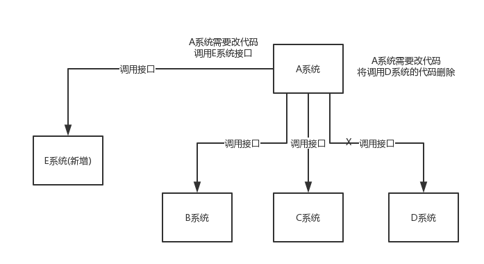


在这个场景中，A 系统跟其它各种乱七八糟的系统严重耦合，A 系统产生一条比较关键的数据，很多系统都需要 A 系统将这个数据发送过来。A 系统要时时刻刻考虑 BCDE 四个系统如果挂了该咋办？要不要重发，要不要把消息存起来？头发都白了啊！

如果使用 MQ，A 系统产生一条数据，发送到 MQ 里面去，哪个系统需要数据自己去 MQ 里面消费。如果新系统需要数据，直接从 MQ 里消费即可；如果某个系统不需要这条数据了，就取消对 MQ 消息的消费即可。这样下来，A 系统压根儿不需要去考虑要给谁发送数据，不需要维护这个代码，也不需要考虑人家是否调用成功、失败超时等情况。


**总结**：通过一个 MQ，Pub/Sub 发布订阅消息这么一个模型，A 系统就跟其它系统彻底解耦了。

**面试技巧**：你需要去考虑一下你负责的系统中是否有类似的场景，就是一个系统或者一个模块，调用了多个系统或者模块，互相之间的调用很复杂，维护起来很麻烦。但是其实这个调用是不需要直接同步调用接口的，如果用 MQ 给它异步化解耦，也是可以的，你就需要去考虑在你的项目里，是不是可以运用这个 MQ 去进行系统的解耦。在简历中体现出来这块东西，用 MQ 作解耦。

#### 异步

再来看一个场景，A 系统接收一个请求，需要在自己本地写库，还需要在 BCD 三个系统写库，自己本地写库要 3ms，BCD 三个系统分别写库要 300ms、450ms、200ms。最终请求总延时是 3 + 300 + 450 + 200 = 953ms，接近 1s，用户感觉搞个什么东西，慢死了慢死了。用户通过浏览器发起请求，等待个 1s，这几乎是不可接受的。


一般互联网类的企业，对于用户直接的操作，一般要求是每个请求都必须在 200 ms 以内完成，对用户几乎是无感知的。

如果**使用 MQ**，那么 A 系统连续发送 3 条消息到 MQ 队列中，假如耗时 5ms，A 系统从接受一个请求到返回响应给用户，总时长是 3 + 5 = 8ms，对于用户而言，其实感觉上就是点个按钮，8ms 以后就直接返回了，爽！网站做得真好，真快！


#### 削峰

每天 0:00 到 12:00，A 系统风平浪静，每秒并发请求数量就 50 个。结果每次一到 12:00 ~ 13:00 ，每秒并发请求数量突然会暴增到 5k+ 条。但是系统是直接基于 MySQL 的，大量的请求涌入 MySQL，每秒钟对 MySQL 执行约 5k 条 SQL。

一般的 MySQL，扛到每秒 2k 个请求就差不多了，如果每秒请求到 5k 的话，可能就直接把 MySQL 给打死了，导致系统崩溃，用户也就没法再使用系统了。

但是高峰期一过，到了下午的时候，就成了低峰期，可能也就 1w 的用户同时在网站上操作，每秒中的请求数量可能也就 50 个请求，对整个系统几乎没有任何的压力。

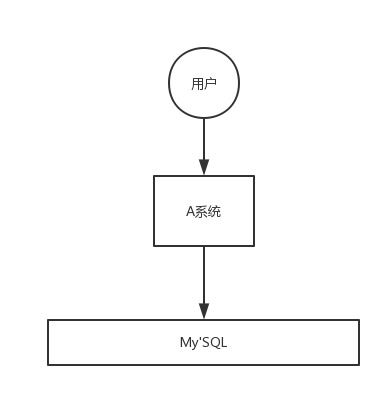


如果使用 MQ，每秒 5k 个请求写入 MQ，A 系统每秒钟最多处理 2k 个请求，因为 MySQL 每秒钟最多处理 2k 个。A 系统从 MQ 中慢慢拉取请求，每秒钟就拉取 2k 个请求，不要超过自己每秒能处理的最大请求数量就 ok，这样下来，哪怕是高峰期的时候，A 系统也绝对不会挂掉。而 MQ 每秒钟 5k 个请求进来，就 2k 个请求出去，结果就导致在中午高峰期（1 个小时），可能有几十万甚至几百万的请求积压在 MQ 中。


这个短暂的高峰期积压是 ok 的，因为高峰期过了之后，每秒钟就 50 个请求进 MQ，但是 A 系统依然会按照每秒 2k 个请求的速度在处理。所以说，只要高峰期一过，A 系统就会快速将积压的消息给解决掉。


### 消息队列有什么优缺点

优点上面已经说了，就是**在特殊场景下有其对应的好处**，**解耦**、**异步**、**削峰**。

缺点有以下几个：

- 系统可用性降低
  系统引入的外部依赖越多，越容易挂掉。本来你就是 A 系统调用 BCD 三个系统的接口就好了，人 ABCD 四个系统好好的，没啥问题，你偏加个 MQ 进来，万一 MQ 挂了咋整，MQ 一挂，整套系统崩溃的，你不就完了？如何保证消息队列的高可用，可以[点击这里查看](https://github.com/doocs/advanced-java/blob/master/docs/high-concurrency/how-to-ensure-high-availability-of-message-queues.md)。
- 系统复杂度提高
  硬生生加个 MQ 进来，你怎么[保证消息没有重复消费](https://github.com/doocs/advanced-java/blob/master/docs/high-concurrency/how-to-ensure-that-messages-are-not-repeatedly-consumed.md)？怎么[处理消息丢失的情况](https://github.com/doocs/advanced-java/blob/master/docs/high-concurrency/how-to-ensure-the-reliable-transmission-of-messages.md)？怎么保证消息传递的顺序性？头大头大，问题一大堆，痛苦不已。
- 一致性问题
  A 系统处理完了直接返回成功了，人都以为你这个请求就成功了；但是问题是，要是 BCD 三个系统那里，BD 两个系统写库成功了，结果 C 系统写库失败了，咋整？你这数据就不一致了。

所以消息队列实际是一种非常复杂的架构，你引入它有很多好处，但是也得针对它带来的坏处做各种额外的技术方案和架构来规避掉，做好之后，你会发现，妈呀，系统复杂度提升了一个数量级，也许是复杂了 10 倍。但是关键时刻，用，还是得用的。


### Kafka、ActiveMQ、RabbitMQ、RocketMQ 有什么优缺点？

| 特性                     | ActiveMQ                              | RabbitMQ                                           | RocketMQ                                                     | Kafka                                                        |
| ------------------------ | ------------------------------------- | -------------------------------------------------- | ------------------------------------------------------------ | ------------------------------------------------------------ |
| 单机吞吐量               | 万级，比 RocketMQ、Kafka 低一个数量级 | 同 ActiveMQ                                        | 10 万级，支撑高吞吐                                          | 10 万级，高吞吐，一般配合大数据类的系统来进行实时数据计算、日志采集等场景 |
| topic 数量对吞吐量的影响 |                                       |                                                    | topic 可以达到几百/几千的级别，吞吐量会有较小幅度的下降，这是 RocketMQ 的一大优势，在同等机器下，可以支撑大量的 topic | topic 从几十到几百个时候，吞吐量会大幅度下降，在同等机器下，Kafka 尽量保证 topic 数量不要过多，如果要支撑大规模的 topic，需要增加更多的机器资源 |
| 时效性                   | ms 级                                 | 微秒级，这是 RabbitMQ 的一大特点，延迟最低         | ms 级                                                        | 延迟在 ms 级以内                                             |
| 可用性                   | 高，基于主从架构实现高可用            | 同 ActiveMQ                                        | 非常高，分布式架构                                           | 非常高，分布式，一个数据多个副本，少数机器宕机，不会丢失数据，不会导致不可用 |
| 消息可靠性               | 有较低的概率丢失数据                  | 基本不丢                                           | 经过参数优化配置，可以做到 0 丢失                            | 同 RocketMQ                                                  |
| 功能支持                 | MQ 领域的功能极其完备                 | 基于 erlang 开发，并发能力很强，性能极好，延时很低 | MQ 功能较为完善，还是分布式的，扩展性好                      | 功能较为简单，主要支持简单的 MQ 功能，在大数据领域的实时计算以及日志采集被大规模使用 |

综上，各种对比之后，有如下建议：

一般的业务系统要引入 MQ，最早大家都用 ActiveMQ，但是现在确实大家用的不多了，没经过大规模吞吐量场景的验证，社区也不是很活跃，所以大家还是算了吧，我个人不推荐用这个了；

后来大家开始用 RabbitMQ，但是确实 erlang 语言阻止了大量的 Java 工程师去深入研究和掌控它，对公司而言，几乎处于不可控的状态，但是确实人家是开源的，比较稳定的支持，活跃度也高；

不过现在确实越来越多的公司会去用 RocketMQ，确实很不错，毕竟是阿里出品，但社区可能有突然黄掉的风险（目前 RocketMQ 已捐给 [Apache](https://github.com/apache/rocketmq)，但 GitHub 上的活跃度其实不算高）对自己公司技术实力有绝对自信的，推荐用 RocketMQ，否则回去老老实实用 RabbitMQ 吧，人家有活跃的开源社区，绝对不会黄。

所以**中小型公司**，技术实力较为一般，技术挑战不是特别高，用 RabbitMQ 是不错的选择；**大型公司**，基础架构研发实力较强，用 RocketMQ 是很好的选择。

如果是**大数据领域**的实时计算、日志采集等场景，用 Kafka 是业内标准的，绝对没问题，社区活跃度很高，绝对不会黄，何况几乎是全世界这个领域的事实性规范。


### 1 Kafka、RabbitMQ、RocketMQ比较

#### 1. 流派1：有Broker的暴力路由

这个流派最典型的就是Kafka了，Kafka实际上为了**提升性能**，简化了MQ功能模型，仅仅提供了一些最基础的MQ相关的功能，但是大幅度优化和提升了**吞吐量**。首先，这个流派**一定是有一个Broker角色**的，也就是说，**Kafka需要部署一套服务器集群，每台机器上都有一个Kafka Broker进程，这个进程就负责接收请求，存储数据，发送数据**。Kafka的生产消费模型做的相对是比较暴力简单的，就是简单的数据流模型。

简单来说，他有一个概念，叫做“Topic”，你可以往这个“Topic”里写数据，然后让别人从这里来消费。这个**Topic可以划分为多个Partition，每个Partition放一台机器上，存储一部分数据**。在写消息到Topic的时候，会自动把你这个消息给分发到某一个Partition上去。然后消费消息的时候，有一个Consumer Group的概念，你部署在多台机器上的Consumer可以组成一个Group，**一个Partition只能给一个Consumer消费，一个Cosumer可以消费多个Partition**，这是最最核心的一点。通过这个模型，**保证一个Topic里的每条消息，只会交给Consumer Group里的一个Consumer来消费，形成了一个Queue（队列）的效果**。

假如你想要有一个Queue的效果，也就是希望不停的往Queue里写数据，然后多个消费者消费，每条消息就只能给一个消费者，那么通过Kafka来实现，其实就是生产者写多个Partition，每个Partition只能给Consumer Group中的一个Consumer来消费。如下图所示：


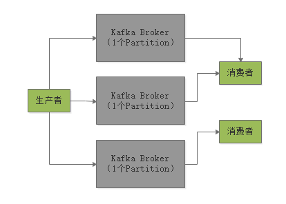


**如果要实现Publish/Subscribe的模型呢？就是说生产者发送的每条消息，都要让所有消费都消费到，怎么实现？**

那就让**每个消费者都是一个独立的消费组，这样每条消息都会发送给所有的消费组**，每个消费组里那唯一的一个消费者一定会消费到所有的消息。


但是除此之外，Kafka就没有任何其他的消费功能了，就是如此简单，所以属于一种比较暴力直接的流派。**它就是简单的消费模型，实现最基础的Queue和Pub/Sub两种消费模型，但是内核中大幅度优化和提升了性能以及吞吐量**。所以Kafka天生适合的场景，就是大数据领域的实时数据计算的场景。因为**在大数据的场景下，通常是弱业务的场景**，没有太多复杂的业务系统交互，而主要是大量的数据流入Kafka，然后进行实时计算。所以就是需要简单的消费模型，但是必须在内核中对吞吐量和性能进行大幅度的优化。因此Kafka技术通常是在大数据的实时数据计算领域中使用的，比如说**每秒处理几十万条消息，甚至每秒处理上百万条消息。**


#### 2.流派2：有Broker的复杂路由

第二个流派，就是RabbitMQ为代表的流派，**他强调的不是说如何提升性能和吞吐量，关注的是说要提供非常强大、复杂而且完善的消息路由功能**。所以对于RabbitMQ而言，他就不是那么简单的Topic-Partition的消费模型了。在RabbitMQ中引入了一个非常核心的概念，叫做Exchange，这个**Exchange就是负责根据复杂的业务规则把消息路由到内部的不同的Queue里去**。举个例子，如果要实现最简单的队列功能，就是让exchange往一个queue里写数据，然后多个消费者来消费这个queue里的数据，每条消息只能给一个消费者，那么可以是类似下面的方式。

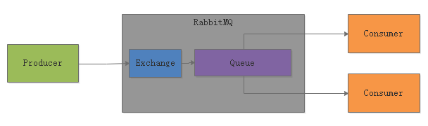

**如果想要实现Pub/Sub的模型，就是一条消息要被所有的消费者给消费到，那么就可以让每个消费者都有一个自己的Queue，然后绑定到一个Exchange上去。接着，这个Exchange就设定把消息路由给所有的Queue即可**，如下面这样。此时Exchange可以把每条消息都路由给所有的Queue，每个Consumer都可以从自己的Queue里拿到所有的消息。

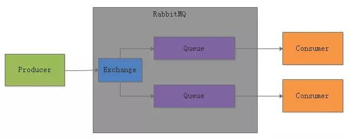

RabbitMQ这种流派，**其实最核心的是，基于Exchange这个概念**，他可以做很多复杂的事情。比如：**如果你想要某个Consumer只能消费到某一类数据，那么Exchange可以把消息里比如带“XXX”前缀的消息路由给某个Queue**。或者你可以限定某个Consumer就只能消费某一部分数据。总之在这里你可以做很多的限制，设置复杂的路由规则。但是也正是因为引入了这种复杂的消费模型，**支持复杂的路由功能**，导致RabbitMQ在内核以及架构设计上没法像Kafka做的那么的轻量级、高性能、可扩展、高吞吐，所以**RabbitMQ在吞吐量上要比Kafka低一个数量级**。所以这种流派的MQ，**往往适合用在Java业务系统中，不同的业务系统需要进行复杂的消息路由**。

比如说业务系统A发送了10条消息，其中3条消息是给业务系统B的，7条消息是给业务系统C的，要实现这种复杂的路由模型，就必须依靠RabbitMQ来实现。当然，对于这种业务系统之间的消息流转而言，可能不需要那么高的吞吐量，可能每秒业务系统之间也就转发几十条或者几百条消息，那么就完全适合采用RabbitMQ来实现。

#### 3.流派3：无Broker的通信流派

ZeroMQ代表的是第三种MQ。说白了，他是**不需要在服务器上部署的，就是一个客户端的库**而已。也就是说，他**主要是封装了底层的Socket网络通讯，然后一个系统要发送一条消息给另外一个消息消费** 。通过ZeroMQ，本质就是底层ZeroMQ发送一条消息到另外一个系统上去。所以ZeroMQ是**去中心化的，不需要跟Kafka、RabbitMQ一样在服务器上部署的**。

他主要是**用来进行业务系统之间的网络通信的**，有点类似于比如你是一个分布式系统架构，那么此时分布式架构中的**各个子系统互相之间要通信**，你是基于Dubbo RPC？还是Spring Cloud HTTP？可能上述两种你都不想要，就是要基于原始的Socket进行网络通信，简单的收发消息而已。此时就可以使用ZeroMQ作为分布式系统之间的消息通信，如下面那样。


#### 总结

其实现在基本上MQ主要就是这三个流派，很多小众的MQ一般很少有人会用。

而且用MQ的场景主要就是两大类：

1. 业务系统之间异步通信
2. 大数据领域的实时数据计算

所以一般业务系统之间通信就是会采用RabbitMQ/RocketMQ，需要复杂的消息路由功能的支撑。大数据的实时计算场景会采用Kafka，需要简单的消费模型，但是超高的吞吐量。至于ZeroMQ，一般来说，少数分布式系统中子系统之间的分布式通信时会采用，作为轻量级的异步化的通信组件。


## kafka

### kafka的高可用架构原理

#### 1.如何保证宕机的时候数据不丢失？

比如下面的图里就是表明了对于**每一个Topic，我们都可以设置它包含几个Partition，每个Partition负责存储这个Topic一部分的数据**。然后Kafka的Broker集群中，每台机器上都存储了一些Partition，也就存放了Topic的一部分数据，这样就实现了Topic的数据分布式存储在一个Broker集群上。

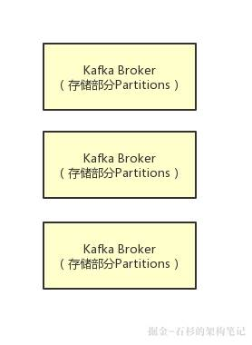


但是有一个问题，万一 一个Kafka Broker宕机了，此时上面存储的数据不就丢失了吗？没错，这就是一个比较大的问题了，分布式系统的数据丢失问题，是他首先必须要解决的，一旦说任何一台机器宕机，此时就会导致数据的丢失。

#### 2.多副本冗余的高可用机制

所以如果大家去分析任何一个分布式系统的原理，比如说zookeeper、kafka、redis cluster、elasticsearch、hdfs，等等，其实他都有自己内部的一套**多副本冗余的机制**，多副本冗余几乎是现在任何一个优秀的分布式系统都一般要具备的功能。在kafka集群中，每个Partition都有多个副本，其中一个副本叫做leader，其他的副本叫做follower，如下图。

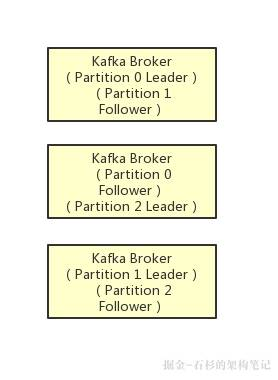

如上图所示，假设一个Topic拆分为了3个Partition，分别是Partition0，Partiton1，Partition2，此时每个Partition都有2个副本。比如Partition0有一个副本是Leader，另外一个副本是Follower，Leader和Follower两个副本是分布在不同机器上的。这样的**多副本冗余机制，可以保证任何一台机器挂掉，都不会导致数据彻底丢失**，因为起码还是有副本在别的机器上的。


#### 3.多副本之间数据如何同步？

着我们就来看看多个副本之间数据是如何同步的？其实任何一个Partition，**只有Leader是对外提供读写服务**的也就是说，如果有一个客户端往一个Partition写入数据，此时一般就是写入这个Partition的Leader副本。然后Leader副本接收到数据之后，**Follower副本会不停的给他发送请求尝试去拉取最新的数据，拉取到自己本地后，写入磁盘中**。如下图所示：


#### 4.ISR到底指的是什么东西？

既然大家已经知道了Partiton的多副本同步数据的机制了，那么就可以来看看ISR是什么了。ISR全称是“In-Sync Replicas”，也就是**保持同步的副本**，他的含义就是，**跟Leader始终保持同步的Follower有哪些**。大家可以想一下 ，如果说某个Follower所在的Broker因为JVM FullGC之类的问题，导致自己卡顿了，无法及时从Leader拉取同步数据，那么是不是会导致Follower的数据比Leader要落后很多？所以这个时候，就意味着Follower已经跟Leader不再处于同步的关系了。但是只要Follower一直及时从Leader同步数据，就可以保证他们是处于同步的关系的。所以**每个Partition都有一个ISR，这个ISR里一定会有Leader自己，因为Leader肯定数据是最新的，然后就是那些跟Leader保持同步的Follower，也会在ISR里。**


#### 5.acks参数的含义

铺垫了那么多的东西，最后终于可以进入主题来聊一下acks参数的含义了。如果大家没看明白前面的那些副本机制、同步机制、ISR机制，那么就无法充分的理解acks参数的含义，这个参数实际上决定了很多重要的东西。**首先这个acks参数，是在KafkaProducer，也就是生产者客户端里设置的**。也就是说，你往kafka写数据的时候，就可以来设置这个acks参数。然后这个参数实际上有三种常见的值可以设置，分别是：0、1 和 all。第一种选择是把acks参数设置为0，意思就是我的KafkaProducer在客户端，只要把消息发送出去，不管那条数据有没有在哪怕Partition Leader上落到磁盘，我就不管他了，直接就认为这个消息发送成功了。如果你采用这种设置的话，那么你必须注意的一点是，可能你发送出去的消息还在半路。结果呢，Partition Leader所在Broker就直接挂了，然后结果你的客户端还认为消息发送成功了，此时就会**导致这条消息就丢失了。**

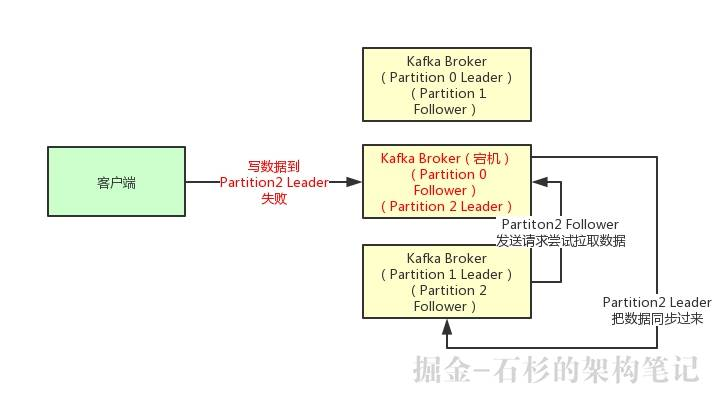


第二种选择是设置 acks = 1，意思就是说只要**Partition Leader接收到消息而且写入本地磁盘了，就认为成功了，不管他其他的Follower有没有同步过去这条消息了**。这种设置其实是kafka**默认的设置**，大家请注意，划重点！==这是默认的设置==也就是说，默认情况下，你要是不管acks这个参数，只要Partition Leader写成功就算成功。但是这里有一个问题，**万一Partition Leader刚刚接收到消息，Follower还没来得及同步过去，结果Leader所在的broker宕机了，此时也会导致这条消息丢失，因为人家客户端已经认为发送成功了。**

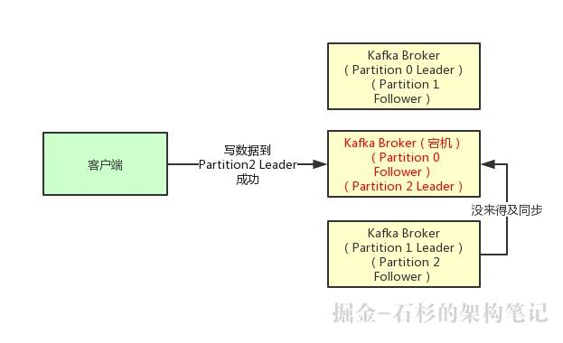


最后一种情况，就是设置acks=all，这个意思就是说，**Partition Leader接收到消息之后，还必须要求ISR列表里跟Leader保持同步的那些Follower都要把消息同步过去，才能认为这条消息是写入成功了。**如果说Partition Leader刚接收到了消息，但是结果Follower没有收到消息，此时Leader宕机了，那么客户端会感知到这个消息没发送成功，他会重试再次发送消息过去。此时可能Partition 2的Follower变成Leader了，此时ISR列表里只有最新的这个Follower转变成的Leader了，那么只要这个新的Leader接收消息就算成功了。

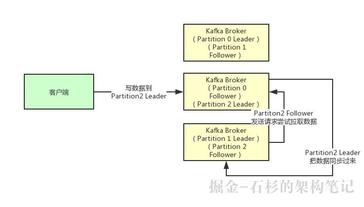


#### 6.最后的思考acks=all 就可以代表数据一定不会丢失了吗？

==当然不是==，如果你的Partition**只有一个副本，也就是一个Leader，任何Follower都没有**，你认为acks=all有用吗？当然没用了，因为ISR里就一个Leader，他接收完消息后宕机，也会导致数据丢失。所以说，**这个acks=all，必须跟ISR列表里至少有2个以上的副本配合使用，起码是有一个Leader和一个Follower才可以**。这样才能保证说写一条数据过去，一定是2个以上的副本都收到了才算是成功，此时任何一个副本宕机，不会导致数据丢失。


### kafka如何保证消息不被重复消费/如何保证消息消费的幂等性

RabbitMQ、RocketMQ、Kafka，都有可能会出现消息重复消费的问题，正常。因为这问题通常不是 MQ 自己保证的，是由我们开发来保证的。

Kafka 实际上有个 offset 的概念，就是每个消息写进去，都有一个 offset，代表消息的序号，然后 consumer 消费了数据之后，**每隔一段时间**（定时定期），会把自己消费过的消息的 offset 提交一下，表示“我已经消费过了，下次我要是重启啥的，你就让我继续从上次消费到的 offset 来继续消费吧”。

但是凡事总有意外，比如我们之前生产经常遇到的，就是你有时候重启系统，看你怎么重启了，如果碰到点着急的，直接 kill 进程了，再重启。这会导致 consumer 有些消息处理了，但是没来得及提交 offset，尴尬了。重启之后，少数消息会再次消费一次。

举个栗子。

有这么个场景。数据 1/2/3 依次进入 kafka，kafka 会给这三条数据每条分配一个 offset，代表这条数据的序号，我们就假设分配的 offset 依次是 152/153/154。消费者从 kafka 去消费的时候，也是按照这个顺序去消费。假如当消费者消费了 `offset=153` 的这条数据，刚准备去提交 offset 到 zookeeper，此时消费者进程被重启了。那么此时消费过的数据 1/2 的 offset 并没有提交，kafka 也就不知道你已经消费了 `offset=153` 这条数据。那么重启之后，消费者会找 kafka 说，嘿，哥儿们，你给我接着把上次我消费到的那个地方后面的数据继续给我传递过来。由于之前的 offset 没有提交成功，那么数据 1/2 会再次传过来，如果此时消费者没有去重的话，那么就会导致重复消费。


如果消费者干的事儿是拿一条数据就往数据库里写一条，会导致说，你可能就把数据 1/2 在数据库里插入了 2 次，那么数据就错啦。

其实重复消费不可怕，可怕的是你没考虑到重复消费之后，**怎么保证幂等性**。

举个例子吧。假设你有个系统，消费一条消息就往数据库里插入一条数据，要是你一个消息重复两次，你不就插入了两条，这数据不就错了？但是你要是消费到第二次的时候，自己判断一下是否已经消费过了，若是就直接扔了，这样不就保留了一条数据，从而保证了数据的正确性。

一条数据重复出现两次，数据库里就只有一条数据，这就保证了系统的幂等性。

幂等性，通俗点说，就一个数据，或者一个请求，给你重复来多次，你得确保对应的数据是不会改变的，**不能出错**。

所以第二个问题来了，**怎么保证消息队列消费的幂等性**？

其实还是得结合业务来思考，我这里给几个思路：

- 比如你拿个数据要写库，你先根据主键查一下，如果这数据都有了，你就别插入了，update 一下好吧。
- 比如你是写 Redis，那没问题了，反正每次都是 set，天然幂等性。
- 比如你不是上面两个场景，那做的稍微复杂一点，你需要让生产者发送每条数据的时候，里面加一个全局唯一的 id，类似订单 id 之类的东西，然后你这里消费到了之后，先根据这个 id 去比如 Redis 里查一下，之前消费过吗？如果没有消费过，你就处理，然后这个 id 写 Redis。如果消费过了，那你就别处理了，保证别重复处理相同的消息即可。
- 比如基于数据库的唯一键来保证重复数据不会重复插入多条。因为有唯一键约束了，重复数据插入只会报错，不会导致数据库中出现脏数据。


当然，如何保证 MQ 的消费是幂等性的，需要结合具体的业务来看。


### Kafka 的高可用性

Kafka 一个最基本的架构认识：由多个 broker 组成，每个 broker 是一个节点；你创建一个 topic，这个 topic 可以划分为多个 partition，每个 partition 可以存在于不同的 broker 上，每个 partition 就放一部分数据。

这就是**天然的分布式消息队列**，就是说一个 topic 的数据，是**分散放在多个机器上的，每个机器就放一部分数据**。

实际上 RabbmitMQ 之类的，并不是分布式消息队列，它就是传统的消息队列，只不过提供了一些集群、HA(High Availability, 高可用性) 的机制而已，因为无论怎么玩儿，RabbitMQ 一个 queue 的数据都是放在一个节点里的，镜像集群下，也是每个节点都放这个 queue 的完整数据。

Kafka 0.8 以前，是没有 HA 机制的，就是任何一个 broker 宕机了，那个 broker 上的 partition 就废了，没法写也没法读，没有什么高可用性可言。

比如说，我们假设创建了一个 topic，指定其 partition 数量是 3 个，分别在三台机器上。但是，如果第二台机器宕机了，会导致这个 topic 的 1/3 的数据就丢了，因此这个是做不到高可用的。


Kafka 0.8 以后，提供了 HA 机制，就是 replica（复制品） 副本机制。每个 partition 的数据都会同步到其它机器上，形成自己的多个 replica 副本。所有 replica 会选举一个 leader 出来，那么生产和消费都跟这个 leader 打交道，然后其他 replica 就是 follower。写的时候，leader 会负责把数据同步到所有 follower 上去，读的时候就直接读 leader 上的数据即可。只能读写 leader？很简单，**要是你可以随意读写每个 follower，那么就要 care 数据一致性的问题**，系统复杂度太高，很容易出问题。Kafka 会均匀地将一个 partition 的所有 replica 分布在不同的机器上，这样才可以提高容错性。


这么搞，就有所谓的**高可用性**了，因为如果某个 broker 宕机了，没事儿，那个 broker上面的 partition 在其他机器上都有副本的。如果这个宕机的 broker 上面有某个 partition 的 leader，那么此时会从 follower 中**重新选举**一个新的 leader 出来，大家继续读写那个新的 leader 即可。这就有所谓的高可用性了。

**写数据**的时候，生产者就写 leader，然后 leader 将数据落地写本地磁盘，接着其他 follower 自己主动从 leader 来 pull 数据。一旦所有 follower 同步好数据了，就会发送 ack 给 leader，leader 收到所有 follower 的 ack 之后，就会返回写成功的消息给生产者。（当然，这只是其中一种模式，还可以适当调整这个行为）

**消费**的时候，只会从 leader 去读，但是只有当一个消息已经被所有 follower 都同步成功返回 ack 的时候，这个消息才会被消费者读到。


### kafka如何保证消息的可靠性传输？（如何处理消息丢失的问题）

#### 消费端弄丢了数据

唯一可能导致消费者弄丢数据的情况，就是说，你消费到了这个消息，然后消费者那边**自动提交了 offset**，让 Kafka 以为你已经消费好了这个消息，但其实你才刚准备处理这个消息，你还没处理，你自己就挂了，此时这条消息就丢咯。

这不是跟 RabbitMQ 差不多吗，大家都知道 Kafka 会自动提交 offset，那么只要**关闭自动提交** offset，在处理完之后自己手动提交 offset，就可以保证数据不会丢。但是此时确实还是**可能会有重复消费**，比如你刚处理完，还没提交 offset，结果自己挂了，此时肯定会重复消费一次，自己保证幂等性就好了。

生产环境碰到的一个问题，就是说我们的 Kafka 消费者消费到了数据之后是写到一个内存的 queue 里先缓冲一下，结果有的时候，你刚把消息写入内存 queue，然后消费者会自动提交 offset。然后此时我们重启了系统，就会导致内存 queue 里还没来得及处理的数据就丢失了。


#### Kafka 弄丢了数据

这块比较常见的一个场景，就是 Kafka 某个 broker 宕机，然后重新选举 partition 的 leader。大家想想，要是此时其他的 follower 刚好还有些数据没有同步，结果此时 leader 挂了，然后选举某个 follower 成 leader 之后，不就少了一些数据？这就丢了一些数据啊。

生产环境也遇到过，我们也是，之前 Kafka 的 leader 机器宕机了，将 follower 切换为 leader 之后，就会发现说这个数据就丢了。

所以此时一般是要求起码设置如下 4 个参数：

- 给 topic 设置 `replication.factor` 参数：这个值必须大于 1，要求每个 partition 必须有至少 2 个副本。
- 在 Kafka 服务端设置 `min.insync.replicas` 参数：这个值必须大于 1，这个是要求一个 leader 至少感知到有至少一个 follower 还跟自己保持联系，没掉队，这样才能确保 leader 挂了还有一个 follower 吧。
- 在 producer 端设置 `acks=all`：这个是要求每条数据，必须是**写入所有 replica 之后，才能认为是写成功了**。
- 在 producer 端设置 `retries=MAX`（很大很大很大的一个值，无限次重试的意思）：这个是**要求一旦写入失败，就无限重试**，卡在这里了。

我们生产环境就是按照上述要求配置的，这样配置之后，至少在 Kafka broker 端就可以保证在 leader 所在 broker 发生故障，进行 leader 切换时，数据不会丢失。


#### 生产者会不会弄丢数据？

如果按照上述的思路设置了 `acks=all`，一定不会丢，要求是，你的 leader 接收到消息，所有的 follower 都同步到了消息之后，才认为本次写成功了。如果没满足这个条件，生产者会自动不断的重试，重试无限次。


### kafka 如何保证消息的顺序性？

先看看顺序会错乱的俩场景：

- **Kafka**：比如说我们建了一个 topic，有三个 partition。生产者在写的时候，其实可以指定一个 key，比如说我们指定了某个订单 id 作为 key，那么这个订单相关的数据，一定会被分发到同一个 partition 中去，而且这个 partition 中的数据一定是有顺序的。
  消费者从 partition 中取出来数据的时候，也一定是有顺序的。到这里，顺序还是 ok 的，没有错乱。接着，我们在消费者里可能会搞**多个线程来并发处理消息**。因为如果消费者是单线程消费处理，而处理比较耗时的话，比如处理一条消息耗时几十 ms，那么 1 秒钟只能处理几十条消息，这吞吐量太低了。而多个线程并发跑的话，顺序可能就乱掉了。


解决方案


Kafka

- 一个 topic，一个 partition，一个 consumer，内部单线程消费，单线程吞吐量太低，一般不会用这个。
- 写 N 个内存 queue，具有相同 key 的数据都到同一个内存 queue；然后对于 N 个线程，每个线程分别消费一个内存 queue 即可，这样就能保证顺序性。


## RabbitMQ


### RabbitMQ 的高可用性

RabbitMQ 是比较有代表性的，因为是**基于主从**（非分布式）做高可用性的，我们就以 RabbitMQ 为例子讲解第一种 MQ 的高可用性怎么实现。

RabbitMQ 有三种模式：单机模式、普通集群模式、镜像集群模式。

#### 单机模式

单机模式，就是 Demo 级别的，一般就是你本地启动了玩玩儿的，没人生产用单机模式。

#### 普通集群模式（无高可用性）

普通集群模式，意思就是在多台机器上启动多个 RabbitMQ 实例，每个机器启动一个。你**创建的 queue，只会放在一个 RabbitMQ 实例上**，但是每个实例都同步 queue 的元数据（元数据可以认为是 queue 的一些配置信息，通过元数据，可以找到 queue 所在实例）。你消费的时候，实际上如果连接到了另外一个实例，那么那个实例会从 queue 所在实例上拉取数据过来。


这种方式确实很麻烦，也不怎么好，**没做到所谓的分布式**，就是个普通集群。因为这导致你要么消费者每次随机连接一个实例然后拉取数据，要么固定连接那个 queue 所在实例消费数据，前者有**数据拉取的开销**，后者导致**单实例性能瓶颈**。

而且如果那个放 queue 的实例宕机了，会导致接下来其他实例就无法从那个实例拉取，如果你**开启了消息持久化**，让 RabbitMQ 落地存储消息的话，**消息不一定会丢**，得等这个实例恢复了，然后才可以继续从这个 queue 拉取数据。

所以这个事儿就比较尴尬了，这就**没有什么所谓的高可用性**，**这方案主要是提高吞吐量的**，就是说让集群中多个节点来服务某个 queue 的读写操作。


#### 镜像集群模式（高可用性）

这种模式，才是所谓的 RabbitMQ 的高可用模式。跟普通集群模式不一样的是，在镜像集群模式下，你创建的 queue，无论元数据还是 queue 里的消息都会**存在于多个实例上**，就是说，每个 RabbitMQ 节点都有这个 queue 的一个**完整镜像**，包含 queue 的全部数据的意思。然后每次你写消息到 queue 的时候，都会自动把**消息同步**到多个实例的 queue 上。


那么**如何开启这个镜像集群模式**呢？其实很简单，RabbitMQ 有很好的管理控制台，就是在后台新增一个策略，这个策略是**镜像集群模式的策略**，指定的时候是可以要求数据同步到所有节点的，也可以要求同步到指定数量的节点，再次创建 queue 的时候，应用这个策略，就会自动将数据同步到其他的节点上去了。

这样的话，好处在于，你任何一个机器宕机了，没事儿，其它机器（节点）还包含了这个 queue 的完整数据，别的 consumer 都可以到其它节点上去消费数据。坏处在于，第一，这个性能开销也太大了吧，消息需要同步到所有机器上，导致网络带宽压力和消耗很重！第二，这么玩儿，不是分布式的，就**没有扩展性可言**了，如果某个 queue 负载很重，你加机器，新增的机器也包含了这个 queue 的所有数据，并**没有办法线性扩展**你的 queue。你想，如果这个 queue 的数据量很大，大到这个机器上的容量无法容纳了，此时该怎么办呢？


### RabbitMQ 如何保证消息的可靠性传输？（如何处理消息丢失的问题）

数据的丢失问题，可能出现在生产者、MQ、消费者中，咱们从 RabbitMQ 和 Kafka 分别来分析一下吧。


#### 生产者弄丢了数据

生产者将数据发送到 RabbitMQ 的时候，可能数据就在半路给搞丢了，因为网络问题啥的，都有可能。

此时可以选择用 RabbitMQ 提供的事务功能，就是生产者**发送数据之前**开启 RabbitMQ 事务`channel.txSelect`，然后发送消息，如果消息没有成功被 RabbitMQ 接收到，那么生产者会收到异常报错，此时就可以回滚事务`channel.txRollback`，然后重试发送消息；如果收到了消息，那么可以提交事务`channel.txCommit`。

```java
// 开启事务
channel.txSelect
try {
    // 这里发送消息
} catch (Exception e) {
    channel.txRollback

    // 这里再次重发这条消息
}

// 提交事务
channel.txCommit
```

但是问题是，RabbitMQ 事务机制（同步）一搞，基本上**吞吐量会下来，因为太耗性能**。

所以一般来说，如果你要确保说写 RabbitMQ 的消息别丢，可以开启 `confirm` 模式，在生产者那里设置开启 `confirm` 模式之后，你每次写的消息都会**分配一个唯一的 id**，然后如果写入了 RabbitMQ 中，RabbitMQ 会给你回传一个 `ack` 消息，告诉你说这个消息 ok 了。如果 RabbitMQ 没能处理这个消息，会回调你的一个 `nack` 接口，告诉你这个消息接收失败，你可以重试。而且你可以结合这个机制自己在内存里维护每个消息 id 的状态，如果超过一定时间还没接收到这个消息的回调，那么你可以重发。

事务机制和 `confirm` 机制最大的不同在于，**事务机制是同步的**，你提交一个事务之后会**阻塞**在那儿，但是 `confirm` 机制是**异步**的，你发送个消息之后就可以发送下一个消息，然后那个消息 RabbitMQ 接收了之后会异步回调你的一个接口通知你这个消息接收到了。

所以一般在生产者这块**避免数据丢失**，都是用 `confirm` 机制的。


#### RabbitMQ 弄丢了数据

就是 RabbitMQ 自己弄丢了数据，这个你必须**开启 RabbitMQ 的持久化**，就是消息写入之后会持久化到磁盘，哪怕是 RabbitMQ 自己挂了，**恢复之后会自动读取之前存储的数据**，一般数据不会丢。除非极其罕见的是，RabbitMQ 还没持久化，自己就挂了，**可能导致少量数据丢失**，但是这个概率较小。

设置持久化有**两个步骤**：

- 创建 queue 的时候将其设置为持久化
  这样就可以保证 RabbitMQ **持久化 queue 的元数据**，但是它是**不会持久化 queue 里的数据**的。
- 第二个是发送消息的时候将消息的 `deliveryMode` 设置为 2
  就是将**消息设置为持久化**的，此时 RabbitMQ 就会将消息持久化到磁盘上去。

**必须要同时设置这两个持久化才行**，RabbitMQ 哪怕是挂了，再次重启，也会从磁盘上重启恢复 queue，恢复这个 queue 里的数据。

注意，哪怕是你给 RabbitMQ 开启了持久化机制，也有一种可能，就是这个消息写到了 RabbitMQ 中，但是还没来得及持久化到磁盘上，结果不巧，此时 RabbitMQ 挂了，就会导致内存里的一点点数据丢失。

所以，持久化可以跟生产者那边的 `confirm` 机制配合起来，只有消息被持久化到磁盘之后，才会通知生产者 `ack` 了，所以哪怕是在持久化到磁盘之前，RabbitMQ 挂了，数据丢了，生产者收不到 `ack`，你也是可以自己重发的。


#### 消费端弄丢了数据

RabbitMQ 如果丢失了数据，主要是因为你消费的时候，**刚消费到，还没处理，结果进程挂了**，比如重启了，那么就尴尬了，RabbitMQ 认为你都消费了，这数据就丢了。

这个时候得用 RabbitMQ 提供的 `ack` 机制，简单来说，就是你**必须关闭 RabbitMQ 的自动** `ack`，可以通过一个 api 来调用就行，然后每次你自己代码里确保处理完的时候，再在程序里 `ack` 一把。这样的话，如果你还没处理完，不就没有 `ack`了？那 RabbitMQ 就认为你还没处理完，这个时候 RabbitMQ 会把这个消费**分配给别的 consumer 去处理**，消息是不会丢的。


### RabbitMQ 如何保证消息的顺序性？


先看看顺序会错乱的俩场景：

- **RabbitMQ**：一个 queue，多个 consumer。比如，生产者向 RabbitMQ 里发送了三条数据，顺序依次是 data1/data2/data3，压入的是 RabbitMQ 的一个内存队列。有三个消费者分别从 MQ 中消费这三条数据中的一条，结果消费者2先执行完操作，把 data2 存入数据库，然后是 data1/data3。这不明显乱了。


解决方案

RabbitMQ

拆分多个 queue，每个 queue 一个 consumer，就是多一些 queue 而已，确实是麻烦点；或者就一个 queue 但是对应一个 consumer，然后这个 consumer 内部用内存队列做排队，然后分发给底层不同的 worker 来处理。


### RabbitMQ confirm


Confirm发送方确认模式使用和事务类似，也是通过设置Channel进行发送方确认的。

**Confirm的三种实现方式：**

方式一：channel.waitForConfirms()普通发送方确认模式；

方式二：channel.waitForConfirmsOrDie()批量确认模式；

方式三：channel.addConfirmListener()异步监听发送方确认模式；


#### 方式一：普通Confirm模式

```java
// 创建连接
ConnectionFactory factory = new ConnectionFactory();
factory.setUsername(config.UserName);
factory.setPassword(config.Password);
factory.setVirtualHost(config.VHost);
factory.setHost(config.Host);
factory.setPort(config.Port);
Connection conn = factory.newConnection();
// 创建信道
Channel channel = conn.createChannel();
// 声明队列
channel.queueDeclare(config.QueueName, false, false, false, null);
// 开启发送方确认模式
channel.confirmSelect();
String message = String.format("时间 => %s", new Date().getTime());
channel.basicPublish("", config.QueueName, null, message.getBytes("UTF-8"));
if (channel.waitForConfirms()) {
    System.out.println("消息发送成功" );
}
```

我们只需要在推送消息之前，channel.confirmSelect()声明开启发送方确认模式，再使用channel.waitForConfirms()等待消息被服务器确认即可。


### 方式二：批量Confirm模式

```java
// 创建连接
ConnectionFactory factory = new ConnectionFactory();
factory.setUsername(config.UserName);
factory.setPassword(config.Password);
factory.setVirtualHost(config.VHost);
factory.setHost(config.Host);
factory.setPort(config.Port);
Connection conn = factory.newConnection();
// 创建信道
Channel channel = conn.createChannel();
// 声明队列
channel.queueDeclare(config.QueueName, false, false, false, null);
// 开启发送方确认模式
channel.confirmSelect();
for (int i = 0; i < 10; i++) {
    String message = String.format("时间 => %s", new Date().getTime());
    channel.basicPublish("", config.QueueName, null, message.getBytes("UTF-8"));
}
channel.waitForConfirmsOrDie(); //直到所有信息都发布，只要有一个未确认就会IOException
System.out.println("全部执行完成");
```

channel.waitForConfirmsOrDie()，使用同步方式等所有的消息发送之后才会执行后面代码，只要有一个消息未被确认就会抛出IOException异常。


### 方式三：异步Confirm模式

```java
// 创建连接
ConnectionFactory factory = new ConnectionFactory();
factory.setUsername(config.UserName);
factory.setPassword(config.Password);
factory.setVirtualHost(config.VHost);
factory.setHost(config.Host);
factory.setPort(config.Port);
Connection conn = factory.newConnection();
// 创建信道
Channel channel = conn.createChannel();
// 声明队列
channel.queueDeclare(config.QueueName, false, false, false, null);
// 开启发送方确认模式
channel.confirmSelect();
for (int i = 0; i < 10; i++) {
    String message = String.format("时间 => %s", new Date().getTime());
    channel.basicPublish("", config.QueueName, null, message.getBytes("UTF-8"));
}
//异步监听确认和未确认的消息
channel.addConfirmListener(new ConfirmListener() {
    @Override
    public void handleNack(long deliveryTag, boolean multiple) throws IOException {
        System.out.println("未确认消息，标识：" + deliveryTag);
    }
    @Override
    public void handleAck(long deliveryTag, boolean multiple) throws IOException {
        System.out.println(String.format("已确认消息，标识：%d，多个消息：%b", deliveryTag, multiple));
    }
});
```

步模式的优点，就是执行效率高，不需要等待消息执行完，只需要监听消息即可

消息确认有可能是批量确认的，是否批量确认在于返回的multiple的参数，此参数为bool值，如果true表示批量执行了deliveryTag这个值以前的所有消息，如果为false的话表示单条确认。


## RocketMQ


### rocketMQ介绍

#### 1.RocketMQ整体架构


# 😈 SPI

SPI 全称为 (Service Provider Interface) ,是JDK内置的一种服务提供发现机制。

一个服务(Service)通常指的是已知的接口或者抽象类，服务提供方就是对这个接口或者抽象类的实现，然后按照SPI 标准存放到资源路径**META-INF/services**目录下，**文件的命名为该服务接口的全限定名**

**SPI机制的约定**

1. 在META-INF/services/目录中创建以Service接口全限定名命名的文件，该文件内容为Service接口具体实现类的全限定名，文件编码必须为UTF-8。
2. 使用ServiceLoader.load(Class class); 动态加载Service接口的实现类。
3. 如SPI的实现类为jar，则需要将其放在当前程序的classpath下。
4. Service的具体实现类必须有一个不带参数的构造方法。

**SPI机制的缺点**

1. JDK 标准的 SPI 会一次性实例化扩展点所有实现，如果有扩展实现初始化很耗时，但如果没用上也加载，会很浪费资源。

**无法直接运行成功处理**

注意，直接运行无法成功，会报异常 找不到xxImpl

1. 检查文件名和路径 是否com.test.spi.DemoService   文件内容和路径com.test.spi.impl.EnglishDemoServiceImpl
2. 为什么在一个工程中获取不到接口的实现类呢？经过观察发现是因为资源文件没有在classPath中，为什么这么说呢，
   可以看下build（target/classes/）的目录下面是没有META-INF文件夹。最简单的方法，把资源下的META-INF文件夹拷贝到build目录下，然后再运行

**示例**

1. 接口定义

   ```java
   public interface DemoService {
       String sayHi(String msg);
   }
   ```

2. 接口实现

   ```java
   import com.test.spi.DemoService;
   
   public class ChineseDemoServiceImpl implements DemoService {
       @Override
       public String sayHi(String msg) {
           return "你好 "+ msg ;
       }
   }
   
   
   import com.test.spi.DemoService;
   
   public class EnglishDemoServiceImpl implements DemoService {
       @Override
       public String sayHi(String msg) {
           return "Hello, "+msg;
       }
   }
   
   ```

   

3.  在resources/META-INFO/service/下建立com.test.spi.DemoService文件，内容为

   ```java
   com.test.spi.impl.EnglishDemoServiceImpl
   com.test.spi.impl.ChineseDemoServiceImpl
   ```

4. 调用服务

   ```java
   import java.util.Iterator;
   import java.util.ServiceLoader;
   public class DemoTest {
       public static void main(String[] args)throws Exception{
           ServiceLoader<DemoService> load = ServiceLoader.load(DemoService.class);
           Iterator<DemoService> iterator = load.iterator();
           while (iterator != null && iterator.hasNext()){
               DemoService demoService = iterator.next();
         System.out.println("class:"+demoService.getClass().getName()+"***"+demoService.sayHi("World"));
   
           }
   
   //        注意，直接运行无法成功，会报异常 找不到xxImpl
   //        1.检查文件名和路径 是否com.test.spi.DemoService   文件内容和路径com.test.spi.impl.EnglishDemoServiceImpl
   //        2.为什么在一个工程中获取不到接口的实现类呢？经过观察发现是因为资源文件没有在classPath中，为什么这么说呢，
   //        可以看下build（target/classes/）的目录下面是没有META-INF文件夹。
   //        最简单的方法，把资源下的META-INF文件夹拷贝到build目录下，然后再运行
   
       }
   }
   ```

   


# 😈  位移

(1).二进制中负数的计算

负数以正数的补码表示

原码：一个整数按照绝对值的大小转化成二进制的数

反码：将二进制数按位取反

补码：反码加 1

以-14 举例

```
00000000 00000000  00000000  00001110  原码 14 
11111111 11111111  11111111  11110001  反码
11111111 11111111  11111111  11110010  补码
```

所以-14  的二进制是 11111111 11111111  11111111  11110010 	

假设 我们得到  二进制让我们求整数 就是倒着来取相反数

如二进制是           11111111  11111111  11111111  11110010

得到反码减1         11111111  11111111  11111111   11110001

原码：                  00000000  00000000  00000000   00001110

即  1110  = 14  所以取反  就是-14

(2).<<左移运算符

1.将一个运算对象的各二进制位全部左移若干位（左边的二进制丢弃，右边补0）

（注意：java中 整数位 32位）

11 << 2 = 44

-14 <<2 =-56

-14的二进制（11111111  11111111  11111111 11110010）左移2位 为
 11111111  11111111  11111111  11001000 结果为（-56）
 【补充】：对于左移，直观的理解为，对于正数来说，左移相当于乘以2（但效率比乘法高）；对于负数来说，没有直观的理解。

(3).>>右移运算符

将一个运算对象的各二进制位全部右移若干位，正数左补0，负数左补1.

4 >> 2 = 1;

-14 >> 2 = -4;
 【补充】：对于右移，直观的理解为，对于正数来说，右1移相当于除以2（但效率比除法高）；对于负数来说，没有直观的理解。


# 😈 泛型

```java
abstract class AbstractAnnotationConfigBeanBuilder<A extends Annotation, B extends AbstractInterfaceConfig> {
    
	protected final A annotation;
    public <T extends AbstractAnnotationConfigBeanBuilder<A, B>> T interfaceClass(Class<?> interfaceClass) {
        this.interfaceClass = interfaceClass;
        return (T) this;
    }
}

private static <T> T[] of(T... values) {
        return values;
}

----------
@SPI
public interface ExtensionFactory {
    <T> T getExtension(Class<T> type, String name);
}    
```

### getSuperclass   

返回直接继承的父类（由于编译擦除，没有显示泛型参数）

| ` Class<? super T>` | `**getSuperclass**()`            返回表示此 `Class` 所表示的实体（类、接口、基本类型或 void）的超类的 `Class`。 |
| ------------------- | ------------------------------------------------------------ |
|                     |                                                              |

1. 返回表示此 `Class` 所表示的实体（类、接口、基本类型或 void）的超类的 `Class`。
2. 如果此 `Class` 表示 `Object` 类、一个接口、一个基本类型或 void，则返回 null。
3. 如果此对象表示一个数组类，则返回表示该 `Object` 类的 `Class` 对象。 

- **返回：**

  此对象所表示的类的超类。

### getGenericSuperclass  

返回直接继承的父类（包含泛型参数）

| ` Type` | `**getGenericSuperclass**()`            返回表示此 `Class` 所表示的实体（类、接口、基本类型或 void）的直接超类的 `Type`。 |
| ------- | ------------------------------------------------------------ |
|         |                                                              |

1. 返回表示此 `Class` 所表示的实体（类、接口、基本类型或 void）的直接超类的 `Type`。
2. 如果超类是参数化类型，则返回的 `Type` 对象必须准确反映源代码中所使用的实际类型参数。如果以前未曾创建表示超类的参数化类型，则创建这个类型。有关参数化类型创建过程的语义，请参阅 `ParameterizedType` 声明。
3. 如果此 `Class` 表示 `Object` 类、接口、基本类型或 void，则返回 null。
4. 如果此对象表示一个数组类，则返回表示 `Object` 类的 `Class` 对象。 

- **返回：**

  此对象所表示的类的超类

- **抛出：**

  `GenericSignatureFormatError` - 如果常规类签名不符合 Java Virtual Machine Specification, 3rd edition 规定的格式

  `TypeNotPresentException` - 如果常规超类引用不存在的类型声明

  `MalformedParameterizedTypeException` - 如果常规超类引用的参数化类型由于某种原因无法实例化

```java
package com.test;

public class ClassTest {
    class Person<T> {
    }

    class Student extends Person<ClassTest> {
    }

    public static void main(String[] args) {
        System.out.println("Student.class.getSuperclass()\t" + Student.class.getSuperclass());
        System.out.println("Student.class.getGenericSuperclass()\t" + Student.class.getGenericSuperclass());

        System.out.println("Test.class.getSuperclass()\t" + ClassTest.class.getSuperclass());
        System.out.println("Test.class.getGenericSuperclass()\t" + ClassTest.class.getGenericSuperclass());

        System.out.println("Object.class.getGenericSuperclass()\t" + Object.class.getGenericSuperclass());
        System.out.println("Object.class.getSuperclass()\t" + Object.class.getSuperclass());

        System.out.println("void.class.getSuperclass()\t" + void.class.getSuperclass());
        System.out.println("void.class.getGenericSuperclass()\t" + void.class.getGenericSuperclass());

        System.out.println("int[].class.getSuperclass()\t" + int[].class.getSuperclass());
        System.out.println("int[].class.getGenericSuperclass()\t" + int[].class.getGenericSuperclass());

        System.out.println("String[].class.getSuperclass()\t" + String[].class.getSuperclass()); //String[].class.getSuperclass()	class java.lang.Object
        System.out.println("String[].class.getGenericSuperclass()\t" + String[].class.getGenericSuperclass());
    }

}


Student.class.getSuperclass()	class com.test.ClassTest$Person
Student.class.getGenericSuperclass()	com.test.ClassTest$Person<com.test.ClassTest>
Test.class.getSuperclass()	class java.lang.Object
Test.class.getGenericSuperclass()	class java.lang.Object
Object.class.getGenericSuperclass()	null
Object.class.getSuperclass()	null
void.class.getSuperclass()	null
void.class.getGenericSuperclass()	null
int[].class.getSuperclass()	class java.lang.Object
int[].class.getGenericSuperclass()	class java.lang.Object
String[].class.getSuperclass()	class java.lang.Object
String[].class.getGenericSuperclass()	class java.lang.Object
```


#### 泛型

**一、当泛型遇到重载** 

```
  public class GenericTypes {
      public static void method(List<String> list) {  
            System.out.println("invoke method(List<String> list)");  
        }  

    public static void method(List<Integer> list) {  
        System.out.println("invoke method(List<Integer> list)");  
    }  
}  
复制代码
```

上面这段代码，有两个重载的函数，因为他们的参数类型不同，一个是List另一个是List ，但是，这段代码是编译通不过的。因为我们前面讲过，参数List和List编译之后都被擦除了，变成了一样的原生类型List，擦除动作导致这两个方法的特征签名变得一模一样。

**二、当泛型遇到catch** 泛型的类型参数不能用在Java异常处理的catch语句中。因为异常处理是由JVM在运行时刻来进行的。由于类型信息被擦除，JVM是无法区分两个异常类型`MyException<String>`和`MyException<Integer>`的

**三、当泛型内包含静态变量**

```
public class StaticTest{
    public static void main(String[] args){
        GT<Integer> gti = new GT<Integer>();
        gti.var=1;
        GT<String> gts = new GT<String>();
        gts.var=2;
        System.out.println(gti.var);
    }
}
class GT<T>{
    public static int var=0;
    public void nothing(T x){}
}
复制代码
```

以上代码输出结果为：2！由于经过类型擦除，所有的泛型类实例都关联到同一份字节码上，泛型类的所有静态变量是共享的。


# 😈 注解

@ConfigurationProperties

```java
@ConfigurationProperties("spring.cloud.loadbalancer.retry")
public class LoadBalancerRetryProperties {
	private boolean enabled = true;
	public boolean isEnabled() {
		return this.enabled;
	}
	public void setEnabled(boolean enabled) {
		this.enabled = enabled;
	}

}
```


# 😈 spring

## 自定义ArgumentResolver

1.实现自定义的ArgumentResolver

```java
@Component
public class PayAsynArgumentResolver implements HandlerMethodArgumentResolver {
    private static Logger logger = LoggerFactory.getLogger(PayAsynArgumentResolver.class);

    @Override
    public boolean supportsParameter(MethodParameter parameter) {
        return parameter.hasParameterAnnotation(PayAsynModelAttribute.class);
    }

    @Override
    public Object resolveArgument(MethodParameter parameter, ModelAndViewContainer mavContainer,
                                  NativeWebRequest webRequest, WebDataBinderFactory binderFactoryy) throws Exception {
 HttpServletRequest request = (HttpServletRequest)webRequest.getNativeRequest(HttpServletRequest.class);
        PayAsynNotify payAsynNotify = payAsynNotifyFactory.getPayAsynNotify(request);
        return payAsynNotify;
    }
}

```


2.定义注解

```java
@Inherited
@Target({ElementType.PARAMETER})
@Retention(RetentionPolicy.RUNTIME)
@Documented
public @interface PayAsynModelAttribute {
    @AliasFor("name")
    String value() default "";

    @AliasFor("value")
    String name() default "";

    boolean binding() default true;
}
```


3.添加配置

```
@Configuration
public class WebMvcConfig extends WebMvcConfigurationSupport { 
    @Override
    protected void addArgumentResolvers(List<HandlerMethodArgumentResolver> argumentResolvers) {
        argumentResolvers.add(new PayAsynArgumentResolver());
    }
}
```

// 不推荐 会屏蔽掉WebMvcAutoConfiguration

```java
@Configuration
public class WebConfiguration {
      @Configuration
    public static class MyConfig extends WebMvcConfigurerAdapter {

        @Autowired
        private PayAsynArgumentResolver payAsynArgumentResolver;

        @Override
        public void addArgumentResolvers(List<HandlerMethodArgumentResolver> argumentResolvers) {
            argumentResolvers.add(payAsynArgumentResolver);

        }
    }
}
```


4.使用自动以注解解析请求

```java
 @RequestMapping(value = "/unifiedorder/{channel}/asyn",method = RequestMethod.POST)
    @org.springframework.web.bind.annotation.ResponseBody
    public String unifiedOrderPayAsynHandle(@PayAsynModelAttribute PayAsynNotify payAsynNotify,
											@PathVariable channel,
                                            HttpServletRequest request, HttpServletResponse response){
        request.getInputStream()

        if(iApiTradeAsynNotifyService.unifiedOrderPayAsynNotify(payAsynNotify)){
            return  payAsynNotifyResultTemplate.produce(payAsynNotify);
        }
        return ERROR;
    }
```


## AOP

Spring Aop 中有两种动态代理，分别是JDK动态代理和Cglib动态代理，前者是基于接口，后者是基于继承


### [aop切入点表达式](https://www.cnblogs.com/imzhuo/p/5888007.html)


来了解下AspectJ类型匹配的通配符：
*：匹配任何数量字符；
..：匹配任何数量字符的重复，如在类型模式中匹配任何数量子包；而在方法参数模式中匹配任何数量参数。
+：匹配指定类型的子类型；仅能作为后缀放在类型模式后边。
java.lang.String 匹配String类型；
java.*.String 匹配java包下的任何“一级子包”下的String类型；
如匹配java.lang.String，但不匹配java.lang.ss.String
java..* 匹配java包及任何子包下的任何类型;
如匹配java.lang.String、java.lang.annotation.Annotation
java.lang.*ing 匹配任何java.lang包下的以ing结尾的类型；
java.lang.Number+ 匹配java.lang包下的任何Number的自类型；
如匹配java.lang.Integer，也匹配java.math.BigInteger

```java
1、切入点表达式：对指定的方法进行拦截，并且生成代理表达式。
2、拦截所有public方法
<aop:pointcut expression="execution(public * *(..))"id="pt"/>
3、拦截所有save开头的方法
<aop:pointcut expression="execution(* save*(..))" id="pt"/>
4、拦截指定类的指定方法
<aop:pointcut expression="execution(public * 包名.类名.方法名(..))" id="pt"/>
5、拦截指定类的所有方法
<aop:pointcut expression="execution(* 包名.类名.*(..))"id="pt"/>
6、拦截指定包，以及其自包下所有类的所有方法
<aop:pointcut expression="execution(* cn..*.*(..))"id="pt"/>
7、多个表达式
<aop:pointcut expression="execution(* 包名.类名.方法名(..)) || execution(* 包名.类名（不同的类）.方法名(..))"id="pt"/>
<aop:pointcut expression="execution(* 包名.类名.方法名(..)) or execution(* 包名.类名（不同的类）.方法名(..))"id="pt"/>
8、取非值
<aop:pointcut expression="!execution(* 包名.类名.方法名(..))"id="pt"/>
<aop:pointcut expression=" not execution(* 包名.类名.方法名(..))"id="pt"/>
```

```java
public class PointCuts {
    @Pointcut(value = "within(test.*)")
    public void aopDemo() {
 
    }
}

@Component
@Aspect
public class Aspect1 {
 
    @Before(value = "test.PointCuts.aopDemo()")
    public void before(JoinPoint joinPoint) {
        System.out.println("[Aspect1] before advise");
    }
 
    @Around(value = "test.PointCuts.aopDemo()")
    public void around(ProceedingJoinPoint pjp) throws  Throwable{
        System.out.println("[Aspect1] around advise 1");
        pjp.proceed();
        System.out.println("[Aspect1] around advise2");
    }
 
    @AfterReturning(value = "test.PointCuts.aopDemo()")
    public void afterReturning(JoinPoint joinPoint) {
        System.out.println("[Aspect1] afterReturning advise");
    }
 
    @AfterThrowing(value = "test.PointCuts.aopDemo()")
    public void afterThrowing(JoinPoint joinPoint) {
        System.out.println("[Aspect1] afterThrowing advise");
    }
 
    @After(value = "test.PointCuts.aopDemo()")
    public void after(JoinPoint joinPoint) {
        System.out.println("[Aspect1] after advise");
    }
}
```

在一个方法只被一个aspect类拦截时，aspect类内部的 advice 将按照以下的顺序进行执行：


### 关于AOP无法切入同类调用方法的问题

```java
public class Service {
 
/**
 * 被Controller调用的方法
 * 这个方法调用被切的方法
*/
 public void callMethodA() {
    ......
    callMethodB();
    ......
}
 
/**
 * Aop切入的方法
*/
 public void callMethodB() {
	......
 }
}


/**
 * AOP的实现
*/
public class Aspect {
 
 @AfterReturning("execution(* Service.callMethodB(..)))
 public void after() {
	 Logger.info(&quot;after call and do something.&quot;);
 }
}


```

调用callMethodA，在callMethodA中调用callMethodB，无法切入.  callMethodA()中callMethodB()方法调用，实际是this.callMethodB() 而aop实际是创建了代理对象，通多代理对象调用callMethodB()，因而当直接调用callMethodA()时，并没有获取代理对象，所以aop无效


被拦截的类的方法执行其实是通过由spring为该类生成的代理类调用指定方法实现的，如下：
ServiceProxy serviceProxy;
serviceProxy.callMethodA();
而**在callMethodA方法内部再调用callMethodB()，其实是this.callMethodB(),这个this是Service的对象，即被代理的对象，而不是代理对象（serviceProxy）**
其实任何的拦截，都是依赖“代理”这种机制实现的，在真正调用方法的前后执行拦截操作，既然不是通过代理对象调用的，自然就失去了拦截的能力，故没有嵌套拦截的能力


解决方法：

1.避免嵌套调用

2.嵌套调用时获取代理的对象  

1. 通过Spring提供的ProxyFactoryBean来获取被拦截类的代理类的对象，然后发起调用，此时就能被拦截到了
2. AopContext.currentProxy()获取代理对象

```java
public class Service {
    public void callMethodA() {
	......
	 ((Service) AopContext.currentProxy()).callMethodB();
	......
	}
} 

Springboot 
@EnableAspectJAutoProxy(exposeProxy = true)
public class Main {}

```


如果是通过xml配置或当前springboot版本不支持

可以配置一个aop.xml文件，文件内容如下：

```java
<?xml version="1.0" encoding="UTF-8"?>
<beans xmlns="http://www.springframework.org/schema/beans"
       xmlns:xsi="http://www.w3.org/2001/XMLSchema-instance"
       xmlns:aop="http://www.springframework.org/schema/aop"
       xsi:schemaLocation="http://www.springframework.org/schema/beans
           http://www.springframework.org/schema/beans/spring-beans-3.0.xsd
           http://www.springframework.org/schema/aop
           http://www.springframework.org/schema/aop/spring-aop-3.0.xsd">
 
    <aop:aspectj-autoproxy proxy-target-class="true" expose-proxy="true"/>
 
</beans>
```

然后在ApplicationMain中添加注解如下：
@ImportResource(locations = "aop.xml")

```java
public class ProxyConfig implements Serializable {
    // 这个参数是用来控制当前是否指定只使用Cglib代理
    private boolean proxyTargetClass = false;

    // 标记是否对代理进行优化。启动优化通常意味着在代理对象被创建后，增强的修改将不会生效，因此默认值为false。
    // 如果exposeProxy设置为true，即使optimize为true也会被忽略。
    private boolean optimize = false;
    
    // 标记是否需要阻止通过该配置创建的代理对象转换为Advised类型，默认值为false，表示代理对象可以被转换为Advised类型
    boolean opaque = false;

    // 标记代理对象是否应该被aop框架通过AopContext以ThreadLocal的形式暴露出去。
    // 当一个代理对象需要调用它自己的另外一个代理方法时，这个属性将非常有用。默认是是false，以避免不必要的拦截。
    boolean exposeProxy = false;

    // 标记该配置是否需要被冻结，如果被冻结，将不可以修改增强的配置。
    // 当我们不希望调用方修改转换成Advised对象之后的代理对象时，这个配置将非常有用。
    private boolean frozen = false;
}

```


我们需要关注的就是 exposeProxy 属性，如果这个属性值 true，那么 Spring 在代理的时候就会将当前这个代理对象放在 ThreadLoacl 中，我们在使用fun1方法的时候，调用fun2就可以改为：

```java
public void fun1(){
    System.out.println("fun1 ...");
    ((OrderService)AopContext.currentProxy()).fun2();
}
```

点开 AopContext.currentProxy() 对象无非就是从 ThreadLoacl 中获取。**需要注意的是，如果采用这种方式，但是没有设置 exposeProxy = true，那么会抛出 IllegalStateException 异常。**


参考：

[关于AOP无法切入同类调用方法的问题](https://www.cnblogs.com/fanguangdexiaoyuer/p/7620534.html)

[AOP方法嵌套调用为何失效和解决方案](https://blog.csdn.net/Liu_York/article/details/86681933)


## Spring Bean 初始化之InitializingBean, init-method 和 PostConstruct

从接口的名字上不难发现，InitializingBean 的作用就是在 bean 初始化后执行定制化的操作。

Spring 容器中的 Bean 是有生命周期的，Spring 允许在 Bean 在初始化完成后以及 Bean 销毁前执行特定的操作，常用的设定方式有以下三种：

- 通过实现 InitializingBean/DisposableBean 接口来定制初始化之后/销毁之前的操作方法；
- 通过 <bean> 元素的 init-method/destroy-method 属性指定初始化之后 /销毁之前调用的操作方法；
- 在指定方法上加上@PostConstruct 或@PreDestroy注解来制定该方法是在初始化之后还是销毁之前调用。

注：以下源码分析基于`spring 5.0.4`

**InitializingBean vs init-method**

```java
public interface InitializingBean {
    void afterPropertiesSet() throws Exception;
}
```

接口只有一个方法`afterPropertiesSet`，此方法的调用入口是负责加载 spring bean 的`AbstractAutowireCapableBeanFactory`，源码如下：

```java
protected void invokeInitMethods(String beanName, final Object bean, @Nullable RootBeanDefinition mbd)throws Throwable {
    boolean isInitializingBean = (bean instanceof InitializingBean);
    if(isInitializingBean && (mbd == null || !mbd.isExternallyManagedInitMethod("afterPropertiesSet"))) {
        if (logger.isDebugEnabled()) {
            logger.debug("Invoking afterPropertiesSet() on bean with name '" + beanName + "'");
        }
        if (System.getSecurityManager() != null) {
            try {
                AccessController.doPrivileged(
				(PrivilegedExceptionAction<Object>) () -> {
                    ((InitializingBean) bean).afterPropertiesSet();
                    return null;
                }, getAccessControlContext());
            }
            catch (PrivilegedActionException pae) {
                throw pae.getException();
            }
        }
        else {
            ((InitializingBean) bean).afterPropertiesSet();
        }
    }
}	
```

从这段源码可以得出以下结论：

1. spring为bean提供了两种初始化bean的方式，**实现InitializingBean接口**，实现afterPropertiesSet方法，或者在配置文件中通过**init-method**指定，两种方式可以**同时**使用
2. 实现InitializingBean接口是直接调用afterPropertiesSet方法，比通过反射调用init-method指定的方法效率相对来说要高点。但是init-method方式消除了对spring的依赖
3. 先调用afterPropertiesSet，再执行 init-method 方法，如果调用afterPropertiesSet方法时出错，则不调用init-method指定的方法。


**@PostConstruct**

通过 debug 和调用栈找到类`InitDestroyAnnotationBeanPostProcessor`, 其中的核心方法，即 `@PostConstruct` 方法调用的入口：

```java
@Override
public Object postProcessBeforeInitialization(Object bean, String beanName) throws BeansException {
    LifecycleMetadata metadata = findLifecycleMetadata(bean.getClass());
    try {
        metadata.invokeInitMethods(bean, beanName);
    }
    catch (InvocationTargetException ex) {
        throw new BeanCreationException(beanName, "Invocation of init method failed", ex.getTargetException());
    }
    catch (Throwable ex) {
        throw new BeanCreationException(beanName, "Failed to invoke init method", ex);
    }
    return bean;
}
```

从命名上，我们就可以得到某些信息——这是一个BeanPostProcessor。想到了什么？在[也谈Spring容器的生命周期](http://sexycoding.iteye.com/blog/1046775)中，提到过BeanPostProcessor的postProcessBeforeInitialization是在Bean生命周期中afterPropertiesSet和init-method之前被调用的。另外通过跟踪，`@PostConstruct`方法的调用方式也是通过发射机制。


#### 总结

1. spring bean的初始化执行顺序：构造方法 --> `@PostConstruct`注解的方法 --> `afterPropertiesSet`方法 --> `init-method`指定的方法。具体可以参考例子
2. `afterPropertiesSet`通过接口实现方式调用（效率上高一点），`@PostConstruct`和`init-method`都是通过反射机制调用
3. 

例子

```java
@Slf4j
public class InitSequenceBean implements InitializingBean {

    public InitSequenceBean() {
        log.info("InitSequenceBean: construct");
    }

    @Override
    public void afterPropertiesSet() throws Exception {
        log.info("InitSequenceBean: afterPropertiesSet");
    }

    @PostConstruct
    public void postConstruct() {
        log.info("InitSequenceBean: postConstruct");
    }

    public void initMethod() {
        log.info("InitSequenceBean: initMethod");
    }
}

@Configuration
public class SystemConfig {

    @Bean(initMethod = "initMethod", name = "initSequenceBean")
    public InitSequenceBean initSequenceBean() {
        return new InitSequenceBean();
    }
}

@Slf4j
public class InitSequenceBeanTest extends ApplicationTests {

    @Autowired
    private InitSequenceBean initSequenceBean;

    @Test
    public void initSequenceBeanTest() {
        log.info("Finish: {}", initSequenceBean.toString());
    }
}
```


springboot 配置filter


# 😈 springboot

有时候，绑定时可能需要实现额外的逻辑，而BindHandler接口提供了一个很好的方法来实现这一点。 每个BindHandler都可以实现onStart，onSuccess，onFailure和onFinish方法来覆盖行为。

Spring Boot提供了一些处理程序，主要用于支持现有的@ConfigurationProperties绑定。 例如，ValidationBindHandler可用于对绑定对象应用Validator验证。


## 定时任务


参考：

[Scheduling Tasks](https://spring.io/guides/gs/scheduling-tasks/#_what_you_ll_need)

[scheduling](https://docs.spring.io/spring/docs/current/spring-framework-reference/integration.html#scheduling)


## spring-retry

1. 添加maven依赖

```xml
     <!--  spring retry  -->
        <dependency>
            <groupId>org.springframework.retry</groupId>
            <artifactId>spring-retry</artifactId>
        </dependency>
        <dependency>
            <groupId>org.springframework.boot</groupId>
            <artifactId>spring-boot-starter-aop</artifactId>
        </dependency>
```

2. 启动类上开启自动重试

```java
@EnableRetry
public class Main {
    public static void main(String[] args) {
        App.setProfileIfNotExists("ARK");
        SpringApplication.run(Main.class, args);
    }
}
```

3. 服务组件中添加注解

```java

import java.time.LocalTime;
import org.slf4j.Logger;
import org.slf4j.LoggerFactory;
import org.springframework.remoting.RemoteAccessException;
import org.springframework.retry.annotation.Backoff;
import org.springframework.retry.annotation.Recover;
import org.springframework.retry.annotation.Retryable;
import org.springframework.stereotype.Service;

@Service
public class RemoteService {
    
    private final static Logger logger = LoggerFactory.getLogger(RemoteService.class);
    
    /*    value值表示当哪些异常的时候触发重试，maxAttempts表示最大重试次数默认为3，delay表示重试的延迟时间，multiplier表示上一次延时时间是这一次的倍数。不能用static 不能try cactch
    */
    @Retryable(value = { RemoteAccessException.class }, maxAttempts = 3, backoff = @Backoff(delay = 2000, multiplier = 1.5))
    public void call() throws Exception {
        logger.info(LocalTime.now()+" do something...");
        throw new RemoteAccessException("RPC调用异常");
    }

    //    使用@Recover注解，当重试次数达到设置的次数的时候，还是失败抛出异常，执行的回调函数。
    @Recover
    public void recover(RemoteAccessException e) {
        logger.info(e.getMessage());
    }
}
```

**@Retryable注解**

被注解的方法发生异常时会重试 

- value：指定发生的异常进行重试 
- include：和value一样，默认空，当exclude也为空时，所有异常都重试 
- exclude：指定异常不重试，默认空，当include也为空时，所有异常都重试 
- maxAttemps：重试次数，默认3 
- backoff：重试补偿机制，默认没有

**@Backoff注解**

- delay:指定延迟后重试 
- multiplier:指定延迟的倍数，比如delay=5000L,multiplier=2时，第一次重试为5秒后，第二次为10秒，第三次为20秒

**@Recover** 

当重试到达指定次数时，被注解的方法将被回调，可以在该方法中进行日志处理。需要注意的是发生的异常和入参类型一致时才会回调。


**注意**

1、使用了@Retryable的方法不能在本类被调用，不然重试机制不会生效。也就是要标记为@Service，然后在其它类使用@Autowired注入或者@Bean去实例才能生效。

2、要触发@Recover方法，那么在@Retryable方法上不能有返回值，只能是void才能生效。

3、使用了@Retryable的方法里面不能使用try...catch包裹

4、在重试期间这个方法是**同步的**，如果使用类似Spring Cloud这种框架的熔断机制时，可以结合重试机制来重试后返回结果。（**线程重试时，是同步的，会阻塞等待，直到成功或者达到最大尝试次数**）

5、Spring Retry不只能注入方式去实现，还可以通过API的方式实现，类似熔断处理的机制就基于API方式实现会比较宽松。


## Spring Cache

### 1. JSR107

Java Caching定义了5个核心接口，分别是CachingProvider, CacheManager, Cache, Entry 和 Expiry。

1. CachingProvider定义了创建、配置、获取、管理和控制多个CacheManager。一个应用可以在运行期访问多个CachingProvider。
2. CacheManager定义了创建、配置、获取、管理和控制多个唯一命名的Cache，这些Cache存在于CacheManager的上下文中。一个CacheManager仅被一个CachingProvider所拥有。
3. Cache是一个类似Map的数据结构并临时存储以Key为索引的值。一个Cache仅被一个CacheManager所拥有。
4. Entry是一个存储在Cache中的key-value对.
5. Expiry 每一个存储在Cache中的条目有一个定义的有效期。一旦超过这个时间，条目为过期的状态。一旦过期，条目将不可访问、更新和删除。缓存有效期可以通过ExpiryPolicy设置。

如下图所示:

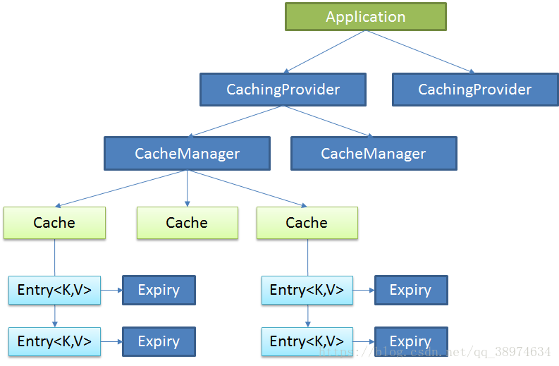


### 2.spring缓存抽象

Spring从3.1开始定义了org.springframework.cache.Cache和org.springframework.cache.CacheManager接口来统一不同的缓存技术；并支持使用JCache（JSR-107）注解简化我们开发

1 Cache接口为缓存的组件规范定义，包含缓存的各种操作集合

2 Cache接口下Spring提供了各种xxxCache的实现,如RedisCache,EhCacheCache , ConcurrentMapCache等；每次调用需要缓存功能的方法时，Spring会检查检查指定参数的指定的目标方法是否已经被调用过；如果有就直接从缓存中获取方法调用后的结果，如果没有就调用方法并缓存结果返回给用户。下次直接从缓存中获取。

3 使用Spring缓存抽象时我们需要关注以下两点；

1. 确定方法需要被缓存以及他们的缓存策略  
2. 从缓存中读取之前缓存存储的数据

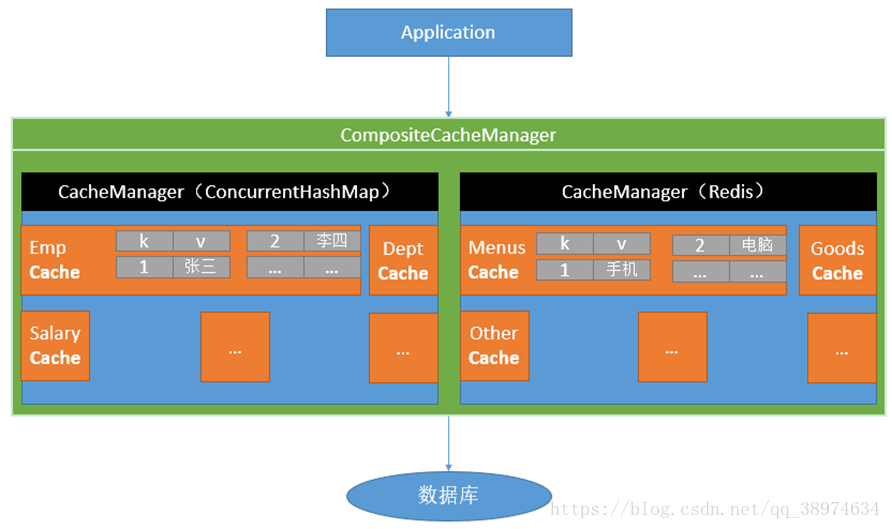


### 3.缓存注解

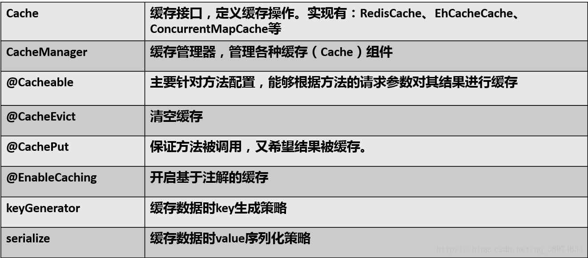


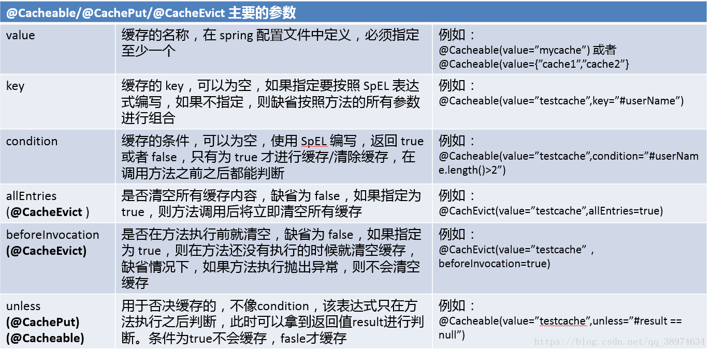


同样支持spel表达式

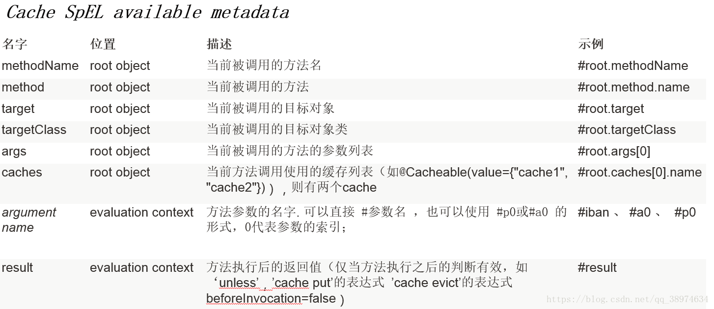


### 4.spring 支持的CacheManager

针对不同的缓存技术，需要实现不同的CacheManager ,spring 定义了如下表的CacheManager实现。

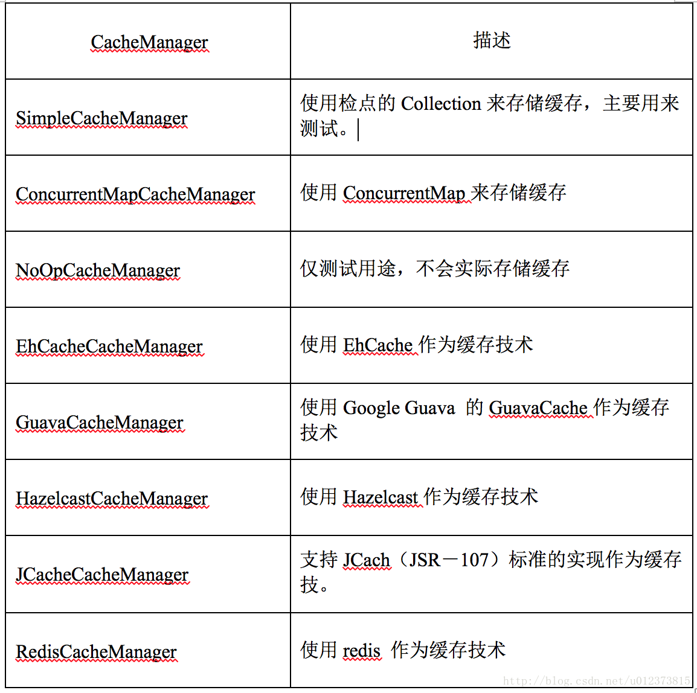


### 5.缓存使用(guavaCacheManager)

要在Springboot中使用缓存需要以下几步:

第一步： 导入spring-boot-starter-cache模块

```xml
 <!-- 结合guava 配置Spring Cache -->
        <dependency>
            <groupId>org.springframework.boot</groupId>
            <artifactId>spring-boot-starter-cache</artifactId>
            <version>2.0.0.RELEASE</version>
        </dependency>
        <dependency>
            <groupId>com.google.guava</groupId>
            <artifactId>guava</artifactId>
            <version>25.0-jre</version>
        </dependency>
```


第二步： @EnableCaching开启缓存

```java
@Configuration
public class ReferenceConfiguration {
    @Configuration
    @EnableCaching
    public class GuavaCacheConfig{
        /**
         *  设置spring Cache 管理器，设置失效时间 300s
         * @return
         */
        @Bean
        public CacheManager cacheManager(){
            GuavaCacheManager cacheManager = new GuavaCacheManager();
            cacheManager.setCacheBuilder(
                    CacheBuilder.newBuilder()
                            .expireAfterAccess(300, TimeUnit.SECONDS)
                            .maximumSize(1000)
                );
            return cacheManager;
        }
    }
}

@EnableCaching
public class Main {}
```


  第三步： 使用缓存注解

```java
 @Cacheable(value = "merchants",key = "#merchantInfoId",unless = "#result==null")
 public MerchantInfoDef getMerchantInfoByPK(String merchantInfoId){
        return merchantInfoService.queryMerchantInfoByPK(merchantInfoId);
 }
```


### 6.优缺点

优点

- 方便快捷高效，可直接嵌入多个现有的 cache 实现，简写了很多代码，可观性非常强。

缺点

1. 内部调用，非 public 方法上使用注解，会导致缓存无效。由于 SpringCache 是基于 Spring AOP 的动态代理实现，由于代理本身的问题，当同一个类中调用另一个方法，会导致另一个方法的缓存不能使用，这个在编码上需要注意，避免在同一个类中这样调用。如果非要这样做，可以通过再次代理调用，如 ((Category)AopContext.currentProxy()).get(category) 这样避免缓存无效。
2. 不能支持多级缓存设置，如默认到本地缓存取数据，本地缓存没有则去远端缓存取数据，然后远程缓存取回来数据再存到本地缓存。


### spring cache 注解内部方法失效


失效案例：

```java
 @Cacheable(value = "payGlobalParamsControls",key = "#code",unless = "#result == null")
    public  PayGlobalParamsControl getPayGlobalParamsControl(String code){
       return  payGlobalParamsControlService.selectByCode(code);
    }

 public RiskCheckDTO checkRisk(RiskCheckDTO dto) {
     // 调用cache缓存方法失效 没有起作用
     PayGlobalParamsControl ctrl =  getPayGlobalParamsControl(LIMIT_PLATFROM_RISK);
     String platFromLimit = ctrl == null ? riskDefaultReleaseCode : ctrl.getValue();
 ......
 }


========================================
    
@CacheEvict(value = "groupUserCached", key = "'user_status_' + #userId")
    public void removeGroupUserStatusCached(long userId) {
        logger.info("removeGroupUserStatusCached, userId is {}", userId);
    }

    /**
     * 支付成功新客变老客
     * @param userId
     */
    public void updateUserStatusToOld(Long userId){
        GroupUserDO groupUserDO = new GroupUserDO();
        groupUserDO.setUserId(userId);
        groupUserDO.setStatus(GroupUserStatus.OLD_USER.getStatus());
        int result = groupUserDao.updateStatusByUserId(groupUserDO);
        if(result > 0){
            this.unLockGroupUser(userId);
            this.removeGroupUserStatusCached(userId);
            logger.info("【新客变老客】会员状态更新成功, userId：{}", userId);
        }else{
            logger.info("【新客变老客】会员状态更新失败, userId：{}", userId);
        }
    }
方法updateUserStatusToOld调用了注解方法removeGroupUserStatusCached，但是方法removeGroupUserStatusCached没有生效
```


spring cache的实现原理跟spring的事物管理类似，都是**基于AOP的动态代理实现的**：即都在方法调用前后
去获取方法的名称、参数、返回值，然后根据方法名称、参数生成缓存的key(自定义的key例外)，进行缓存。

当调用代理的方法时,代理可以整体控制实际的方法的入参和返回值。比如缓存结果**,直接跳过**执行实际的方法等。


内部直接调用注解方法，**如果是在同一个类的内部直接调用的话，调用的是this.注解的内部方法，其中this是当前类的实例，不会走代理。因此，注解缓存不会生效。**


#### 解决方法：

1. 可以把注解修饰的内部方法（getPayGlobalParamsControl removeGroupUserStatusCached）方法单独抽取到另外一个类里面，通过代理类引入。

2. 通过  ((XXX) AopContext.currentProxy() ).getPayGlobalParamsControl方法获取当前类的代理类；
3. 通过ApplicationContext获取当前类的代理对象，XXX  xxx = springContextUtil.getBean(XXX.class);


## sping Hystrix


```java
@Service
public class GreetingService {
    @HystrixCommand(
            fallbackMethod = "defaultGreeting",
            ignoreExceptions = RuntimeException.class

    )
    public String getGreeting(String username) {
       return Optional.ofNullable(new RestTemplate()
                .getForObject("http://localhost:9090/greeting/{username}",
                        String.class, username))
                .orElseThrow( ()-> new RuntimeException("request fail"));
    }

    private String defaultGreeting(String username) {
        return "Hello User!";
    }
}
```


>Normally a @HytrixCommand annotated method is executed **in a thread pool context.** But sometimes it needs to be running in **a local scope, for example, a @SessionScope or a @RequestScope**. This can be done via giving arguments to the command annotation:
>
>@HystrixCommand(fallbackMethod = "getSomeDefault", commandProperties = {
>  @HystrixProperty(name = "execution.isolation.strategy", value = "SEMAPHORE")
>})


```java

import org.springframework.aop.framework.AdvisedSupport;
import org.springframework.aop.framework.AopProxy;
import org.springframework.aop.support.AopUtils;

import java.lang.reflect.Field;

/**
 * @author yuanhaijie
 */
public class AopTargetUtils {
    /**
     * 获取 目标对象
     *
     * @param proxy 代理对象
     * @return
     * @throws Exception
     */
    public static Object getTarget(Object proxy) throws Exception {
        if (!AopUtils.isAopProxy(proxy)) {
            return proxy;//不是代理对象
        }
        Class<?> targetClass = AopUtils.getTargetClass(proxy);
        if (AopUtils.isJdkDynamicProxy(proxy)) {
            return getJdkDynamicProxyTargetObject(proxy);
        } else { //cglib
            return getCglibProxyTargetObject(proxy);
        }
    }

    private static Object getCglibProxyTargetObject(Object proxy) throws Exception {
        Field h = proxy.getClass().getDeclaredField("CGLIB$CALLBACK_0");
        h.setAccessible(true);
        Object dynamicAdvisedInterceptor = h.get(proxy);
        Field advised = dynamicAdvisedInterceptor.getClass().getDeclaredField("advised");
        advised.setAccessible(true);
        Object target = ((AdvisedSupport) advised.get(dynamicAdvisedInterceptor)).getTargetSource().getTarget();
        return target;
    }


    private static Object getJdkDynamicProxyTargetObject(Object proxy) throws Exception {
        Field h = proxy.getClass().getSuperclass().getDeclaredField("h"); //InvocationHandler h (JdkDynamicAopProxy)
        h.setAccessible(true);

        //proxy.h的值是一个JdkDynamicAopProxy 对象   获取JdkDynamicAopProxy.advised的值advisedSupport（AdvisedSupport类型）
        //advisedSupport.getTargetSource().getTarget();
        AopProxy aopProxy = (AopProxy) h.get(proxy);//JdkDynamicAopProxy 对象
        Field advised = aopProxy.getClass().getDeclaredField("advised");
        advised.setAccessible(true);
        Object target = ((AdvisedSupport) advised.get(aopProxy)).getTargetSource().getTarget();

        return getTarget(target);
    }
}


```


```java
 public static Map<String, String> parseRequestXml(HttpServletRequest request) {
        // 解析结果存储在HashMap
        Map<String, String> map = new HashMap<String, String>();
        InputStream inputStream = null;
        try {
            inputStream = request.getInputStream();
            // 读取输入流
            SAXReader reader = new SAXReader();

            //====weixin xml解析漏洞修复
            reader.setFeature("http://apache.org/xml/features/disallow-doctype-decl", true);
            reader.setFeature("http://xml.org/sax/features/external-general-entities", false);
            reader.setFeature("http://xml.org/sax/features/external-parameter-entities", false);

            Document document = reader.read(inputStream);
            // 得到xml根元素
            Element root = document.getRootElement();
            // 得到根元素的所有子节点
            List<Element> elementList = root.elements();
            // 遍历所有子节点
            for (Element e : elementList) {
                map.put(e.getName(), e.getTextTrim());
            }
        } catch (Exception e) {
            LOG.error(e.getMessage());
        } finally {
            // 释放资源
            if (inputStream != null) {
                try {
                    inputStream.close();
                } catch (IOException e) {
                    LOG.error(e.getMessage());
                }
            }
            inputStream = null;
        }
        return map;
    }
```


# ISSUE

## Apache HttpClient 没有设置time out导致应用长时间阻塞的问题

Apache HttpClient应该是最常用的Java http组件了。这货有个坑爹的地方，Apache HttpClient如果对方不回应，或者网络原因不返回了，那么HttpClient会一直阻塞。这种情况在公网可能比较容易碰到。

因为Http Client默认的SO_TIMEOUT是0，即一直等待。

Apache HttpClient的示例也没提到要设置TimeOut，这也是比较坑爹的地方。一个库如果没有默认阻止用户去范错误，那么你也应当在文档，示例代码里提醒用户不要范错误


有三个可以设置time out 的参数：

```java
httpClient = new DefaultHttpClient();  httpClient.getParams().setIntParameter(CoreConnectionPNames.SO_LINGER, value)  httpClient.getParams().setIntParameter(CoreConnectionPNames.SO_TIMEOUT, 3000);  
```

参考：

[Apache HttpClient 没有设置time out导致应用长时间阻塞的问题](http://www.importnew.com/22952.html)