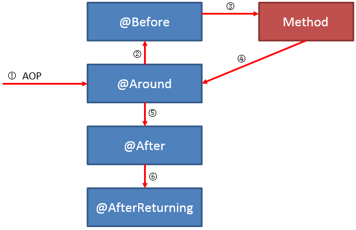

😈  🙂

```
this.applicationContext.getBeansWithAnnotation(MessageListener.class);
```

# 😈 maven 

```xml
<dependency>
	<groupId>org.codehaus.groovy</groupId>
	<artifactId>groovy-all</artifactId>
	<version>2.5.4</version>
	<type>pom</type>
	<scope>provided</scope>
</dependency>
<dependency>
      <groupId>org.apache.commons</groupId>
      <artifactId>commons-lang3</artifactId>
      <version>3.8</version>
</dependency>


<dependency>
            <groupId>ma.glasnost.orika</groupId>
            <artifactId>orika-core</artifactId>
            <version>1.5.2</version><!-- or latest version -->
</dependency>

     <!--  spring retry  -->
        <dependency>
            <groupId>org.springframework.retry</groupId>
            <artifactId>spring-retry</artifactId>
        </dependency>
        <dependency>
            <groupId>org.springframework.boot</groupId>
            <artifactId>spring-boot-starter-aop</artifactId>
        </dependency>


<!-- 规则引擎-->
<dependency>
  <groupId>org.jeasy</groupId>
  <artifactId>easy-rules-core</artifactId>
  <version>3.2.0</version>
</dependency>

<dependency>
 	<groupId>org.codehaus.groovy</groupId>
 	<artifactId>groovy-all</artifactId>
 	<version>2.5.4</version>
 	<type>pom</type>
 	<scope>provided</scope>
</dependency>

<!--  支付 UnitRuleGroup-->
<dependency>
  <groupId>org.jeasy</groupId>
  <artifactId>easy-rules-support</artifactId>
  <version>3.2.0</version>
</dependency>

<!-- 支付读取yml配置的规则-->
<dependency>
  <groupId>org.jeasy</groupId>
  <artifactId>easy-rules-mvel</artifactId>
  <version>3.2.0</version>
</dependency>	


<!-- https://mvnrepository.com/artifact/org.projectlombok/lombok -->
<dependency>
	<groupId>org.projectlombok</groupId>
	<artifactId>lombok</artifactId>
	<version>1.18.2</version>
	<scope>provided</scope>
</dependency>
```


[spring-Scheduled   CronSequenceGenerator](https://docs.spring.io/spring/docs/current/javadoc-api/org/springframework/scheduling/support/CronSequenceGenerator.html)


## plugin

[Java 代码规约扫描插件 ](https://github.com/alibaba/p3c/wiki/IDEA插件使用文档)


# 😈  nginx

```nginx
在ng的pay.lvmama.com域名http和https两个协议server下添加如下location
location /channel {           
 proxy_pass   http://http_payment_channel_servers/channel/;
} 

upstream http_payment_channel_servers{
        server 192.168.10.51:8083;
	server 192.168.30.238:8083;
}
```


# 😈 ZooKeeper


>[curator api](https://www.jianshu.com/p/8311bff69f7c)
>
>

# 😈  linux

```shell
[qa@testtech4-195 ~]$ printf %d  0xac
172
[qa@testtech4-195 ~]$ printf %0x 172
ac


```


😈 

```

AopUtils				package org.springframework.util;
AopTargetUtils
AnnotationUtils			org.springframework.core.annotation
BeanUtils				org.springframework.beans
BeanUtils				org.apache.commons.beanutils
ClassHelper				org.apache.dubbo.common.utils
Collections				java.util
ObjectUtils				package org.springframework.util;
ReflectUtils			org.apache.dubbo.common.utils
ReflectionUtils			org.springframework.util
StringUtils				org.springframework.util
StringUtils				org.apache.dubbo.common.utils
NetUtils				com.alibaba.dubbo.common.utils
```


```
AopUtils.isAopProxy(proxy)
可以判断一个对象是不是代理对象(JDK代理 cglib代理)
Class<?> targetClass = AopUtils.getTargetClass(proxy);
获取一个代理对象的实际对象的class
AnnotationUtils.getAnnotation() 
Objects.equals() 
StringUtils.collectionToCommaDelimitedString
ClassHelper.getClassLoader
class.isAssignableFrom(cls) class是否cls或cls的父类、父接口
class.isAnnotationPresent(annotation) class上是否存在annotation注解
class.isInterface()
if (method.getName().startsWith("set")
                            && method.getParameterTypes().length == 1
                            && Modifier.isPublic(method.getModifiers()))
ClassHelper.isGetter(method) 
ReflectUtils.isPrimitives(clazz)
Collections.sort()
Collections.unmodifiableList(list);
StringUtils.camelToSplitName("ThisIsADemoStr",".")-->this.is.a.demo.str  
ReflectionUtils.makeAccessible(Constructor); 
BeanUtils.instantiateClass(class) 实例化一个指定class class不能是一个接口  Instantiate a class using its no-arg constructor.
BeanUtils.findMethodWithMinimalParameters(class,methodName ) //匹配 方法名相同，参数最少的方法
BeanUtils.cloneBean()
```


😈 

Assert.isInstanceOf(ConfigurableEnvironment.class, environment);
Assert.notNull(prefix, "The prefix of Configuration Properties must not be null");
Assert.notEmpty()                                                                                                                                                             Assert.isTrue                                                                                                                                                       Assert.assertEquals("hello", applicationConfig.getName());

😈 

😈 


😈 
集合

CollectionUtils.isEmpty(properties)
Collections.singleton(resolveSingleBeanName(properties, configClass, registry));  // java.util.Collections

SortedMap<String, Object> dubboProperties = new TreeMap<>();                                                                                            return Collections.unmodifiableSortedMap(dubboProperties); 

Collections.unmodifiableMap(map) //返回指定map的一个只读(read-only)视图


😈 获取类加载器

1. Thread.currentThread().getContextClassLoader()
2. ClassUtils.class.getClassLoader(); // No thread context class loader -> use class loader of this class.    XXX.class.getClassLoader();
3. ClassLoader.getSystemClassLoader();  //getClassLoader() returning null indicates the bootstrap ClassLoader

```java
public static ClassLoader getDefaultClassLoader() {
	ClassLoader cl = null;
	try {
		cl = Thread.currentThread().getContextClassLoader();
	}
	catch (Throwable ex) {
		// Cannot access thread context ClassLoader - falling back...
	}
	if (cl == null) {
		// No thread context class loader -> use class loader of this class.
		cl = ClassUtils.class.getClassLoader();
		if (cl == null) {
			// getClassLoader() returning null indicates the bootstrap ClassLoader
			try {
				cl = ClassLoader.getSystemClassLoader();
			}
			catch (Throwable ex) {
				// Cannot access system ClassLoader - oh well, maybe the caller can live with null...
			}
		}
	}
	return cl;
}
```


attribute.getValue() instanceof String[]


Map<Class<? extends Annotation>, List<Method>>


# 😈  Concurrency

### SynchronousQueue

[SynchronousQueue](http://docs.oracle.com/javase/6/docs/api/java/util/concurrent/SynchronousQueue.html)是一个没有数据缓冲的[BlockingQueue](http://docs.oracle.com/javase/6/docs/api/java/util/concurrent/BlockingQueue.html)，生产者线程对其的插入操作put必须等待消费者的移除操作take，反过来也一样

1. 不像ArrayBlockingQueue或LinkedListBlockingQueue，SynchronousQueue内部并**没有数据缓存空间**，你不能调用peek()方法来看队列中是否有数据元素
2. 遍历这个队列的操作也是不允许的
3. 队列头元素是第一个排队要插入数据的**线程**，而**不是要交换的数据**。数据是在配对的生产者和消费者线程之间直接传递的，并不会将数据缓冲数据到队列中。可以这样来理解：生产者和消费者互相等待对方，握手，然后**一起**离开。


> 参考   [SynchronousQueue](http://ifeve.com/java-synchronousqueue/) 


### sleep/wait/notify

1. sleep

   sleep是**线程类（Thread）的方法**，导致此线程暂停执行指定时间，给执行机会给其他线程，但是监控状态依然保持，到时后会自动恢复。**调用sleep不会释放对象锁**。

   sleep就是正在执行的线程主动让出cpu，cpu去执行其他线程，在sleep指定的时间过后，cpu才会回到这个线程上继续往下执行，如果当前线程进入了同步锁，sleep方法并不会释放锁，即使当前线程使用sleep方法让出了cpu，但其他被同步锁挡住了的线程也无法得到执行。

2. wait

   wait是**Object类的方法**，对此对象调用wait方法导致本线程放弃对象锁，进入等待此对象的等待锁定池，只有针对此对象发出notify方法（或notifyAll）后，本线程才进入对象锁定池准备获得对象锁进入运行状态。

   wait是指在一个已经进入了同步锁的线程内，让自己暂时让出同步锁，以便**其他**正在等待此锁的**线程可以得到同步锁并运行**，只有其他线程调用了notify方法（**notify并不释放锁，只是告诉调用过wait方法的线程可以去参与获得锁的竞争了，但不是马上得到锁，因为锁还在别人手里，别人还没释放**。如果notify方法后面的代码还有很多，需要这些代码执行完后才会释放锁，可以在notfiy方法后增加一个等待和一些代码，看看效果），调用wait方法的线程就会解除wait状态和程序可以再次得到锁后继续向下运行。


### Semaphore

Semaphore是一种计数信号量，用于管理一组资源，内部是基于AQS的共享模式。它相当于给线程规定一个量从而控制允许活动的线程数。 从概念上讲信号量维护了一个**许可集**,只有当资源获取许可以后即(得到相应的acquire)才会执行相应的操作,**否则就为等待的状态**,在释放release之后 下一个相应的线程才会进入方法之中,semaphore并**不使用实际的许可对象**,只是仅仅的进行技术,并采取相应的行动,限制访问某些资源的线程数目

Semaphore主要方法：

1. Semaphore(int permits):构造方法，创建具有给定许可数的计数信号量并设置为非公平信号量。
2. Semaphore(int permits,boolean fair):构造方法，当fair等于true时，创建具有给定许可数的计数信号量并设置为公平信号量
3. void acquire():从此信号量获取一个许可前线程将一直阻塞。
4. void acquire(int n):从此信号量获取给定数目许可，在提供这些许可前一直将线程阻塞。
5. void release():释放一个许可，将其返回给信号量。
6. void release(int n):释放n个许可。
7. int availablePermits()：当前可用的许可数。

关于semaphore的参数值问题new Semaphore(0);

>```
>fred = Semaphore(1)
>```
>
>The function `Semaphore` is a constructor; it creates and returns a new Semaphore. **The initial value of the semaphore is passed as a parameter to the constructor.**
>
>If the value is positive, then it represents the number of threads that can decrement without blocking. If it is negative, then it represents the number of threads that have blocked and are waiting. **If the value is zero, it means there are no threads waiting, but if a thread tries to decrement, it will block.**
>
>[Semaphore(0)问题](https://stackoverflow.com/questions/14793416/zero-permit-semaphores)
>
>


>[seamphore 停车场](https://blog.csdn.net/carson0408/article/details/79475723 )


# 线程

Executors.newSingleThreadExecutor().execute


# jvm

### jstack

1、top后按c查看最耗cpu的进程，得到pid

2、top -Hp pid 查看该进程里的线程资源使用情况，找到最耗资源的线程的pid

3、jstack pid来查看进程的各个线程栈，注意这里的pid是第一步中进程的pid，不是第二步得到的线程id

4、将第二步得到的pid转成16进制之后在线程栈信息里查找nid等于pid16进制的，就找到最耗资源的线程的栈信息

5、在thread dump中每个线程都有一个nid，找到对应的nid即可；隔段时间再执行一次stack命令获取thread dump，区分两份dump是否有差别，在nid=0x246c的线程调用栈中，发现该线程一直在执行JstackCase类第33行的calculate方法，得到这个信息，就可以检查对应的代码是否有问题 ( printf %0x  pid 把pid转为十六进制)

参考：

[如何使用jstack分析线程状态](https://www.jianshu.com/p/6690f7e92f27)


# 😈 queue

 java Queue中 add/offer，element/peek，remove/poll中的三个方法均为重复的方法，在选择使用时不免有所疑惑，这里简单区别一下：

1、add()和offer()区别:

add()和offer()都是向队列中添加一个元素。一些队列有大小限制，因此如果想在一个满的队列中加入一个新项，调用 add() 方法就会抛出一个 unchecked 异常，而调用 offer() 方法会返回 false。因此就可以在程序中进行有效的判断！

 2、poll()和remove()区别：

remove() 和 poll() 方法都是从队列中删除第一个元素。如果队列元素为空，调用remove() 的行为与 Collection 接口的版本相似会抛出异常，但是新的 poll() 方法在用空集合调用时只是返回 null。因此新的方法更适合容易出现异常条件的情况。

3、element() 和 peek() 区别：

element() 和 peek() 用于在队列的头部查询元素。与 remove() 方法类似，在队列为空时， element() 抛出一个异常，而 peek() 返回 null。
下面是Java中Queue的一些常用方法：
add         增加一个元索                      如果队列已满，则抛出一个IIIegaISlabEepeplian异常
remove   移除并返回队列头部的元素     如果队列为空，则抛出一个NoSuchElementException异常
element  返回队列头部的元素              如果队列为空，则抛出一个NoSuchElementException异常
offer       添加一个元素并返回true        如果队列已满，则返回false
poll         移除并返问队列头部的元素     如果队列为空，则返回null
peek       返回队列头部的元素              如果队列为空，则返回null
put         添加一个元素                       如果队列满，则阻塞                                                                                                take        移除并返回队列头部的元素    

---------------------


# 😈 Class

class.isAnonymousClass() 

class.getSuperclass()  //返回class代表的实体类的父类class

class.getGenericSuperclass()  

class.isInterface()

class.isAnnotationPresent(SPI.class)  是否有SPI注解

```
if ("getParameters".equals(name)// Map public getParameters()
        && Modifier.isPublic(method.getModifiers())
        && method.getParameterTypes().length == 0
        && method.getReturnType() == Map.class)
```

wrapper类

```java
public class XxxProtocolWrapper implements Protocol {
    Protocol impl;
 
    public XxxProtocolWrapper(Protocol protocol) { impl = protocol; }
 
    // 接口方法做一个操作后，再调用extension的方法
    public void refer() {
        //... 一些操作
        impl.refer();
        // ... 一些操作
    }
 
    // ...
}
```


java

```java
private static final Pattern NAME_SEPARATOR = Pattern.compile("\\s*[,]+\\s*");
String[] names = NAME_SEPARATOR.split(value);
```


# 😈 雪花算法(snowflake)

### 1.雪花算法


Twitter_Snowflake<br>
 * SnowFlake的结构如下(每部分用-分开):<br>
 * 0 - 0000000000 0000000000 0000000000 0000000000 0 - 00000 - 00000 - 000000000000 <br>
 * 1位标识，由于long基本类型在Java中是带符号的，最高位是符号位，正数是0，负数是1，所以id一般是正数，最高位是0<br>
 * 41位时间截(毫秒级)，注意，**41位时间截不是存储当前时间的时间截，而是存储时间截的差值**（当前时间截 - 开始时间截)得到的值，这里的的开始时间截，一般是我们的id生成器开始使用的时间，由我们程序来指定的（如下下面程序IdWorker类的startTime属性）。41位的时间截，可以使用69年，年T = (1L << 41) / (1000L * 60 * 60 * 24 * 365) = 69<br>
 * 10位的数据机器位，可以部署在1024个节点，包括5位datacenterId和5位workerId<br>
 * 12位序列，毫秒内的计数，12位的计数顺序号支持每个节点每毫秒(同一机器，同一时间截)产生4096个ID序号<br>
 * 加起来刚好64位，为一个Long型。<br>
 * SnowFlake的优点是，**整体上按照时间自增排序**，并且整个分布式系统内不会产生ID碰撞(由数据中心ID和机器ID作区分)，并且效率较高，经测试，SnowFlake每秒能够产生26万ID左右。
---------------------
```java
import com.google.common.base.Preconditions;

public class SnowflakeIdWorker {
    // ==============================Fields===========================================
    /** 开始时间截 (2019-04-15 14-11-12) */
    private final long twepoch = 1555308671804L;

    /** 机器id所占的位数 */
    private final long workerIdBits = 5L;

    /** 数据标识id所占的位数 */
    private final long dataCenterIdBits = 5L;

    /** 支持的最大机器id，结果是31 (这个移位算法可以很快的计算出几位二进制数所能表示的最大十进制数) */
    private final long maxWorkerId = -1L ^ (-1L << workerIdBits);

    /** 支持的最大数据标识id，结果是31 */
    private final long maxDataCenterId = -1L ^ (-1L << dataCenterIdBits);


    /** 序列在id中占的位数 */
    private final long sequenceBits = 12L;

    /** 机器ID向左移12位 */
    private final long workerIdShift = sequenceBits;

    /** 生成序列的掩码，这里为4095 (0b111111111111=0xfff=4095) */
    private final long sequenceMask = -1L ^ (-1L << sequenceBits);


    /** 数据标识id向左移17位(12+5) */
    private final long dataCenterIdShift = sequenceBits + workerIdBits;

    /** 时间截向左移22位(5+5+12) */
    private final long timestampLeftShift = sequenceBits + workerIdBits + dataCenterIdBits;


    /** 工作机器ID(0-31) */
    private long workerId;

    /** 数据中心ID(0-31) */
    private long dataCenterId;

    /** 毫秒内序列(0-4095) */
    private long sequence = 0L;

    /** 上次生成ID的时间截 */
    private long lastTimestamp = -1L;


    //==============================Constructors=====================================

    /**
     *
     * @param workerId
     * @param dataCenterId
     */
    public SnowflakeIdWorker(long workerId, long dataCenterId) {
       Preconditions.checkArgument(workerId >= 0L && workerId < maxWorkerId,
                String.format("workerId can't be greater than %d or less than 0", maxWorkerId));
        if(dataCenterId > maxDataCenterId || dataCenterId < 0 ){
            throw new IllegalArgumentException(String.format("dataCenterId can't be greater than %d or less than 0", maxDataCenterId));
        }
        this.workerId = workerId;
        this.dataCenterId = dataCenterId;
    }


// ==============================Methods==========================================
    /**
     * 返回以毫秒为单位的当前时间
     * @return 当前时间(毫秒)
     */
    protected long timeGen() {
        return System.currentTimeMillis();
    }
    public synchronized long nextId(){
        long timestamp = timeGen();
        //如果当前时间小于上一次ID生成的时间戳，说明系统时钟回退过这个时候应当抛出异常
        if (timestamp < lastTimestamp) {
            throw new RuntimeException( String.format("Clock moved backwards.  Refusing to generate id for %d milliseconds", lastTimestamp - timestamp));
        }
        //如果是同一时间生成的，则进行毫秒内序列
        if (lastTimestamp == timestamp) {
            // 如果超过（2^12=4096 即最大值是4095  超过4095的数 & 4095  = 0）
            sequence = (sequence + 1) & sequenceMask;
            if (sequence == 0) {
                //阻塞到下一个毫秒,获得新的时间戳
                timestamp = tilNextMillis(lastTimestamp);
            }
        }else{//时间戳改变，毫秒内序列重置 重新从0开始
            sequence = 0L;
        }

        //上次生成ID的时间截
        lastTimestamp = timestamp;

        //移位并通过或运算拼到一起组成64位的ID
        return ((timestamp - twepoch) << timestampLeftShift)
                | (dataCenterId << dataCenterIdShift)
                | (workerId << workerIdShift)
                | sequence;

    }

    /**
     *  阻塞到下一个毫秒，直到获得新的时间戳
     * @param lastTimestamp
     * @return
     */
    protected long tilNextMillis(long lastTimestamp) {
        long timestamp = timeGen();
        while (timestamp <= lastTimestamp) {
            timestamp = timeGen();
        }
        return timestamp;
    }


    //==============================Test=============================================
    /** 测试 */
    public static void main(String[] args) {
        System.out.println(System.currentTimeMillis());
        SnowflakeIdWorker idWorker = new SnowflakeIdWorker(30, 30);
        long startTime = System.nanoTime();
        for (int i = 0; i < 50000; i++) {
            long id = idWorker.next
                Id();
            System.out.println(id);
        }
        System.out.println((System.nanoTime()-startTime)/1000000+"ms");
    }


}

```


版本二：

```java
import com.google.common.base.Preconditions;

import java.net.InetAddress;
import java.net.UnknownHostException;
import java.util.Calendar;

public class DefaultKeyGenerator {
    public static final long EPOCH;

    // 自增长序列的长度（单位是位时的长度）
    private static final long SEQUENCE_BITS = 12L;

    // workerId的长度（单位是位时的长度）
    private static final long WORKER_ID_BITS = 10L;

    private static final long SEQUENCE_MASK = (1 << SEQUENCE_BITS) - 1;

    private static final long WORKER_ID_LEFT_SHIFT_BITS = SEQUENCE_BITS;

    private static final long TIMESTAMP_LEFT_SHIFT_BITS = WORKER_ID_LEFT_SHIFT_BITS + WORKER_ID_BITS;

    // 位运算计算workerId的最大值（workerId占10位，那么1向左移10位就是workerId的最大值）
    private static final long WORKER_ID_MAX_VALUE = 1L << WORKER_ID_BITS;

    private static TimeService timeService = new TimeService();

    private static long workerId;

    // EPOCH就是起始时间，从2016-11-01 00:00:00开始的毫秒数
    static {
        Calendar calendar = Calendar.getInstance();
        calendar.set(2016, Calendar.NOVEMBER, 1);
        calendar.set(Calendar.HOUR_OF_DAY, 0);
        calendar.set(Calendar.MINUTE, 0);
        calendar.set(Calendar.SECOND, 0);
        calendar.set(Calendar.MILLISECOND, 0);
        EPOCH = calendar.getTimeInMillis();
    }

    private long sequence;

    private long lastTime;

    /**
     * 得到分布式唯一ID需要先设置workerId，workId的值范围[0, 1024)
     * @param workerId work process id
     */
    public static void setWorkerId(final long workerId) {
        // google-guava提供的入参检查方法：workerId只能在0~WORKER_ID_MAX_VALUE之间；
        Preconditions.checkArgument(workerId >= 0L && workerId < WORKER_ID_MAX_VALUE);
        DefaultKeyGenerator.workerId = workerId;
    }

    /**
     * 调用该方法，得到分布式唯一ID
     * @return key type is @{@link Long}.
     */
//    @Override
    public synchronized Number generateKey() {
        long currentMillis = timeService.getCurrentMillis();
        // 每次取分布式唯一ID的时间不能少于上一次取时的时间
        Preconditions.checkState(lastTime <= currentMillis, "Clock is moving backwards, last time is %d milliseconds, current time is %d milliseconds", lastTime, currentMillis);
        // 如果同一毫秒范围内，那么自增，否则从0开始
        if (lastTime == currentMillis) {
            // 如果自增后的sequence值超过4096，那么等待直到下一个毫秒
            if (0L == (sequence = ++sequence & SEQUENCE_MASK)) {
                currentMillis = waitUntilNextTime(currentMillis);
            }
        } else {
            sequence = 0;
        }
        // 更新lastTime的值，即最后一次获取分布式唯一ID的时间
        lastTime = currentMillis;
        // 从这里可知分布式唯一ID的组成部分；
        return ((currentMillis - EPOCH) << TIMESTAMP_LEFT_SHIFT_BITS) | (workerId << WORKER_ID_LEFT_SHIFT_BITS) | sequence;
    }

    // 获取下一毫秒的方法：死循环获取当前毫秒与lastTime比较，直到大于lastTime的值；
    private long waitUntilNextTime(final long lastTime) {
        long time = timeService.getCurrentMillis();
        while (time <= lastTime) {
            time = timeService.getCurrentMillis();
        }
        return time;
    }


static   class TimeService {
        public Long getCurrentMillis(){
           return  System.currentTimeMillis();
        }
 }
}        
```


参考：

[ID生成器，Twitter的雪花算法（Java）](https://blog.csdn.net/xiaopeng9275/article/details/72123709)

[sharding-jdbc源码之分布式ID](https://www.jianshu.com/p/7f0661ddd6dd)

[分布式ID增强篇--优化时钟回拨问题](https://www.jianshu.com/p/98c202f64652?utm_campaign=haruki&utm_content=note&utm_medium=reader_share&utm_source=weixin)

### 2.雪花算法缺点

1. 机器ID（5位）和数据中心ID（5位）配置没有解决，分布式部署的时候会使用相同的配置，任然有ID重复的风险。

2. 使用的时候需要实例化对象，没有形成开箱即用的工具类。

3. 时钟回拨问题；强依赖时间，如果时钟回拨，就会生成重复的ID

4. 趋势递增，而不是绝对递增；

   趋势递增并不是严格的，比如，1，2，3，5，4，6，7，8这是趋势递增，5和4由于并发，可能5先插入。而绝对递增必须是1，2，3，4，5，6，7，8。snowflakes算法由于workid这个因素，所以基本上不可能做到绝对递增的。而分布式环境下如果像做到绝对递增，那么必然会引入分布式锁，从而导致性能急剧下降

5. 不能在一台服务器上部署多个分布式ID服务

dsfd

### 3.优化

#### workerID获取

获取workerId的三种方式

```java
//    HostNameKeyGenerator  根据hostname获取，源码如下（HostNameKeyGenerator.java）：

    /**
     * 根据机器名最后的数字编号获取工作进程Id.如果线上机器命名有统一规范,建议使用此种方式.
     * 例如机器的HostName为:dangdang-db-sharding-dev-01(公司名-部门名-服务名-环境名-编号)
     * ,会截取HostName最后的编号01作为workerId.
     *
     * @author DonneyYoung
     **/
    static void initWorkerId() {
        InetAddress address;
        Long workerId;
        try {
            address = InetAddress.getLocalHost();
        } catch (final UnknownHostException e) {
            throw new IllegalStateException("Cannot get LocalHost InetAddress, please check your network!");
        }
        // 先得到服务器的hostname，例如JTCRTVDRA44，linux上可通过命令"cat /proc/sys/kernel/hostname"查看；
        String hostName = address.getHostName();
        try {
            // 计算workerId的方式：
            // 第一步hostName.replaceAll("\\d+$", "")，即去掉hostname后纯数字部分，例如JTCRTVDRA44去掉后就是JTCRTVDRA
            // 第二步hostName.replace(第一步的结果, "")，即将原hostname的非数字部分去掉，得到纯数字部分，就是workerId
            workerId = Long.valueOf(hostName.replace(hostName.replaceAll("\\d+$", ""), ""));
        } catch (final NumberFormatException e) {
            throw new IllegalArgumentException(String.format("Wrong hostname:%s, hostname must be end with number!", hostName));
        }
        DefaultKeyGenerator.setWorkerId(workerId);
    }


//    IPKeyGenerator  根据IP获取，源码如下（IPKeyGenerator.java）

    /**
     * 根据机器IP获取工作进程Id,如果线上机器的IP二进制表示的最后10位不重复,建议使用此种方式
     * ,列如机器的IP为192.168.1.108,二进制表示:11000000 10101000 00000001 01101100
     * ,截取最后10位 01 01101100,转为十进制364,设置workerId为364.
     */
    static void initWorkerId2() {
        InetAddress address;
        try {
            // 首先得到IP地址，例如192.168.1.108
            address = InetAddress.getLocalHost();
        } catch (final UnknownHostException e) {
            throw new IllegalStateException("Cannot get LocalHost InetAddress, please check your network!");
        }
        // IP地址byte[]数组形式，这个byte数组的长度是4，数组0~3下标对应的值分别是192，168，1，108
        byte[] ipAddressByteArray = address.getAddress();
        // 由这里计算workerId源码可知，workId由两部分组成：
        // 第一部分(ipAddressByteArray[ipAddressByteArray.length - 2] & 0B11) << Byte.SIZE：ipAddressByteArray[ipAddressByteArray.length - 2]即取byte[]倒数第二个值，即1，然后&0B11，即只取最后2位（IP段倒数第二个段取2位，IP段最后一位取全部8位，总计10位），然后左移Byte.SIZE，即左移8位（因为这一部分取得的是IP段中倒数第二个段的值）；
        // 第二部分(ipAddressByteArray[ipAddressByteArray.length - 1] & 0xFF)：ipAddressByteArray[ipAddressByteArray.length - 1]即取byte[]最后一位，即108，然后&0xFF，即通过位运算将byte转为int；
        // 最后将第一部分得到的值加上第二部分得到的值就是最终的workId
        DefaultKeyGenerator.setWorkerId((long) (((ipAddressByteArray[ipAddressByteArray.length - 2] & 0B11) << Byte.SIZE) + (ipAddressByteArray[ipAddressByteArray.length - 1] & 0xFF)));
    }

//IPSectionKeyGenerator  根据IP段获取，源码如下（IPSectionKeyGenerator.java）
    /**
     * 浏览 {@link IPKeyGenerator} workerId生成的规则后，感觉对服务器IP后10位（特别是IPV6）数值比较约束.
     *
     * <p>
     * 有以下优化思路：
     * 因为workerId最大限制是2^10，我们生成的workerId只要满足小于最大workerId即可。
     * 1.针对IPV4:
     * ....IP最大 255.255.255.255。而（255+255+255+255) < 1024。
     * ....因此采用IP段数值相加即可生成唯一的workerId，不受IP位限制。
     * 2.针对IPV6:
     * ....IP最大ffff:ffff:ffff:ffff:ffff:ffff:ffff:ffff
     * ....为了保证相加生成出的workerId < 1024,思路是将每个bit位的后6位相加。这样在一定程度上也可以满足workerId不重复的问题。
     * </p>
     * 使用这种IP生成workerId的方法,必须保证IP段相加不能重复
     *
     * @author DogFc
     */
    static void initWorkerId3() {
        InetAddress address;
        try {
            address = InetAddress.getLocalHost();
        } catch (final UnknownHostException e) {
            throw new IllegalStateException("Cannot get LocalHost InetAddress, please check your network!");
        }
        // 得到IP地址的byte[]形式值
        byte[] ipAddressByteArray = address.getAddress();
        long workerId = 0L;
        //如果是IPV4，计算方式是遍历byte[]，然后把每个IP段数值相加得到的结果就是workerId
        if (ipAddressByteArray.length == 4) {
            for (byte byteNum : ipAddressByteArray) {
                workerId += byteNum & 0xFF;
            }
            //如果是IPV6，计算方式是遍历byte[]，然后把每个IP段后6位（& 0B111111 就是得到后6位）数值相加得到的结果就是workerId
        } else if (ipAddressByteArray.length == 16) {
            for (byte byteNum : ipAddressByteArray) {
                workerId += byteNum & 0B111111;
            }
        } else {
            throw new IllegalStateException("Bad LocalHost InetAddress, please check your network!");
        }
        DefaultKeyGenerator.setWorkerId(workerId);
    }

```


#### 时钟回拨问题

snowflake算法给workerId预留了10位，即workId的取值范围为[0, 1023]，事实上实际生产环境不大可能需要部署1024个分布式ID服务，所以：**将workerId取值范围缩小为[0, 511]，[512, 1023]这个范围的workerId当做备用workerId**。workId为0的备用workerId是512，workId为1的备用workerId是513，以此类推……

```java
package com.test.IdGenerator;


import com.google.common.base.Preconditions;
import org.slf4j.Logger;
import org.slf4j.LoggerFactory;

import java.text.SimpleDateFormat;
import java.util.Calendar;
import java.util.Date;
import java.util.Map;
import java.util.concurrent.ConcurrentHashMap;

// snowflake 优化时间回拨
public class MyKeyGenerator {
    private static Logger log = LoggerFactory.getLogger(DefaultKeyGenerator2.class);
    private static final long EPOCH;

    private static final long SEQUENCE_BITS = 12L;

    private static final long WORKER_ID_BITS = 10L;

    private static final long SEQUENCE_MASK = (1 << SEQUENCE_BITS) - 1;

    private static final long WORKER_ID_LEFT_SHIFT_BITS = SEQUENCE_BITS;

    private static final long TIMESTAMP_LEFT_SHIFT_BITS = WORKER_ID_LEFT_SHIFT_BITS + WORKER_ID_BITS;

    /**
     * 每台workerId服务器有3个备份workerId, 备份workerId数量越多, 可靠性越高, 但是可部署的sequence ID服务越少
     */
    private static final long BACKUP_COUNT = 3;

    /**
     * 实际的最大workerId的值<br/>
     * workerId原则上上限为1024, 但是需要为每台sequence服务预留BACKUP_AMOUNT个workerId,
     */
    private static final long WORKER_ID_MAX_VALUE = (1L << WORKER_ID_BITS) / (BACKUP_COUNT + 1);

    /**
     * 目前用户生成ID的workerId
     */
    private static long workerId;

    static {
        Calendar calendar = Calendar.getInstance();
        calendar.set(2018, Calendar.NOVEMBER, 1);
        calendar.set(Calendar.HOUR_OF_DAY, 0);
        calendar.set(Calendar.MINUTE, 0);
        calendar.set(Calendar.SECOND, 0);
        calendar.set(Calendar.MILLISECOND, 0);
        // EPOCH是服务器第一次上线时间点, 设置后不允许修改
        EPOCH = calendar.getTimeInMillis();
    }

    private long sequence;

    private long lastTime;

    /**
     * 保留workerId和lastTime, 以及备用workerId和其对应的lastTime
     */
    private static Map<Long, Long> workerIdLastTimeMap = new ConcurrentHashMap<>();

    static {
        // 初始化workerId和其所有备份workerId与lastTime
        // 假设workerId为0且BACKUP_AMOUNT为4, 那么map的值为: {0:0L, 256:0L, 512:0L, 768:0L}
        // 假设workerId为2且BACKUP_AMOUNT为4, 那么map的值为: {2:0L, 258:0L, 514:0L, 770:0L}
        for (int i = 0; i<= BACKUP_COUNT; i++){
            workerIdLastTimeMap.put(workerId + (i * WORKER_ID_MAX_VALUE), 0L);
        }
        System.out.println("workerIdLastTimeMap:" + workerIdLastTimeMap);
    }

    /**
     * 最大容忍时间, 单位毫秒, 即如果时钟只是回拨了该变量指定的时间, 那么等待相应的时间即可;
     * 考虑到sequence服务的高性能, 这个值不易过大
     */
    private static final long MAX_BACKWARD_MS = 3;

    /**
     * Set work process id.
     * @param workerId work process id
     */
    public static void setWorkerId(final long workerId) {
        Preconditions.checkArgument(workerId >= 0L && workerId < WORKER_ID_MAX_VALUE);
        MyKeyGenerator.workerId = workerId;
    }

    /**
     * Generate key. 考虑时钟回拨, 与sharding-jdbc源码的区别就在这里</br>
     * 缺陷: 如果连续两次时钟回拨, 可能还是会有问题, 但是这种概率极低极低
     */
    public synchronized Number generateKey() {
        long currentMillis = System.currentTimeMillis();

        // 当发生时钟回拨时
        if (lastTime > currentMillis){
            // 如果时钟回拨在可接受范围内, 等待即可
            if (lastTime - currentMillis < MAX_BACKWARD_MS){
                try {
                    Thread.sleep(lastTime - currentMillis);
                } catch (InterruptedException e) {
                    e.printStackTrace();
                }
            }else {
                tryGenerateKeyOnBackup(currentMillis);
            }
        }

        // 如果和最后一次请求处于同一毫秒, 那么sequence+1
        if (lastTime == currentMillis) {
            if (0L == (sequence = ++sequence & SEQUENCE_MASK)) {
                currentMillis = waitUntilNextTime(currentMillis);
            }
        } else {
            // 如果是一个更近的时间戳, 那么sequence归零
            sequence = 0;
        }


        lastTime = currentMillis;
        // 更新map中保存的workerId对应的lastTime
        workerIdLastTimeMap.put(MyKeyGenerator.workerId, lastTime);

        if (log.isDebugEnabled()) {
            log.debug("{}-{}-{}", new SimpleDateFormat("yyyy-MM-dd HH:mm:ss.SSS").format(new Date(lastTime)), workerId, sequence);
        }

        System.out.println(new SimpleDateFormat("yyyy-MM-dd HH:mm:ss.SSS").format(new Date(lastTime))
                +" -- "+workerId+" -- "+sequence+" -- "+workerIdLastTimeMap);
        return ((currentMillis - EPOCH) << TIMESTAMP_LEFT_SHIFT_BITS) | (workerId << WORKER_ID_LEFT_SHIFT_BITS) | sequence;
    }

    /**
     * 尝试在workerId的备份workerId上生成
     * @param currentMillis 当前时间
     */
    private long tryGenerateKeyOnBackup(long currentMillis){
        System.out.println("try GenerateKey OnBackup, map:" + workerIdLastTimeMap);

        // 遍历所有workerId(包括备用workerId, 查看哪些workerId可用)
        for (Map.Entry<Long, Long> entry:workerIdLastTimeMap.entrySet()){
            MyKeyGenerator.workerId = entry.getKey();
            // 取得备用workerId的lastTime
            Long tempLastTime = entry.getValue();
            lastTime = tempLastTime==null?0L:tempLastTime;

            // 如果找到了合适的workerId    //        取出的lastTime < currentMills(回拨后的当前时间)  则当前的workerID才是可用的
            if (lastTime < currentMillis){
                return lastTime;
            }
        }

        // 如果所有workerId以及备用workerId都处于时钟回拨, 那么抛出异常
        throw new IllegalStateException("Clock is moving backwards, current time is "
                +currentMillis+" milliseconds, workerId map = " + workerIdLastTimeMap);
    }

    private long waitUntilNextTime(final long lastTime) {
        long time = System.currentTimeMillis();
        while (time <= lastTime) {
            time = System.currentTimeMillis();
        }
        return time;
    }
}

```


# 😈 注解

### @PostConstruct

从Java EE5规范开始，Servlet中增加了两个影响Servlet生命周期的注解，@PostConstruct和@PreDestroy，这两个注解被用来修饰一个非静态的void（）方法。

```java
@PostConstruct
public void someMethod(){}
或者
public @PostConstruct void someMethod(){}
```

被@PostConstruct修饰的方法会在服务器加载Servlet的时候运行，**并且只会被服务器执行一次**。**PostConstruct在构造函数之后执行，init（）方法之前执行。PreDestroy（）方法在destroy（）方法之后执行**


**spring中Constructor、@Autowired、@PostConstruct的顺序(Constructor >> @Autowired >> @PostConstruct)**

其实从依赖注入的字面意思就可以知道，要将对象p注入到对象a，那么首先就必须得生成对象a和对象p，才能执行注入。所以，如果一个类A中有个成员变量p被@Autowried注解，那么@Autowired注入是发生在A的构造方法执行完之后的。

如果想在生成对象时完成某些初始化操作，而偏偏这些初始化操作又依赖于依赖注入，那么久无法在构造函数中实现。为此，可以使用@PostConstruct注解一个方法来完成初始化，@PostConstruct注解的方法将会在依赖注入完成后被自动调用。

```java
public class Test {
    @Autowired
    private BBB b;
    public Test() {
        System.out.println("此时b还未被注入: b = " + b);
    }
    @PostConstruct
    private void init() {
        System.out.println("@PostConstruct将在依赖注入完成后被自动调用: b = " + b);
    }
}

```


### @Value

@value不能直接注入值给静态属性，spring 不允许/不支持把值注入到静态变量

1.注入私有属性

```java
    @Value("${jms.event_type.payment_waring.destinations}")
    private  String paymentWarningDests;
```

2.注入static 属性的替代方法

```java
private static String paymentWarningDests;
@Value("${jms.event_type.payment_waring.destinations}")
private void setPaymentWarningDests(String paymentWarningDests) {//public private都可以,不能用static
    JMSProducer.paymentWarningDests = paymentWarningDests;
}
```

3.用于方法参数注入

```java
 @Bean
    public ConnectionFactory connectionFactory(@Value("${jms_server}") String brokerURL) {
        ActiveMQConnectionFactory connectionFactory = new ActiveMQConnectionFactory(brokerURL);
        return connectionFactory;
    }
```


### @Import

1.普通类 

@Import(Dog.class) 直接导入指定类，改类会被注入SpringIOC , 类上不需要加任何注解

```java
@SpringBootApplication(scanBasePackages={"retryTest","com"})
@Import(Dog.class)
public class DemoApplication {}

public class Dog {
}

```

2.configuration

```java
@SpringBootApplication(scanBasePackages={"retryTest","com"})
@Import(MyConfig.class)
public class DemoApplication {}

// @Configuration  加和不加都可以
public class MyConfig {
    @Bean
    public Dog dog(){
        return new Dog();
    }
}

```

3.ImportSelector

导入实现 ImportSelector 接口的自定义选择器

4.ImportBeanDefinitionRegistrar

导入实现ImportBeanDefinitionRegistrar口的自定义类


# 😈 lambda

```java
package com.test.lambda;

import com.google.common.collect.Maps;

import java.util.*;
import java.util.stream.Collectors;

public class EmployeeTest {
    public static List<Employee> generateData() {
        return Arrays.asList(new Employee("Matt", 5000, "New York"),
                new Employee("Steve", 6000, "London"),
                new Employee("Carrie", 10000, "New York"),
                new Employee("Peter", 7000, "New York"),
                new Employee("Alec", 60000, "London"),
                new Employee("Sarah", 8000, "London"),
                new Employee("Rebecca", 4000, "New York"),
                new Employee("Pat", 20000, "New York"),
                new Employee("Tammy", 9000, "New York"),
                new Employee("Fred", 15000, "Tokyo"));
    }

    public static Map<String, Integer> generateMapData() {
        Map<String, Integer> items = Maps.newHashMap();
        items.put("A", 10);
        items.put("B", 20);
        items.put("C", 30);
        items.put("D", 40);
        items.put("E", 50);
        items.put("F", 60);

        return items;
    }

    public static void main(String[] args) {
        EmployeeTest employeeTest = new EmployeeTest();
        employeeTest.testEmployee();
        employeeTest.testEmployeeExample();

    }


    public void testEmployee() {
        List<Employee> results = generateData();

        //打印出名字是Steve的员工信息
        results.forEach(c -> {
            if (c.getName().equals("Steve")) {
                System.out.println(c);
            }
        });

        System.out.println("---------");

        //找出年薪超过60000的员工
        results.stream().filter(c -> c.getSalary() >= 60000).forEach(c -> System.out.println(c));

        System.out.println("--->>>>>>----");

        //java8遍历map
        Map<String, Integer> map_ = generateMapData();
        map_.forEach((key, value) -> System.out.println("key:" + key + "," + "value:" + value));

        System.out.println("---->>>>分组>>>-----");

        //java8 分组操作
        Map<String, List<Employee>> groupMap = results.stream().collect(Collectors.groupingBy(c -> c.getOffice()));
        System.out.println(groupMap);

        System.out.println("---->>>>List转化为Map>>>----");
        //List转化Map
        Map<String, Object> map = results.stream().collect(Collectors.toMap(Employee::getName, Employee::getOffice));
        map.forEach((key, value) -> System.out.println("key:" + key + "," + "value:" + value));

        System.out.println("---->>>>>>> key 不能重复----");
        Map<Integer, Employee> employeeMap = results.stream().collect(Collectors.toMap((key -> key.getSalary()), (value -> value)));
        employeeMap.forEach((key, value) -> System.out.println(key + "," + value));

        System.out.println("---->>遍历map>>>----");
        //打印出值大于30的map
        Map<String, Integer> resultMap = map_.entrySet().stream().filter(c -> c.getValue() > 30).collect(Collectors.toMap(p -> p.getKey(), p -> p.getValue()));
        resultMap.forEach((key, value) -> System.out.println(key + "=" + value));

        System.out.println(">>>>>>>>>>>>>>>");
        //打印key=D的map
        Map<String, Integer> mapResults = map_.entrySet().stream().filter(c -> c.getKey().equals("D")).collect(Collectors.toMap(p -> p.getKey(), p -> p.getValue()));
        mapResults.forEach((key, value) -> System.out.println(key + ">>>>" + value));

        System.out.println(">>>>>>>Optional>>>>>>>");
        Optional<String> optional = Optional.of("hello");
        System.out.println(optional.isPresent());

    }


    public void testEmployeeExample() {
        //anyMatch
        List<Employee> employeeList = generateData();
        boolean isMatch = employeeList.stream().anyMatch(employee -> employee.getOffice().equals("London"));
        System.out.println(isMatch);

        //allMatch
        boolean matched = employeeList.stream().allMatch(employee -> employee.getOffice().equals("London"));
        System.out.println(matched);

        //找出工资最高的
        Optional<Employee> employeeOptional = employeeList.stream().max((e1,e2)->Integer.compare(e1.getSalary(),e2.getSalary()));
        System.out.println(employeeOptional);

        //找出工资最少的
        Optional<Employee> employee = employeeList.stream().min((e1,e2)->Integer.compare(e1.getSalary(),e2.getSalary()));
        System.out.println(employee);

        //返回姓名列表
        List<String> names = employeeList.stream().map(c->c.getName()).collect(Collectors.toList());
        System.out.println(names);

        System.out.println(">>>>>>>>>>>");
        //List转化Map
        Map<String,Employee> employeeMap = employeeList.stream().collect(Collectors.toMap((key->key.getName()),(value->value)));
        employeeMap.forEach((key,value)-> System.out.println(key + "=" + value));

        //统计办公室是New York的个数
        long officeCount =  employeeList.stream().filter(c->c.getOffice().equals("New York")).count();
        System.out.println(officeCount);

        long salaryCount = employeeList.stream().filter(c->c.getSalary()>60000).count();
        System.out.println(salaryCount);

        //List转化为Set
        Set<String> officeSet = employeeList.stream().map(c->c.getOffice()).distinct().collect(Collectors.toSet());
        System.out.println(officeSet);

        Set<Integer> salarySet = employeeList.stream().map(c->c.getSalary()).distinct().collect(Collectors.toSet());
        System.out.println(salarySet);

        //查找办公室地点是New York的员工
        Optional<Employee> optionals = employeeList.stream().filter(c->c.getOffice().equals("New York")).findAny();
        System.out.println(optionals);

        System.out.println(">>>>>工资降序排序>>>>>");
        //按照工资的降序来列出员工信息
        List<Employee> sortSalaryEmployeeList = employeeList.stream().sorted((e1,e2)->Integer.compare(e2.getSalary(),e1.getSalary())).collect(Collectors.toList());
        System.out.println(sortSalaryEmployeeList);

        System.out.println(">>>>>姓名升序排序>>>>>");
        List<Employee> sortNameEmployeeList = employeeList.stream().sorted((e1,e2)->e1.getName().compareTo(e2.getName())).collect(Collectors.toList());
        System.out.println(sortNameEmployeeList);

        System.out.println(">>>>获取工资最高的前2条员工信息");
        List<Employee> dispaly2EmployeeList = employeeList.stream().sorted((e1,e2)->Integer.compare(e2.getSalary(),e1.getSalary())).limit(2).collect(Collectors.toList());
        System.out.println(dispaly2EmployeeList);

        System.out.println(">>>>获取平均工资");
        OptionalDouble averageSalary = employeeList.stream().mapToInt(c->c.getSalary()).average();
        System.out.println(averageSalary);

        System.out.println(">>>>获取工作地点的平均工资");
        OptionalDouble optionalDouble = employeeList.stream().filter(c->c.getOffice().equals("New York")).mapToInt(c->c.getSalary()).average();
        System.out.println(optionalDouble);

        System.out.println(">>>>>>Java8 Optional用法>>>>>>");
        Optional<String> stringOptional = Optional.of("test");
        System.out.println(stringOptional.get());

        Optional<String> isOptional = Optional.ofNullable("hello");
        System.out.println(isOptional.isPresent());
        System.out.println(isOptional.get());
        System.out.println(isOptional.orElse("0"));

        System.out.println(">>>>>>>>>>>>");
        //Optional<String> optionalVal = Optional.of(null);
        // System.out.println(optionalVal);
        Optional<String> optional = Optional.ofNullable("optional");
        System.out.println(optional);
        System.out.println(optional.isPresent());
        System.out.println(optional.get());
        System.out.println(optional.orElse("haha"));
        System.out.println(">>>>>>>>>>>>");

        Optional<Employee> employeeOptional_ = employeeList.stream().filter(c->c.getOffice().equals("New York")).findFirst();
        System.out.println(employeeOptional_);

    }


}

```


# 😈函数式接口 


  函数式接口的定义

在java8中，满足下面任意一个条件的接口都是函数式接口：

1、被@FunctionalInterface注释的接口，满足@FunctionalInterface注释的约束。

2、没有被@FunctionalInterface注释的接口，但是满足@FunctionalInterface注释的约束

<br/>
@FunctionalInterface注释的约束：

1、接口有且只能有个一个抽象方法，只有方法定义，没有方法体

2、在接口中覆写Object类中的public方法，不算是函数式接口的方法。


所谓的函数式接口，当然首先是一个接口，然后就是在这个接口里面只能有一个抽象方法。
这种类型的接口也称为SAM接口，即Single Abstract Method interfaces

**特点**
1. 接口有且仅有一个抽象方法
2. 允许定义静态方法
3. 允许定义默认方法
4. 允许java.lang.Object中的public方法
5. 该注解不是必须的，如果一个接口符合"函数式接口"定义，那么加不加该注解都没有影响。加上该注解能够更好地让编译器进行检查。如果编写的不是函数式接口，但是加上了@FunctionInterface，那么编译器会报错

<br/>
**java8中常用的函数式接口：**

常用的函数式接口主要有四种类型，是通过其输入和输出的参数来进行区分的。定义了编码过程中主要的使用场景。


| 接口名              | 说明                                                  |
| ------------------- | ----------------------------------------------------- |
| Function<T,R>       | 接收一个T类型的参数，返回一个R类型的结果              |
| Function< T >       | 接收一个T类型的参数，不返回值                         |
| Predicate< T>       | 接收一个T类型的参数，返回一个boolean类型的结果        |
| Supplier< T>        | 不接受参数，返回一个T类型的结果                       |
| BiFunction<T, U, R> | 接收T类型和U类型的两个参数，返回一个R类型的结果       |
| BiConsumer<T , U>   | 接收T类型和U类型的两个参数，不返回值                  |
| BiPredicate<T, U>   | 接收T类型和U类型的两个参数，返回一个boolean类型的结果 |


### 1.Function接口的andThen方法和compose方法

```java

default <V> Function<V, R> compose(Function<? super V, ? extends T> before) {
        Objects.requireNonNull(before);
        return (V v) -> apply(before.apply(v));
}
 
default <V> Function<T, V> andThen(Function<? super R, ? extends V> after) {
        Objects.requireNonNull(after);
        return (T t) -> after.apply(apply(t));


```

 说明:

 - Compose方法：方法接收一个Function类型的参数，返回一个值。这也是一个标准的Function类型的定义。在compose方法内部也有一个apply方法。在执行compose方法中的apply方法之前，它先执行了before接口的apply方法，也是compose方法的输入参数。然后将before方法执行的返回值作为compose中apply方法的输入参数。实际上是形成了一种链式组合。

 - andThen方法：该方法与compose方法很类似。不同之处在于，andThen是先执行自身的apply方法，将apply的返回值作为after接口的输入值。相对于compose方法，只是方向的不同


### 2、Consumer接口的andThen方法

```java

default Consumer<T> andThen(Consumer<? super T> after) {
        Objects.requireNonNull(after);
        return (T t) -> { accept(t); after.accept(t); };
}
```

说明：

 1. 将输入参数分别赋给andThen内部的accept方法和after内部的accept方法。After的计算在andThen之后，起到了后置连接的作用。在这里没有compose方法，因为后置连接反过来就是前置连接，所以不需要一个多余的compose方法了。只需要在传递时，交换两个consumer的顺序即可。


### 3、 predicate接口的and、or、negate方法

```java

default Predicate<T> and(Predicate<? super T> other) {
        Objects.requireNonNull(other);
        return (t) -> test(t) && other.test(t);
}
 
default Predicate<T> negate() {
        return (t) -> !test(t);
}
 
default Predicate<T> or(Predicate<? super T> other) {
        Objects.requireNonNull(other);
        return (t) -> test(t) || other.test(t);
}
```

说明：
 - 源码已经很清晰了，就不一一说明了。分别是&&, || 和取反操作。


    此外，java8针对原生类型int，long，double都提供了相应的函数式接口。如：DoubleConsumer， DoubleFunction，IntConsumer等等，使用方式都相同，见java.util.function包。


# 😈 Orika

常用自定义解析

map转对象

```java

import ma.glasnost.orika.CustomMapper;
import ma.glasnost.orika.MappingContext;
import org.slf4j.Logger;
import org.slf4j.LoggerFactory;
import org.springframework.beans.BeanUtils;
import org.springframework.stereotype.Component;
import java.lang.reflect.Method;
import java.util.Map;
@Component
public class Map2Object extends CustomMapper<Map, Object> {
    private static Logger logger = LoggerFactory.getLogger(TradeReqDTO2TradReq.class);
    @Override
    public void mapAtoB(Map map, Object o, MappingContext context) {
        long start = System.currentTimeMillis();
        Class<?> clazz = o.getClass();

        map.keySet().stream().forEach( key ->{
            //匹配 方法名相同，参数最少的方法
            Method method = BeanUtils.findMethodWithMinimalParameters(clazz, getSetMethodName((String) key));
            if(method!=null){
                try {
                    method.invoke(o,map.get(key));
                } catch (Exception e) {
                    logger.warn("objectId={},paymentTradeNo={},key={}反射fail ", map.get("objectId"),map.get("paymentTradeNo"),key);
                }
            }
        });

/*
        map.keySet().stream().forEach( key -> {
            String methodName = "";
//            Method[] methods = clazz.getMethods();
            try {
//               for(Method method: methods){
//                    String name = method.getName();
//                    if(Modifier.PUBLIC == method.getModifiers()
//                            && method.getParameterCount() == 1
//                            && isSetMethod(name,String.valueOf(key))){
//                        method.invoke(o,map.get(key));
//                    }
//                }

                methodName = getSetMethodName((String)key);
                Method method = clazz.getMethod(methodName,map.get(key).getClass());
                method.invoke(o,map.get(key));
            } catch (Exception e) {
                Class<?> wrappClass = ClassUtil.primitiveWrapperTypeMap.getOrDefault(map.get(key).getClass(), null) ;
                Class<?> wrapperClass = ClassUtil.primitiveTypeToWrapperMap.getOrDefault(map.get(key).getClass(), null);
                Class<?> paraClass = Objects.isNull(wrappClass) ? ( Objects.isNull(wrapperClass)? null: wrapperClass  ) : wrappClass;
                if(!Objects.isNull(paraClass)){
                    try {
                        Method method = clazz.getMethod(methodName,paraClass);
                        method.invoke(o,map.get(key));
                    } catch (Exception e1) {

                    }
                }
            }
        });*/
        long end = System.currentTimeMillis();
        logger.warn("start={},end={},delay={}",start,end,(end - start));

    }

    private static String getSetMethodName(String key){
        if(key.startsWith("is")){
            // isSuccess -->  setSuccess
            return "set".concat(key.substring(2,3).toUpperCase()).concat(key.substring(3));
        }
        return "set".concat(key.substring(0,1).toUpperCase()).concat(key.substring(1));
    }


}
```


# 😈 规则引擎

1. 引入相关依赖

   ```xml
   <!-- 规则引擎-->
   <dependency>
     <groupId>org.jeasy</groupId>
     <artifactId>easy-rules-core</artifactId>
     <version>3.2.0</version>
   </dependency>
   <!--  支付 UnitRuleGroup-->
   <dependency>
     <groupId>org.jeasy</groupId>
     <artifactId>easy-rules-support</artifactId>
     <version>3.2.0</version>
   </dependency>
   <!-- 支付读取yml配置的规则-->
   <dependency>
     <groupId>org.jeasy</groupId>
     <artifactId>easy-rules-mvel</artifactId>
     <version>3.2.0</version>
   </dependency>	
   ```

   

2.  通过java注解设置规则

   ```java
   
   import org.jeasy.rules.annotation.Action;
   import org.jeasy.rules.annotation.Condition;
   import org.jeasy.rules.annotation.Fact;
   import org.jeasy.rules.annotation.Rule;
   import org.jeasy.rules.support.UnitRuleGroup;
   
   public class RuleClass {
       @Rule(priority = 1)
       public static class FizzRule{
           @Condition
           public boolean fitFizz(@Fact("number")Integer number){
               return number % 5 == 0;
           }
           @Action
           public void printFizz() {
               System.out.print("fizz");
           }
       }
       @Rule(priority = 2)
       public static class BuzzRule {
           @Condition
           public boolean isBuzz(@Fact("number") Integer number) {
               return number % 7 == 0;
           }
           @Action
           public void printBuzz() {
               System.out.print("buzz");
           }
       }
       @Rule(priority = 1)
       public static class Bug{
           @Condition
           public boolean isBug(){
               return true;
           }
           @Action
           public void doAction(){
               System.out.println("=====**** bug **====");
           }
       }
       // 组合规则
       public static class FizzBuzzRule extends UnitRuleGroup {
           public FizzBuzzRule(Object... rules) {
               for (Object rule : rules) {
                   addRule(rule);
               }
           }
           @Override
           public int getPriority() {
               return 0;
           }
       }
   
       @Rule(priority = 3)
       public static class NonFizzBuzzRule {
   
           @Condition
           public boolean isNotFizzNorBuzz(@Fact("number") Integer number) {
               // can return true, because this is the latest rule to trigger according to
               // assigned priorities
               // and in which case, the number is not fizz nor buzz
               return number % 5 != 0 || number % 7 != 0;
           }
           @Action
           public void printInput(@Fact("number") Integer number) {
               System.out.print(number);
           }
       }
   
   }
   
   ```

   

3. 使用规则

   ```java
   import org.jeasy.rules.api.Facts;
   import org.jeasy.rules.api.Rules;
   import org.jeasy.rules.core.DefaultRulesEngine;
   import org.jeasy.rules.core.RulesEngineParameters;
   import org.jeasy.rules.mvel.MVELRuleFactory;
   
   import java.io.FileReader;
   import java.io.InputStream;
   import java.io.InputStreamReader;
   
   public class RuleClient {
       public static void main(String[] args) throws Exception{
           /**
            * RulesEngine rulesEngine = new DefaultRulesEngine();
            * 未设置任何属性，从priority由高到底（值越小优先级越高），符合规则就执行（可能匹配到多条规则）
            *
            *  skipOnFirstAppliedRule
            *  从priority由高到底（值越小优先级越高）执行匹配到的第一条规则，后面的规则不执行
            *
            *  skipOnFirstNonTriggeredRule
            *  从priority由高到底（值越小优先级越高）执行匹配。如果满足当前的规则，则执行相应的操作，
            *  直到遇到不满足条件的规则为止，并且也不会对其他规则进行判断了
            *
            *  rulePriorityThreshold (1)
            *  在创建规则引擎时，我们将其属性 rulePriorityThreshold 的值设置为了 1，这样的设置后的效果相当于在定义的所有规则中将 priority > 1 的规则去掉，
            *  换种说法就是只考虑 priority 的值小于等于 1 的规则。
            *
            *  RulesEngineParameters parameters = new RulesEngineParameters()
            *                 .priorityThreshold(10)
            *                 .skipOnFirstAppliedRule(true)
            *                 .skipOnFirstFailedRule(true)
            *                 .skipOnFirstNonTriggeredRule(true);
            */
   
   
   
           RulesEngineParameters rulesEngineParameters = new RulesEngineParameters()
                   .priorityThreshold(1);
   //                .skipOnFirstAppliedRule(true);
           DefaultRulesEngine rulesEngine = new DefaultRulesEngine(rulesEngineParameters);
   
   
           // 方式一：
           Rules rules = new Rules();
           rules.register(new RuleClass.FizzRule());
           rules.register(new RuleClass.BuzzRule());
           rules.register(new RuleClass.FizzBuzzRule(new RuleClass.FizzRule(), new RuleClass.BuzzRule()));
           rules.register(new RuleClass.NonFizzBuzzRule());
           rules.register(new RuleClass.Bug());
   
           // 方式二：通过读取yml文件中配置的规则  /xx文件 会到target/classes下去找
   //        InputStream inputStream = Thread.currentThread().getClass().getResourceAsStream("/rules.yml");
   //        InputStreamReader streamReader = new InputStreamReader(inputStream);
   //        Rules rules = MVELRuleFactory.createRulesFrom(streamReader);
   
   //        Rules rules = MVELRuleFactory.createRulesFrom(new FileReader("/rules.yml"));
   
   
           Facts facts = new Facts();
           for (int i = 10; i <= 20; i++) {
               System.out.println("num="+i);
               facts.put("number", i);
               rulesEngine.fire(rules, facts);
               System.out.println("");
           }
       }
   }
   
   ```

   

4. 如果使用yml配置规则

   放在src/resources/rules.yml   通过MVELRuleFactory.createRulesFrom方法从reader对象中读取配置规则

   ```yaml
   ---
   name: "fizz rule"
   description: "print fizz if the number is multiple of 5"
   priority: 1
   condition: "number % 5 == 0"
   actions:
     - "System.out.println(\"fizz\")"
   
   ---
   name: "buzz rule"
   description: "print buzz if the number is multiple of 7"
   priority: 2
   condition: "number % 7 == 0"
   actions:
     - "System.out.println(\"buzz\")"
   
   ---
   name: "fizzbuzz rule"
   description: "print fizzbuzz if the number is multiple of 5 and 7"
   priority: 0
   condition: "number % 5 == 0 && number % 7 == 0"
   actions:
     - "System.out.println(\"fizzbuzz\")"
   
   ---
   name: "non fizzbuzz rule"
   description: "print the number itself otherwise"
   priority: 3
   condition: "number % 5 != 0 || number % 7 != 0"
   actions:
     - "System.out.println(number)"
   ```

   


# 😈 Java Lombok 

常用的 lombok 注解
@EqualsAndHashCode：实现equals()方法和hashCode()方法 @ToString：实现toString()方法 
@Data ：注解在类上；提供类所有属性的 getting 和 setting 方法，此外还提供了equals、canEqual、hashCode、toString 方法 
@Setter：注解在属性上；为属性提供 setting 方法 
@Getter：注解在属性上；为属性提供 getting 方法 
@Log4j ：注解在类上；为类提供一个 属性名为log 的 log4j 日志对象 
@NoArgsConstructor：注解在类上；为类提供一个无参的构造方法 
@AllArgsConstructor：注解在类上；为类提供一个全参的构造方法 
@Cleanup：关闭流 @Synchronized：对象同步 @SneakyThrows：抛出异常

```java
package com.test.lambda;

import lombok.AllArgsConstructor;
import lombok.Builder;
import lombok.Data;
import lombok.NoArgsConstructor;

@Data
@Builder
@AllArgsConstructor
@NoArgsConstructor
public class Person {

    private int id;
    private String name;
    private String address;

    public static void main(String[] args) {
        System.out.println(Person.builder().name("111"));
    }
}
```


# 😈 junit

@ContextConfiguration(locations = { "classpath:/applicationContext-pay-service-beans.xml" })
@Transactional
@TransactionConfiguration(transactionManager = "transactionManager", defaultRollback = true)
@RunWith(SpringJUnit4ClassRunner.class)

```java
@ContextConfiguration(locations = { "classpath:/applicationContext-pay-service-beans.xml" })
@Transactional
@TransactionConfiguration(transactionManager = "transactionManager", defaultRollback = true)
@RunWith(SpringJUnit4ClassRunner.class)
public class PayPaymentServiceTest {
    @Test 
	@Rollback(false)
	public void callBackPayPayment(){}
}
```


# 😈 网络

 

```
Socket socket = new Socket();
InetSocketAddress contextPath = new InetSocketAddress(ip, Integer.parseInt(port));
socket.connect(contextPath, 1000);
socket.getLocalAddress().getHostAddress();
```


# 😈 DUBBO


# 😈 kafka

### kafka的高可用架构原理

（1）如何保证宕机的时候数据不丢失？

比如下面的图里就是表明了对于**每一个Topic，我们都可以设置它包含几个Partition，每个Partition负责存储这个Topic一部分的数据**。然后Kafka的Broker集群中，每台机器上都存储了一些Partition，也就存放了Topic的一部分数据，这样就实现了Topic的数据分布式存储在一个Broker集群上。


但是有一个问题，万一 一个Kafka Broker宕机了，此时上面存储的数据不就丢失了吗？没错，这就是一个比较大的问题了，分布式系统的数据丢失问题，是他首先必须要解决的，一旦说任何一台机器宕机，此时就会导致数据的丢失。

（2）多副本冗余的高可用机制

所以如果大家去分析任何一个分布式系统的原理，比如说zookeeper、kafka、redis cluster、elasticsearch、hdfs，等等，其实他都有自己内部的一套**多副本冗余的机制**，多副本冗余几乎是现在任何一个优秀的分布式系统都一般要具备的功能。在kafka集群中，每个Partition都有多个副本，其中一个副本叫做leader，其他的副本叫做follower，如下图。


如上图所示，假设一个Topic拆分为了3个Partition，分别是Partition0，Partiton1，Partition2，此时每个Partition都有2个副本。比如Partition0有一个副本是Leader，另外一个副本是Follower，Leader和Follower两个副本是分布在不同机器上的。这样的**多副本冗余机制，可以保证任何一台机器挂掉，都不会导致数据彻底丢失**，因为起码还是有副本在别的机器上的。


（3）多副本之间数据如何同步？

着我们就来看看多个副本之间数据是如何同步的？其实任何一个Partition，**只有Leader是对外提供读写服务**的也就是说，如果有一个客户端往一个Partition写入数据，此时一般就是写入这个Partition的Leader副本。然后Leader副本接收到数据之后，**Follower副本会不停的给他发送请求尝试去拉取最新的数据，拉取到自己本地后，写入磁盘中**。如下图所示：


（4）ISR到底指的是什么东西？

既然大家已经知道了Partiton的多副本同步数据的机制了，那么就可以来看看ISR是什么了。ISR全称是“In-Sync Replicas”，也就是**保持同步的副本**，他的含义就是，**跟Leader始终保持同步的Follower有哪些**。大家可以想一下 ，如果说某个Follower所在的Broker因为JVM FullGC之类的问题，导致自己卡顿了，无法及时从Leader拉取同步数据，那么是不是会导致Follower的数据比Leader要落后很多？所以这个时候，就意味着Follower已经跟Leader不再处于同步的关系了。但是只要Follower一直及时从Leader同步数据，就可以保证他们是处于同步的关系的。所以**每个Partition都有一个ISR，这个ISR里一定会有Leader自己，因为Leader肯定数据是最新的，然后就是那些跟Leader保持同步的Follower，也会在ISR里。**


（5）acks参数的含义

铺垫了那么多的东西，最后终于可以进入主题来聊一下acks参数的含义了。如果大家没看明白前面的那些副本机制、同步机制、ISR机制，那么就无法充分的理解acks参数的含义，这个参数实际上决定了很多重要的东西。**首先这个acks参数，是在KafkaProducer，也就是生产者客户端里设置的**。也就是说，你往kafka写数据的时候，就可以来设置这个acks参数。然后这个参数实际上有三种常见的值可以设置，分别是：0、1 和 all。第一种选择是把acks参数设置为0，意思就是我的KafkaProducer在客户端，只要把消息发送出去，不管那条数据有没有在哪怕Partition Leader上落到磁盘，我就不管他了，直接就认为这个消息发送成功了。如果你采用这种设置的话，那么你必须注意的一点是，可能你发送出去的消息还在半路。结果呢，Partition Leader所在Broker就直接挂了，然后结果你的客户端还认为消息发送成功了，此时就会**导致这条消息就丢失了。**


第二种选择是设置 acks = 1，意思就是说只要**Partition Leader接收到消息而且写入本地磁盘了，就认为成功了，不管他其他的Follower有没有同步过去这条消息了**。这种设置其实是kafka**默认的设置**，大家请注意，划重点！这是默认的设置也就是说，默认情况下，你要是不管acks这个参数，只要Partition Leader写成功就算成功。但是这里有一个问题，**万一Partition Leader刚刚接收到消息，Follower还没来得及同步过去，结果Leader所在的broker宕机了，此时也会导致这条消息丢失，因为人家客户端已经认为发送成功了。**


最后一种情况，就是设置acks=all，这个意思就是说，**Partition Leader接收到消息之后，还必须要求ISR列表里跟Leader保持同步的那些Follower都要把消息同步过去，才能认为这条消息是写入成功了。**如果说Partition Leader刚接收到了消息，但是结果Follower没有收到消息，此时Leader宕机了，那么客户端会感知到这个消息没发送成功，他会重试再次发送消息过去。此时可能Partition 2的Follower变成Leader了，此时ISR列表里只有最新的这个Follower转变成的Leader了，那么只要这个新的Leader接收消息就算成功了。


（6）最后的思考acks=all 就可以代表数据一定不会丢失了吗？

当然不是，如果你的Partition**只有一个副本，也就是一个Leader，任何Follower都没有**，你认为acks=all有用吗？当然没用了，因为ISR里就一个Leader，他接收完消息后宕机，也会导致数据丢失。所以说，**这个acks=all，必须跟ISR列表里至少有2个以上的副本配合使用，起码是有一个Leader和一个Follower才可以**。这样才能保证说写一条数据过去，一定是2个以上的副本都收到了才算是成功，此时任何一个副本宕机，不会导致数据丢失。所以希望大家把这篇文章好好理解一下，对大家出去面试，或者工作中用kafka都是很好的一个帮助。


# 😈 SPI

SPI 全称为 (Service Provider Interface) ,是JDK内置的一种服务提供发现机制。

一个服务(Service)通常指的是已知的接口或者抽象类，服务提供方就是对这个接口或者抽象类的实现，然后按照SPI 标准存放到资源路径**META-INF/services**目录下，**文件的命名为该服务接口的全限定名**

**SPI机制的约定**

1. 在META-INF/services/目录中创建以Service接口全限定名命名的文件，该文件内容为Service接口具体实现类的全限定名，文件编码必须为UTF-8。
2. 使用ServiceLoader.load(Class class); 动态加载Service接口的实现类。
3. 如SPI的实现类为jar，则需要将其放在当前程序的classpath下。
4. Service的具体实现类必须有一个不带参数的构造方法。

**SPI机制的缺点**

1. JDK 标准的 SPI 会一次性实例化扩展点所有实现，如果有扩展实现初始化很耗时，但如果没用上也加载，会很浪费资源。

**无法直接运行成功处理**

注意，直接运行无法成功，会报异常 找不到xxImpl

1. 检查文件名和路径 是否com.test.spi.DemoService   文件内容和路径com.test.spi.impl.EnglishDemoServiceImpl
2. 为什么在一个工程中获取不到接口的实现类呢？经过观察发现是因为资源文件没有在classPath中，为什么这么说呢，
   可以看下build（target/classes/）的目录下面是没有META-INF文件夹。最简单的方法，把资源下的META-INF文件夹拷贝到build目录下，然后再运行

**示例**

1. 接口定义

   ```java
   public interface DemoService {
       String sayHi(String msg);
   }
   ```

2. 接口实现

   ```java
   import com.test.spi.DemoService;
   
   public class ChineseDemoServiceImpl implements DemoService {
       @Override
       public String sayHi(String msg) {
           return "你好 "+ msg ;
       }
   }
   
   
   import com.test.spi.DemoService;
   
   public class EnglishDemoServiceImpl implements DemoService {
       @Override
       public String sayHi(String msg) {
           return "Hello, "+msg;
       }
   }
   
   ```

   

3.  在resources/META-INFO/service/下建立com.test.spi.DemoService文件，内容为

   ```java
   com.test.spi.impl.EnglishDemoServiceImpl
   com.test.spi.impl.ChineseDemoServiceImpl
   ```

4. 调用服务

   ```java
   import java.util.Iterator;
   import java.util.ServiceLoader;
   public class DemoTest {
       public static void main(String[] args)throws Exception{
           ServiceLoader<DemoService> load = ServiceLoader.load(DemoService.class);
           Iterator<DemoService> iterator = load.iterator();
           while (iterator != null && iterator.hasNext()){
               DemoService demoService = iterator.next();
         System.out.println("class:"+demoService.getClass().getName()+"***"+demoService.sayHi("World"));
   
           }
   
   //        注意，直接运行无法成功，会报异常 找不到xxImpl
   //        1.检查文件名和路径 是否com.test.spi.DemoService   文件内容和路径com.test.spi.impl.EnglishDemoServiceImpl
   //        2.为什么在一个工程中获取不到接口的实现类呢？经过观察发现是因为资源文件没有在classPath中，为什么这么说呢，
   //        可以看下build（target/classes/）的目录下面是没有META-INF文件夹。
   //        最简单的方法，把资源下的META-INF文件夹拷贝到build目录下，然后再运行
   
       }
   }
   ```

   


# 😈  位移

(1).二进制中负数的计算

负数以正数的补码表示

原码：一个整数按照绝对值的大小转化成二进制的数

反码：将二进制数按位取反

补码：反码加 1

以-14 举例

```
00000000 00000000  00000000  00001110  原码 14 
11111111 11111111  11111111  11110001  反码
11111111 11111111  11111111  11110010  补码
```

所以-14  的二进制是 11111111 11111111  11111111  11110010 	

假设 我们得到  二进制让我们求整数 就是倒着来取相反数

如二进制是           11111111  11111111  11111111  11110010

得到反码减1         11111111  11111111  11111111   11110001

原码：                  00000000  00000000  00000000   00001110

即  1110  = 14  所以取反  就是-14

(2).<<左移运算符

1.将一个运算对象的各二进制位全部左移若干位（左边的二进制丢弃，右边补0）

（注意：java中 整数位 32位）

11 << 2 = 44

-14 <<2 =-56

-14的二进制（11111111  11111111  11111111 11110010）左移2位 为
 11111111  11111111  11111111  11001000 结果为（-56）
 【补充】：对于左移，直观的理解为，对于正数来说，左移相当于乘以2（但效率比乘法高）；对于负数来说，没有直观的理解。

(3).>>右移运算符

将一个运算对象的各二进制位全部右移若干位，正数左补0，负数左补1.

4 >> 2 = 1;

-14 >> 2 = -4;
 【补充】：对于右移，直观的理解为，对于正数来说，右1移相当于除以2（但效率比除法高）；对于负数来说，没有直观的理解。


# 😈 泛型

```java
abstract class AbstractAnnotationConfigBeanBuilder<A extends Annotation, B extends AbstractInterfaceConfig> {
    
	protected final A annotation;
    public <T extends AbstractAnnotationConfigBeanBuilder<A, B>> T interfaceClass(Class<?> interfaceClass) {
        this.interfaceClass = interfaceClass;
        return (T) this;
    }
}

private static <T> T[] of(T... values) {
        return values;
}

----------
@SPI
public interface ExtensionFactory {
    <T> T getExtension(Class<T> type, String name);
}    
```

### getSuperclass   

返回直接继承的父类（由于编译擦除，没有显示泛型参数）

| ` Class<? super T>` | `**getSuperclass**()`            返回表示此 `Class` 所表示的实体（类、接口、基本类型或 void）的超类的 `Class`。 |
| ------------------- | ------------------------------------------------------------ |
|                     |                                                              |

1. 返回表示此 `Class` 所表示的实体（类、接口、基本类型或 void）的超类的 `Class`。
2. 如果此 `Class` 表示 `Object` 类、一个接口、一个基本类型或 void，则返回 null。
3. 如果此对象表示一个数组类，则返回表示该 `Object` 类的 `Class` 对象。 

- **返回：**

  此对象所表示的类的超类。

### getGenericSuperclass  

返回直接继承的父类（包含泛型参数）

| ` Type` | `**getGenericSuperclass**()`            返回表示此 `Class` 所表示的实体（类、接口、基本类型或 void）的直接超类的 `Type`。 |
| ------- | ------------------------------------------------------------ |
|         |                                                              |

1. 返回表示此 `Class` 所表示的实体（类、接口、基本类型或 void）的直接超类的 `Type`。
2. 如果超类是参数化类型，则返回的 `Type` 对象必须准确反映源代码中所使用的实际类型参数。如果以前未曾创建表示超类的参数化类型，则创建这个类型。有关参数化类型创建过程的语义，请参阅 `ParameterizedType` 声明。
3. 如果此 `Class` 表示 `Object` 类、接口、基本类型或 void，则返回 null。
4. 如果此对象表示一个数组类，则返回表示 `Object` 类的 `Class` 对象。 

- **返回：**

  此对象所表示的类的超类

- **抛出：**

  `GenericSignatureFormatError` - 如果常规类签名不符合 Java Virtual Machine Specification, 3rd edition 规定的格式

  `TypeNotPresentException` - 如果常规超类引用不存在的类型声明

  `MalformedParameterizedTypeException` - 如果常规超类引用的参数化类型由于某种原因无法实例化

```java
package com.test;

public class ClassTest {
    class Person<T> {
    }

    class Student extends Person<ClassTest> {
    }

    public static void main(String[] args) {
        System.out.println("Student.class.getSuperclass()\t" + Student.class.getSuperclass());
        System.out.println("Student.class.getGenericSuperclass()\t" + Student.class.getGenericSuperclass());

        System.out.println("Test.class.getSuperclass()\t" + ClassTest.class.getSuperclass());
        System.out.println("Test.class.getGenericSuperclass()\t" + ClassTest.class.getGenericSuperclass());

        System.out.println("Object.class.getGenericSuperclass()\t" + Object.class.getGenericSuperclass());
        System.out.println("Object.class.getSuperclass()\t" + Object.class.getSuperclass());

        System.out.println("void.class.getSuperclass()\t" + void.class.getSuperclass());
        System.out.println("void.class.getGenericSuperclass()\t" + void.class.getGenericSuperclass());

        System.out.println("int[].class.getSuperclass()\t" + int[].class.getSuperclass());
        System.out.println("int[].class.getGenericSuperclass()\t" + int[].class.getGenericSuperclass());

        System.out.println("String[].class.getSuperclass()\t" + String[].class.getSuperclass()); //String[].class.getSuperclass()	class java.lang.Object
        System.out.println("String[].class.getGenericSuperclass()\t" + String[].class.getGenericSuperclass());
    }

}


Student.class.getSuperclass()	class com.test.ClassTest$Person
Student.class.getGenericSuperclass()	com.test.ClassTest$Person<com.test.ClassTest>
Test.class.getSuperclass()	class java.lang.Object
Test.class.getGenericSuperclass()	class java.lang.Object
Object.class.getGenericSuperclass()	null
Object.class.getSuperclass()	null
void.class.getSuperclass()	null
void.class.getGenericSuperclass()	null
int[].class.getSuperclass()	class java.lang.Object
int[].class.getGenericSuperclass()	class java.lang.Object
String[].class.getSuperclass()	class java.lang.Object
String[].class.getGenericSuperclass()	class java.lang.Object
```


# 😈 spring

### 自定义ArgumentResolver

1.实现自定义的ArgumentResolver

```java
@Component
public class PayAsynArgumentResolver implements HandlerMethodArgumentResolver {
    private static Logger logger = LoggerFactory.getLogger(PayAsynArgumentResolver.class);

    @Override
    public boolean supportsParameter(MethodParameter parameter) {
        return parameter.hasParameterAnnotation(PayAsynModelAttribute.class);
    }

    @Override
    public Object resolveArgument(MethodParameter parameter, ModelAndViewContainer mavContainer,
                                  NativeWebRequest webRequest, WebDataBinderFactory binderFactoryy) throws Exception {
 HttpServletRequest request = (HttpServletRequest)webRequest.getNativeRequest(HttpServletRequest.class);
        PayAsynNotify payAsynNotify = payAsynNotifyFactory.getPayAsynNotify(request);
        return payAsynNotify;
    }
}

```


2.定义注解

```java
@Inherited
@Target({ElementType.PARAMETER})
@Retention(RetentionPolicy.RUNTIME)
@Documented
public @interface PayAsynModelAttribute {
    @AliasFor("name")
    String value() default "";

    @AliasFor("value")
    String name() default "";

    boolean binding() default true;
}
```


3.添加配置

```
@Configuration
public class WebMvcConfig extends WebMvcConfigurationSupport { 
    @Override
    protected void addArgumentResolvers(List<HandlerMethodArgumentResolver> argumentResolvers) {
        argumentResolvers.add(new PayAsynArgumentResolver());
    }
}
```

// 不推荐 会屏蔽掉WebMvcAutoConfiguration

```java
@Configuration
public class WebConfiguration {
      @Configuration
    public static class MyConfig extends WebMvcConfigurerAdapter {

        @Autowired
        private PayAsynArgumentResolver payAsynArgumentResolver;

        @Override
        public void addArgumentResolvers(List<HandlerMethodArgumentResolver> argumentResolvers) {
            argumentResolvers.add(payAsynArgumentResolver);

        }
    }
}
```


4.使用自动以注解解析请求

```java
 @RequestMapping(value = "/unifiedorder/{channel}/asyn",method = RequestMethod.POST)
    @org.springframework.web.bind.annotation.ResponseBody
    public String unifiedOrderPayAsynHandle(@PayAsynModelAttribute PayAsynNotify payAsynNotify,
											@PathVariable channel,
                                            HttpServletRequest request, HttpServletResponse response){
        request.getInputStream()

        if(iApiTradeAsynNotifyService.unifiedOrderPayAsynNotify(payAsynNotify)){
            return  payAsynNotifyResultTemplate.produce(payAsynNotify);
        }
        return ERROR;
    }
```


# 😈 springboot

有时候，绑定时可能需要实现额外的逻辑，而BindHandler接口提供了一个很好的方法来实现这一点。 每个BindHandler都可以实现onStart，onSuccess，onFailure和onFinish方法来覆盖行为。

Spring Boot提供了一些处理程序，主要用于支持现有的@ConfigurationProperties绑定。 例如，ValidationBindHandler可用于对绑定对象应用Validator验证。


## 定时任务


参考：

[Scheduling Tasks](https://spring.io/guides/gs/scheduling-tasks/#_what_you_ll_need)

[scheduling](https://docs.spring.io/spring/docs/current/spring-framework-reference/integration.html#scheduling)


## spring-retry

1. 添加maven依赖

```xml
     <!--  spring retry  -->
        <dependency>
            <groupId>org.springframework.retry</groupId>
            <artifactId>spring-retry</artifactId>
        </dependency>
        <dependency>
            <groupId>org.springframework.boot</groupId>
            <artifactId>spring-boot-starter-aop</artifactId>
        </dependency>
```

2. 启动类上开启自动重试

```java
@EnableRetry
public class Main {
    public static void main(String[] args) {
        App.setProfileIfNotExists("ARK");
        SpringApplication.run(Main.class, args);
    }
}
```

3. 服务组件中添加注解

```java

import java.time.LocalTime;
import org.slf4j.Logger;
import org.slf4j.LoggerFactory;
import org.springframework.remoting.RemoteAccessException;
import org.springframework.retry.annotation.Backoff;
import org.springframework.retry.annotation.Recover;
import org.springframework.retry.annotation.Retryable;
import org.springframework.stereotype.Service;

@Service
public class RemoteService {
    
    private final static Logger logger = LoggerFactory.getLogger(RemoteService.class);
    
    /*    value值表示当哪些异常的时候触发重试，maxAttempts表示最大重试次数默认为3，delay表示重试的延迟时间，multiplier表示上一次延时时间是这一次的倍数。不能用static 不能try cactch
    */
    @Retryable(value = { RemoteAccessException.class }, maxAttempts = 3, backoff = @Backoff(delay = 2000, multiplier = 1.5))
    public void call() throws Exception {
        logger.info(LocalTime.now()+" do something...");
        throw new RemoteAccessException("RPC调用异常");
    }

    //    使用@Recover注解，当重试次数达到设置的次数的时候，还是失败抛出异常，执行的回调函数。
    @Recover
    public void recover(RemoteAccessException e) {
        logger.info(e.getMessage());
    }
}
```

**@Retryable注解**

被注解的方法发生异常时会重试 

- value：指定发生的异常进行重试 
- include：和value一样，默认空，当exclude也为空时，所有异常都重试 
- exclude：指定异常不重试，默认空，当include也为空时，所有异常都重试 
- maxAttemps：重试次数，默认3 
- backoff：重试补偿机制，默认没有

**@Backoff注解**

- delay:指定延迟后重试 
- multiplier:指定延迟的倍数，比如delay=5000L,multiplier=2时，第一次重试为5秒后，第二次为10秒，第三次为20秒

**@Recover** 

当重试到达指定次数时，被注解的方法将被回调，可以在该方法中进行日志处理。需要注意的是发生的异常和入参类型一致时才会回调。


**注意**

1、使用了@Retryable的方法不能在本类被调用，不然重试机制不会生效。也就是要标记为@Service，然后在其它类使用@Autowired注入或者@Bean去实例才能生效。

2、要触发@Recover方法，那么在@Retryable方法上不能有返回值，只能是void才能生效。

3、使用了@Retryable的方法里面不能使用try...catch包裹

4、在重试期间这个方法是**同步的**，如果使用类似Spring Cloud这种框架的熔断机制时，可以结合重试机制来重试后返回结果。（**线程重试时，是同步的，会阻塞等待，直到成功或者达到最大尝试次数**）

5、Spring Retry不只能注入方式去实现，还可以通过API的方式实现，类似熔断处理的机制就基于API方式实现会比较宽松。


# AOP

Spring Aop 中有两种动态代理，分别是JDK动态代理和Cglib动态代理，前者是基于接口，后者是基于继承


## [aop切入点表达式](https://www.cnblogs.com/imzhuo/p/5888007.html)


来了解下AspectJ类型匹配的通配符：
*：匹配任何数量字符；
..：匹配任何数量字符的重复，如在类型模式中匹配任何数量子包；而在方法参数模式中匹配任何数量参数。
+：匹配指定类型的子类型；仅能作为后缀放在类型模式后边。
java.lang.String 匹配String类型；
java.*.String 匹配java包下的任何“一级子包”下的String类型；
如匹配java.lang.String，但不匹配java.lang.ss.String
java..* 匹配java包及任何子包下的任何类型;
如匹配java.lang.String、java.lang.annotation.Annotation
java.lang.*ing 匹配任何java.lang包下的以ing结尾的类型；
java.lang.Number+ 匹配java.lang包下的任何Number的自类型；
如匹配java.lang.Integer，也匹配java.math.BigInteger

```java
1、切入点表达式：对指定的方法进行拦截，并且生成代理表达式。
2、拦截所有public方法
<aop:pointcut expression="execution(public * *(..))"id="pt"/>
3、拦截所有save开头的方法
<aop:pointcut expression="execution(* save*(..))" id="pt"/>
4、拦截指定类的指定方法
<aop:pointcut expression="execution(public * 包名.类名.方法名(..))" id="pt"/>
5、拦截指定类的所有方法
<aop:pointcut expression="execution(* 包名.类名.*(..))"id="pt"/>
6、拦截指定包，以及其自包下所有类的所有方法
<aop:pointcut expression="execution(* cn..*.*(..))"id="pt"/>
7、多个表达式
<aop:pointcut expression="execution(* 包名.类名.方法名(..)) || execution(* 包名.类名（不同的类）.方法名(..))"id="pt"/>
<aop:pointcut expression="execution(* 包名.类名.方法名(..)) or execution(* 包名.类名（不同的类）.方法名(..))"id="pt"/>
8、取非值
<aop:pointcut expression="!execution(* 包名.类名.方法名(..))"id="pt"/>
<aop:pointcut expression=" not execution(* 包名.类名.方法名(..))"id="pt"/>
```

```java
public class PointCuts {
    @Pointcut(value = "within(test.*)")
    public void aopDemo() {
 
    }
}

@Component
@Aspect
public class Aspect1 {
 
    @Before(value = "test.PointCuts.aopDemo()")
    public void before(JoinPoint joinPoint) {
        System.out.println("[Aspect1] before advise");
    }
 
    @Around(value = "test.PointCuts.aopDemo()")
    public void around(ProceedingJoinPoint pjp) throws  Throwable{
        System.out.println("[Aspect1] around advise 1");
        pjp.proceed();
        System.out.println("[Aspect1] around advise2");
    }
 
    @AfterReturning(value = "test.PointCuts.aopDemo()")
    public void afterReturning(JoinPoint joinPoint) {
        System.out.println("[Aspect1] afterReturning advise");
    }
 
    @AfterThrowing(value = "test.PointCuts.aopDemo()")
    public void afterThrowing(JoinPoint joinPoint) {
        System.out.println("[Aspect1] afterThrowing advise");
    }
 
    @After(value = "test.PointCuts.aopDemo()")
    public void after(JoinPoint joinPoint) {
        System.out.println("[Aspect1] after advise");
    }
}
```

在一个方法只被一个aspect类拦截时，aspect类内部的 advice 将按照以下的顺序进行执行：




## 关于AOP无法切入同类调用方法的问题

```java
public class Service {
 
/**
 * 被Controller调用的方法
 * 这个方法调用被切的方法
*/
 public void callMethodA() {
    ......
    callMethodB();
    ......
}
 
/**
 * Aop切入的方法
*/
 public void callMethodB() {
	......
 }
}


/**
 * AOP的实现
*/
public class Aspect {
 
 @AfterReturning("execution(* Service.callMethodB(..)))
 public void after() {
	 Logger.info(&quot;after call and do something.&quot;);
 }
}


```

调用callMethodA，在callMethodA中调用callMethodB，无法切入.  callMethodA()中callMethodB()方法调用，实际是this.callMethodB() 而aop实际是创建了代理对象，通多代理对象调用callMethodB()，因而当直接调用callMethodA()时，并没有获取代理对象，所以aop无效


被拦截的类的方法执行其实是通过由spring为该类生成的代理类调用指定方法实现的，如下：
ServiceProxy serviceProxy;
serviceProxy.callMethodA();
而**在callMethodA方法内部再调用callMethodB()，其实是this.callMethodB(),这个this是Service的对象，即被代理的对象，而不是代理对象（serviceProxy）**
其实任何的拦截，都是依赖“代理”这种机制实现的，在真正调用方法的前后执行拦截操作，既然不是通过代理对象调用的，自然就失去了拦截的能力，故没有嵌套拦截的能力


解决方法：

1.避免嵌套调用

2.嵌套调用时获取代理的对象  

1. 通过Spring提供的ProxyFactoryBean来获取被拦截类的代理类的对象，然后发起调用，此时就能被拦截到了
2.  AopContext.currentProxy()获取代理对象

```java
public class Service {
    public void callMethodA() {
	......
	 ((Service) AopContext.currentProxy()).callMethodB();
	......
	}
} 

Springboot 
@EnableAspectJAutoProxy(exposeProxy = true)
public class Main {}

```


如果是通过xml配置或当前springboot版本不支持

可以配置一个aop.xml文件，文件内容如下：

```java
<?xml version="1.0" encoding="UTF-8"?>
<beans xmlns="http://www.springframework.org/schema/beans"
       xmlns:xsi="http://www.w3.org/2001/XMLSchema-instance"
       xmlns:aop="http://www.springframework.org/schema/aop"
       xsi:schemaLocation="http://www.springframework.org/schema/beans
           http://www.springframework.org/schema/beans/spring-beans-3.0.xsd
           http://www.springframework.org/schema/aop
           http://www.springframework.org/schema/aop/spring-aop-3.0.xsd">
 
    <aop:aspectj-autoproxy proxy-target-class="true" expose-proxy="true"/>
 
</beans>
```

然后在ApplicationMain中添加注解如下：
@ImportResource(locations = "aop.xml")

```java
public class ProxyConfig implements Serializable {
    // 这个参数是用来控制当前是否指定只使用Cglib代理
    private boolean proxyTargetClass = false;

    // 标记是否对代理进行优化。启动优化通常意味着在代理对象被创建后，增强的修改将不会生效，因此默认值为false。
    // 如果exposeProxy设置为true，即使optimize为true也会被忽略。
    private boolean optimize = false;
    
    // 标记是否需要阻止通过该配置创建的代理对象转换为Advised类型，默认值为false，表示代理对象可以被转换为Advised类型
    boolean opaque = false;

    // 标记代理对象是否应该被aop框架通过AopContext以ThreadLocal的形式暴露出去。
    // 当一个代理对象需要调用它自己的另外一个代理方法时，这个属性将非常有用。默认是是false，以避免不必要的拦截。
    boolean exposeProxy = false;

    // 标记该配置是否需要被冻结，如果被冻结，将不可以修改增强的配置。
    // 当我们不希望调用方修改转换成Advised对象之后的代理对象时，这个配置将非常有用。
    private boolean frozen = false;
}

```


我们需要关注的就是 exposeProxy 属性，如果这个属性值 true，那么 Spring 在代理的时候就会将当前这个代理对象放在 ThreadLoacl 中，我们在使用fun1方法的时候，调用fun2就可以改为：

```java
public void fun1(){
    System.out.println("fun1 ...");
    ((OrderService)AopContext.currentProxy()).fun2();
}
```

点开 AopContext.currentProxy() 对象无非就是从 ThreadLoacl 中获取。**需要注意的是，如果采用这种方式，但是没有设置 exposeProxy = true，那么会抛出 IllegalStateException 异常。**


参考：

[关于AOP无法切入同类调用方法的问题](https://www.cnblogs.com/fanguangdexiaoyuer/p/7620534.html)

[AOP方法嵌套调用为何失效和解决方案](https://blog.csdn.net/Liu_York/article/details/86681933)


```java

import org.springframework.aop.framework.AdvisedSupport;
import org.springframework.aop.framework.AopProxy;
import org.springframework.aop.support.AopUtils;

import java.lang.reflect.Field;

/**
 * @author yuanhaijie
 */
public class AopTargetUtils {
    /**
     * 获取 目标对象
     *
     * @param proxy 代理对象
     * @return
     * @throws Exception
     */
    public static Object getTarget(Object proxy) throws Exception {
        if (!AopUtils.isAopProxy(proxy)) {
            return proxy;//不是代理对象
        }
        Class<?> targetClass = AopUtils.getTargetClass(proxy);
        if (AopUtils.isJdkDynamicProxy(proxy)) {
            return getJdkDynamicProxyTargetObject(proxy);
        } else { //cglib
            return getCglibProxyTargetObject(proxy);
        }
    }

    private static Object getCglibProxyTargetObject(Object proxy) throws Exception {
        Field h = proxy.getClass().getDeclaredField("CGLIB$CALLBACK_0");
        h.setAccessible(true);
        Object dynamicAdvisedInterceptor = h.get(proxy);
        Field advised = dynamicAdvisedInterceptor.getClass().getDeclaredField("advised");
        advised.setAccessible(true);
        Object target = ((AdvisedSupport) advised.get(dynamicAdvisedInterceptor)).getTargetSource().getTarget();
        return target;
    }


    private static Object getJdkDynamicProxyTargetObject(Object proxy) throws Exception {
        Field h = proxy.getClass().getSuperclass().getDeclaredField("h"); //InvocationHandler h (JdkDynamicAopProxy)
        h.setAccessible(true);

        //proxy.h的值是一个JdkDynamicAopProxy 对象   获取JdkDynamicAopProxy.advised的值advisedSupport（AdvisedSupport类型）
        //advisedSupport.getTargetSource().getTarget();
        AopProxy aopProxy = (AopProxy) h.get(proxy);//JdkDynamicAopProxy 对象
        Field advised = aopProxy.getClass().getDeclaredField("advised");
        advised.setAccessible(true);
        Object target = ((AdvisedSupport) advised.get(aopProxy)).getTargetSource().getTarget();

        return getTarget(target);
    }
}


```


```java
 public static Map<String, String> parseRequestXml(HttpServletRequest request) {
        // 解析结果存储在HashMap
        Map<String, String> map = new HashMap<String, String>();
        InputStream inputStream = null;
        try {
            inputStream = request.getInputStream();
            // 读取输入流
            SAXReader reader = new SAXReader();

            //====weixin xml解析漏洞修复
            reader.setFeature("http://apache.org/xml/features/disallow-doctype-decl", true);
            reader.setFeature("http://xml.org/sax/features/external-general-entities", false);
            reader.setFeature("http://xml.org/sax/features/external-parameter-entities", false);

            Document document = reader.read(inputStream);
            // 得到xml根元素
            Element root = document.getRootElement();
            // 得到根元素的所有子节点
            List<Element> elementList = root.elements();
            // 遍历所有子节点
            for (Element e : elementList) {
                map.put(e.getName(), e.getTextTrim());
            }
        } catch (Exception e) {
            LOG.error(e.getMessage());
        } finally {
            // 释放资源
            if (inputStream != null) {
                try {
                    inputStream.close();
                } catch (IOException e) {
                    LOG.error(e.getMessage());
                }
            }
            inputStream = null;
        }
        return map;
    }
```


# ISSUE

## Apache HttpClient 没有设置time out导致应用长时间阻塞的问题

Apache HttpClient应该是最常用的Java http组件了。这货有个坑爹的地方，Apache HttpClient如果对方不回应，或者网络原因不返回了，那么HttpClient会一直阻塞。这种情况在公网可能比较容易碰到。

因为Http Client默认的SO_TIMEOUT是0，即一直等待。

Apache HttpClient的示例也没提到要设置TimeOut，这也是比较坑爹的地方。一个库如果没有默认阻止用户去范错误，那么你也应当在文档，示例代码里提醒用户不要范错误


有三个可以设置time out 的参数：

```java
httpClient = new DefaultHttpClient();  httpClient.getParams().setIntParameter(CoreConnectionPNames.SO_LINGER, value)  httpClient.getParams().setIntParameter(CoreConnectionPNames.SO_TIMEOUT, 3000);  
```

参考：

[Apache HttpClient 没有设置time out导致应用长时间阻塞的问题](http://www.importnew.com/22952.html)