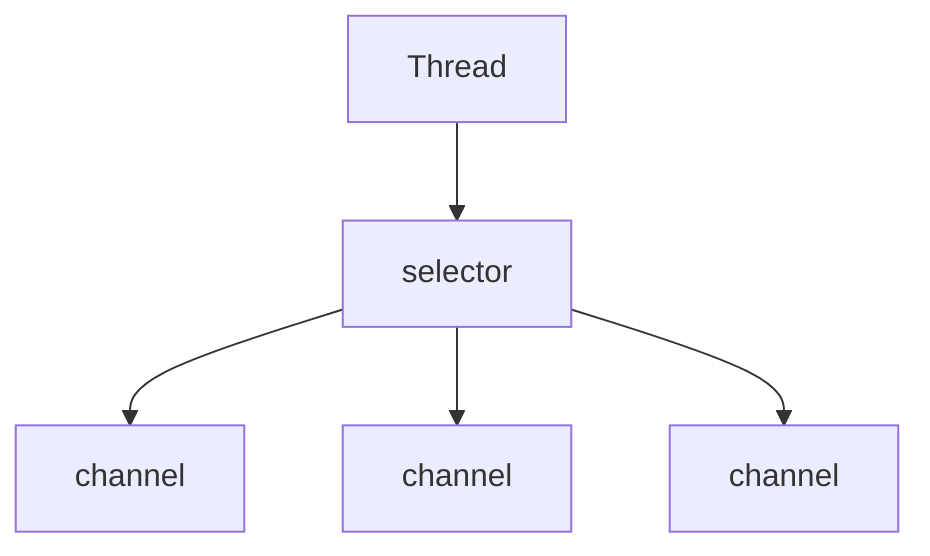

较少的thread通过selector来执行不同channel中的任务，执行的任务再结合AIO(异步I/O)能发挥最大的性能




常规I/O 是阻塞的

NIO : 非阻塞  buffer缓冲区，数据存放在缓冲区

Buffer ： 抽象类，有7个直接子类

​	ByteBuffer	CharBuffer 	DoubleBuffer 	FloatBuffer 	IntBuffer 	LongBuffer 	ShortBuffer

传统I/O缓冲区只能存char / byte

NIO缓冲区，4个核心：

- ​	capacity  不能为负，且不可修改
- ​	limit  不能为负 第一个不应该读取或写入元素的index 
- ​	position  下一个要读取或写入元素的index
- ​	mark

0 <= mark <= position <= limit <= capacity

remaining():  return limit - position

非直接缓冲区：

​	通过ByteBuffer向硬盘存取数据需要先将数据暂存在JVM的中间缓冲区，再交给ByteBuffer

​	ByteBuffer.allocate() 创建出的缓冲区类型为HeapByteBuffer

​	

直接缓冲区：

​	直接在内核中进行处理，无需JVM创建新的缓冲区 直接缓冲区的数据不在JVM堆，而是在内核空间，善于保存那些易受操作系统本机I/O操作影响的大量、长时间保存的数据

```java
ByteBuffer byteBuffer  =  ByteBuffer.allocateDirect(100);	
byteBuffer.isDirect();

```

 ByteBuffer.allocateDirect()创建的缓冲区类型为DirectByteBuffer

直接缓冲区如何释放内存？

1. 手动释放

   ```java
   public class Test2 {
       public static void main(String[] args) throws  Exception{
           ByteBuffer buffer = ByteBuffer.allocateDirect(Integer.MAX_VALUE);
           byte[] byteArray = new byte[]{1};
           for (int i = 0; i < Integer.MAX_VALUE; i++) {
               buffer.put(byteArray);
           }
           System.out.println("====put end ====");
           Thread.sleep(5000);
           Method cleannerMethod = buffer.getClass().getMethod("cleaner");
           cleannerMethod.setAccessible(true);
           Object returnValue = cleannerMethod.invoke(buffer);
           Method cleanMethod = returnValue.getClass().getMethod("clean");
           cleanMethod.setAccessible(true);
           cleanMethod.invoke(returnValue);// 回收直接缓冲区所占用内存
   
       }
   
   }
   
   ```

2. JVM自动处理

   ```java
   public class Test2 {
       public static void main(String[] args) throws  Exception{
           ByteBuffer buffer = ByteBuffer.allocateDirect(Integer.MAX_VALUE);
           byte[] byteArray = new byte[]{1};
           for (int i = 0; i < Integer.MAX_VALUE; i++) {
               buffer.put(byteArray);
           }
           System.out.println("====put end ====");
       }
   }
   多次运行后一直在耗费内存
   进程结束后也不会立马回收内存（可能）
   而是在某个世纪触动GC垃圾回收期进行内存回收
   ```


clear()方法，还原缓冲区到初始状态

```java
public final Buffer clear(){
    position = 0;
    limit = capacity;
    mark = -1;
    return this;
}
```

flip()方法，反转缓冲区， 当向缓冲区写入数据，然后再从缓冲区中读取数据是使用flip的最佳时机

```java
public final Buffer flip(){
    limit = position;
    position = 0;
    mark =-1;
    return this;
}
```

rewind()方法，重饶缓冲区(limit不变)， 常在重新读取缓冲区数据时使用

```java
public final Buffer rewind(){
    position = 0;
    mark =-1;
    return this;
}
```


常规I/O 是阻塞的

NIO : 非阻塞  buffer缓冲区，数据存放在缓冲区

Buffer ： 抽象类，有7个直接子类

​	ByteBuffer	CharBuffer 	DoubleBuffer 	FloatBuffer 	IntBuffer 	LongBuffer 	ShortBuffer

传统I/O缓冲区只能存char / byte

NIO缓冲区，4个核心：


- capacity  不能为负，且不可修改

- limit  不能为负 第一个不应该读取或写入元素的index 

- position  下一个要读取或写入元素的index

- mark


