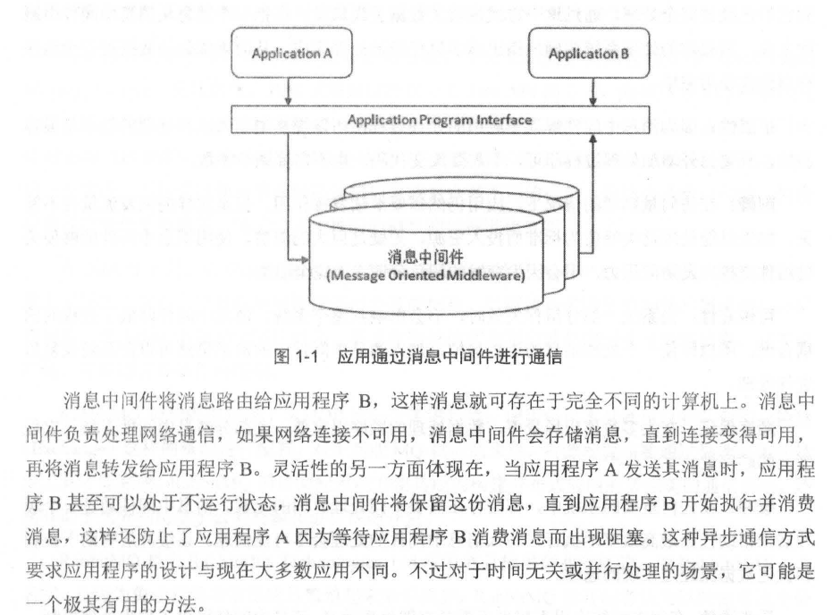

# 第 1章Ra bbit MQ 简介

# 1.1 什么是消息中间件

消息 （ Message ）  是指在应用间传送的数据

消息队列中间件 （ Message Queue Middleware ，简称为 MQ ） 是指利用高效可 靠的消息传递 机制进行与平台无关的数据交流 ，井基于数据通信来进行分布式系统的集成 。通过提供消息传 递和消息排队模型 ，它可以在分布式环境下扩展进程间的通信  。

消息队列中间件 ，也可以称为消息队列或者消息中间件 。它一般有两种传递模式 ：**点对点（ P2P,   Point-to-Point ） 模式和发布／订阅 （ Pub/Sub ） 模式**。点对点模式是基于队列的 ，消息生产 者发送消息到队列 ，消息消费者从队列中接收消息 ，队列的存在使得消息的异步传输成为可能  。 发布订阅模式定义了如何向一个内容节点发布 和订阅消息 ，这个内容节点称为 主题 （topic ） ，主 题可以认为是消息传递的中介  ，消息发布者将消息发布到某个主题  ，而消息订阅者则从主题中 订阅消息 。主题使得消息的订阅者与消息的发布者互相保持独立    ，不需要进行接触即可保证消 息的传递，发布／订阅模式在消息   的一对多广播时采用。

目前开源的消息中间件有很多 ，比较主流的有  RabbitMQ 、Kafka 、ActiveMQ 、RocketMQ 等。



## 1.2	消息中间件的作用

### 解耦 ：

在项目启动之初来预测将来会碰到什么需求是极其困难的 。消息中间件在处理过程 中间插入了一个隐含的、基于数据的接口层 ，**两边的处理过程都要实现这一接口 ，这允许你独 立地扩展或修改两边的处理过程** ，只要确保它们遵守同样的接口约束即可 。

### 冗余 〈存储） ：

有些情况下 ，处理数据的过程会失败 。**消息中间件可以把数据进行持久化直 到它们己经被完全处理** ，通过这一方式规避了数据丢失风险 。在把一个消息从消息中间件中删 除之前，需要你的处理系统明确地指出该消息己经被处理完成 ，从而确保你的数据被安全地保 存直到你使用完毕 。

### 扩展性 ：

因为消息中间件解藕了应用的处理过程 ，所以提高消息入队和处理的效 率是很容 易的，只要另外增加处理过程即可 ，不需要改变代码 ，也不需要调节参数 。

### 削峰：

在访问量剧增的情况下 ，应用仍然需要继续发挥作用 ，但是这样的突发流 量并不常 见。如果以能处理这类峰值为标准而投入资源 ，无疑是巨大的浪费 。使用消息中间件能够使关 键组件支撑突发访问压力 ，不会因为突发的超负荷请求而完全崩溃 。

### 可恢复性 ：

当系统一部分组件失效时 ，不会影响到整个系统 。消息中间件降低了进程间的 精合度 ，所以即使一个处理消息的进程挂掉 ，加入消息中间件中的消息仍然可以在系统恢复后 进行处理。

### 顺序保证 ：

在大多数使用场景下 ，数据处理的顺序很重要 ，大部分消息中间件支持 一定程 度上的顺序性 。

### 缓冲 ：

在任何重要的系统中 ，都会存在需要不同处理时间的元素 。消息中间件通过 一个缓 冲层来帮助任务最高效率地执行 ，写入消息中间件的处理会尽可能快速 。该缓冲层有助于控制 和优化数据流经过系统的速度 。

### 异步通信 ：

在很多时候应用不想也不需要立即处理消息 。消息中间件提供了异步处理机制 ， 允许应用把一些消息放入消息中间件中 ，但并不立即处理它 ，在之后需要的时候再慢慢处理 。


## 1.3 RabbitMQ 的具体特点可以概括为以下几点 。

- 可靠性 ：RabbitMQ 使用一些机制来保证可靠性 ，如持久化 、传输确认及发布确认等 。 

- 灵活的路由 ：在消息进入队列之前 ，通过交换器来路由消息 。对于典型的路由功能 ，RabbitMQ 已经提供了一些内置的交换器来实现 。针对更复杂的路由功能 ，可以将多个交换器绑定在一起 ，也可以通过插件机制来实现自己的交换器 。

- 扩展性：多个RabbitMQ 节点可以组成一个集群，也可以根据实际业务情况动态地扩展 集群中节点 。
- 高可用性：队列可以在集群中的机器上设置镜像，使得在部分节点出现问题的情况下队 列仍然可用 。
- 多种协议 ：RabbitMQ 除了原生支持 AMQP 协议，还支持 STOMP、MQTT 等多种消息 中间件协议。
- 多语言客户端 ：RabbitMQ 几乎支持所有常用语 言，比如 Java 、Python 、Ruby 、P田、C＃、JavaScript 等。
- 管理界面 ：RabbitMQ 提供了一个易用的用户界面 ，使得用户可以监控和管理消息 、集 群中的节点等 。
- 插件机制 ：RabbitMQ 提供了许多插件 ，以实现从多方面进行扩展，当然也可以编写自 己的插件。


## 1.4 Ra bbit MQ 的安装及简单使用

### 1.4.1    安装 Erlang

第一步 ，解压安装包 ，井配置安装目录，这里我们预备安装 到／opt / erlang  目录下：

```
tar  -zxvf   otp_src_19.3.tar.gz 
cd otp_src_19.3.tar.gz
./configure --prefix=/opt/erlang
```

第二步，如果出现类似关键报错信息：No curses libra可 functions found。那么此时需要安装
ncurses 

```
yum  install  ncu rses-devel
```

第三步 ，安装 Erlang:

```
make
make   install
```

第四步 ，修改 ／et c/ prof ile 配置文件 ，添加下面的环境变 量：
ERLANG HOME=/ opt/erlang
export PATH=$ PATH ：♀ERLANG HOME / bin export ERLANG_HOME

最后执行如下命令让配置文件生效 ：
[ root@ hidden  otp_src_l 9 . 3] #   source  / etc/prof ile

可以输入 erl 命令来验证 Erlang 是否安装成功 ，如果出现类似以下的提示即表示安装成功 ：
[ root@ hidden	］ ＃ erl
Erlang/OTP 19 [ erts-8 .1][ source ]   [ 64-bit ][ smp :4 : 4 ]   [ async-threads : l O J    [ hipe ][ kernel-poll : f alse]

### 1.4.2	RabbitMQ 的安装

这里选择将 RabbitMQ 安装到与 Erlang  同一个目录 （／opt ） 下面：
[ root@ hidden	］ ＃ tar  zvxf   rabbitmq -server-generic-unix-3 . 6 . 10 . tar . gz  -C  /opt [ root@ hidden	］ ＃ cd / opt
[ root@ hidden	］ ＃ mv  rabbitmq server-3 . 6 .10 rabbitmq

同样修改／et c/ prof ile 文件，添加下面的环境变量 ：
export   PATH=$PATH  : / opt / rabbitmq/ sbin export RABBITMQ  HOME =/ opt / rabbitmq
之后执行 sou rce / et c/ pro f ile 命令让配置文件生效 。


### 1.4.3	RabbitMQ 的运行

在修改了 ／et c/ p rof ile 配置文件之后 ，可以任意打开一个 Shell 窗口，输入如下命令以 运行 RabbitMQ 服务：
rabbitmq-server  -detached

在 r abbitmq-s erver 命令后面添加一个 “ detached ” 参数是为了能够让 RabbitMQ
服务**以守护进程 的方式在后台运行** ，这样就不会因为当前 Shell 窗口的关闭而影响服务 。

```
[ root@ hidden	］ ＃ rabbitmqct l status 

通过 rabbitmqct l cluster_status 命令来查看集群信息 
[ root@ hidden	］ ＃ rabbitmqctl  cluster  status 
```


### 1.4.4     生产和消费消息

目前最新的 RabbitMQ Java 客户端版本为 4.2.1 ，相应的 maven 构建文件如下 ：
< !-- ht tps : / /mvn repository .com/ art if act / com . rabbitmq / amqp-client -->
<dependency>
<groupid>com .rabbitmq< / groupid>
<artif act id>amqp -client< /ar tif act id>
<version>4 . 2 . l< /version>
<  /dependency>


默认情况下 ，访问RabbitMQ 服务的用户名和密码都是 “guest ”，这个账户有限制 ，默认只能通过本地网络 （ 如 localhost ）  访问 ，远程网络访问受限 ，所以在实现生产和消费消息之前 ， 需要另外添加一个用户 ，并设置相应的访问权限 。

```
添加新用户 ，用户名为 “root ”，密码为 “rootl23 ”：
[ root@ hidden	］ ＃ rabbitmqctl  add  user  root  root Creat ing user  ” root ”

 
为 root 用户设置所有权限 ：
[ root@ hidden	］ ＃ rabbitmqctl  set_permissions  -p  I  root ”．女”
Setting  permissions   f or  user  ” root ”  in  vhost  ” ／”


设置 root 用户为管理员角色 ：
[ root@ hidden	］ ＃ rabbitmqctl   set_user_tags   root   admin istrator Setting  tags  f or  user  ” root ”  to   [ admin istrator ]

```


