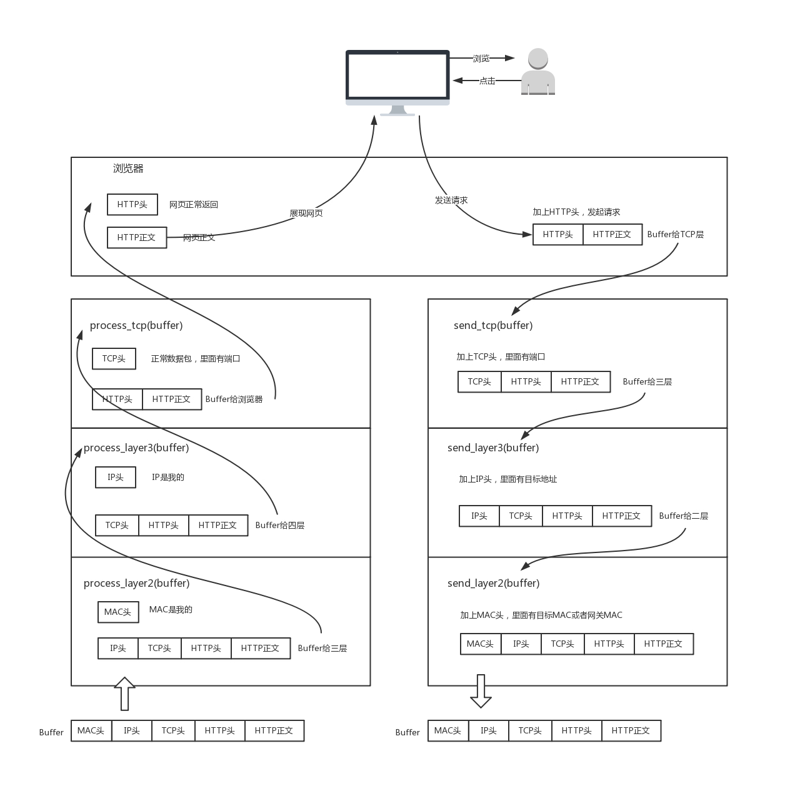

[TOC]


## 2.网络分层的真实含义是什么？

为什么网络要分层呀？

因为不同的层次之间有不同的沟通方式，这个叫作协议。 

那么，TCP 在进行三次握手的时候，**IP 层和 MAC 层对应都有什么操作呢？** 

每个层次所包含不同的协议 ，那这些**协议之间是什么关系**呢？

学习第三层的时候会提到，IP 协议里面包含**目标地址**和**源地址。**第三层里往往还会学习**路由协议**。路由就像中转站，我们从原始地址 A 到目标地址 D，中间经过两个中转站 A->B->C->D，是通过路由转发的。

那么，A 知道自己的下一个中转站是 B，那从 A 发出来的包，应该把 B 的 IP 地址放在哪里呢？

B 知道自己的下一个中转站是 C，从 B 发出来的包，应该把 C 的 IP 地址放在哪里呢？

如果放在 IP 协议中的目标地址，那包到了中转站，怎么知道最终的目的地址是 D 呢？

又比如，发送一个 HTTP 的包，是在第七层工作的 ，二层设备处理的通常是 MAC 层的东西 ，**二层设备处理的包里，有没有 HTTP 层的内容呢？**


### 网络为什么要分层？


**<u>是个复杂的程序都要分层</u>**


想象网络包就是一段 Buffer，或者一块内存，是有格式的。 想象自己是一个处理网络包的程序 ，你想象自己有很多的网口，从某个口拿进一个网络包来，用自己的程序处理一下，再从另一个网口发送出去。 

###程序是如何工作的？

 

当一个网络包从一个网口经过的时候，你看到了，首先先看看要不要请进来，处理一把。有的网口配置了混杂模式，凡是经过的，全部拿进来。

拿进来以后，就要交给一段程序来处理。于是，你调用**process_layer2(buffer)**。当然，这是一个假的函数。但是你明白其中的意思，知道肯定是有这么个函数的。那这个函数是干什么的呢？从 Buffer 中，摘掉二层的头，看一看，应该根据头里面的内容做什么操作。

假设你发现这个包的 MAC 地址和你的相符，那说明就是发给你的，于是需要调用**process_layer3(buffer)**。这个时候，Buffer 里面往往就没有二层的头了，因为已经在上一个函数的处理过程中拿掉了，或者将开始的偏移量移动了一下。在这个函数里面，摘掉三层的头，看看到底是发送给自己的，还是希望自己转发出去的。

如何判断呢？如果 IP 地址不是自己的，那就应该转发出去；如果 IP 地址是自己的，那就是发给自己的。根据 IP 头里面的标示，拿掉三层的头，进行下一层的处理，到底是调用 process_tcp(buffer) 呢，还是调用 process_udp(buffer) 呢？

假设这个地址是 TCP 的，则会调用**process_tcp(buffer)**。这时候，Buffer 里面没有三层的头，就需要查看四层的头，看这是一个发起，还是一个应答，又或者是一个正常的数据包，然后分别由不同的逻辑进行处理。如果是发起或者应答，接下来可能要发送一个回复包；如果是一个正常的数据包，就需要交给上层了。交给谁呢？是不是有 process_http(buffer) 函数呢？

没有的，如果你是一个网络包处理程序，你不需要有 process_http(buffer)，而是应该交给应用去处理。交给哪个应用呢？在四层的头里面有端口号，不同的应用监听不同的端口号。如果发现浏览器应用在监听这个端口，那你发给浏览器就行了。至于浏览器怎么处理，和你没有关系。

浏览器自然是解析 HTML，显示出页面来。电脑的主人看到页面很开心，就点了鼠标。点击鼠标的动作被浏览器捕获。浏览器知道，又要发起另一个 HTTP 请求了，于是使用端口号，将请求发给了你。

你应该调用**send_tcp(buffer)**。不用说，Buffer 里面就是 HTTP 请求的内容。这个函数里面加一个 TCP 的头，记录下源端口号。浏览器会给你目的端口号，一般为 80 端口。

然后调用**send_layer3(buffer)**。Buffer 里面已经有了 HTTP 的头和内容，以及 TCP 的头。在这个函数里面加一个 IP 的头，记录下源 IP 的地址和目标 IP 的地址。

然后调用**send_layer2(buffer)**。Buffer 里面已经有了 HTTP 的头和内容、TCP 的头，以及 IP 的头。这个函数里面要加一下 MAC 的头，记录下源 MAC 地址，得到的就是本机器的 MAC 地址和目标的 MAC 地址。不过，这个还要看当前知道不知道，知道就直接加上；不知道的话，就要通过一定的协议处理过程，找到 MAC 地址。**反正要填一个，不能空着**

万事俱备，只要 Buffer 里面的内容完整，就可以从网口发出去了，你作为一个程序的任务就算告一段落了。


###揭秘层与层之间的关系


那 TCP 在三次握手的时候，IP 层和 MAC 层在做什么呢？当然是 TCP 发送每一个消息，都会带着 IP 层和 MAC 层了。因为，**TCP 每发送一个消息，IP 层和 MAC 层的所有机制都要运行一遍**。而你只看到 TCP 三次握手了，其实，IP 层和 MAC 层为此也忙活好久了。

这里要记住一点：**只要是在网络上跑的包，都是完整的。可以有下层没上层，绝对不可能有上层没下层**


**只知道机器的IP地址，而没有Mac地址是发不出去的**

所以如果一个 HTTP 协议的包跑在网络上，它一定是完整的。无论这个包经过哪些设备，它都是完整的 


一个 HTTP 协议的包经过一个二层设备，二层设备收进去的是整个网络包。这里面 HTTP、TCP、 IP、 MAC 都有。

什么叫二层设备呀，就是只把 MAC 头摘下来，看看到底是丢弃、转发，还是自己留着。

什么叫三层设备呢？就是把 MAC 头摘下来之后，再把 IP 头摘下来，看看到底是丢弃、转发，还是自己留着。 


## 3.ifconfig：最熟悉又陌生的命令行

如何查看IP 地址 ？

1. Windows 上是 ipconfig，在 Linux 上是 ifconfig 

2. Linux  ip addr 

   

```

root@test:~# ip addr
1: lo: <LOOPBACK,UP,LOWER_UP> mtu 65536 qdisc noqueue state UNKNOWN group default 
    link/loopback 00:00:00:00:00:00 brd 00:00:00:00:00:00
    inet 127.0.0.1/8 scope host lo valid_lft forever preferred_lft forever
    inet6 ::1/128 scope host  valid_lft forever preferred_lft forever
    
2: eth0: <BROADCAST,MULTICAST,UP,LOWER_UP> mtu 1500 qdisc pfifo_fast state UP group default qlen 1000
    link/ether fa:16:3e:c7:79:75 brd ff:ff:ff:ff:ff:ff  （mac地址）
    inet 10.100.122.2/24 brd 10.100.122.255 scope global eth0 valid_lft forever preferred_lft forever  （ipv4）
    inet6 fe80::f816:3eff:fec7:7975/64 scope link  valid_lft forever preferred_lft forever
```

- 大部分的网卡都会有一个 IP 地址，当然，这不是必须的 

- **IP 地址是一个网卡在网络世界的通讯地址，相当于我们现实世界的门牌号码而Mac相当于身份证**

- 10.100.122.2 就是一个 IP 地址。这个地址被点分隔为四个部分，每个部分 8 个 bit，所以 IP 地址总共是 32 位。 

- **inet6 fe80::f816:3eff:fec7:7975/64   是IPv6**

- 在 IP 地址的后面有个 scope，对于 eth0 这张网卡来讲，是 global，说明这张网卡是可以对外的，可以接收来自各个地方的包。

  对于 lo 来讲，是 host，说明这张网卡仅仅可以供本机相互通信。 lo 全称是**loopback**，又称**环回接口**，往往会被分配到 127.0.0.1 这个地址。这个地址用于本机通信，经过内核处理后直接返回，不会在任何网络中出现。

- **Mac地址**   

  link/ether fa:16:3e:c7:79:75 brd ff:ff:ff:ff:ff:ff，这个被称为**MAC 地址，**是一个网卡的物理地址，用十六进制，6 个 byte 表示。 

   **MAC 地址号称全局唯一**，不会有两个网卡有相同的 MAC 地址，而且网卡自生产出来，就带着这个地址。 

  **MAC 地址更像是身份证，是一个唯一的标识。**它的唯一性设计是为了组网的时候，不同的网卡放在一个网络里面的时候，可以不用担心冲突。从硬件角度，保证不同的网卡有不同的标识。 

  MAC 地址是有一定定位功能的，只不过范围非常有限。 MAC 地址的通信范围比较小，局限在一个子网里面。例如，从 192.168.0.2/24 访问 192.168.0.3/24 是可以用 MAC 地址的。一旦跨子网，即从 192.168.0.2/24 到 192.168.1.2/24，MAC 地址就不行了，需要 IP 地址起作用了。 

- **网络设备标志**

  < BROADCAST,MULTICAST,UP,LOWER_UP > 是 **net_device flags**，**网络设备的状态标识** 

  UP 表示网卡处于启动的状态；

  BROADCAST 表示这个网卡有广播地址，可以发送广播包；

  MULTICAST 表示网卡可以发送多播包；

  LOWER_UP 表示 L1 是启动的，也即网线插着呢。

  MTU1500 是指什么意思呢？是哪一层的概念呢？最大传输单元 MTU 为 1500，这是以太网的默认值。 

  网络包是层层封装的。MTU 是二层 MAC 层的概念。MAC 层有 MAC 的头，以**太网规定连 MAC 头带正文合起来，不允许超过 1500 个字节。正文里面有 IP 的头、TCP 的头、HTTP 的头。如果放不下，就需要分片来传输。** 

- qdisc pfifo_fast    qdisc 全称是**queueing discipline**，中文叫**排队规则**。内核如果需要通过某个网络接口发送数据包，它都需要按照为这个接口配置的 qdisc（排队规则）把数据包加入队列。 最简单的 qdisc 是 pfifo，它不对进入的数据包做任何的处理，数据包采用先入先出的方式通过队列。pfifo_fast 稍微复杂一些，它的队列包括三个波段（band）。在每个波段里面，使用先进先出规则。 


对于 A、B、 C 类主要分两部分，**<u>前面一部分是网络号，后面一部分是主机号</u>**。这很好理解，大家都是六单元 1001 号，我是小区 A 的六单元 1001 号，而你是小区 B 的六单元 1001 号。 

 A、B、C 三类地址所能包含的主机的数量 


C 类地址能包含的最大主机数量实在太少了，只有 254 个 ,而 B 类地址能包含的最大主机数量又太多了 


### 无类型域间选路（CIDR）

为解决三类地址数量分布不均，有了一个折中的方式叫作**无类型域间选路**，简称**CIDR**。这种方式打破了原来设计的几类地址的做法，将 32 位的 IP 地址一分为二，前面是**网络号**，后面是**主机号**。 

**10.100.122.2/24，这个 IP 地址中有一个斜杠，斜杠后面有个数字 24。这种地址表示形式，就是 CIDR。后面 24 的意思是，32 位中，前 24 位是网络号，后 8 位是主机号。**

伴随着 CIDR 存在的，有两个特殊的地址

- 一个是**广播地址(主机号全为1)**，10.100.122.255。如果发送这个地址，所有 10.100.122 网络里面的机器都可以收到。
- 另一个是**子网掩码(主机号全为0)**，255.255.255.0。 


### 网络号的计算(IP and 子网掩码)

将子网掩码和 IP 地址进行 AND 计算。前面三个 255，转成二进制都是 1。1 和任何数值取 AND，都是原来数值，因而前三个数不变，为 10.100.122。后面一个 0，转换成二进制是 0，0 和任何数值取 AND，都是 0，因而最后一个数变为 0，合起来就是 10.100.122.0。这就是**网络号**。**将子网掩码和 IP 地址按位计算 AND，就可得到网络号。** 

### 公有 IP 地址和私有 IP 地址


平时我们看到的数据中心里，办公室、家里或学校的 IP 地址，一般都是**私有 IP 地址段。**因为这些地址允许组织内部的 IT 人员自己管理、自己分配，而且**可以重复。** 

这就像每个小区有自己的楼编号和门牌号，你们小区可以叫 6 栋，我们小区也叫 6 栋，没有任何问题。**但是一旦出了小区，就需要使用公有 IP 地址。** 

公有 IP 地址有个组织统一分配，你需要去买。 这样全世界的人才能访问。 

表格中的 **192.168.0.x 是最常用的私有 IP 地址**。你家里有 Wi-Fi，对应就会有一个 IP 地址。一般你家里地上网设备不会超过 256 个，所以 /24 基本就够了。有时候我们也能见到 /16 的 CIDR，这两种是最常见的，也是最容易理解的。

不需要将十进制转换为二进制 32 位，就能明显看出 192.168.0 是网络号，后面是主机号。而整个网络里面的**第一个地址 192.168.0.1，往往就是你这个私有网络的出口地址**。例如，你家里的电脑连接 Wi-Fi，Wi-Fi 路由器的地址就是 192.168.0.1，而 **192.168.0.255 就是广播地址**。一旦发送这个地址，整个 **192.168.0 网络里**面的所有机器都能收到。


### 举例：一个容易“犯错”的 CIDR

**<u>16.158.165.91/22 这个 CIDR。求一下这个网络的第一个地址、子网掩码和广播地址。</u>** 

1. /22 不是 8 的整数倍，不好办，只能先变成二进制来看。 

   **16.158** 的部分不会动，它占了前 16 位。

   中间的 **165，变为二进制为‭10100101**‬。除了前面的 16 位，还剩 6 位。所以，这 8 位中**前 6 位是网络号，16.158.<101001>，而<01>.91 是主机号。** 

2. 第一个地址是 16.158.<101001>**<00>.1**，即 16.158.164.1。 

3. 子网掩码是 255.255.<111111>**<00>.0，**即 255.255.252.0。 

4. 广播地址为 16.158.<101001>**<11>.255**，即 16.158.167.255。 


## 小结

- IP 是地址，有定位功能；MAC 是身份证，无定位功能；
- CIDR 可以用来判断是不是本地人；
- IP 分公有的 IP 和私有的 IP。后面的章节中我会谈到“出国门”，就与这个有关。


## 4.DHCP与PXE：IP是怎么来的，又是怎么没的？


### 如何配置 IP 地址？

-----


**使用 net-tools：**

```
$ sudo ifconfig eth1 10.0.0.1/24
$ sudo ifconfig eth1 up
```

**使用 iproute2：**

```
$ sudo ip addr add 10.0.0.1/24 dev eth1
$ sudo ip link set up eth1
```


假设旁边的机器都是 192.168.1.x，自己配置一个 16.158.23.6，会出现什么现象呢？  **包发不出去**

192.168.1.6 就在你这台机器的旁边，甚至是在同一个交换机上，而你把机器的地址设为了 16.158.23.6。在这台机器上，你企图去 ping192.168.1.6，***你觉得只要将包发出去，同一个交换机的另一台机器马上就能收到，对不对？*** 

Linux 系统不是这样的 

**只要是在网络上跑的包，都是完整的，可以有下层没上层，绝对不可能有上层没下层。** 

所以，你看着它有自己的源 IP 地址 16.158.23.6，也有目标 IP 地址 192.168.1.6，但是包发不出去，这是**因为 MAC 层还没填。** 

自己的 MAC 地址自己知道，这个容易。但是目标 MAC 填什么呢？***是不是填 192.168.1.6 这台机器的 MAC 地址呢？*** 

当然不是。 

- Linux 首先会判断，要去的这个地址和我是一个网段的吗，或者和我的一个网卡是同一网段的吗？只有是一个网段的，它才会发送 ARP 请求，获取 MAC 地址。 
- 如果发现不是呢？**Linux 默认的逻辑，如果这是一个跨网段的调用，它便不会直接将包发送到网络上，而是企图将包发送到网关。** 
- 如果你配置了网关的话，Linux 会获取网关的 MAC 地址，然后将包发出去。对于 192.168.1.6 这台机器来讲，虽然路过它家门的这个包，目标 IP 是它，但是无奈 MAC 地址不是它的，所以它的网卡是不会把包收进去的。
- **如果没有配置网关呢**？那包压根就发不出去。
- **如果将网关配置为 192.168.1.6 呢**？不可能，Linux 不会让你配置成功的，因为网关要和当前的网络至少一个网卡是同一个网段的，怎么可能 16.158.23.6 的网关是 192.168.1.6 呢？ 

所以，当你需要手动配置一台机器的网络 IP 时，一定要好好问问你的网络管理员。 

当然，真正配置的时候，**一定不是直接用命令配置的**，而是放在一个配置文件里面。

**不同系统的配置文件格式不同，但是无非就是 CIDR、子网掩码、广播地址和网关地址**。 


### 动态主机配置协议（DHCP）

-----------

