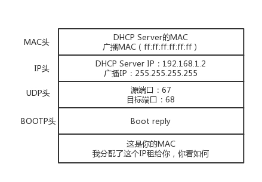

[TOC]


## 2.网络分层的真实含义是什么？

为什么网络要分层呀？

因为不同的层次之间有不同的沟通方式，这个叫作协议。 

那么，TCP 在进行三次握手的时候，**IP 层和 MAC 层对应都有什么操作呢？** 

每个层次所包含不同的协议 ，那这些**协议之间是什么关系**呢？

学习第三层的时候会提到，IP 协议里面包含**目标地址**和**源地址。**第三层里往往还会学习**路由协议**。路由就像中转站，我们从原始地址 A 到目标地址 D，中间经过两个中转站 A->B->C->D，是通过路由转发的。

那么，A 知道自己的下一个中转站是 B，那从 A 发出来的包，应该把 B 的 IP 地址放在哪里呢？

B 知道自己的下一个中转站是 C，从 B 发出来的包，应该把 C 的 IP 地址放在哪里呢？

如果放在 IP 协议中的目标地址，那包到了中转站，怎么知道最终的目的地址是 D 呢？

又比如，发送一个 HTTP 的包，是在第七层工作的 ，二层设备处理的通常是 MAC 层的东西 ，**二层设备处理的包里，有没有 HTTP 层的内容呢？**


### 网络为什么要分层？


**<u>是个复杂的程序都要分层</u>**


想象网络包就是一段 Buffer，或者一块内存，是有格式的。 想象自己是一个处理网络包的程序 ，你想象自己有很多的网口，从某个口拿进一个网络包来，用自己的程序处理一下，再从另一个网口发送出去。 

###程序是如何工作的？

 

当一个网络包从一个网口经过的时候，你看到了，首先先看看要不要请进来，处理一把。有的网口配置了混杂模式，凡是经过的，全部拿进来。

拿进来以后，就要交给一段程序来处理。于是，你调用**process_layer2(buffer)**。当然，这是一个假的函数。但是你明白其中的意思，知道肯定是有这么个函数的。那这个函数是干什么的呢？从 Buffer 中，摘掉二层的头，看一看，应该根据头里面的内容做什么操作。

假设你发现这个包的 MAC 地址和你的相符，那说明就是发给你的，于是需要调用**process_layer3(buffer)**。这个时候，Buffer 里面往往就没有二层的头了，因为已经在上一个函数的处理过程中拿掉了，或者将开始的偏移量移动了一下。在这个函数里面，摘掉三层的头，看看到底是发送给自己的，还是希望自己转发出去的。

如何判断呢？如果 IP 地址不是自己的，那就应该转发出去；如果 IP 地址是自己的，那就是发给自己的。根据 IP 头里面的标示，拿掉三层的头，进行下一层的处理，到底是调用 process_tcp(buffer) 呢，还是调用 process_udp(buffer) 呢？

假设这个地址是 TCP 的，则会调用**process_tcp(buffer)**。这时候，Buffer 里面没有三层的头，就需要查看四层的头，看这是一个发起，还是一个应答，又或者是一个正常的数据包，然后分别由不同的逻辑进行处理。如果是发起或者应答，接下来可能要发送一个回复包；如果是一个正常的数据包，就需要交给上层了。交给谁呢？是不是有 process_http(buffer) 函数呢？

没有的，如果你是一个网络包处理程序，你不需要有 process_http(buffer)，而是应该交给应用去处理。交给哪个应用呢？在四层的头里面有端口号，不同的应用监听不同的端口号。如果发现浏览器应用在监听这个端口，那你发给浏览器就行了。至于浏览器怎么处理，和你没有关系。

浏览器自然是解析 HTML，显示出页面来。电脑的主人看到页面很开心，就点了鼠标。点击鼠标的动作被浏览器捕获。浏览器知道，又要发起另一个 HTTP 请求了，于是使用端口号，将请求发给了你。

你应该调用**send_tcp(buffer)**。不用说，Buffer 里面就是 HTTP 请求的内容。这个函数里面加一个 TCP 的头，记录下源端口号。浏览器会给你目的端口号，一般为 80 端口。

然后调用**send_layer3(buffer)**。Buffer 里面已经有了 HTTP 的头和内容，以及 TCP 的头。在这个函数里面加一个 IP 的头，记录下源 IP 的地址和目标 IP 的地址。

然后调用**send_layer2(buffer)**。Buffer 里面已经有了 HTTP 的头和内容、TCP 的头，以及 IP 的头。这个函数里面要加一下 MAC 的头，记录下源 MAC 地址，得到的就是本机器的 MAC 地址和目标的 MAC 地址。不过，这个还要看当前知道不知道，知道就直接加上；不知道的话，就要通过一定的协议处理过程，找到 MAC 地址。**反正要填一个，不能空着**

万事俱备，只要 Buffer 里面的内容完整，就可以从网口发出去了，你作为一个程序的任务就算告一段落了。


###揭秘层与层之间的关系


那 TCP 在三次握手的时候，IP 层和 MAC 层在做什么呢？当然是 TCP 发送每一个消息，都会带着 IP 层和 MAC 层了。因为，**TCP 每发送一个消息，IP 层和 MAC 层的所有机制都要运行一遍**。而你只看到 TCP 三次握手了，其实，IP 层和 MAC 层为此也忙活好久了。

这里要记住一点：**只要是在网络上跑的包，都是完整的。可以有下层没上层，绝对不可能有上层没下层**


**只知道机器的IP地址，而没有Mac地址是发不出去的**

所以如果一个 HTTP 协议的包跑在网络上，它一定是完整的。无论这个包经过哪些设备，它都是完整的 


一个 HTTP 协议的包经过一个二层设备，二层设备收进去的是整个网络包。这里面 HTTP、TCP、 IP、 MAC 都有。

什么叫二层设备呀，就是只把 MAC 头摘下来，看看到底是丢弃、转发，还是自己留着。

什么叫三层设备呢？就是把 MAC 头摘下来之后，再把 IP 头摘下来，看看到底是丢弃、转发，还是自己留着。 


## 3.ifconfig：最熟悉又陌生的命令行

如何查看IP 地址 ？

1. Windows 上是 ipconfig，在 Linux 上是 ifconfig 

2. Linux  ip addr 

   

```

root@test:~# ip addr
1: lo: <LOOPBACK,UP,LOWER_UP> mtu 65536 qdisc noqueue state UNKNOWN group default 
    link/loopback 00:00:00:00:00:00 brd 00:00:00:00:00:00
    inet 127.0.0.1/8 scope host lo valid_lft forever preferred_lft forever
    inet6 ::1/128 scope host  valid_lft forever preferred_lft forever
    
2: eth0: <BROADCAST,MULTICAST,UP,LOWER_UP> mtu 1500 qdisc pfifo_fast state UP group default qlen 1000
    link/ether fa:16:3e:c7:79:75 brd ff:ff:ff:ff:ff:ff  （mac地址）
    inet 10.100.122.2/24 brd 10.100.122.255 scope global eth0 valid_lft forever preferred_lft forever  （ipv4）
    inet6 fe80::f816:3eff:fec7:7975/64 scope link  valid_lft forever preferred_lft forever
```

- 大部分的网卡都会有一个 IP 地址，当然，这不是必须的 

- **IP 地址是一个网卡在网络世界的通讯地址，相当于我们现实世界的门牌号码而Mac相当于身份证**

- 10.100.122.2 就是一个 IP 地址。这个地址被点分隔为四个部分，每个部分 8 个 bit，所以 IP 地址总共是 32 位。 

- **inet6 fe80::f816:3eff:fec7:7975/64   是IPv6**

- 在 IP 地址的后面有个 scope，对于 eth0 这张网卡来讲，是 global，说明这张网卡是可以对外的，可以接收来自各个地方的包。

  对于 lo 来讲，是 host，说明这张网卡仅仅可以供本机相互通信。 lo 全称是**loopback**，又称**环回接口**，往往会被分配到 127.0.0.1 这个地址。这个地址用于本机通信，经过内核处理后直接返回，不会在任何网络中出现。

- **Mac地址**   

  link/ether fa:16:3e:c7:79:75 brd ff:ff:ff:ff:ff:ff，这个被称为**MAC 地址，**是一个网卡的物理地址，用十六进制，6 个 byte 表示。 

   **MAC 地址号称全局唯一**，不会有两个网卡有相同的 MAC 地址，而且网卡自生产出来，就带着这个地址。 

  **MAC 地址更像是身份证，是一个唯一的标识。**它的唯一性设计是为了组网的时候，不同的网卡放在一个网络里面的时候，可以不用担心冲突。从硬件角度，保证不同的网卡有不同的标识。 

  MAC 地址是有一定定位功能的，只不过范围非常有限。 MAC 地址的通信范围比较小，局限在一个子网里面。例如，从 192.168.0.2/24 访问 192.168.0.3/24 是可以用 MAC 地址的。一旦跨子网，即从 192.168.0.2/24 到 192.168.1.2/24，MAC 地址就不行了，需要 IP 地址起作用了。 

- **网络设备标志**

  < BROADCAST,MULTICAST,UP,LOWER_UP > 是 **net_device flags**，**网络设备的状态标识** 

  UP 表示网卡处于启动的状态；

  BROADCAST 表示这个网卡有广播地址，可以发送广播包；

  MULTICAST 表示网卡可以发送多播包；

  LOWER_UP 表示 L1 是启动的，也即网线插着呢。

  MTU1500 是指什么意思呢？是哪一层的概念呢？最大传输单元 MTU 为 1500，这是以太网的默认值。 

  网络包是层层封装的。MTU 是二层 MAC 层的概念。MAC 层有 MAC 的头，以**太网规定连 MAC 头带正文合起来，不允许超过 1500 个字节。正文里面有 IP 的头、TCP 的头、HTTP 的头。如果放不下，就需要分片来传输。** 

- qdisc pfifo_fast    qdisc 全称是**queueing discipline**，中文叫**排队规则**。内核如果需要通过某个网络接口发送数据包，它都需要按照为这个接口配置的 qdisc（排队规则）把数据包加入队列。 最简单的 qdisc 是 pfifo，它不对进入的数据包做任何的处理，数据包采用先入先出的方式通过队列。pfifo_fast 稍微复杂一些，它的队列包括三个波段（band）。在每个波段里面，使用先进先出规则。 


对于 A、B、 C 类主要分两部分，**<u>前面一部分是网络号，后面一部分是主机号</u>**。这很好理解，大家都是六单元 1001 号，我是小区 A 的六单元 1001 号，而你是小区 B 的六单元 1001 号。 

 A、B、C 三类地址所能包含的主机的数量 


C 类地址能包含的最大主机数量实在太少了，只有 254 个 ,而 B 类地址能包含的最大主机数量又太多了 


### 无类型域间选路（CIDR）

为解决三类地址数量分布不均，有了一个折中的方式叫作**无类型域间选路**，简称**CIDR**。这种方式打破了原来设计的几类地址的做法，将 32 位的 IP 地址一分为二，前面是**网络号**，后面是**主机号**。 

**10.100.122.2/24，这个 IP 地址中有一个斜杠，斜杠后面有个数字 24。这种地址表示形式，就是 CIDR。后面 24 的意思是，32 位中，前 24 位是网络号，后 8 位是主机号。**

伴随着 CIDR 存在的，有两个特殊的地址

- 一个是**广播地址(主机号全为1)**，10.100.122.255。如果发送这个地址，所有 10.100.122 网络里面的机器都可以收到。
- 另一个是**子网掩码(主机号全为0)**，255.255.255.0。 


### 网络号的计算(IP and 子网掩码)

将子网掩码和 IP 地址进行 AND 计算。前面三个 255，转成二进制都是 1。1 和任何数值取 AND，都是原来数值，因而前三个数不变，为 10.100.122。后面一个 0，转换成二进制是 0，0 和任何数值取 AND，都是 0，因而最后一个数变为 0，合起来就是 10.100.122.0。这就是**网络号**。**将子网掩码和 IP 地址按位计算 AND，就可得到网络号。** 

### 公有 IP 地址和私有 IP 地址


平时我们看到的数据中心里，办公室、家里或学校的 IP 地址，一般都是**私有 IP 地址段。**因为这些地址允许组织内部的 IT 人员自己管理、自己分配，而且**可以重复。** 

这就像每个小区有自己的楼编号和门牌号，你们小区可以叫 6 栋，我们小区也叫 6 栋，没有任何问题。**但是一旦出了小区，就需要使用公有 IP 地址。** 

公有 IP 地址有个组织统一分配，你需要去买。 这样全世界的人才能访问。 

表格中的 **192.168.0.x 是最常用的私有 IP 地址**。你家里有 Wi-Fi，对应就会有一个 IP 地址。一般你家里地上网设备不会超过 256 个，所以 /24 基本就够了。有时候我们也能见到 /16 的 CIDR，这两种是最常见的，也是最容易理解的。

不需要将十进制转换为二进制 32 位，就能明显看出 192.168.0 是网络号，后面是主机号。而整个网络里面的**第一个地址 192.168.0.1，往往就是你这个私有网络的出口地址**。例如，你家里的电脑连接 Wi-Fi，Wi-Fi 路由器的地址就是 192.168.0.1，而 **192.168.0.255 就是广播地址**。一旦发送这个地址，整个 **192.168.0 网络里**面的所有机器都能收到。


### 举例：一个容易“犯错”的 CIDR

**<u>16.158.165.91/22 这个 CIDR。求一下这个网络的第一个地址、子网掩码和广播地址。</u>** 

1. /22 不是 8 的整数倍，不好办，只能先变成二进制来看。 

   **16.158** 的部分不会动，它占了前 16 位。

   中间的 **165，变为二进制为‭10100101**‬。除了前面的 16 位，还剩 6 位。所以，这 8 位中**前 6 位是网络号，16.158.<101001>，而<01>.91 是主机号。** 

2. 第一个地址是 16.158.<101001>**<00>.1**，即 16.158.164.1。 

3. 子网掩码是 255.255.<111111>**<00>.0，**即 255.255.252.0。 

4. 广播地址为 16.158.<101001>**<11>.255**，即 16.158.167.255。 


## 小结

- IP 是地址，有定位功能；MAC 是身份证，无定位功能；
- CIDR 可以用来判断是不是本地人；
- IP 分公有的 IP 和私有的 IP。


## 4.DHCP与PXE：IP是怎么来的，又是怎么没的？


### 如何配置 IP 地址？

**使用 net-tools：**

```
$ sudo ifconfig eth1 10.0.0.1/24
$ sudo ifconfig eth1 up
```

**使用 iproute2：**

```
$ sudo ip addr add 10.0.0.1/24 dev eth1
$ sudo ip link set up eth1
```


假设旁边的机器都是 192.168.1.x，自己配置一个 16.158.23.6，会出现什么现象呢？  **包发不出去**

192.168.1.6 就在你这台机器的旁边，甚至是在同一个交换机上，而你把机器的地址设为了 16.158.23.6。在这台机器上，你企图去 ping192.168.1.6，***你觉得只要将包发出去，同一个交换机的另一台机器马上就能收到，对不对？*** 

Linux 系统不是这样的 

**只要是在网络上跑的包，都是完整的，可以有下层没上层，绝对不可能有上层没下层。** 

所以，你看着它有自己的源 IP 地址 16.158.23.6，也有目标 IP 地址 192.168.1.6，但是包发不出去，这是**因为 MAC 层还没填。** 

自己的 MAC 地址自己知道，这个容易。但是目标 MAC 填什么呢？***是不是填 192.168.1.6 这台机器的 MAC 地址呢？*** 

当然不是。 

- Linux 首先会判断，要去的这个地址和我是一个网段的吗，或者和我的一个网卡是同一网段的吗？只有是一个网段的，它才会发送 ARP 请求，获取 MAC 地址。 
- 如果发现不是呢？**Linux 默认的逻辑，如果这是一个跨网段的调用，它便不会直接将包发送到网络上，而是企图将包发送到网关。** 
- 如果你配置了网关的话，Linux 会获取网关的 MAC 地址，然后将包发出去。对于 192.168.1.6 这台机器来讲，虽然路过它家门的这个包，目标 IP 是它，但是无奈 MAC 地址不是它的，所以它的网卡是不会把包收进去的。
- **如果没有配置网关呢**？那包压根就发不出去。
- **如果将网关配置为 192.168.1.6 呢**？不可能，Linux 不会让你配置成功的，因为网关要和当前的网络至少一个网卡是同一个网段的，怎么可能 16.158.23.6 的网关是 192.168.1.6 呢？ 

所以，当你需要手动配置一台机器的网络 IP 时，一定要好好问问你的网络管理员。 

当然，真正配置的时候，**一定不是直接用命令配置的**，而是放在一个配置文件里面。

**不同系统的配置文件格式不同，但是无非就是 CIDR、子网掩码、广播地址和网关地址**。 


### 动态主机配置协议（DHCP）

**动态主机配置协议（Dynamic Host Configuration Protocol）**，简称**DHCP**。 

有了这个协议，网络管理员就轻松多了。他只需要配置一段共享的 IP 地址。每一台新接入的机器都通过 DHCP 协议，来这个共享的 IP 地址里申请，然后自动配置好就可以了。等人走了，或者用完了，还回去，这样其他的机器也能用。 

 

### 解析 DHCP 的工作方式

----


当一台机器新加入一个网络的时候，肯定一脸懵，啥情况都不知道，只知道自己的 MAC 地址。 

1.**DHCP Discover** 

新来的机器使用 IP 地址 0.0.0.0 发送了一个广播包，目的 IP 地址为 255.255.255.255。广播包封装在 UDP 里面，UDP 封装在 BOOTP 里面。其实 DHCP 是 BOOTP 的增强版，但是如果你去抓包的话，很可能看到的名称还是 BOOTP 协议。

在这个广播包里面，新人大声喊：我是新来的（Boot request），我的 MAC 地址是这个，我还没有 IP，谁能给租给我个 IP 地址！


2.**DHCP Offer**

如果一个网络管理员在网络里面配置了**DHCP Server**的话，他就相当于这些 IP 的管理员。他立刻能知道来了一个“新人”。这个时候，我们可以体会 MAC 地址唯一的重要性了。当一台机器带着自己的 MAC 地址加入一个网络的时候，MAC 是它唯一的身份，如果连这个都重复了，就没办法配置了。

只有 MAC 唯一，IP 管理员才能知道这是一个新人，需要租给它一个 IP 地址，这个过程我们称为**DHCP Offer**。同时，DHCP Server 为此客户保留为它提供的 IP 地址，从而不会为其他 DHCP 客户分配此 IP 地址。

DHCP Offer 的格式就像这样，里面有给新人分配的地址。




DHCP Server 仍然使用广播地址作为目的地址，因为，此时请求分配 IP 的新人还没有自己的 IP。DHCP Server 回复说，我分配了一个可用的 IP 给你，你看如何？除此之外，服务器还发送了子网掩码、网关和 IP 地址租用期等信息。

新来的机器很开心，它的“吼”得到了回复，并且有人愿意租给它一个 IP 地址了，这意味着它可以在网络上立足了。当然更令人开心的是，如果有多个 DHCP Server，这台新机器会收到多个 IP 地址，简直受宠若惊。

它会选择其中一个 DHCP Offer，一般是最先到达的那个，并且会向网络发送一个 DHCP Request 广播数据包，包中包含客户端的 MAC 地址、接受的租约中的 IP 地址、提供此租约的 DHCP 服务器地址等，并告诉所有 DHCP Server 它将接受哪一台服务器提供的 IP 地址，告诉其他 DHCP 服务器，谢谢你们的接纳，并请求撤销它们提供的 IP 地址，以便提供给下一个 IP 租用请求者。


3.**DHCP request**


 

此时，由于还没有得到 DHCP Server 的最后确认，客户端仍然使用 0.0.0.0 为源 IP 地址、255.255.255.255 为目标地址进行广播。在 BOOTP 里面，接受某个 DHCP Server 的分配的 IP。


4.**DHCP ACK** 

当 DHCP Server 接收到客户机的 DHCP request 之后，会广播返回给客户机一个 DHCP ACK 消息包，表明已经接受客户机的选择，并将这一 IP 地址的合法租用信息和其他的配置信息都放入该广播包，发给客户机，欢迎它加入网络大家庭。


最终租约达成的时候，还是需要广播一下，让大家都知道。 


### IP 地址的收回和续租

---

租期到了，管理员就要将 IP 收回。 

客户机会在租期过去 50% 的时候，直接向为其提供 IP 地址的 DHCP Server 发送 DHCP request 消息包。客户机接收到该服务器回应的 DHCP ACK 消息包，会根据包中所提供的新的租期以及其他已经更新的 TCP/IP 参数，更新自己的配置。这样，IP 租用更新就完成了。 


### 预启动执行环境（PXE）

普通的笔记本电脑，一般不会有这种需求。因为你拿到电脑时，就已经有操作系统了，即便你自己重装操作系统，也不是很麻烦的事情。但是，在数据中心里就不一样了。数据中心里面的管理员可能一下子就拿到几百台空的机器，一个个安装操作系统，会累死的。

所以管理员希望的不仅仅是自动分配 IP 地址，还要自动安装系统。装好系统之后自动分配 IP 地址，直接启动就能用了，这样当然最好了！

这事儿其实仔细一想，还是挺有难度的。安装操作系统，应该有个光盘吧。数据中心里不能用光盘吧，想了一个办法就是，可以将光盘里面要安装的操作系统放在一个服务器上，让客户端去下载。但是客户端放在哪里呢？它怎么知道去哪个服务器上下载呢？客户端总得安装在一个操作系统上呀，可是这个客户端本来就是用来安装操作系统的呀？

其实，这个过程和操作系统启动的过程有点儿像。首先，启动 BIOS。这是一个特别小的小系统，只能干特别小的一件事情。其实就是读取硬盘的 MBR 启动扇区，将 GRUB 启动起来；然后将权力交给 GRUB，GRUB 加载内核、加载作为根文件系统的 initramfs 文件；然后将权力交给内核；最后内核启动，初始化整个操作系统。

那我们安装操作系统的过程，只能插在 BIOS 启动之后了。因为没安装系统之前，连启动扇区都没有。因而这个过程叫做**预启动执行环境（Pre-boot Execution Environment）**，简称**PXE。**

PXE 协议分为客户端和服务器端，由于还没有操作系统，只能先把客户端放在 BIOS 里面。当计算机启动时，BIOS 把 PXE 客户端调入内存里面，就可以连接到服务端做一些操作了。

首先，PXE 客户端自己也需要有个 IP 地址。因为 PXE 的客户端启动起来，就可以发送一个 DHCP 的请求，让 DHCP Server 给它分配一个地址。PXE 客户端有了自己的地址，那它怎么知道 PXE 服务器在哪里呢？对于其他的协议，都好办，要么人告诉他。例如，告诉浏览器要访问的 IP 地址，或者在配置中告诉它；例如，微服务之间的相互调用。

但是 PXE 客户端启动的时候，啥都没有。好在 DHCP Server 除了分配 IP 地址以外，还可以做一些其他的事情。这里有一个 DHCP Server 的一个样例配置：

```
ddns-update-style interim;
ignore client-updates;
allow booting;
allow bootp;
subnet 192.168.1.0 netmask 255.255.255.0
{
option routers 192.168.1.1;
option subnet-mask 255.255.255.0;
option time-offset -18000;
default-lease-time 21600;
max-lease-time 43200;
range dynamic-bootp 192.168.1.240 192.168.1.250;
filename "pxelinux.0";
next-server 192.168.1.180;
}
```

按照上面的原理，默认的 DHCP Server 是需要配置的，无非是我们配置 IP 的时候所需要的 IP 地址段、子网掩码、网关地址、租期等。如果想使用 PXE，则需要配置 next-server，指向 PXE 服务器的地址，另外要配置初始启动文件 filename。

这样 PXE 客户端启动之后，发送 DHCP 请求之后，除了能得到一个 IP 地址，还可以知道 PXE 服务器在哪里，也可以知道如何从 PXE 服务器上下载某个文件，去初始化操作系统。

## 解析 PXE 的工作过程

接下来我们来详细看一下 PXE 的工作过程。

首先，启动 PXE 客户端。第一步是通过 DHCP 协议告诉 DHCP Server，我刚来，一穷二白，啥都没有。DHCP Server 便租给它一个 IP 地址，同时也给它 PXE 服务器的地址、启动文件 pxelinux.0。

其次，PXE 客户端知道要去 PXE 服务器下载这个文件后，就可以初始化机器。于是便开始下载，下载的时候使用的是 TFTP 协议。所以 PXE 服务器上，往往还需要有一个 TFTP 服务器。PXE 客户端向 TFTP 服务器请求下载这个文件，TFTP 服务器说好啊，于是就将这个文件传给它。

然后，PXE 客户端收到这个文件后，就开始执行这个文件。这个文件会指示 PXE 客户端，向 TFTP 服务器请求计算机的配置信息 pxelinux.cfg。TFTP 服务器会给 PXE 客户端一个配置文件，里面会说内核在哪里、initramfs 在哪里。PXE 客户端会请求这些文件。

最好，启动 Linux 内核。一旦启动了操作系统，以后就啥都好办了。


## 小结

- DHCP 协议主要是用来给客户租用 IP 地址，和房产中介很像，要商谈、签约、续租，广播还不能“抢单”；
- DHCP 协议能给客户推荐“装修队”PXE，能够安装操作系统，这个在云计算领域大有用处。

最后，学完了这一节，给你留两个思考题吧。

1. PXE 协议可以用来安装操作系统，但是如果每次重启都安装操作系统，就会很麻烦。你知道如何使得第一次安装操作系统，后面就正常启动吗？
2. 现在上网很简单了，买个家用路由器，连上 WIFI，给 DHCP 分配一个 IP 地址，就可以上网了。那你是否用过更原始的方法自己组过简单的网呢

 

> 在一个有dhcp的网络里，如果我手动配置了一个IP，dhcp Server会知道这个信息，并不再分配这个IP吗？会的话具体是怎样交互的呢？
>
> 有可能冲突的，所以办公网里面一般禁止配置静态ip 
>
> 


## 5.| 从物理层到MAC层：如何在宿舍里自己组网玩联机游戏？


### 第一层（物理层）

---

使用路由器，是在第三层上。我们先从第一层物理层开始说。

物理层能折腾啥？现在的同学可能想不到，我们当时去学校配电脑的地方买网线，卖网线的师傅都会问，你的网线是要电脑连电脑啊，还是电脑连网口啊？

我们要的是电脑连电脑。这种方式就是一根网线，有两个头。一头插在一台电脑的网卡上，另一头插在另一台电脑的网卡上。但是在当时，普通的网线这样是通不了的，所以水晶头要做交叉线，用的就是所谓的**1－3**、**2－6 交叉接法**。

水晶头的第 1、2 和第 3、6 脚，它们分别起着收、发信号的作用。将一端的 1 号和 3 号线、2 号和 6 号线互换一下位置，就能够在物理层实现一端发送的信号，另一端能收到。

当然电脑连电脑，除了网线要交叉，还需要配置这两台电脑的 IP 地址、子网掩码和默认网关。这三个概念上一节详细描述过了。要想两台电脑能够通信，这三项必须配置成为一个网络，可以一个是 192.168.0.1/24，另一个是 192.168.0.2/24，否则是不通的。

**两台电脑之间的网络包，包含 MAC 层吗**？当然包含，要完整。IP 层要封装了 MAC 层才能将包放入物理层。

到此为止，两台电脑已经构成了一个最小的**局域网**，也即**LAN。**可以玩联机局域网游戏啦！ 

**怎么把三台电脑连在一起呢？**

先别说交换机，当时交换机也贵。有一个叫作**Hub**的东西，也就是**集线器**。这种设备有多个口，可以将宿舍里的多台电脑连接起来。但是，和交换机不同，集线器没有大脑，它完全在物理层工作。它会将自己收到的每一个字节，都复制到其他端口上去。这是第一层物理层联通的方案。 


### 第二层（数据链路层）

你可能已经发现问题了。Hub 采取的是广播的模式，如果每一台电脑发出的包，宿舍的每个电脑都能收到，那就麻烦了。这就需要解决几个问题：

1. **这个包是发给谁的？谁应该接收？**
2. **大家都在发，会不会产生混乱？有没有谁先发、谁后发的规则？**
3. **如果发送的时候出现了错误，怎么办？**

这几个问题，都是第二层，数据链路层，也即 MAC 层要解决的问题。 


**MAC**的全称是**Medium Access Control**，即**媒体访问控制。**

**控制什么呢？**

其实就是控制在往媒体上发数据的时候，谁先发、谁后发的问题。防止发生混乱。这解决的是第二个问题。这个问题中的规则，学名叫**多路访问**。有很多算法可以解决这个问题。就像车管所管束马路上跑的车，能想的办法都想过了。 

比如接下来这三种方式：

- 方式一：分多个车道。每个车一个车道，你走你的，我走我的。这在计算机网络里叫作**信道划分；**
- 方式二：今天单号出行，明天双号出行，轮着来。这在计算机网络里叫作**轮流协议；**
- 方式三：不管三七二十一，有事儿先出门，发现特堵，就回去。错过高峰再出。我们叫作**随机接入协议。**著名的以太网，用的就是这个方式。

解决了第二个问题，就是解决了媒体接入控制的问题，MAC 的问题也就解决好了。这和 MAC 地址没什么关系。


**接下来要解决第一个问题：发给谁，谁接收？**

这里用到一个物理地址，叫作**链路层地址。**但是因为第二层主要解决媒体接入控制的问题，所以它常被称为**MAC 地址**。

解决第一个问题就牵扯到第二层的网络包**格式**。对于以太网，第二层的最开始，就是目标的 MAC 地址和源的 MAC 地址。


接下来是**类型**，大部分的类型是 IP 数据包，然后 IP 里面包含 TCP、UDP，以及 HTTP 等，这都是里层封装的事情。

有了这个目标 MAC 地址，数据包在链路上广播，MAC 的网卡才能发现，这个包是给它的。MAC 的网卡把包收进来，然后打开 IP 包，发现 IP 地址也是自己的，再打开 TCP 包，发现端口是自己，也就是 80，而 nginx 就是监听 80。

于是将请求提交给 nginx，nginx 返回一个网页。然后将网页需要发回请求的机器。然后层层封装，最后到 MAC 层。因为来的时候有源 MAC 地址，返回的时候，源 MAC 就变成了目标 MAC，再返给请求的机器。

对于以太网，第二层的最后面是**CRC**，也就是**循环冗余检测**。通过 XOR 异或的算法，来计算整个包是否在发送的过程中出现了错误，**主要解决第三个问题。**

这里还有一个没有解决的问题，当源机器知道目标机器的时候，可以将目标地址放入包里面，如果不知道呢？

一个广播的网络里面接入了 N 台机器，我怎么知道每个 MAC 地址是谁呢？

这就是**ARP 协议**，也就是已知 IP 地址，求 MAC 地址的协议。


在一个局域网里面，当知道了 IP 地址，不知道 MAC 怎么办呢？靠“吼”。 


广而告之，发送一个广播包，谁是这个 IP 谁来回答。具体询问和回答的报文就像下面这样： 


为了避免每次都用 ARP 请求，机器本地也会进行 ARP 缓存。当然机器会不断地上线下线，IP 也可能会变，所以 ARP 的 MAC 地址缓存过一段时间就会过期。 


### 局域网

好了，至此我们宿舍四个电脑就组成了一个局域网。用 Hub 连接起来，就可以玩局域网版的《魔兽争霸》了。


打开游戏，进入“局域网选项”，选择一张地图，点击“创建游戏”，就可以进入这张地图的房间中。等同一个局域网里的其他小伙伴加入后，游戏就可以开始了。

这种组网的方法，对一个宿舍来说没有问题，但是一旦机器数目增多，问题就出现了。**因为 Hub 是广播的，不管某个接口是否需要，所有的 Bit 都会被发送出去，然后让主机来判断是不是需要。**这种方式路上的车少就没问题，车一多，产生冲突的概率就提高了。而且把不需要的包转发过去，纯属浪费。看来 Hub 这种不管三七二十一都转发的设备是不行了，需要点儿智能的。因为每个口都只连接一台电脑，这台电脑又不怎么换 IP 和 MAC 地址，**只要记住这台电脑的 MAC 地址，**如果目标 MAC 地址不是这台电脑的，这个口就不用转发了。

谁能知道目标 MAC 地址是否就是连接某个口的电脑的 MAC 地址呢？

这就需要一个能把 MAC 头拿下来，检查一下目标 MAC 地址，然后根据策略转发的设备，按第二节课中讲过的，这个设备显然是个二层设备，我们称为**交换机**。

交换机怎么知道每个口的电脑的 MAC 地址呢？这需要交换机会学习。

一台 MAC1 电脑将一个包发送给另一台 MAC2 电脑，当这个包到达交换机的时候，一开始交换机也不知道 MAC2 的电脑在哪个口，所以没办法，它只能将包转发给除了来的那个口之外的其他所有的口。但是，这个时候，交换机会干一件非常聪明的事情，就是交换机会记住，MAC1 是来自一个明确的口。以后有包的目的地址是 MAC1 的，直接发送到这个口就可以了。

当交换机作为一个关卡一样，过了一段时间之后，就有了整个网络的一个结构了，这个时候，基本上不用广播了，全部可以准确转发。当然，每个机器的 IP 地址会变，所在的口也会变，因而交换机上的学习的结果，我们称为**转发表**，是有一个过期时间的。

有了交换机，一般来说，你接个几十台、上百台机器打游戏，应该没啥问题。你可以组个战队了。能上网了，就可以玩网游了。


## 小结

第一，MAC 层是用来解决多路访问的堵车问题的；

第二，ARP 是通过吼的方式来寻找目标 MAC 地址的，吼完之后记住一段时间，这个叫作缓存；

第三，交换机是有 MAC 地址学习能力的，学完了它就知道谁在哪儿了，不用广播了。

最后，给你留两个思考题吧。

1. 在二层中我们讲了 ARP 协议，即已知 IP 地址求 MAC；还有一种 RARP 协议，即已知 MAC 求 IP 的，你知道它可以用来干什么吗？
2. 如果一个局域网里面有多个交换机，ARP 广播的模式会出现什么问题呢？  

ARP广播时，交换机会将一个端口收到的包转发到其它所有的端口上。 比如数据包经过交换机A到达交换机B，交换机B又将包复制为多份广播出去。 如果整个局域网存在一个环路，使得数据包又重新回到了最开始的交换机A，这个包又会被A再次复制多份广播出去。 如此循环，数据包会不停得转发，而且越来越多，最终占满带宽，或者使解析协议的硬件过载，行成广播风暴。 


Hub： 1.一个广播域，一个冲突域。 2.传输数据的过程中易产生冲突，带宽利用率不高 Switch： 1.在划分vlan的前提下可以实现多个广播域，每个接口都是一个单独的冲突域 2.通过自我学习的方法可以构建出CAM表，并基于CAM进行转发数据。 3.支持生成树算法。可以构建出物理有环，逻辑无环的网络，网络冗余和数据传输效率都甩Hub好几条街。SW是目前组网的基本设备之一。 


前有无盘工作站，即没有硬盘的机器，无法持久化ip地址到本地，但有网卡，所以可以用RARP协议来获取IP地址。RARP可以用于局域网管理员想指定机器IP（与机器绑定，不可变），又不想每台机器去设置静态IP的情况，可以在RARP服务器上配置MAC和IP对应的ARP表，不过获取每台机器的MAC地址，好像也挺麻烦的。这个协议现在应该用得不多了吧，都用BOOTP或者DHCP了。 